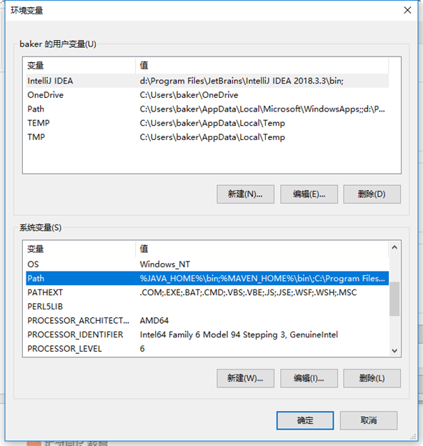
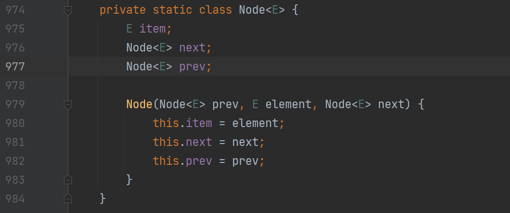

​                                   

 

​                   


 

 

# Java入门

学习目标中标注的知识点十分详细，非常适合初学者，能帮助初学者打好坚实的Java基础。按照学习目标复习，避免漏掉知识点。对于标注“理解”的，表示能够描述知识点，就是能对别人讲解，能说出相关原因或现象。

学习目标

1. 了解Java语言是什么。

2. 了解Java能干什么。

3. 了解Java分哪三个版本，分别擅长哪方面的开发。

4. 熟悉如何构建Java的开发环境。

5. 掌握如何配置环境变量、为什么配置这些环境变量。

6. 掌握简述开发HelloWorld的步骤。

7. 能够描述HelloWorld的组成部分及中文解释。

8. 总结在开发HelloWorld程序时遇到的**编译错误**和**运行异常**，并在笔记中记录下来。

 


 

Java是一门很优秀的编程语言，具有面向对象、与平台无关、安全、稳定和多线程等特点，是目前软件设计中极为健壮的编程语言。Java不仅可以用来开发大型的应用程序，而且特别适合于Internet的应用开发。Java确实具备了“一次编写，处处运行”的特点，Java已成为网络时代最重要的编程语言之一。

## Java的诞生

 

计算机语言发展史：


**SUN公司**

斯坦福大学校园网（Stanford University Network）的首字母缩写

中文名：太阳计算机系统（中国）有限公司


在1990年，Sun公司成立了一个由James Gosling领导的软件设计团队，他们合作的项目称为“绿色计划”。他们认为计算机技术发展的一个趋势是数字家电之间的通讯。James开始负责为设备和用户之间的交流创建一种能够实现网络交互的语言。随着大量的时间和金钱投入到“绿色计划”，他们创建了一种语言。这种语言一开始被叫做“Oak”，这个名字得自于Gosling想名字时看到了窗外的一棵橡树，后来被改为了“Java”。

   

Java的快速发展得利于Internet和Web的出现，到了2000年，Java已经成为世界上最流行的电脑语言。绿色小组当初设计Java是为了面向数字家庭，支持各种家电设备。他们没有想到的是，Java支持的计算模式，实际上就是互联网的模式 。

 

Java的重要历史事件：

| **时间**      | **事件**                                                     |
| ------------- | ------------------------------------------------------------ |
| 1995年5月23日 | Java语言诞生                                                 |
| 1996年1月     | 第一个JDK-JDK1.0诞生                                         |
| 1996年4月     | 10个最重要的操作系统供应商申明将在其产品中嵌入JAVA技术       |
| 1997年2月18日 | JDK1.1发布                                                   |
| 1998年12月8日 | JAVA2企业平台J2EE发布                                        |
| 1999年6月     | SUM公司发布Java的三个版本：   标准版（J2SE）、企业版（J2EE）和微型版（J2ME） |
| 2004年9月30日 | J2SE1.5发布，成为Java语言发展史上的又一里程碑。为了表示该版本的重要性，J2SE1.5更名为Java SE  5.0 |
| 2006年12月    | SUN公司发布JDK6.0                                            |
| 2011年7月     | Oracle公司发布JDK7.0                                         |
| 2014年3月     | Oracle公司发布JDK8.0                                         |
| 2017年9月     | Oracle公司发布JDK9                                           |
| 2018年3月     | Oracle公司发布JDK10                                          |
| 2018年9月     | Oracle公司发布JDK11                                          |
| 2019年3月     | Oracle公司发布JDK12                                          |
| 2019年9月     | Oracle公司发布JDK13                                          |
| 2020年3月     | Oracle公司发布JDK14                                          |
| 2020年9月     | Oracle公司发布JDK15                                          |
| 2021年3月     | Oracle公司发布JDK16                                          |
| 2021年9月     | Oracle公司发布JDK17                                          |
| 2022年3月     | Oracle公司发布JDK18                                          |

目前主流的JDK是Sun公司发布的JDK，除了Sun之外，还有很多公司和组织都开发了自己的 JDK，例如IBM公司开发的JDK，BEA公司的Jrocket，还有GNU组织开发的JDK等等。 

**印度尼西亚**有一个重要的**盛产咖啡的岛屿**，中文名叫爪哇，开发人员为这种新的语言起名为Java，其寓意是为世人端上一杯香浓的热咖啡。现在就让我们来一起品尝吧。 

## Java能干什么

Java 能做的事情很多，涉及到编程领域的各个方面。

- **桌面级应用：尤其是需要跨平台的桌面级应用程序。**

简单的说就是主要功能都在我们本机上运行的程序，比如word、excel 等运行在本机上的应用就属于桌面应用。


- **企业级应用**

简单的说就是大规模的应用，一般使用**人数较多**，**数据量较大**， 对系统的稳定性、安全性、可扩展性和可装配性等都有比较高的要求。举例说明一下：

组件化：企业级应用通常比较复杂，组件化能够更好对业务进行建模，提高系统的扩展性和维护性，做到组件复用。

分布式：企业组织机构复杂，同一地有多个分部，或者跨省，甚至跨国，COABA, RMI，Web Services是JavaEE中支持的分布式访问技术，还有分布式的连接，如系统需要接入多个数据源，可以用JNDI来透明实现。 

事务管理：为了保证数据的安全操作、安全访问，事务是不可缺少的，事实上只要操作数据库，就离不开事务管理。 

消息管理：通过消息来实现异步触发从而降低系统耦合性，提高系统吞吐量。一个电子商务网站也可以使用消息来进行异步发邮件，但在企业级应用当中，根据实际需求还可以演变成更多复杂的应用，JEE提供JMS实现消息管理。 

安全性：企业级应用的数据都更为敏感（比如公司的销售数据、财务数据），需要为此提供严格的安全性保护，企业级组织的复杂性、接入访问的多样性增加了安全策略实施的难度，JAAS为此提供了一整套的安全策略，方便企业级应用以安全、一致、便捷的方式实现安全机制。 

目前企业级应用是Java应用最广泛的一个领域，几乎一枝独秀。包括各种行业应用、企业信息化、电子政务等，包括办公自动化 OA，人力资源 HR，客户关系管理 CRM， 企业资源计划 ERP、供应链管理 SCM、企业设备管理系统 EAM、产品生命 周期管理 PLM、面向服务体系架构 SOA、商业智能 BI、项目管理 PM、营销管理、流程管理 WorkFlow、财务管理……等等几乎所有你能想到的应用。


- **嵌入式设备及消费类电子设备**

包括无线手持设备、智能卡、通信终端、医疗设备、信息家电（如数字机顶盒、 电冰箱）、汽车导航系统等都是近年以来热门的 Java 应用领域，尤其是手机上的Java应用程序和Java 游戏，更是普及。

嵌入式装置答题上区分为两种：一种是运算功能有限、电力供应也有限的嵌入式装置，例如：PDA、手机；另外一种则是运算能力相对较佳、并且电力供应上相对比较充足的嵌入式装置，比如：冷气机、电冰箱、电视机顶盒。

除了上面提到的，Java还有很多功能：如进行数学运算、显示图形界面、进行网络操作、进行数据库操作、进行文件的操作等等。 

## Java 有什么

Java 体系比较庞杂，功能繁多，这也导致很多人在自学 Java 的时候总是感觉无法建立全面的知识体系，无法从整体上把握 Java 的原因。在这里我们先简单了解一下 Java 的版本。

Java 分成三种版本，分别是： Java 标准版(JSE)、Java 微缩版(JME)和 Java 企业版(JEE)。

每一种版本都有自己的功能和应用方向。

**Java** **标准版: JSE(Java Standard Edition**）

JSE是 Sun 公司针对桌面开发以及低端商务计算解决方案而开发的版本，例如：我们平常熟悉的 Application 桌面应用程序。这个版本是个基础，它也是我们平常开发和使用最多的技术，Java的主要的技术将在这个版本中体现。本书主要讲的就是 JSE。

 

**Java** **企业版：JEE**（Java Enterprise Edition）

JEE是一种利用 Java 平台来简化企业解决方案的开发、部署和管理相关的复杂问题的体系结构。JEE 技术的基础就是核心 Java 平台或 Java 平台的标准版，JEE 不仅巩固了标准版中的许多优点，例如“一次编写、处处运行”的特性、方便存取数据库的 JDBC API、CORBA 技术以及能够在 Internet 应用中保护数据的安全模式等等， 同时还提供了对 EJB(Enterprise Java Beans)、Java Servlets API、JSP(Java Server Pages) 以及 XML 技术的全面支持。其最终目的就是成为一个能够使企业开发者大幅缩短投放市场时 间的体系结构。

JEE 体系结构提供中间层集成框架来满足无需太多费用而又需要高可用性、高可靠性以及可扩展性的应用的需求。通过提供统一的开发平台，JEE 降低了开发多层应用的费用和复 杂性，同时提供对现有应用程序集成强有力支持，完全支持 Enterprise Java Beans，有良好的向导支持打包和部署应用，添加了目录支持，增强了安全机制，提高了性能。

JEE 是对标准版进行功能扩展，提供一系列功能，用来解决进行企业应用开发中所面临的复杂的问题。具体的我们会放到后面 JEE 的课程去讲。

 

**Java** **微缩版：JME(Java Micro Edition**）

JME是对标准版 JSE 进行功能缩减后的版本，于 1999 年 6 月由 Sun Microsystems 第一次推向 Java 团体。它是一项能更好满足 Java 开发人员不同需求的广泛倡议的一部分。Sun Microsystems 将 JME 定义为“一种以广泛的消费性产品为目标的高度优化的Java运行时环境”，应用范围包括掌上电脑、移动电话、可视电话、数字机顶盒和汽车导航系统及其他无线设备等。

JME 是致力于消费产品和嵌入式设备的开发人员的最佳选择。尽管早期人们对它看好而且 Java 开发人员团体中的热衷人士也不少，然而JME最近才开始从其影响更大的同属产品JEE和 JSE 的阴影中走出其不成熟期。

JME 在开发面向内存有限的移动终端(例如掌上电脑、移动电话)的应用时，显得尤其实用。 因为它是建立在操作系统之上的，使得应用的开发无须考虑太多特殊的硬件配置类型或操作系统。因此，开发商也无须为不同的终端建立特殊的应用，制造商也只需要简单地使它们的 操作平台可以支持 JME 便可。

三个版本之间的关系：

> JEE 几乎完全包含 JSE 的功能，然后在 JSE 的基础上添加了很多新的功能。
>
> JME 主要是 JSE 的部分功能子集，然后再加上一部分额外添加的功能。
>


 

 

 

## Java的特点

简单地说，Java 具有如下特点：简单的、面向对象的、平台无关的、多线程的、安全的、高效的、健壮的、动态的等特点。

**简单的**

简单是指Java 既易学又好用。不要将简单误解为这门编程语言很干瘪。你可能很赞同这样的观点：英语要比阿拉伯语言容易学。但这并不意味着英语就不能表达丰富的内容和深刻的思想，许多荣获诺贝尔文学奖的作品都是用英文写的。如果你学习过C++，你会感觉Java很眼熟，因为Java中许多基本语句的语法和C++一样，像常用的循环语句、控制语句等和C++几乎一样，但不要误解为Java是C++的增强版，Java和C++是两种完全不同的编程语言，它们各有各的优势，将会长期并存下去，Java和C++已成为软件开发者应当掌握的编程语言。如果从语言的简单性方面看，Java要比C++简单，C++中有许多容易混淆的概念，或者被Java弃之不用了，或者以一种更清楚更容易理解的方式实现，例如，Java不再有指针的概念。

**面向对象的**

面向对象是指以对象为基本粒度，其下包含属性和方法。对象的说明用属性表达，而通过使用方法来操作这个对象。面向对象技术使得应用程序的开发变得简单易用，节省代码。基于对象的编程更符合人的思维模式，使人们更容易编写程序。Java是一种面向对象的语言，也继承了面向对象的诸多好处，如代码扩展、代码复用等。我们将在以后的章节中详细地讨论类、对象等概念。

**平台无关的**

与平台无关是Java最大的优势。其他语言编写的程序面临的一个主要问题是：操作系统的变化，处理器升级以及核心系统资源的变化，都可能导致程序出现错误或无法运行。而用 Java 写的程序不用修改就可在不同的软硬件平台上运行。这样就能实现同样的程序既可以在 Windows 下运行，到了 Unix 或者 Linux 环境不用修改就直接可以运行了。Java 主要靠 Java 虚拟机（JVM）实现平台无关性。平台无关性就是一次编写，到处运行：Write Once, Run Anywhere。

**多线程的**

Java实现了内置对多线程的支持。多线程允许同时完成多个任务。实际上多线程使人产生多个任务在同时执行的错觉，因为，目前的计算机的处理器在同一时刻只能执行一个线程，但处理器可以在不同的线程之间快速地切换，由于处理器速度非常快，远远超过了人接收信息的速度，所以给人的感觉好像多个任务在同时执行。C++没有内置的多线程机制，因此必须调用操作系统的多线程功能来进行多线程程序的设计。 

**安全的**

安全性可以分为四个层面，即编译、类装载、字节码校验、沙箱机制。 

**高效的**

高级语言程序必须转换为机器语言程序才能执行，但不同的计算机系统所使用的机器语言不同。Java为了实现“一次编译，随处运行”的目标，Java 的源程序在编译时，并不直接编译成特定的机器语言程序，而是编译成与系统无关的**字节码**，由Java 虚拟机（JVM ）来执行。当JVM解释执行Java程序时，Java 实时编译器（Just-In-Time，JIT）会将字节码译成目标平台对应的机器语言的指令代码。

早先的许多尝试解决跨平台的方案对性能要求都很高。其他解释执行的语言系统，如BASIC、PERL 都有无法克服的性能缺陷。然而，Java 却可以在非常低档的CPU上顺畅运行，这是因为Java字节码是经过精心设计的，能够直接使用JIT编译技术将字节码转换成高性能的本机代码。事实上，Java的运行速度随着JIT编译器技术的发展已接近于C++。

**健壮的**

Java是健壮的语言。为了更好地理解Java的健壮性，先讨论一下在传统编程环境下程序设计失败的主要原因：内存管理错误和误操作引起的异常或运行时异常。
   在传统的编程环境下，内存管理是一项困难、乏味的工作。例如，在C或C++ 中，必须手工分配、释放所有的动态内存。如果忘记释放原来分配的内存，或是释放了其他程序正在使用的内存时，就会出错。在传统的编程环境下，异常情况可能经常由“被零除”、“Null指针操作”、“文件未找到”等原因引起，必须用既繁琐又难理解的一大堆指令来进行管理。
   对此，Java 通过自行管理内存分配和释放，从根本上消除了有关内存的问题。Java提供垃圾收集器，可自动收集闲置对象占用的内存。通过提供面向对象的异常处理机制来解决异常处理的问题。通过类型检查、Null指针检测、数组边界检测等方法，在开发早期发现程序错误。

**动态的**

Java 语言具有动态特性。Java 动态特性是其面向对象设计方法的扩展，允许程序动态地装入运行过程中所需的类，这是C++进行面向对象程序设计所无法实现的。C++程序设计过程中，每当在类中增加一个实例变量或一种成员函数后，引用该类的所有子类都必须重新编译，否则将导致程序崩溃。

## 构建Java开发环境

我们先来学习构建Java 开发环境，让大家对Java有更实际的了解。下面以 JDK13 在 Window10 上的安装配置为例来讲述：

### 第一步：下载 JDK

从 Oracle 网站下载 JDK软件，打开下载页面，选择合适的版本，下载地址是https://www.oracle.com/technetwork/java/javase/overview/index.html，这里以jdk-13_windows-x64_bin.exe 版为例，如下图：

 

### 第二步：安装 JDK

（1）双击jdk-13_windows-x64_bin.exe 文件，出现如下安装界面：

 

（2）然后出现下面的界面

 

点击更改，修改安装路径

（3）点击“下一步”按钮，然后出现下列界面

 

（4）安装完成

 

（5）安装完成过后，JDK 文件夹如下图：

 

C:\Java\jdk-13是 JDK 的安装路径

 

### 第三步：配置环境变量

安装完成后，还要进行 Java 环境的配置，才能正常使用，步骤如下：

（1）在我的电脑点击右键à选择属性，如下图所示：

 

（2）在弹出界面上 ：选择高级系统设置à环境变量，如下图所示：

 

（3）弹出如下界面，我们的设置就在这个界面上：

 

 

（4）点击环境变量界面的**系统变量**栏的“**新建**”按钮，弹出界面如下图：

 

在上面填写变量名为：JAVA_HOME，变量值为：C:\Java\jdk-13 ，如下图所示：

 

点击确定按钮。

（5）再次点击环境变量界面的**系统变量**栏的“**新建**”按钮。 在弹出的窗口中填写变量名为：classpath，变量值为：.; ，注意是点和分号，如下图所示：

   

点击确定按钮。

（6）如下图所示：在系统变量里面找到“Path”这一项，然后双击它，在弹出的界面上，在变量值开头添加如下语句“%JAVA_HOME%\bin;”，注意不要忘了后面的分号，如下图所示：

   

然后点击“编辑系统变量”界面的确定按钮。

   

点击上移，移动到最顶端。

 

点击确定

（7）另一种打开方式：

 

在变量值输入框，最前端，写入%JAVA_HOME%\bin;点击确定。

（8）点击“环境变量”界面的确定按钮。

 

（9）点击“系统属性”界面的确定按钮。Java 开发环境的设置就完成了。

那么为何要设置这些环境变量呢？

- JAVA_HOME：配置到 JDK 安装路径。**注意**：变量名必须书写正确，全部大写，中间用下划线。

- PATH：提供给操作系统寻找到 Java 命令工具的路径。通常是配置到 JDK 安装路径\bin。完成配置以后，使用编译器和解释器就会很方便，可以在任何路径下使用bin目录下的Java命令，而不需要写出完整的路径：C:\Java\jdk13\bin 。

- CLASSPATH：提供程序在运行期寻找所需资源的路径，比如：.class类文件、文件、图片等等。在 windows环境下配置“.”代表当前路径，那么在执行java命令时，就会先到当前路径寻找class类文件。这个配置对于Java初学者比较难理解，我们在后面的Java运行过程中，再详细体会。

注意：在 windows 操作系统上，最好在CLASSPATH的配置里面，始终在前面保持“.;”的配置。

### 第四步：检测安装配置是否成功

  进行完上面的步骤，基本的安装和配置就好了，怎么知道安装成功没有呢？

（1）点击开始——〉点击运行，在弹出的对话框中输入“cmd”，如下图示：

 

 

（2）然后点击确定，在弹出的 dos命令行窗口里面，输入“javac”，然后回车，出现如下界面则表示安装配置成功。

 

现在 Java 的开发环境就配置好了，如果出现下面的提示，说明刚才的环境变量的配置有问题，需要从头一步一步检查。

   

注意：如果更改了系统环境变量的配置，必须重新打开dos 窗口，就是打开一个新的dos 窗口，环境变量的新配置才会有效，否则，dos 窗口就还应用旧的环境变量的旧配置。

有些人已经跃跃欲试的想要马上开始学习如何编写 Java 程序了，下面先来体会第一个 Java 程序。

## 一个基本的Java应用程序HelloWorld

像其它编程语言一样，Java 编程语言也被用来创建应用程序。一个共同的应用程序范例是在屏幕上显示字串“Hello World!”。下列代码给出了这个Java应用程序。

如果是第一次看到Java 代码，可能都不明白每一个代码的意义，没有关系，主要是来体会一下 Java 程序是什么样子，在脑海里有个印象，然后可以先模仿着做。

### HelloWorld

```java
//这里是注释
//HelloWorld 应用示例
//
public class HelloWorld {
    public static void main(String args[]) {
        System.out.println("你好，欢迎来到Java快车！");
    }
}
```

以上程序行是在dos 窗口上打印“你好，欢迎来到Java快车！”所需的最少组件。

### 描述HelloWorld

>  程序中的 1-3 行是注释行

> 第 4 行声明类名为 HelloWorld。类名（ClassName）是在源文件中指明的，它可在与源代码相同的目录上创建一个 ClassName.class 文件。在本例题中，编译器创建了一个称为 HelloWorld.class 的文件，它包含了公共类 HelloWorld 的编译代码。

> 第 5 行是程序执行的起始点(入口)。Java 解释器必须发现这一严格定义的点，否则将拒绝运行程序。
>
> 其它程序语言（特别是 C 和 C++）也采用 main()声明作为程序执行的起始点。此声明的不同部分将在本课程的后几部分介绍。
>
> 如果在程序的命令行中给出了任何自变量（命令行参数），它们将被传递给main()方法中被称作 args 的 String 数组。在本例题中，未使用自变量。
>
> - public：说明方法 main()可被任何程序访问，包括 Java 解释器。
> - static：是一个告知编译器 main()是用于类 HelloWorldApp 中的方法的关键字。为使 main()在程序做其它事之前就开始运行，这一关键字是必要的。
> - void： 表明 main()不返回任何信息。这一点是重要的，因为 Java 编程语言要进行谨慎的类型检查，包括检查调用的方法确实返回了这些方法所声明的类型。
> - String args[]：是一个字符串类型的数组声明，它是main方法的参数，它将包含位于类名之后的命令行中的自变量。
> - {}：两个大括号一起中间的内容叫方法体，代表这个方法所执行的代码。

>  第6行声明如何使用类名、对象名和方法调用。它使用由 System 类的 out 成员引用的 PrintStream 对象的 println ()方法，将字串“你好，欢迎来到Java快车！”打印到标准输出上。
>
> 在这个例子中，println()方法被输入了一个字串自变量并将其写在了标准输出流上。

> 本程序的 7-8 行分别是方法 main()和类 HelloWorld 的下括号。

### 编译并运行HelloWorld

- **编译**

当你创建了 HelloWorld.java 源文件后，用下列命令行进行编译：

>  javac HelloWorld.java

如果编译器未返回任何提示信息，表示编译完成，生成一个新文件 HelloWorld. class，该文件称为字节码文件，class文件名和对应的java文件名是相同的。class文件被存储在与源文件相同的目录中，除非另有指定。

如果在编译中遇到问题，请参阅本模块的查错提示信息部分。

- **运行**

为运行你的 HelloWorld 应用程序，需使用 Java 解释器和位于 bin 目录下的 java程序:

>  java HelloWorld

你好，欢迎来到Java快车！

### 编译查错

**以下是编译时的常见错误：**

>  --javac:Command not found
>  PATH 变量未正确设置以包括 javac 编译器。javac 编译器位于 JDK目录下的 bin 目录。

> --HelloWorld.java:6: Method printl(java.lang.String) 
>
> not found in class java.io.PrintStream.System. out.printl ("你好，欢迎来到Java快车！");
>
> 方法名是 println而不是printl，少敲了一个n。

> --In class HelloWorld:main must be public or static
>
> 该错误的出现是因为 main 方法没有 static 或 public修饰符。 

**以下是运行时的错误**：

>  --can’t find class HelloWorld
>
> （这个错误是在控制台敲入 java HelloWorld 时产生的）
>
> 通常，它表示在命令行中所指定的类名的拼写与 filename.class 文件的拼写不同。Java 编程语言是一种大小写区别对待的语言。
>
> 例如： public class Helloworld
>
> 创建了一个Helloworld.class，它不是编译器所预期的类名(HelloWorld.class)。

>  --命名
>
> 如果.java 文件包括一个公共类，那么它必须使用与那个公共类相同的文件名。
>
> 例如在前例中的类的定义是public class Helloworld，源文件名则必须是 Helloworld.java


 

 

 


# 基础语法

学习目标

1. 了解什么是关键字？

2. 了解学习Java中的关键字需要注意什么？

3. 了解什么是标识符？

4. 能够描述标识符的命名规则。

5. Java中数据类型的分类。

6. Java中有哪些基本数据类型。

7. 掌握8个基本数据类型的范围，并使用数据类型声明变量。

8. 深刻理解Java中的变量，变量的赋值，变量的存储。

9. 代码写出Java中的注释。

10. 学习Java中的运算符，能够说出每种运算符的运算法则，并能够代码示例。

11. 描述if语句的句法结构，能够说出if语句的运行过程，并能够灵活使用if语句和if语句的嵌套。

12. 描述switch语句的句法结构，能够说出switch语句的运行过程，并能够灵活使用switch语句，理解break。

13. 描述for语句的句法结构，能够说出for语句的运行过程，并能够灵活使用for语句和for语句的嵌套。

14. 描述while语句的句法结构，能够说出while语句的运行过程，并能够灵活使用while语句。

15. 描述do-while语句的句法结构，能够说出do-while语句的运行过程，并能够灵活使用do-while语句。

16. 总结循环语句的本质。

17. 理解循环语句中的break和continue，并代码示例。

18. 理解循环语句中的Label，并代码示例。

 


 

我们在学习汉语的时候，开始学的是一些单个的字，只有认识了单个的字，然后才能组成词，然后才能慢慢的到句子，然后到文章。学习计算机语言跟这个过程是一样的，首先我们要学习一些计算机看得懂的单个的字，然后写成一句代码，最后很多句代码组成程序。 那么这些单个字在 Java 里面就是关键字，让我们的Java语法学习从关键字开始吧。

## 关键字

### 什么是关键字

关键字对Java 技术编译器有特殊的含义，它们可标识数据类型名或程序构造（construct）名。

其实就是个约定或者规定，比如我们看到红灯就知道要停下来，看到绿灯就可以前进了。这些都是人类约定好的游戏规则，在我们的日常生活中有特殊的意义，不可改变，违反它就要付出代价。

关键字是Java语言和Java的开发和运行平台之间的约定，程序员只要按照这个约定使用了某个关键字，Java的开发和运行平台就能够认识它，并正确地处理，展示出程序员想要的效果。

### Java中的关键字

| abstract   | assert  | boolean   | break     | byte         | case     |
| ---------- | ------- | --------- | --------- | ------------ | -------- |
| catch      | char    | class     | continue  | default      | do       |
| double     | else    | enum      | extends   | while        | final    |
| finally    | float   | for       | if        | implements   | import   |
| instanceof | int     | interface | long      | native       | new      |
| void       | package | private   | protected | public       | return   |
| short      | static  | super     | switch    | synchronized | this     |
| throw      | throws  | transient | volatile  | try          | strictfp |

 

> • abstract：表明类或类中的方法是抽象的；
> • assert：声明断言；
> • boolean：基本数据类型之一，布尔类型；
> • break：提前跳出一个块；
> • byte：基本数据类型之一，字节类型；
> • case：在 switch 语句中，表明其中的一个分支；
> • catch：用于处理例外情况，用来捕捉异常；
> • char：基本数据类型之一，字符类型；
> • class：类；
> • continue：回到一个块的开始处；
> • default：用在 switch 语句中，表明一个默认的分支；
> • do：用在"do while"循环结构中；
> • double：基本数据类型之一，双精度浮点数类型；
> • else：在条件语句中，表明当条件不成立时的分支；
> • extends：用来表明一个类是另一个类的子类；
> • final：用来表明一个类不能派生出子类，或类中的方法不能被覆盖，或声明一个变量是常量；
> • finally：用于处理异常情况，用来声明一个肯定会被执行到的块； 
> • float：基本数据类型之一，单精度浮点数类型；
> • for：一种循环结构的引导词；
> • if：条件语句的引导词；
> • implements：表明一个类实现了给定的接口；
> • import：表明要访问指定的类或包；
> • instanceof：用来测试一个对象是否是一个指定类的实例；
> • int：基本数据类型之一，整数类型；
> • interface：接口；
> • long：基本数据类型之一，长整数类型；
> • native：用来声明一个方法是由与机器相关的语言(如 C/C++/FORTRAN 语言)实现的；
> • new：用来申请新对象；
> • package：包；
> • private：一种访问方式：私有模式；
> • protected：一种访问方式：保护模式；
> • public：一种访问方式：公共模式；
> • return：从方法中返回值；
> • short：基本数据类型之一，短整数类型；
> • static：表明域或方法是静态的，即该域或方法是属于类的；
> • strictfp：用来声明 FP-strict(双精度或单精度浮点数)表达式，参见 IEEE 754 算术规范；
> • super：当前对象的父类对象的引用；
> • switch：分支结构的引导词；
> • synchronized：表明一段代码的执行需要同步；
> • this：当前对象的引用；
> • throw：抛出一个异常；
> • throws：声明方法中抛出的所有异常；
> • transient：声明不用序列化的域；
> • try：尝试一个可能抛出异常的程序块
> • void：表明方法不返回值；
> • volatile：表明两个或多个变量必须同步地发生变化；
> • while：用在循环结构中；
> • enum：声明枚举类型；

说明：

> **1.**  **这些关键字的具体含义和使用方法，会在后面使用的时候详细讲述。**
> **2.**  **Java** **的关键字也是随新的版本发布在不断变动中的，不是一成不变的。**
> **3.**  **所有关键字都是小写的。**


## 标识符

每个人都有名字，每个事物也都有名字，有了名字，就可以通过语言表示出来。Java的文件、类、方法、变量也都有名字。中国人的名字有默认的命名规则，比如不使用阿拉伯数字，不使用标点符号，不使用长辈的名字，等等。Java中有什么命名规则呢？

### 什么是标识符

在 Java 编程语言中，标识符是标识变量、类或方法的有效字符序列。简单地说标识符就是一个名字。

### 标识符命名规则

命名规则如下：

> 1. 首字母只能以字母、下划线、$ 开头,其后可以跟字母、下划线、和数字。
> 2. 标识符不能是关键字。
> 3. 标识符区分大小写 （事实上整个 Java 编程里面都是区分大小写的）。
> 4. 标识符长度没有限制，但不宜过长。
> 5. 如果标识符由多个单词构成，那么从第二个单词开始，首字母大写。示例：getUser、setModel、EmployeeModel 等。
> 6. 标识符尽量命名的有意义，让人能够望文知意。 
> 7. 尽量少用带\$符号的标识符，主要是习惯问题，大家都不是很习惯使用带\$符号的标识符；还有内部类中，\$具有特殊的含义。
> 8. 虽然Java 语言使用16-bit 双字节字符编码标准（Unicode 字符集），最多可以识别65536个字符(0-65535)。建议标识符中最好使用 ASCII 字母。虽然中文标识符也能够正常编译和运行，却不建议使用。

 

```java
public class Test {
    public static void main(String[] args) {
       String Java快车 = "中文标识符测试";
       System.out.println("Java快车==" + Java快车);
    }
}
//运行结果：Java 快车==中文标识符测试
```


 


### 示例

下列哪些是正确的标识符：

>my Variable
>9javakc
>a+b
>book1-2-3
>java&c
>It's

错误的标识符及其原因分析如下：

> My Variable //含有空格
> 9javakc //首字符为数字 
> a+b //加号不是字母 
> book1-2-3 //减号不是字母
> java&c //与号不是字母
> It's //单引号不是字母 


## 数据类型

### 什么叫数据类型

数据类型简单的说就是对数据的分类，对数据各自的特点进行类别的划分，划分的每种数据类型都具有区别于其它类型的特征，每一类数据都有相应的特点和操作功能。例如数字类型的就能够进行加减乘除的操作。

在现实生活中，我们通常会针对不同的提问，做出不同类型的回答，比如：

> 你叫什么名字？ --刘德华
> 你今天多大年纪了？ --24
> 你家住哪里？ --北京市海淀区上地信息路
> 请告诉我，你的身高？ --1.75
> 你带课本了，是吗？ --是的
> 1+1=2，对吗？  --对

大家仔细分析一下回答的信息（数据），是不是有类别之分？如果类别搞错了，是不是会出笑话？

类似的在程序中，计算机也需要某种方式来判断某个数字是什么类型的。这通常是需要程序员显示来声明某个数据是什么类型的，Java 就是这样的。Java 是一种强类型的语言，凡是使用到的变量，在编译之前一定要被显示的声明。 

Java的安全和健壮性部分来自于它是强类型语言这一事实。首先，每个变量有类型，每个表达式有类型，而且每种类型是严格定义的。其次，所有的数值传递，不管是直接的还是通过方法调用经由参数传过去的都要先进行类型相容性的检查。有些语言没有自动强迫进行数据类型相容性的检查或对冲突的类型进行转换的机制。Java编译器对所有的表达式和参数都要进行类型相容性的检查以保证类型是兼容的。任何类型的不匹配都是错误的，在编译器完成编译以前，错误必须被改正。

 

### Java数据类型的分类

Java 里面的数据类型从大的方面分为两类，一是基本数据类型，一是引用类型。基本的JAVA数据类型层次图如下：


 

 

### Java中的基本数据类型

Java 中的基本数据类型可分为四种：

> 逻辑型：boolean
> 文本型：char
> 整数型：byte、short、int、long
> 浮点型：float、double

#### 逻辑型 boolean

逻辑值有两种状态，即人们经常使用的“on”和“off” 或“true”和“false”或“yes” 和 “no”，这样的值是用 boolean 类型来表示的。boolean 有两个文字值，即 true 和 false。 以下是一个有关 boolean 类型变量的声明和初始化：

```java
boolean flag = true; //声明变量 flag
```

**注意**：在整数类型和 boolean 类型之间无转换计算。有些语言（特别值得强调的是 C和 C++）允许将数字值转换成逻辑值（所谓“非零即真”）,这在 Java 编程语言中是不允许的；boolean 类型只允许使用 boolean 值（true 或 false）。

true和false不是关键字。

 

#### 文本型 char

char 类型用来表示单个字符。一个char代表一个16-bit无符号的（不分正负的）Unicode 字符，一个 char 字符必须包含在单引号内。

示例：

```java
char c1='a' //表示简单的字符
char c2='1' //用数字也可以表示字符
```


下面就错了，只能使用单个字符。

```java
char c3='ab' //错误
char c4='12' //错误
```


**什么是 Unicode** **编码**

**Unicode** **编码又叫统一码、万国码或单一码，是一种在计算机上使用的字符编码。**它为每种语言中的每个字符设定了统一并且唯一的二进制编码，以满足跨语言、跨平台进行文本转换、处理的要求。1990 年开始研发，1994 年正式公布。随着计算机工作能力的增强，Unicode 也在面世以来的十多年里得到普及。

Unicode字符集最多可以识别65535个字符，每个国建的“字母表”的字母都是Unicode表中的一个字符，比如汉字中的“你”字就是Unicode表中的第20320个字符，还包含日文里的片假名、平假名、韩文以及其他语言中的文字。

在 Java 中的定义示例：

```java
char c1 = 'a';
char c2 = 97;//这个字符表示字母a
char c3 = '汉'
char c4 = 27721;//这个字符表示 汉 
char c5 = '\n';//这个字符表示换行
char c6 = '\'';//这个字符表示单引号
```


取值范围和默认值：

| **名称** | **长度** | **范围**  | **默认值** |
| -------- | -------- | --------- | ---------- |
| char     | 16位     | 0~2^16^-1 | '\u0000'   |

**Java** **里面的转义字符**

转义字符是指，用一些普通字符的组合来代替一些特殊字符，由于其组合改变了原来字符表示的含义，因此称为“转义”。 常见的转义字符：

> \n 回车(\u000a)
>
> \t 水平制表符(\u0009)
>
> \b 退格(\u0008)
>
> \r 换行(\u000d)
>
> \f 换页(\u000c)
>
> \' 单引号(\u0027)
>
> \" 双引号(\u0022)
>
> \\ 反斜杠(\u005c)

#### 整数型 byte、short、int、long 

> byte：字节型 
>
> short：短整型 
>
> int：整型 
>
> long：长整型


```java
byte b=5;
short sh = 5;
int i = 5; 
long lon = 5L;//后面直接跟一个字母“L”或者“l”,表示一个 long 值
```


在 Java 中，整数型的值都是带符号的数字，可以用十进制、二进制、八进制和十六进制来表示。 所谓几进制，就是满多少就进位的意思，如十进制表示逢十进位，八进制就表示逢八进位。 示例：

```java
int x=0b101111;//二进制
int y=057;//八进制
int z=0x2f;//十六进制

//b x f不区分大小写，即大写、小写都可以
```


取值范围和默认值：

| **名称** | **长度** | **范围**                         | **默认值** |
| -------- | -------- | -------------------------------- | ---------- |
| byte     | 8位      | -2^7^~2^7^-1<br />-128 ~ 127     | 0          |
| short    | 16位     | -2^15^~2^15^-1<br />-32768~32767 | 0          |
| int      | 32位     | -2^31^~2^31^-1<br />-21亿~21亿   | 0          |
| long     | 64位     | -2^63^~2^63^-1                   | 0L         |

#### 浮点型 float、double

Java 用浮点型来表示实数，简单地说就是带小数的数据。

用关键字float 或 double 来定义浮点类型，如果一个数字包括小数点或指数部分，或者在数字后带有字母 F 或 f（float）、D 或 d（double），则该数字文字为浮点型的。

示例：

```java
double d1=12.3 //浮点型数据
double d2=12.3E5 //一个大浮点数据，E或e表示指数值，相当于1230000
```


在 Java 中的定义示例 ：

```java
float f1 = 3.14F;
float f2 = 3.14f; 
double d1 = 3.14; 
double d2 = 3.14D;
double d3 = 3.14d;
```


请注意：

浮点型的值，如果没有特别指，**默认是 double** 类型的。

定义 float 型的时候，一定要指明是 float 型的，可以通过在数字后面添加“F”或者“f”来表示。 

定义 double 型的时候，可以不用指明，默认就是 double 型的，也可以通过在数字后面添加“D”或者“d”来表示。

取值范围和默认值：

| **名称** | **长度** | **范围** | **默认值** |
| -------- | -------- | -------- | ---------- |
| float    | 32位     |          | 0.0f       |
| double   | 64位     |          | 0.0d       |

Java 技术规范的浮点数的格式是由电力电子工程师学会（IEEE）754 定义的，是独立于平台的。可以通过 Float.MAX_VALUE 和 Float.MIN_VALUE 取得 Float 的最大最小值；可以通过 Double.MAX_VALUE 和 Double.MIN_VALUE 来取得 Double 的最大最小值。


 

## 运算符和表达式

程序的基本功能是处理数据，任何编程语言都有自己的运算符。为实现逻辑和运算要求，编程语言设置了各种不同的运算符，且有优先级顺序，所以有的初学者使用复杂表达式的时候搞不清楚。

 

下面按优先顺序列出了各种运算符：

| **优先级** | **运算符**                           |
| ---------- | ------------------------------------ |
| 一元运算符 | `++  --`                             |
| 算术运算符 | `*  /  %  + - ()`                    |
| 关系运算符 | `<    >   <=    >=     ==     !=`    |
| 逻辑运算符 | `&&      ||     !`                   |
| 三目运算符 | `布尔表达式?表达式1:表达式2`         |
| 赋值运算符 | `=    *=     /=     %=     +=    -=` |

表达式是由常量、变量、对象、方法调用和操作符组成的式子。表达式必须符合一定的规范，才可被系统理解、编译和运行。表达式的值就是对表达式自身运算后得到的结果。 

根据运算符的不同，表达式相应地分为以下几类：算术表达式、关系表达式、逻辑表达式、赋值表达式，这些都属于数值表达式。 

### 一元运算符

因操作数是一个故称为一元运算符。

| **运算符** | **含义** | **示例**              |
| ---------- | -------- | --------------------- |
| ++         | 左结合   | `++x; `  <br />`x++;` |
| --         | 左结合   | `--x;` <br />`x--;` |

 

需要注意的是 **++** 或 **--** 操作：

> ++x 因为**++**在前，所以先加后用。
> x++ 因为**++**在后，所以先用后加。

 

 ```java
 int a = 10;
 int b = 10;
 int sum = a + ++b;
 System.out.println("a=" + a + ",b=" + b + ",sum=" + sum);
 //运行结果是： a=10,b=11,sum=21
 ```


```java
int a = 10;
int b = 10;
int sum = a++ + b;
System.out.println("a=" + a + ",b=" + b + ",sum=" + sum);
//运行结果是：a=11,b=10,sum=20
```


### 算术运算

算术运算是指：＋、－、*、/ 等基本运算。

| **运算符** | **含义** | **代码示例** | **运算示例**                  |
| ---------- | -------- | ------------ | ----------------------------- |
| +          | 加法     | `x+y`        | 1+2结果：3 ；1.2+1结果：2.2   |
| -          | 减法     | `x-y`        | 1-2结果：-1 ；1.2-1结果：0.2  |
| *          | 乘法     | `x*y`        | 1\*2结果：2 ；1.2\*1结果：1.2 |
| /          | 除法     | `x/y`        | 5/2结果：2 ；5.2/2结果：2.6   |
| %          | 求模(余) | `x%y`        | 5%2结果：1                    |

​    

 这些操作可以对不同类型的数字进行混合运算，为了保证操作的精度，系统在运算过程中会做相应的转化。数字精度的问题，我们在这里不再讨论。下图中展示了运算过程中，数据自动向上造型的原则。

 ```mermaid
 graph LR
 byte-->int
 short-->int
 char-->int
 int-->long
 long-.->float
 int-.->float
 long-.->double
 float-->double
 int-->double
 
 ```

> 1. 实线箭头表示没有信息丢失的转换，也就是安全性的转换，虚线的箭头表示有精度损失的转化，也就是不安全的。
>
> 2. 当两个操作数类型不相同时，操作数在运算前会自动向上造型成相同的类型，再进行运算。

 


用加号（+）进行串链接。

运算符 +  能够进行 String 对象的链接并生成一个新的 String：

```JAVA
String  salutation  =  "Dr.  ";
String  name  =  "Jack  "  +  "Arthur"; 
String  title  =  salutation  +  name;  
System.out.println(title);
//运行结果：Dr.  Jack  Arthur
```


如果+运算符中有一个变量为 String 对象，则其它自变量将被转换成String。所有对象都可被自动转换成String，尽管这样做的结果可能是意义含糊的。不是字符串的对象是通过使用 toString()成员方法而转换成串的等价物的。

### **关系（比较）运算符** 

Java具有完备的关系运算符，这些关系运算符同数学中的关系运算符是一致的。具体说明如下：

| **运算符** | **含义** | **示例** |
| ---------- | -------- | -------- |
| <          | 小于     | x<y      |
| >          | 大于     | x>y      |
| <=         | 小于等于 | x<=y     |
| >=         | 大于等于 | x>=y     |
| ==         | 等于     | x==y     |
| !=         | 不等于   | x!=y     |

关系运算符用于比较两个数据之间的大小关系，产生的结果都是布尔型的值，一般情况下，在逻辑与控制中会经常使用关系运算符，用于选择控制的分支，实现逻辑要求。

需要注意的是：关系运算符中的`==`和`!=`既可以操作基本数据类型，也可以操作引用数据类型。

操作引用数据类型时，比较的是引用的内存地址。所以在比较非基本数据类型时，应该使用equals方法。

简单示例如下：

 ```java
 public class TestRelation {
 	public static void main(String args[]) {
 		// 变量初始化
 		int a = 30;
 		int b = 20;
 		// 定义结果变量
 		boolean r1, r2, r3, r4, r5, r6;
 		// 计算结果
 		r1 = a == b;
 		r2 = a != b;
 		r3 = a > b;
 		r4 = a < b;
 		r5 = a >= b;
 		r6 = a <= b;
 		// 输出结果
 		System.out.println("a = " + a + "   b = " + b);
 		System.out.println("a==b = " + r1);
 		System.out.println("a!=b = " + r2);
 		System.out.println("a>b = " + r3);
 		System.out.println("a<b = " + r4);
 		System.out.println("a>=b = " + r5);
 		System.out.println("a<=b = " + r6);
 	}
 }
 /*
 运行结果如下：
 a = 30   b = 20
 a==b = false
 a!=b = true
 a>b = true
 a<b = false
 a>=b = true
 a<=b = false
 */
 ```


 

### 逻辑运算

运算符**!**(定义为“非”)、&& (定义为“与”)、||（定义为“或”）执行布尔逻辑表达式。

**逻辑非关系值表**

| A     | **!**A |
| ----- | ------ |
| true  | false  |
| false | true   |

 

**逻辑与关系值表**

| A     | B     | A&&B  |
| ----- | ----- | ----- |
| true  | true  | true  |
| true  | false | false |
| false | true  | false |
| false | false | false |

 

**逻辑或关系值表**

| A     | B     | A\|\|B |
| ----- | ----- | ------ |
| true  | true  | true   |
| true  | false | true   |
| false | true  | true   |
| false | false | false  |

在运用逻辑运算符进行相关的操作，就不得不说“**短路**”现象。代码如下：

```java
int x=10;
boolean b= true || x++>10;
System.out.println(x);//10
```


 因为第一个值是true，可以判定整个表达式的值是true，就没有必要执行第二个表达式了，所以Java虚拟机不执行`x++>10`代码，就好像被短路掉了。

逻辑与也存在“短路”现象，当执行到有一个表达式的值为false时，整个表达式的值就为false，后面的代码就不执行了。


“短路”现象在多重判断和逻辑处理中非常有用。我们经常这样使用：

```java
public void a(String str) {
    if (str != null && str.trim().length() > 0) {
        //do some thing;
    }
}
```


如果str为null，那么执行str.trim().length()就会报错，短路现象保证了我们的代码能够正确执行。

在书写布尔表达式时，首先处理主要条件，如果主要条件已经不满足，其他条件也就失去了处理的意义。也提高了代码的执行效率。


### 三目运算

三目运算符(?:)相当于条件判断，表达式x?y:z用于判断x是否为真，如果为真，表达式的值为y，否则表达式的值为z。

例如： 

```java
public class Test {
    public static void main(String[] args) {
        int i = (5 > 3) ? 6 : 7;
        System.out.println("the i=" + i);
    }
}
//运行结果为：the i=6
```

其实三目运算符的基本功能相当于 if-else（马上就要学到了），使用三目运算符是因为它的表达比相同功能的 if-else 更简洁。上面的例子改成用 if-else 表达如下：

```java
public class Test {
    public static void main(String[] args) {
        int i = 0;
        if (5 > 3) {
            i = 6;
        } else {
            i = 7;
        }
        System.out.println("the i=" + i);
    }
}
//运行结果为：the i=6
```


### 赋值运算符

基本的赋值运算符是“=”。他的优先级别低于其他的运算符，所以对该运算符往往最后读取。一开始可能会以为它是“等于”，其实不是的。它的作用是将一个表达式的值赋给一个左值。一个表达式或者是一个左值，或者是一个右值。所谓左值是指一个能用于赋值运算左边的表达式。左值必须能够被修改，不能是常量。我们现在是用变量作左值，以后还可以看到，指针和引用也可以作左值。例如：

```java
int a, b, c;
a = 3;
b = 4;
c = (a + b) * (2 * a - b); // 得出14
```


+= 是先做加法运算，再进行赋值操作，比如：

```java
int a;
a = 3;
a += 2;// 得出5
```

其他的赋值运算符和 += 类似。


## 位运算符（选修）

| **运算符分类** | **运算符**               |
| -------------- | ------------------------ |
| 一元运算符     | ~                        |
| 移位运算符     | <<  >>  >>>              |
| 位运算         | ~ & \| ^                 |
| 赋值运算符     | <<= >>=  >>>= &=  \|= ^= |

 

### 位运算

位运算符包括：&（与），|（或），~（取反），^（异或）；位运算是对整数的二进制位进行相关操作，详细运算如下：

**非位关系值表**

|      |      |
| ---- | ---- |
| A    | ~A   |
| 1    | 0    |
| 0    | 1    |

 

**与位关系值表**

| A    | B    | A&B  |
| ---- | ---- | ---- |
| 1    | 0    | 0    |
| 0    | 1    | 0    |
| 1    | 1    | 1    |
| 0    | 0    | 0    |


 **或位关系值表**

| A    | B    | A\|B |
| ---- | ---- | ---- |
| 1    | 0    | 1    |
| 0    | 1    | 1    |
| 1    | 1    | 1    |
| 0    | 0    | 0    |

 

**异或位关系值表**

| A    | B    | A^B  |
| ---- | ---- | ---- |
| 1    | 0    | 1    |
| 0    | 1    | 1    |
| 1    | 1    | 0    |
| 0    | 0    | 0    |

 

位运算示例：

```java
int a = 15;
int b = 2;

System.out.println(a + "&" + b + "=" + (a & b));
System.out.println(a + "|" + b + "=" + (a | b));
System.out.println(a + "^" + b + "=" + (a ^ b));
System.out.println("~" + b + "=" + (~b));
/*
运算结果如下：
15&2=2
15|2=15
15^2=13
~2=-3
*/
```


 

### 移位运算符

移位运算符操作的对象就是二进制的位，可以单独用移位运算符来处理int型或long型整数，在运算byte和short类型数据时，会自动向上造型成int，再运算。

 

| **运算符** | **含义**                                                     | **示例**            |
| ---------- | ------------------------------------------------------------ | ------------------- |
| <<         | 左移运算符，将运算符左边的对象向左移动运算符右边指定的位数（在低位补0） | 100<<3 : 800        |
| >>         | "有符号"右移运算符，将运算符左边的对象向右移动运算符右边指定的位数。使用符号扩展机制，也就是说，如果值为正，则在高位补0，如果值为负，则在高位补1. | 100>>3 :12          |
| >>>        | "无符号"右移运算符，将运算符左边的对象向右移动运算符右边指定的位数。采用0扩展机制，也就是说，无论值的正负，都在高位补0. | -100>>>3 :536870899 |

​     
 以int类型的2039为例，代码如下：

```java
System.out.println(Integer.toBinaryString(2039));
System.out.println(Integer.toBinaryString(-2039));
System.out.println(Integer.toBinaryString(2039 >> 5));
System.out.println(Integer.toBinaryString(-2039 >> 5));
System.out.println(Integer.toBinaryString(2039 >>> 5));
System.out.println(Integer.toBinaryString(-2039 >>> 5));
System.out.println(Integer.toBinaryString(2039 << 5));
System.out.println(Integer.toBinaryString(-2039 << 5));
/*
运行结果如下：
11111110111
11111111111111111111100000001001
111111
11111111111111111111111111000000
111111
111111111111111111111000000
1111111011100000
11111111111111110000000100100000
*/
```


注意：

> - 负数的二进制表现形式是正数取反加一。
>
> - x<<y 相当于 x*2^y^ ；x>>y相当于x/2^y^ 
>      从计算速度上讲，移位运算要比算术运算快。
> - 如果x是负数，那么x>>>3没有什么算术意义，只有逻辑意义。
> - 移位运算符将它们右侧的操作数模 32 简化为 int 类型左侧操作数，模64简化为 long 类型右侧操作数。因而， 任何 int x, x >>> 32 都会导致不变的 x 值，而不是你可能预计的零 。

 

## 控制语句

### 分支控制语句

分支语句又称条件语句，条件语句使部分程序可根据某些表达式的值被有选择地执行。Java 编程语言支持双路 if和多路 switch 分支语句。

#### if语句 


if-else 语句的基本句法是：

 ```java
 if( 布尔表达式 ){
 	成立执行语句块;
 }
 
 if( 布尔表达式 ){
 	成立执行语句块;
 }else{
 	否则执行语句块;
 }
 
 if( 布尔表达式 ){
 	成立执行语句块;
 }else if( 布尔表达式 ){
 	成立执行语句块;
 }else if( 布尔表达式 ){
 	成立执行语句块;
 }else{
 	否则执行语句块;
 }
 
 ```


​        


例如：

 ```java
 int a=10; 
 int b=10; 
 if (a >= b) {
     System.out.println("a 大于等于 b");
 } else {
     System.out.println("a 小于 b");
 }
 
 ```

 

在 Java编程语言中，if ()用的是一个布尔表达式，而不是数字值，这一点与 C/C++不同。前面已经讲过，布尔类型和数字类型不能相互转换。因而，如果出现下列情况：

> if (x) // x 是 int 型 
>
> 你应该使用下列语句替代： 
>
> if (x ! = 0)

注意：

（1）if块和 else 块可以包含任意的 java 代码，自然也就可以包含新的 if-else，也就是说：if-else 是可以嵌套的，嵌套的规则是不可以交叉，必须完全包含。比如：

```java
if (a1 > a2) {
    if (a1 > a3) {
        // 包含在里面的块必须先结束
    } else {
        // 同样可以包含 if-else 块
    }
}
```


（2）else 部分是选择性的，并且当测试条件为假时如不需做任何事，else 部分可被省略。 也就是说 if块可以独立存在，但是 else 块不能独立存在，必须要有 if块才能有 else 块。

（3）如果 if 块和 else 块的语句只有一句时，可以省略{}，例如：

  ```java
  if (a1 > a2)
      System.out.println("这是 if块");
  else
      System.out.println("这是 else 块");
  ```


上面的代码从语法角度是完全正确的，但是从代码的可阅读性上，容易让人产生迷惑，所以我们不建议大家这么写。

（4）还可以把 else 和 if 组合使用，就是使用 else if，表达“否则如果”的意思，示例如下：

```java
if (score >= 90) {
    grade = "very  good";
} else if (score >= 70) {
    grade = "good";
} else if (score >= 60) {
    grade = "pass";
} else {
    grade = "No  pass";
}
```


（5）如果不用“{ }”，则“else”总是与最接近它的前一个“if”相匹配，例如:

   ```java
   if (x > 5)
       if (y > 5)
           System.out.println("x  and  y  are  >  5");
       else
           System.out.println("x  is  <=  5");
   
   ```


 执行顺序与上面的对应匹配形式不同，而是与下面形式匹配

   ```java
   if (x > 5)
       if (y > 5)
           System.out.println("x  and  y  are  >  5");
       else
           System.out.println("x  is  <=  5");
   
   ```


#### switch语句

switch 表示选择分支的情况，switch 语句的句法是：

```java
switch  ( 表达式 ){
    case  常量1: 
        语句;
        break;
    case  常量2: 
        语句;
        break;
    default: 
        语句;
        break;
}
```


>  说明：
>  (1)表达式的类型，可以是byte、short、int 、char、字符串。
>  (2)case分支是要执行的程序语句。
>  (3)常量1、常量2是可能出现的值。
>  (4)不同的case分支对应着不同的语句或块序列。 
>  (5)break表示跳出这一分支。
>  (6)当变量或表达式的值不能与任何 case 值相匹配时，可选缺省符（default）指出了应该执行的程序代码。

示例：

```java
public class Test {
    public static void main(String[] args) {
       int colorNum = 5;
       switch (colorNum) {
       case 0:
           System.out.println("红色");
           break;
       case 1:
           System.out.println("绿色");
           break;
       default:
           System.out.println("黑色");
           break;
       }
    }
}
//运行结果： 黑色
```


如果没有 break 语句作为某一个 case 代码段的结束句，则程序的执行将继续到下一个 case，而不检查 case 表达式的值。示例：

```java
public class  Test {
    public static void main(String[] args) {
       int colorNum = 0;
       switch (colorNum) {
       case 0:
           System.out.println("红色");
       case 1:
           System.out.println("绿色");
       default:
           System.out.println("黑色");
           break;
       }
    }
}
/*
运行结果： 
红色
绿色
黑色
*/
```


### 循环控制语句

循环语句使语句或块的执行得以重复进行。Java编程语言支持三种循环构造类型：for，while 和do循环。for和while循环是在执行循环体之前测试循环条件，而do循环是在执行完循环体之后测试循环条件。这就意味着for和 while循环可能连一次循环体都未执行，而do循环将至少执行一次循环体。

#### for 循环

**for** 循环的句法是：

```java
for  (初值表达式;  测试表达式;  改变量表达式/步长){
语句块
}
```


 其执行顺序如下：

 (1) 首先运行初值表达式。

 (2) 然后计算测试表达式，如果表达式为true，执行语句或块；如果表达式为false，退出for循环。

 (3) 最后执行步长，第一次循环结束。 

 (4) 第二次循环开始：首先判断测试表达式，转到第2步继续运行。

​           

​     


示例：

```java
     for (int i = 0; i < 10; i++) {
         System.out.println("Java");
     }
     System.out.println("Finally!");
```


**注意：**for循环的执行顺序：先执行初始值表达式**int** i = 0;再执行一遍测试表达式i < 10; 如果测试表达式返回true，则执行循环体，就是System的输出语句，如果测试表达式返回false，则整个循环结束，然后执行增量表达式。我们称这是第一次循环结束了，初始值表达式只执行一次，第二次循环从测试表达式开始，方法和步骤和第一次一样。循环就这样一次一次地进行，直到测试表达式返回false，整个循环就结束了，这个for语句的生命周期就结束了。

​          

​          

​    

for 语句里面的 3 个部分都可以省略，但是我们不建议这么做。示例如下：

示例 1：3个部分全部省略，就是一个无限循环。

```java
public class Test {
	public static void main(String[] args) {
		for (;;) {
			System.out.println("Java");
		}
	}
}
```


示例 2：省略测试表达式和增量表达式部分，就是一个无限循环。

```java
public class Test {
	public static void main(String[] args) {
		for (int i = 0;;) {
			System.out.println("Java" + i);
		}
	}
}
```


示例 3：可以省略增量表达式部分，就是一个无限循环。

```java
public class Test {
	public static void main(String[] args) {
		for (int i = 0; i < 3;) {
			System.out.println("Java" + i);
		}
	}
}
```


示例 4：可以省略增量表达式部分，就是一个无限循环。

```java
public class Test {
	public static void main(String[] args) {
		for (int i = 0;; i++) {
			System.out.println("Java" + i);
		}
	}
}

```


示例 5：在for语句的括号里的表达式省略后，仍然能完成全部功能。

```java
public class Test {
	public static void main(String[] args) {
		int i = 0;
		for (;; ) {
			if(i==10){
				//如果条件成立，使用break跳出循环。
				break;
			}
			System.out.println("Java" + i);
			i++;
		}
	}
}

```


**for** **循环的组合很多，要灵活运行，避免死循环。**

#### while 循环


 

**while** 循环的句法是：

```java
while  (布尔表达式)  {
	语句块
}

```

 

说明：当布尔表达式为true时，执行语句或块，否则跳出while循环。

示例：

   ```java
   int i = 0;
   while (i < 10) {
       System.out.println("java");
       i++;
   }
   System.out.println("Finally!");
   
   ```

请确认循环控制变量在循环体被开始执行之前已被正确初始化，并确认循环控制变量是真时，循环体才开始执行。控制变量必须被正确更新以防止死循环。

#### do-while 循环


do-while 循环的句法是：

```java
do  {
语句块；
}while (测试值表达式);

```


说明：

先执行语句或块，然后再判断布尔表达式。与while语句不同，当布尔表达式一次都不为true时，while语句一开始判断就跳出循环，一次都不执行语句或块，而在do语句中则要执行一次。

​    

示例：

   ```java
   int i = 0;
   do {
   	System.out.println("java");
   	i++;
   } while (i < 10);
   System.out.println("Finally!");
   ```


像while循环一样，请确认循环控制变量在循环体中被正确初始化和测试并被适时更新。作为一种编程惯例，for 循环一般用在那种循环次数事先可确定的情况，而 while 和 do用在那种循环次数事先不可确定的情况。

#### 特殊循环流程控制

下列语句可被用在更深层次的控制循环语句中： 

```java
break  ［label］;
continue［label］;
```


break 语句被用来从 switch 语句、循环语句和预先给定了 label 的块中退出，跳出离break 最近的循环。

continue 语句被用来略过并跳到循环体的结尾，终止本次循环，继续下一次循环。


例 1：break 的使用

 ```java
 public class Test {
     public static void main(String[] args) {
        for (int i = 0; i < 10; i++) {
            if (i == 5) {
               break;
            }
            System.out.println("i==" + i);
        }
     }
 }
 ```


 运行的结果：i\==0 一直到 i\==4。因为当 i==5 的时候，执行 break，跳出 for 循环。

例 2：continue 的使用

 ```java
 public class Test {
     public static void main(String[] args) {
        for (int i = 0; i < 5; i++) {
            if (i == 3) {
               continue;
            }
            System.out.println("i==" + i);
        }
     }
 }
 ```


运行的结果：i\==0 一直到 i\==4，就是不包括 i\==3。因为当 i==3 的时候，执行 continue，终止本次循环，继续下一次循环。


 

## 总结

| **知识点** | **描述**                                                     |
| ---------- | ------------------------------------------------------------ |
| 数据类型   | 基本数据类型：byte short int long  float double char boolean  <br />引用数据类型：类 数组 接口 枚举 |
| 运算符     | 一元运算符：++ --   <br />算术运算符：+ - * / %   <br />比较运算符:> < >= <= == !=   <br />逻辑运算符:&& \|\| !   <br />三元运算符: ?:   <br />赋值运算符:= += -= *= /= %= |
| 结构语句   | 分支：if switch   <br />循环：for while do-while  (break/continue) |


 

# Java类和对象

 

学习目标

1. 理解为什么要面向对象，理解现实中的对象和类型与Java中的类和对象的相互关系。

2. 能够描述Java中类的6个组成部分。

3. 简述什么是包？包的功能，描述使用包的好处。

4. 了解Java中的常见包，能够写出5个以上的JDK中的包，以及他们的基本功能

5. 能够描述import关键字的用法。

6. 简述Java的访问修饰符类型？分别有什么功能？

7. 能够描述**类定义**的完整的语法结构。

8. 能够描述**属性定义**的完整的语法结构。

9. 能够描述**构造方法定义**的完整的语法结构。

10. 理解**构造方法**的调用和系统提供的默认的构造方法

11. 能够描述**方法定义**的完整的语法结构。

12. 分别说明：在类上、在属性上、在方法上等能使用那些访问修饰符

13. 什么是形参（形式参数）？什么是实参（实际参数）？

14. 如何通过类创建对象，如何调用对象的方法，如何调用对象的属性。

15. 什么是引用数据类型？

16. 什么是按值传递，什么是按引用传递？

17. this关键字的用法？

18. 什么时候使用this关键字？

19. 什么是实例变量，什么是局部变量？

20. 如何理解属性的初始化？

21. 什么是强制类型转换。
22. 简述Java类的基本运行顺序。

 

## 理解面向对象

### 面向过程

传统的开发方法是面向过程的，面向过程是一种**以事件为中心**的编程思想。就是分析出解决问题所需要的步骤，然后用函数把这些步骤一步一步实现，使用的时候一个一个依次调用就可以了。

面向过程其实是最为实际的一种思考方式，就是算面向对象的方法也是含有面向过程的思想，可以说面向过程是一种基础的方法，它考虑的是实际的实现。一般的面向过程是从上往下步步求精，当程序规模不是很大时，面向过程的方法还会体现出一种优势，因为程序的流程会很清楚。


如果想吃红烧排骨这道菜，可以自己下厨，制作一道红烧排骨的菜，我们来说说制作的过程：        

|        |                                                              |                                                              |
| ------ | ------------------------------------------------------------ | ------------------------------------------------------------ |
| 第一步 | 买回来的排骨用清水冲洗干净，放入开水中焯烫一下               |  |
| 第二步 | 电高压锅加入适量的清水，放入葱姜，大料，香叶和白酒；将排骨放入电压锅中，加盖子煮上8-10分钟 |  |
| 第三步 | 锅倒油放入花椒小火炸香；再加入白糖和红糖；继续小火炒糖色至糖变褐色 |  |
| 第四步 | 倒入煮过的排骨，翻炒至排骨上色。加入香醋，再加入酱油         |  |
| 第五步 | 加盖大火焖制，汤汁快干加入盐调味，盛盘后可撒些熟芝麻         |  |

这种吃到糖醋排骨的方法，就是面向过程的思维方式。

### 面向对象

 

怎样才是面向对象呢？            

​         

​                                    

 **面向对象(Object-Oriented,**简称OO)是一种以**对象**为中心的编程思想。

对象是真实世界中的事物在人脑中的映象。在实际生活中，我们每时每刻都与“对象”在打交道，我们用的钢笔，骑的自行车，乘坐的公共汽车等都是对象。这些对象是能看得见、摸得着，实际存在的东西，我们称之为实体对象；有的对象是针对非具体物体的，但是在逻辑关系上的反映，比如：钢笔与墨水的关系，人与自行车的关系，我们称之为逻辑对象。

基于对象的编程更符合人的思维模式，编写的程序更加健壮和强大，更重要的是，面向对象编程鼓励创造性的程序设计。                                                                                                               

​             

### 对象的基本构成

现实中的人是一个实体对象，分析实体对象的构成，发现有这样一些共同点，这些实体对象都有自己的状态描述，比如：人有姓名、身高、体重、发型、着装等，有了这些描述，我们可以想象出一个人的样子。我们把这些描述称之为属性，属性是静态的，这些属性用来决定了对象的具体表现形式。

除了这些静态的，实体对象还有自己的动作，通过这些动作能够完成一定的功能，我们称之为方法，比如：人能写字，能刷牙，能跑步，打篮球，踢足球等。我们知道了对象的方法，也就知道了这个对象可以做什么，有什么用。

依照这个理论我们再分析一下汽车，首先想到的是静态的属性，有颜色、车牌号、标志、发动机的功率、乘载人数、自重、轮子数目等等。然后是动态的功能：加速、减速、刹车、转弯等等。

总之一句话，对象同时具备**静态的属性**和**动态的方法**。

​    


 

### Java中的类和对象

#### Java中的类

把抽象出来的类型使用Java表达出来，那就是类class。

类是对具有相似性质的一类事物的抽象，类封装了一类对象的属性和方法。实例化一个类，可以获得属于该类的一个实例（即对象）。

类在Java编程语言中作为定义新类型的一种途径，类是组成Java程序的基本要素。类声明可定义新类型并描述这些类型是如何实现的。

比如前面讨论过的“人”、“汽车”，使用Java表达出来就是一个类。

#### Java中的对象

对象是类的一个实例，类的具体化，也称实例对象。实例就是实际例子，就好像真实存在一样。

类可被认为是一个模板---你正在描述的一个对象模型。一个对象就是你每次使用的时候创建的一个类的实例的结果。 

比如前面讨论的张三和李四，他们就是通过“人”这个类的创建出来的实例，这样就在计算机内存中，把现实中的张三、李四表达出来了，就像张三、李四已经活在计算机的内存中了。

## 如何使用一个Java类

前面学习了如何定义一个类，下面来学习如何使用一个类。

### new关键字

假如定义了一个表示日期的类，有三个整数变量；日、月和年的意义即由这些整数变量给出。如下所示：

 ```java
 class MyDate {
     int day;
     int month;
     int year;
     public String toString() {
         int num=0;
         return day+","+month+","+year;
     }
 }
 ```


名称 MyDate 按照类声明的大小写约定处理，而不是由语意要求来定。

在可以使用变量之前，实际内存必须被分配。这个工作是通过使用关键字 new 来实现的。如下所示：

  ```java
  MyDate myBirth;
  myBirth = new MyDate();
  ```


第一个语句(声明)仅为引用分配了足够的空间，而第二个语句则通过调用对象的构造方法为构成 MyDate 的三个整数分配了空间。对象的赋值使变量 myBirth重新正确地引用新的对象。这两个操作被完成后，MyDate 对象的内容则可通过myBirth 进行访问。

关键字 new 意味着内存的分配和初始化，new调用的方法就是类的构造方法。

假使定义任意一个class XXXX，可以调用new XXXX()来创建任意多的对象，对象之间是分隔的。就像有一个汽车的类，可以使用new关键字创建多个具体的对象，比如有红旗的汽车、奇瑞的汽车、大众的汽车等等，它们都是独立的单元，相互之间是隔离的。

一个对象的引用可被存储在一个变量里，因而一个变量点成员(如myBirth.day)可用来访问每个对象的单个成员。请注意在没有对象引用的情况下，仍有可能使用对象，这样的对象称作“匿名”对象。


 

### 使用对象中的属性和方法

要调用对象中的属性和方法，使用“.”操作符。

对象创建以后就有了自己的属性，通过使用“.”操作符实现对其属性的访问。例如：

```java
myBirth.day =  26;
myBirth.month = 7; 
myBirth.year = 2000;
```

对象创建以后，通过使用“.”操作符实现对其方法的调用，方法中的局部变量被分配内存空间，方法执行完毕，局部变量即刻释放内存。例如：

```java
myBirth.toString();
```


 

## Java 类的基本构成

一个完整的 Java 类通常由下面六个部分组成：

```java
包定义语句 
import 语句 
类定义{
    成员变量
    构造方法
    成员方法
} 
```


其中：只有类定义和“{}”是不可或缺的，其余部分都可以根据需要来定义。 下面分别来学习各个部分的基本规则，看看如何写Java的类，建议初学者，先看类、成员变量、方法部分，再看包、import部分。

### 包

#### 什么是包

计算机操作系统使用文件夹或者目录来存放相关或者同类的文档，在Java编程语言中，提供了一个包的概念来组织相关的类。包在物理上就是一个文件夹，逻辑上代表一个分类概念。

**包是类、接口或其它包的集合，包对类进行有效管理的机制。**

包对于下列工作非常有用：

> 包将类代码的文件和包组织起来，形成层次结构，易于查找和使用适当的类。
>
> 有助于避免命名冲突。当使用很多类时，确保类和方法名称的唯一性是非常困难的。包能够形成层次命名空间，缩小了名称冲突的范围，易于管理名称。
>
> 控制代码访问权限。

为便于管理数目众多的类，Java语言中引入了“包”的概念，可以说是对定义的Java类进行“分组”，将多个功能相关的类定义到一个“包”中，以解决命名冲突、引用不方便、安全性等问题。

比如户籍制度，每个公民除有自己的名字“张三”、“李四”外还被规定了他的户籍地。假定有两个人都叫张三，只称呼名字就无法区分他们，但如果事先登记他们的户籍分别在北京和上海，就可以很容易的用“北京的张三”、“上海的张三”将他们区分开来。如果北京市仍有多个张三，还可以细分为“北京市.海淀区.上地的张三”、“北京市.海淀区.中关村的张三”等等，直到能惟一标识每个“张三”为止。

​          

 

#### 代码中如何表达包

Java语言使用package语句来实现包的定义。package语句必须作为Java源文件的非注释语句第一条语句，指明该文件中定义的类所在的包。若缺省该语句，则指定为无名包，其语法格式为：

```java
package pkg1[.pkg2[.pkg3…]]; //“[]”表示可选
```


Java编译器把包对应于文件系统的目录管理，因此包也可以嵌套使用，即一个包中可以含有类的定义也可以含有子包，其嵌套层数没有限制。package语句中，用“.”来指明包的层次。

 ```java
 package p1;
 public class Test {
     public void display() {
     	System.out.println("in method display()");
     }
 }
 ```


Java 语言要求包声明的层次和实际保存类的字节码文件的目录结构存在对应关系，以便将来使用该类时能通过包名（也就是目录名）查找到所需要的类文件。简单地说就是包的层次结构需要和文件夹的层次对应。

注意：每个源文件只有一个包的声明，而且包名应该全部小写。

### import语句

为了能够使用某一个包的成员，我们需要在 Java 程序中明确导入该包。使用“import”语句可完成此功能。在 java 源文件中 import 语句应位于 package 语句之后，所有类的定义之前，可以没有，也可以有多条，其语法格式为：

```java
package p1;
public class Test {
    public void display() {
    	System.out.println("in method display()");
    }
}
```


java 运行时环境将到 CLASSPATH + package1.[package2…]路径下寻找并载入相应的字节码文件 classname.class。“*”号为通配符，代表所有的类。也就是说 import 语句为编译器指明了寻找类的途径。

例，使用 import 语句引入类程序：TestPackage.java

```java
import p1.Test;
//或者 import p1.*;
public class TestPackage {
	public static void main(String args[]) {
		Test t = new Test(); // Test 类在 p1 包中定义
		t.display();
	}
}
```


java编译器默认为所有的java 程序引入了JDK的java.lang 包中所有的类（import java.lang.*;），其中定义了一些常用类：System、String、Object、Math 等。因此我们可以直 接使用这些类而不必显式引入。但使用其它非无名包中的类则必须先引入、后使用。

### 权限修饰符 


 Java 语言允许对类中定义的各种属性和方法进行访问控制，即规定不同的保护等级来限制对它们的使用。为什么要这样做？Java语言引入类似访问控制机制的目的在于实现信息的封装和隐藏。Java语言为对类中的属性和方法进行有效地访问控制，将它们分为四个等级： private、无修饰符、protected、public，具体规则如下：

 

变量和方法可以使用四个访问级别中的任意一个修饰，类可以使用公共或无修饰级别修饰。

变量、方法或类有缺省（无修饰符）访问性，如果它没有显式受保护修饰符作为它的声明的一部分的话。这种访问性意味着，访问可以来自任何方法，当然这些方法只能在作为对象的同一个包中的成员类当中。

以修饰符 protected 标记的变量或方法实际上比以缺省访问控制标记的更易访问。一个 protected 方法或变量可以从同一个包中的类当中的任何方法进行访问，也可以是从任何子类中的任何方法进行访问。当它适合于一个类的子类但不是不相关的类时，就可以使用这种受保护访问来访问成员。

### 类定义

Java程序的基本单位是类，你建立类之后，就可用它来建立许多你需要的对象。Java把每一个可执行的成分都变成类。

类的定义形式如下：

```java
<权限修饰符> [一般修饰符] class <类名> [extends 父类][implements 接口]{
 [<成员变量>]
 [<构造方法>]
 [<成员方法>]
} 
```


这里，类名要是合法的标识符。在类定义的开始与结束处必须使用花括号。你也许想建立一个矩形类，那么可以用如下代码：

```java
public class Rectangle{
	......//矩形具体的属性和方法
}
```


### 成员变量

成员变量是指类的一些属性定义，标志类的静态特征，它的基本格式如下：

 ```java
 <权限修饰符> [一般修饰符] 类型 <属性名称> [=初始值]；
 ```

**访问修饰符**：可以使用四种不同的访问修饰符中的一种，包括public(公共的)、protected（受保护的），无修饰符和 private（私有的）。public 访问修饰符表示属性可以从任何其它代码调用。private 表示属性只可以由该类中的其它方法来调用。protected 将 在以后的课程中讨论。

**修饰符**：是对属性特性的描述，例如后面会学习到的：static、final 等等。

**类型**：属性的数据类型，可以是任意的类型。

**属性名称**：任何合法标识符

**初始值**：赋值给属性的初始值。如果不设置，那么会自动进行初始化，基本类型使用缺省值，对象类型自动初始化为 null。

成员变量有时候也被称为属性、实例变量。

### 构造方法

**什么是构造方法**

类有一个特殊的成员方法叫作构造方法，它的作用是创建对象并初始化成员变量。在创建对象时，会自动调用类的构造方法。

**构造方法定义规则**

Java中的构造方法**必须与该类具有相同的名字，并且没有方法的返回类型（包括没有 void）**。另外，构造方法一般都应用 public 类型来说明，这样才能在程序任意的位置创建类 的实例－－对象。

下面是一个 Rectangle 类的构造方法，它带有两个参数，分别表示矩形的长和宽：

```java
public class Rectangle {
    int width;
    int height;
    public Rectangle(int w, int h) {
        width = w;
        height = h;
    }
    public Rectangle() {
    }
}
```


每个类至少有一个构造方法。如果不写一个构造方法，**Java** **编程语言将提供一个默认的，该构造方法没有参数，而且方法体为空**。

注意：**如果一个类中已经定义了构造方法则系统不再提供默认的构造方法。**


### 方法

#### 定义

方法就是对象所具有的动态功能。Java 类中方法的声明采用以下格式：

 ```java
 <权限修饰符> [修饰符] 返回值类型 <方法名称> (参数列表) [throws 异常列表]{
 	[方法体]
 }
 ```


 

**访问修饰符** ： 可以使用四种不同的访问修饰符中的一种，包括public、 protected、无修饰符和 private。public 访问修饰符表示方法可以从任何其它代码调用。private表示方法只可以由该类中的其它方法来调用。protected 将在以后的课程中讨论。

**修饰符**：是对方法特性的描述，例如后面会学习到的：static、final、abstract、 synchronized 等等。

**返回值类型**：表示方法返回值的类型。如果方法不返回任何值，它必须声明为 void(空)。 Java 技术对返回值是很严格的，例如，如果声明某方法返回一个int值，那么方法必须从所有可能的返回路径中返回一个int值（只能在等待返回该 int 值的上下文中被调用。）

**方法名称**：可以是任何合法标识符，并带有用已经使用的名称为基础的某些限制条件。

**参数列表**：允许将参数值传递到方法中。列举的元素由逗号分开，而每一个元素包含一个类型和一个标识符。在下面的方法中只有一个形式参数，用 int 类型和标识符 days 来声明：public void test(int days){}

**throws** **异常列表**：子句导致一个运行时错误（异常）被报告到调用的方法中，以便以合适的方式处理它。异常在后面的课程中介绍。

花括号内是方法体，即方法的具体语句序列。

#### 示例

比如现在有一个“车”的类——Car，“车”具有一些基本的属性，比如四个轮子，一个方向盘，车的品牌等等。当然，车也具有自己的功能，也就是方法，比如车能够“开动”——run。要想车子能够开动，需要给车子添加汽油，也就是说，需要为run方法传递一些参数“油”进去。车子就可以跑起来，这些油可以供行驶多少公里？就需要run方法具有返回值“行驶里程数”。

```java
package com.javakc;
public class Car {// 车这个类
    private String make;// 一个车的品牌
    private int tyre;// 一个车具有轮胎的个数
    private int wheel;// 一个车具有方向盘的个数
    public Car() {
        // 初始化属性
        make = "BMW";// 车的品牌是宝马
        tyre = 4;// 一个车具有 4 个轮胎
        wheel = 1;// 一个车具有一个方向盘
    }
    /**
    *  车这个对象所具有的功能，能够开动
    *
    * @param oil  为车辆加汽油的数量
    * @return  车辆行驶的公里数
    */
    public double run(int oil) {
        // 进行具体的功能处理
        return 100*oil/8;
    }
    public static void main(String[] args){
        Car c=new Car();
        double mileage=c.run(100);
        System.out.println("行驶了 "+mileage+" 公里");
    }
}
```


main方法是一个特殊的方法，如果按照**public** **static** **void** main(String[] args)的格式写，它就是一个类的入口方法，也叫主函数。当这个类被java指令执行的时候，首先执行的是main方法，如果一个类没有入口方法，就不能使用java指令执行它，但可以通过其他的方法调用它。

#### 形参和实参

对于方法的参数的理解，分为形参和实参：

**形参**：就是形式参数的意思。是在定义方法的时候使用的参数，用来标识方法接收的参数类型，在调用该方法时传入。 

**实参**：就是实际参数的意思。是在调用方法时传递给该方法的实际参数。

比如：上面的例子中“int oil”就是个形式参数，这里只是表示需要加入汽油，这个方法才能正常运行，但具体加入多少，要到真正使用的时候，也就是调用这个方法的时候才具体确定，加入调用的时候传入“100”，这就是个实际参数。

形参和实参有如下基本规则：

**形参和实参的类型必须要一致，或者要符合隐含转换规则。**

形参类型不是引用类型时，在调用该方法时，是**按值传递**的。在该方法运行时， 形参和实参是不同的变量，它们在内存中位于不同的位置，形参将实参的值复制一份，在该方法运行结束的时候形参被释放，而实参内容不会改变。

形参类型是引用类型时，在调用该方法时，是**按引用传递**的。运行时，传给方法的是实参的地址，在方法体内部使用的也是实参的地址，即使用的就是实参本身对应的内存空间。所以在函数体内部可以改变实参的值。

#### 参数可变的方法（选修）

从 JDK5.0 开始，提供了参数可变的方法。

当不能确定一个方法的入口参数的个数时，5.0 以前版本的 Java 中，通常的做法是将多个参数放在一个数组或者对象集合中作为参数来传递，5.0 版本以前的写法是：

  ```java
  int sum(Integer[] numbers){…}
  //在另一个方法中调用该方法
  sum(new Integer[] {12,13,20});
  ```


而在 5.0 版本中可以写为：

  ```java
  //注意：方法定义中是三个点
  int sum(Integer... numbers){
      //方法内的操作
  }
  //调用该方法
  sum(12,13,20);//正确
  sum(10,11); //正确
  ```


也就是说，传入参数的个数并不确定。但请注意：传入参数的类型必须是一致的，究其本质，就是一个数组。

显然，JDK5.0版本的写法更为简易，也更为直观，尤其是方法的调用语句，不仅简化很多，而且更符合通常的思维方式，更易于理解。

## this关键字

关键字 this 是用来指向当前对象的，功能说明如下：

### this点取属性

this.day 指的是调用当前对象的 day 字段，示例如下：

```java
public class MyDate {
    private int day, month, year;
    public void tomorrow() {
        this.day = this.day + 1;
        // 其他代码
    }
}
```

 

Java 编程语言自动将所有实例变量和方法引用与 this 关键字联系在一起，因此，this可以省略。下面的代码与前面的代码是等同的。

 ```java
 public class MyDate {
     private int day, month, year;
     public void tomorrow() {
         day = day + 1; // 在 day 前面没有使用 this
         // 其他代码
     }
 }
 ```


在类属性上定义的变量和方法内部定义的变量相同的时候，到底是调用谁？例如：

```java
public class Test {
    int i = 2;
    public void t() {
        int i = 3; // 跟属性的变量名称是相同的
        System.out.println("实例变量 i=" + this.i);
        System.out.println("方法内部的变量 i=" + i);
    }
}
```


也就是说：“this.变量“调用的是当前属性的变量值，直接使用变量名称调用的是相对距离最近的变量的值。

### this点取方法

```java
public class Test {
    public void t() {
    	this.t2();
    }
    public void t2() {
    	System.out.println("t2 方法");
    }
}
```


 

### this()调用构造方法

this用在构造方法中，this()也就是相当于调用本类的其它构造方法，它必须作为构造方法的第一句。示例如下：

```java
public class Test {
    public Test() {
		this(3);// 在这里调用本类的另外的构造方法
	}
    public Test(int a) {
    }
    public static void main(String[] args) {
        Test t = new Test();
    }
}
```


## 按值传递&&按引用传递

### 什么是引用类型

 引用类型（reference type）指向一个对象，不是原始值，指向对象的变量是引用变量。

在 Java 里面除去基本数据类型的其它类型都是引用数据类型，自己定义的class类都是引用类型，可以像基本类型一样使用。在Java 程序运行时，会为引用类型分配一定量的存储空间并解释该存储空间的内容。

示例如下：

```java

public class MyDate {
    private int day = 8;
    private int month = 8;
    private int year = 2008;
    public MyDate(int day, int month, int year){…}
    public void print(){…}
}
public class TestMyDate {
    public static void main(String args[]) {
    	// 这个 today 变量就是一个引用类型的变量
    	MyDate today = new MyDate(23, 7, 2008);
    }
}
```

  


### 按值传递


### 按引用传递


## 类中的变量

### 实例变量和局部变量

 在方法外定义的变量主要是实例变量，它们是在使用 new Xxxx ()创建一个对象时被分配内存空间的。每当创建一个对象时，系统就为该类的所有实例变量分配存储空间；创建多个对象就有多份实例变量。通过对象的引用就可以访问实例变量。

在方法内定义的变量或方法的参数被称为局部 (local) 变量 ，有时也被用为自动（automatic）、临时（temporary）或栈（stack）变量。

方法参数变量定义在一个方法调用中传送的自变量，每次当方法被调用时，一个新的变量就被创建并且一直存在到程序的运行跳离了该方法。当执行进入一个方法遇到局部变量的声明语句时，局部变量被创建，当执行离开该方法时，局部变量被取消，也就是该方法结束时局部变量的生命周期也就结束了。

因而，局部变量有时也被引用为“临时或自动”变量。在成员方法内定义的变量对该成员变量是“局部的”，因而，你可以在几个成员方法中使用相同的变量名而代表不同的变量。该方法的应用如下所示：

```java
public class Test {
    private int i; // Test类的实例变量
    public int firstMethod() {
        int j = 1; // 局部变量
        // 这里能够访问i和j
        System.out.println("firstMethod 中 i=" + i + ",j=" + j);
        return 1;
    } // firstMethod()方法结束
    public int secondMethod(float f) {
        // method parameter
        int j = 2; // 局部变量，跟firstMethod()方法中的j是不同的
        // 这个j的范围是限制在secondMethod()方法中的
        // 在这个地方，可以同时访问i,j,f
        System.out.println("secondMethod中 i=" + i + ",j=" + j + ",f=" +f);
        return 2;
    }
    public static void main(String[] args) {
        Test t = new Test();
        t.firstMethod();
        t.secondMethod(3);
    }
}
```

|          | 实例变量           | 局部变量                       |
| -------- | ------------------ | ------------------------------ |
| 位置     | 属性               | 方法中                         |
| 初始化   | 有默认初始值       | 没有默认初始值，必须显示初始化 |
| 内存     | 堆内存             | 栈内存                         |
| 内存回收 | 通过垃圾回收器回收 | 通过块的作用域回收             |


### 实例变量的初始化

 在 Java 程序中，任何变量都必须经初始化后才能被使用。当一个对象被创建时，实例变量在分配内存空间时按程序员指定的初始化值赋值，否则系统将按下列默认值进行初始化：

| **数据类型** | **初始值** |
| ------------ | ---------- |
| byte         | 0          |
| short        | 0          |
| int          | 0          |
| long         | 0L         |
| char         | '\u0000'   |
| float        | 0.0F       |
| double       | 0.0D       |
| boolean      | false      |
| 所有引用类型 | null       |

 

注意：一个具有空值“null”的引用不引用任何对象。试图使用它引用的对象将会引起一个异常。异常是出现在运行时的错误，这将在模块“异常”中讨论。

在方法外定义的变量被自动初始化。局部变量必须在使用之前做“手工”(由程序员进行)初始化。如果编译器能够确认一个变量在初始化之前可能被使用的情形，编译器将报错。

 ```java
 public class Test {
     private int i; // Test类的实例变量
     public void test1() {
         int x = (int) (Math.random() * 100);
         int y;
         int z;
         if (x > 50) {
         	y = 9;
         }
         z = y + x; // 将会引起错误，因为y可能还没有被初始化就使用了
     }
     public static void main(String[] args) {
         Test t = new Test();
         t.test1();
     }
 }
 ```


 

## 总结

| **知识点**   | **描述**                                                     |
| ------------ | ------------------------------------------------------------ |
| 软件开发思想 | 面向过程(以事件（步骤）为中心)   <br />面向对象(以对象为中心) |
| 类的构成     | package   <br />import   <br />public class 类名(){    <br />属性    <br />构造器   <br />方法   <br />} |
| 权限修饰符   | private 、默认的、protected、public                          |
| this关键字   | this表示本对象，谁调用此方法，谁就是本对象   <br />1、this.属性   <br />2、this.方法() <br />3、this() |
| 变量的传递   | 1、基本数据类型：按值传递   <br />2、引用数据类型：按引用(内存地址)传递 |
| 变量         | 1、 实例变量(属性)      堆内存  有默认初始值  <br />2、 局部变量(块{}中的变量)  栈内存  没有默认初始值 |

 

 

 

## 练习

1. 请编写一个方法实现如下功能：将 0 至 6 的数字转换为星期日到星期六的字符串。要求：输入一个数字参数，返回字符串。

2. 请编写一个方法实现如下功能：将任意三个整数 a,b,c 按从小到大排序。要求：输入三个参数，返回一个排好顺序的字符串。

3. 请编写一个方法实现如下功能：计算 1 加到 n（n>=2 的整数）的总和。

4. 请编写一个方法实现如下功能：得到一个整数的绝对值。

5. 请编写一个方法，输入两个参数，判断第一个数字是否是第二个数字的整数倍数，如果是，返回true；如果不是，返回false。

6. 请编写一个方法，输入正方形的边长，然后利用星号和空格，打印具有那个边长的一个空心正方形。假定输入参数是5，则输出效果应该是下面这样：

 

7. “回文”是一种特殊的数字或文字短语，无论顺读，还是倒读，结果都是一样的。 例如，下面这些整数其实都是“回文”： 11、1221、5555、4554、12321、11611。编写一个方法判断是否是“回文”：输入数字，如果是“回文”，返回true，否则返回false

8. 请编写一个方法实现如下功能：输入三个非零的整数值，判断它们是否能代表一个三角形的3个边长，如果能，返回true；如果不能返回false。（提示：判断三个边长能否组成三角形的规则是：任意两个边长之和大于第三个边长）

9. 请编写一个方法实现如下功能：用程序找出每位数的立方和等于该数本身值的所有的 3 位数。（水仙花数）

10. 有一个序列，首两项为 0，1，以后各项值为前两项值之和。写一个方法来实现求这个序列的和

11. 写一个 MyPoint 完全封装类，其中含有私有的 int 类型的 x 和 y 属性，分别用公有的 getX 和 setX、getY 和 setY方法访问，定义一个 toString 方法用来显示这个对象的 x、y 的值，如显示（1，2），最后用 main方法测试。

12. 为MyPoint类添加public boolean equals(MyPoint mp)方法，创建两个MyPoint对象，使用equals方法比较两个对象是否相等，再使用==比较两个对象是否相等，思考两种比较的不同之处。

 

# Java 高级类特性

学习目标

1. OOP（面向对象）语言的三大特征是？ 

2. 理解什么是封装，封装的好处。

3. 理解什么是类的继承，继承的好处。

4. 理解is-a关系。

5. 理解父子类的初始化顺序。

6. 理解类的单继承性。

7. 理解构造方法不能被继承。

8. super关键字的用法，为什么使用super？

9. 什么是方法的覆盖？什么情况下出现？

10. 方法覆盖的规则？

11. 什么是重载？什么情况下出现？

12. 简述重载的规则

13. 如何调用父类的构造函数？如何调用自己的构造函数？

14. 如何确定在多态的调用中，究竟是调用的那个方法？

15. Instanceof运算符的用法

16. static修饰符的功能是？可以用在什么地方？怎么访问？

17. static的基本规则

18. final修饰符的功能是？可以用在什么地方？

19. final的基本规则

20. java中什么数据存储在堆内存，什么数据存储在栈内存。
21. 堆内存有什么特点，栈内存有什么特点。


 

面向对象有三大特征，即**封装**、**继承**、**多态**。 

## 封装

封装这个词听起来好象是将什么东西包裹起来不要别人看见一样，就好象是把东西装进箱子里面，这样别人就不知道箱子里面装的是什么东西了。其实 JAVA 中的封装这个概念也就和这个是差不多的意思。

封装是JAVA 面向对象的特点的表现，封装是一种信息隐蔽技术。它有两个含义：即把对象的全部属性和全部方法结合在一起，形成一个不可分割的独立单位；以及尽可能隐藏对象的内部结构。也就是说，如果我们使用了封装技术的话，别人就只能用我们做出来的东西而看不见我们做的这个东西的内部结构了。 

封装的功能：

- 迫使用户去使用一个界面访问数据
- 使代码更好维护
- 隐藏对象的实现细节

封装迫使用户通过方法访问数据能保护对象的数据不被误修改，还能使对象的重用变得更简单。

数据隐藏通常指的就是封装。它将对象的外部界面与对象的实现区分开来，隐藏实现细节。迫使用户去使用外部界面，即使实现细节改变，还可通过界面承担其功能而保留原样，确保调用它的代码还继续工作。封装使代码维护更简单。

## 继承

### 继承

继承是面向对象最显著的一个特性。继承是派生从已有的类中出新的类，新的类能吸收已有类的数据属性和方法，并能扩展新的能力。

- is-a关系

### extends关键字

在 Java 中使用 extends 关键字来表达继承的关系，比如：经理这个类继承雇员这个类，示例如下：

 ```java
 public class Employee {
     String name;
     Date hireDate;
     Date dateOfBirth;
     String jobTitle;
     int grade;
     ...
 }
 public class Manager extends Employee {
     String department;
     Employee[] subordinates;
     ...
 }
 
 ```


在这样的定义中，Manager 类被定义，具有Employee所拥有的所有变量及方法。所有这些变量和方法都是从父类的定义中继承来的。所有的程序员需要做的是定义额外特征或规定将适用的变化。

注意：这种方法是在维护和可靠性方面的一个伟大进步。如果在 Employee 类中进行修改，那么，Manager 类就会自动修改，而不需要程序员做任何工作，除了对它进行编译。

### 单继承性

单继承性：当一个类从一个唯一的类继承时，被称做单继承性。单继承性使代码更可靠。接口提供多继承性的好处，而且没有（多继承的）缺点。

​     
 Java编程语言允许一个类仅能继承一个其它类，即一个类只能有一个父类。这个限制被称做单继承性。单继承性与多继承性的优点是面向对象程序员之间广泛讨论的话题。Java 编程语言加强了单继承性限制而使代码更为可靠，尽管这样有时会增加程序员的工作。后面会学到一个被叫做接口（interface)的语言特征，它允许多继承性的大部分好处，而不受其缺点的影响。

 

## 方法的覆盖和重载

### 方法的覆盖

#### 什么是方法的覆盖（Overridden Methods）

在类继承中，**子类可以修改从父类继承来的方法**，也就是说子类能创建一个与父类方法有不同功能的方法，但具有相同的：**方法名称、返回类型、参数列表**。

#### 示例

如下在 Employee 和 Manager 类中的这些方法：

```java
public class Employee {
	String name;
	int salary;
	public String getDetails() {
		return "  Name:" + name + "\n" + "Salary:  " + salary;
	}
}
public class Manager extends Employee {
	String department;
	public String getDetails() {
		return "  Name:" + name + "\n" + "  Manager  of  " + department;
	}
}

```


Manager 类有一个定义的 getDetails()方法，因为它是从 Employee 类中继承的。基本的方法被子类的版本所代替或覆盖了。

#### 方法的覆盖规则

- 覆盖方法不能比它所覆盖的方法访问性差（即访问权限不允许缩小）。

- 覆盖方法不能比它所覆盖的方法抛出更多的异常。

 

这些规则源自多态性的属性和Java编程语言必须保证“类型安全”的需要。考虑一下这个无效方案：

```java
public class Parent {
	public void method() {
	}
}
public class Child extends Parent {
	private void method() {// 编译就会出错
	}
}
public class Test {
	public void otherMethod() {
		Parent p1 = new Parent();
		Parent p2 = new Child();
		p1.method();
		p2.method();
	}
}

```


Java编程语言语义规定，p2.method()导致方法的Child版本被执行，但因为方法被声明为 private，p2（声明为 Parent）不能访问它。于是，语言语义冲突。

### 方法的重载

假如你必须在不同情况下发送不同的信息给同一个成员方法的话，该怎么办呢？你可以通过对此成员方法说明多个版本的方法来实现重载。重载的本质是创建了一个新的成员方法：你只需给它一个不同的参数列表。

####  什么是重载

**在同一个 Java 类中，如果出现了方法名称相同，而参数列表不同的情况就叫做重载**。

参数列表不同的情况包括：**个数不同、类型不同、顺序不同**。特别提示，仅仅参数变量名称不同是不可以的。

#### 示例 

如下例所示：

```java
void getArea(int w,int h);    
void getArea(float w,float h);  
```


在第二种情况下，成员方法 getArea()接受两个浮点变量作为它的参数，编译器根据调用时的不同参数来决定该调用哪一种成员方法，假如你把两个整数提供给成员方法，就调用第一个成员方法；假如你把两个浮点数提供给成员方法，第二个成员方法就被调用。

当写代码来调用这些方法中的一个方法时，便以其会根据提供的参数的类型来选择合适的方法。

注意：跟成员方法一样，构造方法也可以重载。

#### 方法的重载规则

- 方法名称必须相同

- 参数列表必须不同（个数不同，或类型不同，或参数排列顺序不同）。

- 方法的返回类型可以相同也可以不相同。仅仅返回类型不同不足以成为方法的重载。

注意：调用语句的参数表必须有足够的不同，以至于允许区分出正确的方法被调用。正常的拓展晋升（如，单精度类型 float 到双精度类型 double）可能被应用，但是这样会导致在某些条件下的混淆。

 

 

### 覆盖与重载的练习

1. A,B,C,D 中哪些是 setVar的重载？(多选题)

```java
public class methodover{
    public void setVar(int a, int b, float c) {}
}
```

A.  `private void setVar(int a， float c， int b){} `

B.  `protected void setVar(int a， int b， float c){} `

C.  `public int setVar(int a， float c， int b){return a;} `

D.  `public int setVar(int a， float c){return a;}`


2. 对于下列代码，第 10 行语句将调用哪行语句？(单选题)

```java
class Person {
   public void printValue(int i, int j) {...} 
   public void printValue(int i){ ...} 
} 
public class Teacher extends Person { 
   public void printValue() { ...}
   public void printValue(int i) { ...} 
   public static void main(String args[]){  
      Teacher t = new Teacher(); 
      t.printValue(10); 
   }  
}
```

A.  line 2

B.  line 3

C.  line 6

D.  line 7

3. 下面哪个方法置于指定位置会导致编译错误（单选题）

```JAVA
public class J_Super {
	public float getNum() {
		return 3.0f;
	}
}
public class J_Sub extends J_Super {
	// 指定位置
}
```

A.  `public float getNum(){return 4.0f;}`

B.  `public double getNum(float d){return 4.0d; }`

C.  `public void getNum(double d){}`

D.  `public void getNum(){}`


4. 下面哪个方法置于指定位置会导致编译错误（单选题）

```JAVA
public class C_Parent {
	boolean  m1() {
		return true;
	}
}
public class C_Child extends C_Parent {
	// 指定位置
}
```

A.  `private float m1(){return 4.0f;}`

B.  `public float m1(int x){return 4.0f;}`

C.  `private boolean m1(int x){return true; }`

D. ` public boolean m1(){return true; }`


5. 给定java代码如下所示，在A处新增下列（ ）方法，是对cal方法的重载（多选题）

```JAVA
public class Test{
   public void cal(int x, int y, int z){
   }
   //A
}
```

A.  `public int cal(int x,int y,float z){return 0;} `

B.  `public int cal(int x,int y,int z){return 0;}`

C.  `public void cal(int x,int z){}`

D.  `public void cal(int z,int y,int x){}`


 

 

## 关键字super

关键字 super 可被用来引用该类的父类，它被用来引用父类的成员变量或方法。父类行为被调用，就好象该行为是本类的行为一样，而且调用行为不必发生在父类中，它能自动向上层类追溯。

super 关键字的功能：

- 点取父类中被子类隐藏了的数据成员。

- 点取已经覆盖了的方法。

- 作为方法名表示父类构造方法。

### 点取父类中被子类隐藏了的属性或方法

```JAVA
public class Employee {
	private String name;
	private int salary;
	public String getDetails() {
		return "Name:  " + name + "\nSalary:  " + salary;
	}
}
public class Manager extends Employee {
	private String department;
	public String getDetails() {
		return super.getDetails() + // 调用父类的方法
				"\nDepartment:  " + department;
	}
}

```


请注意，super.method()格式的调用，如果对象已经具有父类类型，那么它的方法的整个行为都将被调用，也包括其所有负面效果。该方法不必在父类中定义，它也可以从某些祖先类中继承。也就是说可以从父类的父类去获取，具有追溯性，一直向上去找，直到找到为止，这是一个很重要的特点。

### 调用父类构造方法 

在许多情况下，使用默认构造方法来对父类对象进行初始化。当然也可以使用super来显示调用父类的构造方法。

```JAVA
public class Employee {
	String name;
	public Employee(String n) {
		name = n;
	}
}
public class Manager extends Employee {
	String department;
	public Manager(String s, String d) {
		super(s);
		department = d;
	}
}
```


注意：无论是 super 还是 this，都必须放在构造方法的第一行。

通常要定义一个带参数的构造方法，并要使用这些参数来控制一个对象的父类部分的构造。可能通过从子类构造方法的第一行调用关键字 super 的手段调用一个特殊的父类构造方法作为子类初始化的一部分。要控制具体的构造方法的调用，必须给 super()提供合适的参数。当不调用带参数的 super 时，缺省的父类构造方法（即，不带参数的构造方法）被隐含地调用。**在这种情况下，如果没有缺省的父类构造方法，将导致编译错误。**

 ```JAVA
 public class Employee {
 	String name;
 	public Employee(String n) {
 		name = n;
 	}
 }
 public class Manager extends Employee {
 	String department;
 	public Manager(String s, String d) {
 		// 调用父类参数为 String 类型的构造方法，没有这句话，编译会出错
 		super(s);
 		department = d;
 	}
 }
 ```


当被使用时，super 或 this 必须被放在构造方法的第一行。显然，两者不能被放在一个单独行中，但这种情况事实上不是一个问题 。如果写一个构造方法，它既没有调用super(…)也没有调用 this(…)，编译器自动插入一个调用到父类构造方法中，而不带参数。 其它构造方法也能调用 super(…)或 this(…)，调用一个 static 方法和构造方法的数据链。 最终发生的是父类构造方法（可能几个）将在链中的任何子类构造方法前执行。

 

## 多态性 

### 什么是多态

**多态是同一个行为具有多个不同表现形式或形态的能力。**

比如我们说“宠物”这个对象，它就有很多不同的表达或实现，比如有小猫、小狗、蜥蜴等等。那么我到宠物店说“请给我一只宠物”，服务员给我小猫、小狗或者蜥蜴都可以，我们就说“宠物”这个对象就具备多态性。

再回想一下经理和职员的关系，经理类具有父类职员类的所有属性、成员和方法。这就是说，任何在Employee上的合法操作在Manager上也合法。如果 Employee有 raiseSalary()和 fire()两个方法，那么Manager类也有。在这种Manager继承 Employee的情况下，一个 Employee 既可以是一个普通的 Employee类，也可以是一个Manager类。也就是说下述表示都是对的：

```JAVA
Employee e = new Employee();
Employee e = new Manager();
```


从上面可以看到：同一个行为 Employee 具有多个不同的表现形式（既可以是一个普通的 Employee 类，也可以是一个 Manager 类），这就被称为多态。

注意：方法没有多态的说法，严格说多态是类的特性。但是也有对方法说多态的，了解一下，比如前面学到的方法**覆盖称为动态多态**，是一个运行时问题；**方法重载称为静态多态**， 是一个编译时问题。

### 多态与类型

一个对象只有一个格式（是在构造时给它的）。但是，既然变量能指向不同格式的对象， 那么变量就是多态性的。也就是说一个对象只有一种形式，但一个变量却有多种不同形式。 象大多数面向对象语言一样，Java 实际上允许父类类型的引用变量指向一个子类的对象。因此，可以说：

```JAVA
Employee e = new Manager()
```


使用变量 e 是因为，你能访问的对象部分只是 Employee 的一个部分；Manager 的特殊部分是隐藏的。这是因为编译者应意识到，e 是一个 Employee，而不是一个 Manager。因而， 下述情况是不允许的：

```JAVA
e.department = " Finance " ; //非法的，编译时会出错
```


可能有的人会不理解，为什么明明是 new 的一个 Manager，却不能访问 Manager 的属性数据。原因在于编译的时候，变量 e 是一个 Employee 的类型，编译器并不去管运行时 e 指向的具体对象是一个 Employee 的对象，还是一个 Manager 的对象，所以它只能访问到 Employee 里面定义的属性和方法。所以说编译时看数据类型。

那么要想访问到 Manager 里面的 department 该怎么办呢？这就需要先对 e 进行强制类型转换，把它还原成为 Manager 类型，就可以访问到 Manager 里面的属性和方法了，如下：

```JAVA
Employee  e  =  new  Manager(); 
Manager  m  =  (Manager)e;
m.department  =  "开发部";  //这就是合法的了
```


### 到底运行哪一个方法？

这里会给我们带来一个麻烦，父子类中有相同的方法，那么在运行时到底调用哪一个方法呢？假设下述方案：

```JAVA
Employee e = new Employee(); 
Manager m = new Manager();
```


如果请求 e.getDetails()和 m.getDetails()，就会调用不同的行为。Employee 对象将执行与 Employee 有关的 getDetails 版本， Manager 对象将执行与 Manager 有关的getDetails()版本。

不明显的是如下所示：

Employee e = new Manager();

e.getDetails();

或某些相似效果，比如一个通用方法参数或一个来自异类集合的项。事实上，你得到与变量的运行时类型（即，变量所引用的对象的类型）相关的行为，而不是与变量的编译时类型相关的行为。这是面向对象语言的一个重要特征。它也是多态性的 一个特征，并通常被称作虚拟方法调用。

在前例中，被执行的e.getDetails()方法来自对象的真实类型Manager。因此规则是：编译时看数据类型，运行时看实际的对象类型（new 操作符后跟的构造方法是哪个类的）。一句话：**new** **谁就调用谁的方法**。

### instanceof运算符

多态性带来了一个问题 ：如何判断一个变量所实际引用的对象的类型 。C++使用 runtime-type information(RTTI)，Java 使用instanceof操作符。

instanceof 运算符功能：用来判断某个实例变量是否属于某种类的类型。一旦确定了变量所引用的对象的类型后，可以将对象恢复给对应的子类变量，以获取对象的完整功能。 示例如下：

```java
public class Employee extends Object{
    
}    
public class  Manager  extends Employee {
    
}    
public class Contractor extends Employee{
    
}  
```


如果通过 Employee 类型的引用接受一个对象，它变不变成 Manager 或 Contractor 都可以。可以象这样用instanceof来测试：

```java
public void method(Employee e) {    
    if (e instanceof Manager)   {      
        // 如果雇员是经理，可以做的事情写在这里    
    }else if (e instanceof Contractor)   {      
        // 如果雇员是普通的职员，可以做的事情写在这里    
    }else {     
        // 说明是临时雇员，可以做的事情写在这里    
    }  
}  
```


 

### 多态对象的类型转换 

在你接收父类的一个引用时，你可以通过使用 instanceof 运算符判定该对象实际上是你所要的子类，并可以用类型转换该引用的办法来恢复对象的全部功能。

 ```java
 public  void method(Employee e) {      
     if (e instanceof Manager)   {       
         Manager m   = (Manager)e;      
         System.out.println(" This is the manager of " + m.department);    
     }     
 }  
 ```


如果不用强制类型转换，那么引用 e.department 的尝试就会失败，因为编译器不能将被称做 department 的成员定位在 Employee 类中。

如果不用 instanceof 做测试，就会有类型转换失败的危险。通常情况下，类型转换一个对象引用的尝试是要经过几种检查的：

向上强制类型转换类层次总是允许的，而且事实上不需要强制类型转换运算符。可由简单的赋值实现。

严格讲不存在向下类型转换，其实就是强制类型转换，编译器必须满足类型转换至少是可能的这样的条件。比如，任何将 Manager 引用类型转换成 Contractor 引用的尝试是肯定不允许的，因为 Contractor 不是一个 Manager。类型转换发生的类必须是当前引用类型的子类。

如果编译器允许类型转换 ， 那么， 该引用类型就会在运行时被检查 。比如，如果 instanceof 检查从源程序中被省略，而被类型转换的对象实际上不是它应被类型转换进去的类型，那么，就会发生一个运行时错误(exception)。异常是运行时错误的一种形式，而且是后面章节的主题。

## static

### static修饰符 

static 修饰符能够与**属性、方法和内部类**一起使用，表示是“静态”的。

类中的静态变量和静态方法能够与“类名”一起使用，不需要创建一个类的对象来访问该类的静态成员。所以static修饰的变量又称作“类变量”。这与实例变量不同。实例变量总是用对象来访问，因为它们的值在对象和对象之间有所不同。

下列示例展示了如何访问一个类的静态变量：

```java
class StaticModifier {
	static int i = 10;
	int j;
	StaticModifier() {
		j = 20;
	}
}
public class Test {
	public static void main(String args[]) {
		System.out.println("类变量  i=" + StaticModifier.i);
		StaticModifier s = new StaticModifier();
		System.out.println("实例变量  j=" + s.j);
	}
}

```


上述程序的输出是：

>  类变量 i=10
>
>  实例变量 j=20

### static属性的内存分配 

在上面的例子中，无需创建类的对象即可访问静态变量 i。之所以会产生这样的结果，是因为编译器只为整个类创建了一个静态变量的副本，因此它能够用类名进行访问。也就是说：一个类中，一个 static 变量只会有一个内存空间，虽然有多个类实例，但这些类实例中的这个 static 变量会共享同一个内存空间。示例如下：

  ```java
  public class Test {
  	public static void main(String[] args) {
  		UserModel um1 = new UserModel();
  		um.userName = "张三";
  		um.country = "china";
  		UserModel um2 = new UserModel();
  		um2.userName = "李四";
  		um2.country = "中国";
  		System.out.println("um1.userName==" + um1.userName + " um1.country==" +  um1.country );
  		System.out.println("um2.userName==" + um2.userName + " um2.country==" +  um2.country );
  	}
  }
  class UserModel {
  	public static String country
  	public String userName;
  }
  
  ```


运行结果：

> um1.userName\==张三 um1.country\==中国
>
> um2.userName\==李四 um2.country\==中国

为什么会是一样的值呢？就是因为多个UserModel 实例中的静态变量country 是共享同一内存空间，um1.country 和 um2.country 其实指向的都是同一个内存空间，所以就得到上面的结果了。

还有一点也很重要：static 的变量是在类装载的时候就会被初始化。也就是说，只要类被装载，不管你是否使用了这个static 变量，它都会被初始化。

小结一下：类变量（class variables）用关键字 static 修饰，在类加载的时候，分配类变量的内存，以后再生成类的实例对象时，将共享这块内存（类变量），任何一个对象对类变量的修改，都会影响其它对象。外部有两种访问方式：通过对象来访问或通过类名来访问。

### static的基本规则

有关静态变量或方法的一些要点如下：

> - 静态属性和静态方法可以使用类名加“.”方式调用；
> - 在同一个类中，静态方法只能访问静态属性或方法；
> - 静态方法中不存在当前对象，因而不能使用this，当然也不能使用super；
> - 构造方法不允许声明为static的；
> - 局部变量不能使用static修饰；

 


## final

在 Java 中声明类、方法、属性、局部变量时，可使用关键字 final 来修饰。final 所标记的成分具有“终态”的特征，表示“最终的”意思。

其具体规定如下：

> - final 标记的类不能被继承。
> - final 标记的方法不能被子类重写。
> - final 标记的成员变量必须在声明的同时赋值，如果在声明的时候没有赋值，那么只有一次赋值的机会，而且只能在构造方法中显式赋值，然后才能使用。
> - final 标记的局部变量（成员变量或局部变量）即成为常量，只能赋值一次。


final 一般用于标记那些通用性的功能、实现方式或取值不能随意被改变的成分，以避免被误用，

例如实现数学三角方法、幂运算等功能的方法，以及数学常量π=3.141593、e=2.71828 等。事实上，为确保这终态性，提供了上述方法和常量的 java.lang.Math 类也已被定义为 final 的。

需要注意的是，如果将引用类型（即，任何类的类型）的变量标记为 final，那么该变量不能指向任何其它对象。但可以改变对象的内容，因为只有引用本身是 final 的。

**Java 编程语言允许关键字 final 被应用到类上**（放在 class 关键字前面）。

如果这样做了， 类便不能被再派生出子类。比如，类 Java.lang.String 就是一个 final 类。这样做是出于安全原因，因为它保证，如果方法有字符串的引用，它肯定就是类 String 的字符串，而不是某个其它类的字符串，这个类是 String 的被修改过的子类，因为 String 可能被恶意窜改过。

**如果变量被标记为 final，其结果是使它成为常数。**

想改变 final 变量的值会导致一个编译错误。下面是一个正确定义 final 变量的例子：

```java
public final int MAX_ARRAY_SIZE = 25;
```


例 final 关键字程序：Test.java

 ```java
 public final class Test {
 	public static final int TOTAL_NUMBER = 5;
 	public int id;
 	public Test() {
 		id = ++TOTAL_NUMBER;// 非法，对final变量TOTAL_NUMBER进行二次赋值了。
 		// 因为++TOTAL_NUMBER相当于：TOTAL_NUMBER=TOTAL_NUMBER+1
 	}
 	public static void main(String[] args) {
 		final Test t = new Test();
 		final int i = 10;
 		final int j;
 		j = 20;
 		j = 30; // 非法，对final变量进行二次赋值
 	}
 }
 
 ```

  


**被标记为 final 的方法不能被覆盖。**

这是由于安全原因。如果方法具有不能被改变的实现，而且对于对象的一致状态是关键的，那么就要使方法成为final。被声明为 final 的方法有时被用于优化。编译器能产生直接对方法调用的代码，而不是通常的涉及运行时查找的虚拟方法调用。被标记为 static 或 private 的方法被自动地 final，因为动态联编在上述两种情况下都不能应用。

> 思考题：  使用final修饰的变量是最终的不可修改，如果变量指向引用数据类型，请问是变量的引用不可以修改，还是引用的对象不可以修改。  

 

## 再谈Java内存分配

Java程序运行时的内存结构分成：方法区、栈内存、堆内存、本地方法栈几种。栈和堆都是数据结构的知识，如果不清楚，没有关系，就当成一个不同的名字就好了，下面的讲解不需要用到它们具体的知识。


### 方法区

方法区存放装载的类数据信息，也就是，方法区里存在着类的代码。

### 栈内存

Java 栈内存以帧的形式存放本地方法的调用状态(包括方法调用的参数，局部变量，中间结果等)。每调用一个方法就将对应该方法的方法帧压入 Java 栈，成为当前方法帧。当调用结束(返回)时，就弹出该帧。

编译器将源代码编译成字节码(.class)时，就已经将各种类型的方法的局部变量，操作数栈大小确定并放在字节码中，随着类一并装载入方法区。当调用方法时，通过访问方法区中的类的信息，得到局部变量以及操作数栈的大小。

也就是说：在方法中定义的一些基本类型的变量和对象的引用变量都在方法的栈内存中分配。当在一段代码块定义一个变量时，Java 就在栈中为这个变量分配内存空间，当超过变量的作用域后，Java 会自动释放掉为该变量所分配的内存空间，该内存空间可以立即被另作它用。

栈内存的构成：

Java 栈内存由局部变量区、操作数栈、帧数据区组成。

（1）局部变量区为一个以字为单位的数组，每个数组元素对应一个局部变量的值。 调用方法时，将方法的局部变量组成一个数组，通过索引来访问。若为非静态方法，则加入一个隐含的引用参数this,该参数指向调用这个方法的对象。而静态方法则没有this参数。 因此，对象无法调用静态方法。

（2）操作数栈也是一个数组，但是通过栈操作来访问。所谓操作数是那些被指令操作的数据。当需要对参数操作时如 a=b+c,就将即将被操作的参数压栈，如将b和c压栈，然后由操作指令将它们弹出，并执行操作。虚拟机将操作数栈作为工作区。

（3）帧数据区处理常量池解析，异常处理等

### 堆内存

堆内存用来存放由 new 创建的对象和数组。在堆中分配的内存，由Java虚拟机的自动垃圾回收器来管理。 在堆中产生了一个数组或对象后，还可以在栈中定义一个特殊的变量，让栈中这个变量的取值等于数组或对象在堆内存中的首地址，栈中的这个变量就成了数组或对象的引用变量。引用变量就相当于是为数组或对象起的一个名称，以后就可以在程序中使用栈中的引用变量来访问堆中的数组或对象。

**栈内存和堆内存比较**

栈与堆都是 Java 用来在内存中存放数据的地方。与 C++不同，Java 自动管理栈和堆， 程序员不能直接地设置栈或堆。

Java的堆是一个运行时数据区，对象从中分配空间。堆的优势是可以动态地分配内存大小，生存期也不必事先告诉编译器，因为它是在运行时动态分配内存的，Java的垃圾收集器会自动收走这些不再使用的数据。但缺点是，由于要在运行时动态分配内存，存取速度较慢。

栈的优势是，存取速度比堆要快，仅次于寄存器，栈数据可以共享。但缺点是，存在栈中的数据大小与生存期必须是确定的，缺乏灵活性。栈中主要存放一些基本类型的变量（int, short, long, byte, float, double, boolean, char）和对象句柄。 栈有一个很重要的特殊性，就是存在栈中的数据可以共享。

 

### 本地方法栈内存 

当一个线程调用本地方法时，它就不再受到虚拟机关于结构和安全限制方面的约束，它既可以访问虚拟机的运行期数据区，也可以使用本地处理器以及任何类型的栈。例如，本地栈是一个C语言的栈，那么当C程序调用C函数时，函数的参数以某种顺序被压入栈，结果则返回给调用函数。在实现Java虚拟机时，本地方法接口使用的是C语言的模型栈，那么它的本地方法栈的调度与使用则完全与C语言的栈相同。

Java 通过 Java 本地接口 JNI（Java Native Interface）来调用其它语言编写的程序，在 Java 里面用 native 修饰符来描述一个方法是本地方法。这个了解一下就好了，在我们的课程中不会涉及到。


| 内存分类       | 存储数据                      | 特点                                                       |
| -------------- | ----------------------------- | ---------------------------------------------------------- |
| 方法区         | 类的数据信息（代码）          | 只需一次装载                                               |
| 栈内存         | 参数、局部变量、中间结果      | 存取速度快，存储数据量小                                   |
| 堆内存         | 对象、数组                    | 存取速度比栈内存慢，存储数据量大，<br />通过垃圾回收器回收 |
| 本地方法栈内存 | 与c语言的函数，进行交互的数据 | c语言的函数可以访问                                        |


## 总结

 

| **知识点**  | **描述**                                                     |
| ----------- | ------------------------------------------------------------ |
| 封装        | 属性：对数据的封装   方法：对代码的封装                      |
| 继承        | is-a关系   单继承                                            |
| 方法的覆盖  | 相同的方法名称、参数列表、返回类型   <br />规则1:访问权限不能变小<br />规则2:不能抛出更多的异常 |
| 方法的重载  | 方法名称相同，参列表不同，   规则：和返回类型、访问权限无关  |
| super关键字 | super访问父类   super.属性 super.方法   super()              |
| 多态        | 父类 变量=new 子类(); \|  方法(父类 参数名)   <br />instanceof 判断对象的类型   <br />强制类型转换 可能出现的异常: ClassCastException |
| static      | 特点：1、共享内存，一块内存 ；2、类名直接调用                |
| final       | 可以修饰类、方法、变量，表示不可修改的                       |
| 内存        | 方法区、栈、堆、本地方法栈                                   |

 

 

 

 

 


 

# 数组

 

学习目标

1. 熟练使用一维数组的声明、创建、初始化、访问。

2. 了解一维数组的内存分配，能画出内存分配图。

3. 会用for循环访问一维数组。

4. 熟练使用二维数组的声明、创建、初始化、访问。

5. 描述多维数组的本质：n维数组是一维的n-1维。

6. 了解二维数组的内存分配，能画出内存分配图。

7. 会用嵌套for循环访问二维数组。

8. 能画出引用数据类型的数组的内存分配图。

9. 如何完成数组的复制

10. 了解冒泡排序、选择排序、插入排序、希尔排序算法，最少能默写出其中一种排序算法。

11. 熟练掌握Arrays工具类中的方法。能说出大部分方法的方法名称、完成的功能，甚至参数列表、返回值类型、抛出的异常。

 


 

## 数组的声明和创建

### 数组的声明

数组是由相同类型的若干项数据组成的一个数据集合，数组中的每个数据称为元素。也就是说数组是用来集合相同类型的对象，可以是基本数据类型或引用数据类型。

 


数组声明实际是创建一个引用，通过代表引用的这个名字来引用数组。数组声明格式如下：

```java
数据类型 标识符[]
数据类型[] 标识符
    
示例：
char s[];  // 声明一个数据类型为字符型的数组s
Point arr[]; //  声明一个数据类型为Point的数组arr
```


在Java编程语言中，数组是一个对象，声明不能创建对象本身，而创建的是一个引用，该引用可被用来引用数组。数组元素使用的实际内存可由 new 语句或数组初始化软件动态分配。在后面，你将看到如何创建和初始化实际数组。

上述这种将方括号置于变量名之后的声明数组的格式，是用于 C、C++和 Java 编程语言的标准格式。这种格式会使声明的格式复杂难懂，因而，Java编程语言允许一种替代的格式，该格式中的方括号位于变量名的左边：

```java
char[] s; 
Point[] arr;
```


这样的结果是，你可以认为类型部分在左，而变量名在右。上述两种格式并存，你可选择一种你习惯的方式。声明不指出数组的实际大小。

> 注意----当数组声明的方括号在左边时，该方括号可应用于所有位于其右的变量。

### 创建数组

数据对象和其他Java对象一样，使用关键字new创建。创建的时候要指明数组的长度。

```java
s = new char [20];  
p = new Point [100];  
```


第一行创建了一个20个char类型元素的数组，在堆区为数组分配内存空间，每个元素都是char类型的，占2个字节，因此整个数组对象再内存中占用40个字节。为每个元素赋予其数据类型的默认值，即'\u0000'。返回数组对象的引用赋值给变量s。

第二行创建了一个100个类型Point的变量，然而，它并不是创建100个Point对象；创建100个对象的工作必须分别完成如下：

 ```java
 p[0] = new Point();  
 p[1] = new Point();  
 ……  
 ……  
 ```


用来指示单个数组元素的下标必须总是从0开始，并保持在合法范围之内－－大于0或等于0并小于数组长度。任何访问在上述界限之外的数组元素的企图都会引起运行时出错。

数组的下标也称为数组的索引，必须是整数或者整数表达式，如下： 

```java
int i[] = new int[(9 - 2) * 3];// 这是合法的
```


其实，声明和创建可以定义到一行，而不用分开写。

### 数组的初始化

当创建一个数组时，每个元素都被自动使用默认值进行初始化。

Java 编程语言允许使用下列形式快速创建数组，直接定义并初始化：

  ```java
  String names[] = { "Georgianna", "Jen", "Simon" };  
  ```


其结果与下列代码等同：

   ```java
   String  names[];    
   names =  new String[3];     
   names[0]="Georgianna";      
   names[1]="Jen";    
   names[2]="Simon";  
   ```


这“速记”法可用在任何元素类型。例如：

 ```java
 Myclass  array[] = { 
     new Myclass(),             
     new Myclass(),            
     new Myclass()            
 };  
 ```


### 数组的内存分配

数组一旦被创建，在内存里面占用连续的内存地址。

数组还具有一个非常重要的特点——数组的静态性：数组一旦被创建，就不能更改数组的长度。

比如，定义数组如下： 

 ```java
 String[] a=new String[3];
 ```


其中 a 是数组名，数组长度是 3，数组在被创建的时候，在堆内存中分配3个连续的内存地址。


## 数组元素的访问

### 使用length属性

在 Java 编程语言中，所有数组的下标都从0开始。 一个数组中元素的数量被作为具有length 属性的部分数组对象而存储; 这个值被用来检查所有运行时访问的界限。如果发生了一个越出界限的访问，那么运行时的报错也就出现了。使用 length 属性的例子如下：

 ```java
 int[] list =new int [10];
 for(int i=0;i<list.length;i++){
 	System.out.println( list[i] );
 }
 ```


使用 length 属性使得程序的维护变得更简单。

所有元素的访问就通过数组的下标来访问，如上例的 list[i]，随着 i 的值发生变化， 就依次访问 list[0]、list[1]、list[2]…

如果想要给某个数组元素赋值，如下方式： 

```java
list[0]=5; 
list[1]=6;
…
```


### 更优化的for循环语句

在访问数组的时候，经常使用for循环语句。从JDK5.0开始，提供了一个更好的 for循环语句的写法，示例如下：

 ```java
 public class Test {
     public static void main(String args[]) {
         int a[] = new int[3];
         // 旧的写法，赋值
         for (int i = 0; i < a.length; i++) {
         	a[i] = i;
         }
         // 新的写法，取值
         for (int i : a) {
         	System.out.println(i);
         }
     }
 }
 ```


显然 JDK5.0 版本的写法比以前是大大简化了。

 

## 数组的复制

数组一旦创建后，其大小不可调整。然而，你可使用相同的引用变量来引用一个全新的数组：

 ```java
 int myArray []= new int [6];
 myArray = new int [10]
 ```


在这种情况下，第一个数组被有效地丢失，除非对它的其它引用保留在其它地方。

Java编程语言在System类中提供了一种特殊方法拷贝数组，该方法被称作 arraycopy()。例如，araycopy 可作如下使用：

  ```java
  // 原始数组
  int myArray[] = { 1, 2, 3, 4, 5, 6 };
  // 新的数组，比原始数组大
  int hold[] = { 10, 9, 8, 7, 6, 5, 4, 3, 2, 1 };
  // 把原始数组的值拷贝到新的数组
  System.arraycopy(myArray, 0, hold, 0, myArray.length);
  ```


拷贝完成后，数组 hold 有如下内容：1,2,3,4,5,6,4,3,2,1。

**注意**—在处理对象数组时，System.arraycopy()拷贝的是引用，而不是对象。对象本身不改变。

## 数组的排序

### 冒泡排序  

对几个无序的数字进行排序，比较常用的方法是冒泡排序法。冒泡法排序是一个比较简单的排序方法，在待排序的数列基本有序的情况下排序速度较快。

基本思路：对未排序的各元素从头到尾依次比较相邻的两个元素是否逆序（与欲排顺序相反），若逆序就交换这两元素，经过第一轮比较排序后便可把最大（或最小）的元素排好，然后再用同样的方法把剩下的元素逐个进行比较，就得到了你所要的顺序。

可以看出如果有 N 个元素，那么一共要进行 N-1 轮比较，第 I 轮要进行 N-I 次比较。（如： 有 5 个元素，则要进行 5-1 轮比较。第 3 轮则要进行 5-3 次比较）示例如下：

```java
public class Test3 {
    public static void main(String[] args) {
        // 需要排序的数组，目前是按照升序排列的
        int a[] = new int[5];
        a[0] = 3;
        a[1] = 4;
        a[2] = 1;
        a[3] = 5;
        a[4] = 2;
        // 冒泡排序
        for (int i = 0; i < a.length-1; i++) {
            for (int j = 0; j < a.length-1; j++) {
                // 判断相邻的两个元素是否逆序
                if (a[j] > a[j+1]) {
                    int temp = a[j];
                    a[j] = a[j+1];
                    a[j+1] = temp;
            	}
        	}
        }
        // 检测一下排序的结果
        for (int i : a) {
        	System.out.println("i=" + i);
        }
    }
}
```


运行结果：

> i=1
> i=2 
> i=3 
> i=4 
> i=5

如果你想要按照降序排列，很简单，只需把：`if(a[j] > a[j+1])`改成：`if(a[j] < a[j+1]) `就可以了。

### 选择排序

基本思路：从所有元素中选择一个最小元素a[i]放在 a[0]（即让最小元素 a[i]与 a[0] 交换），作为第一轮；第二轮是从 a[1]开始到最后的各个元素中选择一个最小元素，放在 a[1] 中；……依次类推。n 个数要进行（n－1）轮。比较的次数与冒泡法一样多，但是在每一轮中只进行一次交换，比冒泡法的交换次数少，相对于冒泡法效率高。示例如下：

 ```java
 public class Test {
     public static void main(String[] args) {
         // 需要排序的数组，目前是按照升序排列的
         int a[] = new int[5];
         a[0] = 3;
         a[1] = 4;
         a[2] = 1;
         a[3] = 5;
         a[4] = 2;
         // 选择法排序
         int temp;
         for (int i = 0; i < a.length; i++) {
             int lowIndex = i;
             // 找出最小的一个的索引
             for (int j = i + 1; j < a.length; j++) {
                 if (a[j] < a[lowIndex]) {
                     lowIndex = j;
                 }
             }
             // 交换
             temp = a[i];
             a[i] = a[lowIndex];
             a[lowIndex] = temp;
         }
         // 检测一下排序的结果
         for (int i : a) {
         	System.out.println("i=" + i);
         }
     }
 }
 ```


运行结果：

> i=1
> i=2 
> i=3 
> i=4 
> i=5

如果你想要按照降序排列，很简单，只需要把：`if (a[j] <a[lowIndex])`这句话修改成：`if (a[j] > a[lowIndex])`就可以了。

### 插入法排序 

基本思路：每拿到一个元素，都要将这个元素与所有它之前的元素遍历比较一遍，让符合排序顺序的元素挨个移动到当前范围内它最应该出现的位置。

举个例子来说，就用前面的数组，我们要对一个有 5 个元素的数组进行升序排列，假设第一个元素的值被假定为已排好序了，那么我们就将第 2 个元素与数组中的部分进行比较， 如果第 2 个元素的值较小，则将它插入到第 1 个元素的前面，现在就有两个元素排好序了， 我们再将没有排序的元素与排好序的元素列表进行比较，同样，如果小于第一个元素，就将 它插入到第一个元素前面，但是，如果大于第一个元素的话，我们就将它再与第 2 个元素的 值进行比较，小于的话就排在第 2 个元素前面，大于的话，就排在第 2 个元素的后面。以此类推，直到最后一个元素排好序。

示例如下：

 ```java
 public class Test {
     public static void main(String[] args) {
         // 需要排序的数组，目前是按照升序排列的
         int a[] = new int[5];
         a[0] = 3;
         a[1] = 4;
         a[2] = 1;
         a[3] = 5;
         a[4] = 2;
         // 插入法排序
         int temp;
         for (int i = 1; i < a.length; i++) {
             // i=1 开始，因为第一个元素认为 是已经排好序了的
             for (int j = i; (j > 0) && (a[j] < a[j - 1]); j--) {
                 // 交换
                 temp = a[j];
                 a[j] = a[j - 1];
                 a[j - 1] = temp;
             }
         }
         // 检测一下排序的结果
         for (int i : a) {
         	System.out.println("i=" + i);
         }
     }
 }
 ```


运行结果：

> i=1
> i=2 
> i=3 
> i=4 
> i=5

如果你想要按照降序排列，很简单，只需要把：`if (a[j] <a[lowIndex])`这句话修改成：`if (a[j] > a[lowIndex])`就可以了。

### 希尔(Shell)法排序 

从前面介绍的冒泡排序法，选择排序法，插入排序法可以发现，如果数据已经大致排好序的时候，其交换数据位置的动作将会减少。例如在插入排序法过程中，如果某一整数 d[i] 不是较小时，则其往前比较和交换的次数会更少。如何用简单的方式让某些数据有一定的大小次序呢？Donald Shell（Shell 排序的创始人）提出了希尔法排序。

基本思路：先将数据按照固定的间隔分组，例如每隔 4 个分成一组，然后排序各分组的数据，形成以分组来看数据已经排序，从全部数据来看，较小值已经在前面，较大值已经在后面。将初步处理了的分组再用插入排序来排序，那么数据交换和移动的次数会减少。可以得到比插入排序法更高的效率。示例如下：

```java
public class Test {
    public static void main(String[] args) {
        // 需要排序的数组，按照升序排列
        int a[] = new int[5];
        a[0] = 3;
        a[1] = 4;
        a[2] = 1;
        a[3] = 5;
        a[4] = 2;
        // shell法排序
        int j = 0;
        int temp = 0;
        // 分组
        for(int increment = a.length / 2; increment > 0; increment /=2) {
            // 每个组内排序
            for (int i = increment; i < a.length; i++) {
                temp = a[i];
                for (j = i; j >= increment; j -= increment) {
                    if (temp < a[j - increment]) {
                        a[j] = a[j - increment];
                    } else {
                        break;
                    }
                }
                a[j] = temp;
            }
        }
        // 检测一下排序的结果
        for (int i2 : a) {
        	System.out.println("i=" + i2);
        }
    }
}
```


运行结果：

> i=1
> i=2 
> i=3 
> i=4 
> i=5

如果你想要按照降序排列，很简单，只需要把：`if (temp < a[j - increment])`这句话修改成：`if (temp > a[j - increment])`就可以了。

## 数组实用类Arrays 

在java.util包中，有一个用于操纵数组的实用类Arrays。它提供了一系列静态方法，帮助开发人员操作数组。

```java
/**
* 返回指定数组内容的字符串表示形式
* 数组可以是基本数据类型，也可以是引用数据类型
*/
public static String toString(数组)
```


示例如下：

 ```java
 int[] arr={2,4,6,7,9,10,20};
 String s= Arrays.toString(arr);
 System.out.print( s );
 //运行结果：[2, 4, 6, 7, 9, 10, 20]
 ```


 ```java
 /**
 * 比较两个数组参数是否相同
 */
 public static boolean equals(数组参数1,数组参数2)
 ```

只有当两个数组中的元素数目相同，并且对应位置的元素也相同时，才表示数组相同。如果是引用类型的数组，比较的是引用类型的equals方法。示例如下：

```java
String[] a1={"Java1","java2","Java3"};
String[] a2={"Java1","java2","Java3"};
boolean b= Arrays.equals(a1, a2);
System.out.print( b );
//运行结果：true。
```


```java
/**
* 向数组中填充数据参数，把数组中所有元素的值设置为该数据。
*/
public static void fill(数组, 数据参数)
```


数组和数据参数的类型必须一致，或可以自动转化，数组和元素可以是基本数据类型，也可以是引用数据类型。示例如下：

 ```java
 //基本数据类型或字符串
 String[] arr=new String[5];
 for(String s:arr){
 	System.out.print(s+",");
 }
 Arrays.fill(arr, "Java");
 for(String s:arr){
 	System.out.print(s+",");
 }
 //运行结果如下：
 //null,null,null,null,null
 //Java,Java,Java,Java,Java,
 ```


```java
/**
* 使用二分法查找数组中元素，返回找到元素的下标
*/
public static int binarySearch (数组, 数据参数)
```


数组和数据参数的类型必须一致，或可以自动转化，数组和数据参数可以是基本数据类型，也可以是引用数据类型。

因为此方法采用二分法进行查找数据，所以当调用该方法时，必须保证数组中的元素已经按照升序排列，这样才能得到正确的结果。如果该数组包含此数据参数，则返回对应的数组下标，否则返回一个负数。示例如下：

   ```java
   int[] arr = {2,4,6,7,9,10,20};
   int index = Arrays.binarySearch(arr, 9);
   System.out.print( index );
   //运行结果：4。
   
   int[] arr={2,4,6,7,9,10,20};
   int index = Arrays.binarySearch(arr, 8);
   System.out.print( index );
   //运行结果：-5。
   ```


```java
/**
* 把数组中的数组按升序排列
*/
public static void sort (数组)
```


```java
/**
* 赋值指定的数组，截取下标0（包括）至newLength（不包括）范围。
*/
public static  数组 copyOf (数组,int newLength)
```


示例如下：

```java

 int[] arr={2,4,6,7,9,10,20};
 int[] arr2=Arrays.copyOf(arr, 4);
 for(int i:arr2){
     System.out.print(i+",");
 }
 //运行结果：2,4,6,7,

```


```java
/**
* 将数组的指定范围复制到一个新数组
*/
public static  数组 copyOfRange (数组,int from,int to )
```


数组可以是基本数据类型，也可以是引用数据类型。示例如下：

  ```java
  int[] arr={2,4,6,7,9,10,20};
  int[] arr2=Arrays.copyOfRange(arr,1,5);
  for(int i:arr2){
  System.out.print(i+",");
  }
  // 运行结果：4,6,7,9,
  ```


 

## 多维数组

### 多维数组的基础知识

二维数组的创建方式：

 ```java
 int twoDim[][] = new int[3][4];
 ```


 ```java
 double[][] c = { 
 				{ 1.0, 2.0, 3.0, 4.0 }, 
 				{ 0.0, 1.0, 0.0, 0.0 },
 				{ 0.0, 0.0, 1.0, 0.0 } 
 			}
 ```


 

​     

二维数组的内存结构：

 

 

 

### 访问元素

```java
class FillArray {
    public static void main(String args[]) {
        int[][] arr= new int[4][5]; // 二维数组的声明和创建
        for (int row = 0; row < arr.length; row++) {
            for (int col = 0; col < arr[row].lengt; col++) {
            	arr[row][col] = row + col; // 二维数组的访问，为元素赋值
            }
        }
    }
}
```


### 多维数组的本质     

N 维数组就是一维的 N-1 维数组，比如：三维数组就是一维的二维数组。

三维以至多维数组都是一个思路，一维数组——〉二维数组——〉三维数组的实例:

```java
class Fill3DArray {
    public static void main(String args[]) {
        int[][][] M = new int[4][5][3];
        for (int row = 0; row < 4; row++) {
            for (int col = 0; col < 5; col++) {
                for (int ver = 0; ver < 3; ver++) {
                	M[row][col][ver] = row + col + ver;
                }
            }
        }
    }
}
```


 


 

# 常见类的使用

学习目标

1. 学会使用JDK API文档

2. 掌握Object类中的equals、hashCode、toString方法的作用，以及相互的关系。

3. 掌握如何重写Object类中的equals、hashCode、toString方法。

4. equals方法和”==”的功能和区别

5. 至少掌握String类的4中构造方法

6. 理解String类的存储结构。
7.  熟练掌握String类中的方法。能说出大部分方法的方法名称、完成的功能，甚至参数列表、返回值类型。

8. 了解正则表达式完成的功能。

9. 在Java中使用正则表达式完成验证功能。

10. 描述正则表达式中有哪些元字符。

11. 如何在正则表达式中表示“重复”。

12. 如何在正则表达式中表示“字符类”。

13. 为什么要用StringBuffer？（String有什么缺点）

14. 描述StringBuffer的容量和长度。

15. StringBuffer为我们提供了哪些String没有的方法。

16. StringBuffer和StringBuilder的区别。

17. 描述Math类中常用的方法。

18. 掌握课上画的关于日期的图，注意相互之间的转换。

19. 8个基本数据类型对应8个包装类，说出两者的不同之处。

20. 理解自动包装和解包。

21. 掌握如何通过System.in创建扫描仪Scanner，如何使用Scanner。

 

 


 

在java中有成百上千的类，每个类又有很多不同的方法，要记住所有的类和方法是不可能的。因此，熟练掌握如何查阅API是相当重要的。从中可以查到标准库中所有的类及方法。Api文档是Java SDK的一部分，它以HTML形式发布。

Api的主页面有三个窗口组成。左上端的窗口列出了所有可以利用的包，坐下端是所有可用的类，如果点击一个类名，关于这个Api的文档将会显示在右边最大的窗格。关于类的声明、属性、构造方法、成员方法及其他们的说明文字都在这个大窗口打开。

​     

下面我们介绍几个在Java中常用的类。

## Object 类 

java.lang 包中定义的 Object 类是所有 Java 类的**根父类**，其中定义了一些实现和支持面向对象机制的重要方法。任何 Java 对象，如果没有父类，就默认它继承了 Object 类。因此， 实际上，以前的定义是下面的简略：

```java
public  class  Employee  extends  Object
public  class  Manager  extends  Employee
```


Object 类定义许多有用的方法，包括 toString(),它就是为什么 Java 软件中每样东西都能转换成字符串表示法的原因。（即使这仅具有有限的用途）。 

### equals方法

Object 类定义的 equals 方法用于判别某个指定的对象与当前对象（调用 equals 方法的对象）是否等价。在 Java 语言中数据等价的基本含义是指两个数据的值相等。


#### equals方法与==运算符的关系

equals()方法只能比较引用类型，“==”可以比较引用类型及基本类型；

在equals和“==”进行比较的时候，引用类型数据比较的是引用，即内存地址，基本数据类型比较的是值。

|              | equals()方法 | ==                   |
| ------------ | ------------ | -------------------- |
| 基本数据类型 | 不支持       | 使用数值进行比较     |
| 引用数据类型 | 支持         | 使用内存地址进行比较 |
|              |              |                      |

示例如下：

```java
class MyDate {
	private int day, month, year;
	public MyDate(int day, int month, int year) {
		this.day = day;
		this.month = month;
		this.year = year;
	}
}
public class Test {
	public static void main(String[] args) {
		MyDate m1 = new MyDate(8, 8, 2008);
		MyDate m2 = new MyDate(8, 8, 2008);
		if (m1 == m2) {
			System.out.println("m1==m2");
		} else {
			System.out.println("m1!=m2");
		}
		if (m1.equals(m2)) {
			System.out.println("m1 is equal to m2");
		} else {
			System.out.println("m1 is not equal to m2");
		}
		m2 = m1;
		if (m1 == m2) {
			System.out.println("m1==m2");
		} else {
			System.out.println("m1!=m2");
		}
	}
}

```


程序运行结果为：

```
m1!=m2
m1 is not equal to m2
m==m2
```


> 小结一下:
>
> 在引用类型的比较上，Object 里面的equals 方法默认的比较方式，等同于“==”， 都是比较内存地址。

#### 覆盖equals方法

 对于程序员来说，如果一个对象需要调用 equals 方法，应该在类中覆盖 equals 方法。 如果覆盖了 equals 方法，那么具体的比较就按照你的实现进行比较了。

```JAVA
class MyDate {
    private int day, month, year;
    public MyDate(int day, int month, int year) {
        this.day = day;
        this.month = month;
        this.year = year;
    }

    @Override
    public boolean equals(Object o) {
        if (this == o) return true;
        if (o == null || getClass() != o.getClass()) return false;
        MyDate myDate = (MyDate) o;
        return day == myDate.day && month == myDate.month && year == myDate.year;
    }
}
```


### hashCode方法

hashCode 是按照一定的算法得到的一个数值，是对象的散列码值。主要用来在集合（后面会学到）中实现快速查找等操作，也可以用于对象的比较。

在 Java 中，对 hashCode 的规定如下：

（1）在同一个应用程序执行期间，对同一个对象调用 hashCode()，必须返回相同的整数结果——前提是 equals()所比较的信息都不曾被改动过。至于同一个应用程序在不同执 行期所得的调用结果，无需一致。

（2）如果两个对象被 equals(Object)方法视为相等，那么对这两个对象调用 hashCode()必须获得相同的整数结果。

（3）如果两个对象被 equals(Object) 方法视为不相等，那么对这两个对象调用 hashCode()不必产生不同的整数结果。然而程序员应该意识到，对不同对象产生不同的整数结果，有可能提升hashTable（后面会学到，集合框架中的一个类）的效率。

简单地说：如果两个对象相同，那么它们的 hashCode 值一定要相同；如果两个对象的hashCode 相同，它们并不一定相同。

```JAVA
class MyDate {
    private int day, month, year;
    public MyDate(int day, int month, int year) {
        this.day = day;
        this.month = month;
        this.year = year;
    }

    @Override
    public int hashCode() {
        return Objects.hash(day, month, year);
    }
}
```


### toString方法

toString()方法是 Object 类中定义的另一个重要方法，是**返回对象的字符串表现形式**。

方法的返回值是 String 类型，用于描述当前对象的有关信息。Object 类中实现的 toString() 方法是返回当前对象的类型和内存地址信息，但在一些子类（如 String, Date 等）中进行了 重写，也可以根据需要在用户自定义类型中重写 toString()方法，以返回更适用的信息。

除显式调用对象的 toString()方法外，在进行 String 与其它类型数据的连接操作时，

会自动调用 toString()方法，其中又分为两种情况：

（1）引用类型数据直接调用其 toString()方法转换为 String 类型；

（2）基本类型数据先转换为对应的包装类型，再调用该包装类的 toString()方法转换为 String类型。

另外，在 System.out.println()方法输出引用类型的数据时，也先自动调用了该对象的toString()方法，然后再将返回的字符串输出。

```java
class MyDate {
    private int day, month, year;
    public MyDate(int day, int month, int year) {
        this.day = day;
        this.month = month;
        this.year = year;
    }

    @Override
    public String toString() {
        return "MyDate{" +
                "day=" + day +
                ", month=" + month +
                ", year=" + year +
                '}';
    }
}
```


 


 

## Objects

Object 是 Java 中所有类的基类，位于java.lang包。

Objects 是 Object 的工具类，位于java.util包。它从jdk1.7开始才出现，被final修饰不能被继承，拥有私有的构造函数。

### equals方法

```java
/**
* 判断两个对象是否相等
*/
public static boolean equals(Object a,Object b)
```


在比较两个对象的时候，Object.equals方法容易抛出空指针异常。

如果是两个变量比较的时候，就都需要加非空判断。

现在，Objects.equals方法中已经做了非空判断，所以不会抛出空指针异常，它是null-save空指针安全的，而且也可以简化代码。

```java
String s1=null;
String s2="java快车";
System.out.println(Objects.equals(s1, s2)); // 输出false
System.out.println(s1.equals(s2));       // 抛出空指针异常
```


### hashCode方法

```java
/**
* 返回一个整型数值，表示该对象的哈希码值
*/
public static int hashCode(Object o)
```

若参数对象为空，则返回整数0；若不为空，则直接调用了Object.hashCode方法。

  ```java
  String s1="汇才同飞";
  String s2=null;
  System.out.println(Objects.hashCode(s1));  // 输出850666424
  System.out.println(s1.hashCode());          // 输出850666424
  
  System.out.println(Objects.hashCode(s2));  // 输出0
  System.out.println(s2.hashCode());          // 抛出空指针异常
  ```

 

### toString方法

```java
/**
* 返回指定对象的字符串表示形式
*/
public static String toString(Object o)
```

如果参数为空对象null，则返回字符串“null”。

  ```java
  String s1="汇才同飞";
  String s2=null;
  System.out.println(Objects.toString(s1));  // 输出 汇才同飞
  System.out.println(s1.toString());          // 输出 汇才同飞
  
  System.out.println(Objects.toString(s2));  // 输出null
  System.out.println(s2.toString());          // 抛出空指针异常
  ```


 ```java
 /**
 * 返回指定对象的字符串表示形式
 */
 public static String toString(Object o,String nullDefault)
 ```

如果参数为空对象null，则返回第二个参数nullDefault所指定的对象。

```java
String s2=null;
System.out.println(Objects.toString(s2,"汇才同飞"));  // 输出 汇才同飞
```


### isNull方法

 ```java
 /**
 * 判空方法，如果参数为空则返回true
 */
 public static boolean isNull(Object obj)
 ```


示例：

```java
String s1="汇才同飞";
String s2=null;

System.out.println(Objects.isNull(s1)); //输出 false
System.out.println(Objects.isNull(s2)); //输出 true
```


###   nonNull

```java
/**
* 判断非空方法，如果参数不为空则返回true
*/
public static boolean nonNull(Object obj)
```


示例：

 ```java
 String s1="汇才同飞";
 String s2=null;
 
 System.out.println(Objects.nonNull(s1)); //输出  true
 System.out.println(Objects.nonNull(s2)); //输出  false
 ```


## String类

### String的声明和创建

双引号括起来的字符序列就是 String 的直接量。实例:"John" 或"111222333"字符串赋值，可以在声明时赋值：

```java
String color = "blue";
```

color是String类型的引用。

"blue" 存在String常量池中，**一旦定义值就不能改变**，如果更改其值，只能是让变量指向新的内存空间。

如果采用 new 的方法定义 String，那么是需要分配堆内存空间的，如下： 

```java
String str = new String("Hello");
```


 

### String的常用方法

#### length

得到字符串的长度

```java
/**
* 返回 String 的长度，是按照 char 返回的长度
*/
public int length()
```


与数组不同之处: String 类不含有 length 成员域（属性）

```java
  String str = "java快车www.javakc.com";    
  System.out.println(str.length());//输出 20     
```


#### equals

比较字符串

对于字符串，使用“\==” 比较的是内存地址，一般不使用“==”比较字符串。


```java
/**
* 比较两个 String 对象的实体是否相等
*/
public boolean equals(Object s)
```


这个是区分大小写的。实际上就是依次比较其所包含的字符的数值大小。

  ```java
  String s1= new String("java快车");
  String s2= new String("java快车");
  System.out.println(s1.equals(s2));//输出 true
  ```


#### equalsIgnoreCase

 **忽略大小写比较是否相等**

```java
/**
* 比较两个 String 对象的值是否相等，忽略大小写
*/
public boolean equalsIgnoreCase(String s)
```


示例：

```java
String s1= new String("java快车");
String s2= new String("JAVA快车");
System.out.println(s1.equalsIgnoreCase(s2));// 输出 true
```


#### compareTo

 **比较大小**

```java
/**
* 比较两个字符串的大小
*/
public int compareTo(String s)
```

返回0表示相等；

返回大于0的数表示前面的字符串大于后面的字符串；

返回小于 0 表示前面的字符串小于后面的字符串；

区分大小写的。

```java
public class Test {
    public static void main(String[] args) {
       	int x="abc".compareTo("abc");
       	System.out.println(x);// 输出 0

       	x="bac".compareTo("abc");
       	System.out.println(x);// 输出 1

        int x="abc".compareTo("bbc");
       	System.out.println(x);// 输出 -1

		int x="cbc".compareTo("axc");
       	System.out.println(x);// 输出 2
    }
}

```


#### compareToIgnoreCase

 **忽略大小写比较大小**

```java
/**
*  忽略大小写，比较两个字符串的大小
*/
public int compareToIgnoreCase(String s)
```

返回 0 表示相等，

返回大于 0 的数表示前面的字符串大于后面的字符串，

返回小于 0 表示前面的字符串小于后面的字符串。如下：

 ```java
 public class Test {
     public static void main(String[] args) {
        int x="Abc".compareToIgnoreCase("abc");
        System.out.println(x);// 输出 0
     }
 }
 ```


#### startsWith

 **前缀开始**

```java
/**
* 测试此字符串是否以指定的前缀开始
*/
public boolean startsWith(Stirng prefix)
```


```java
public class Test {
    public static void main(String[] args) {
       	String str = "QQ8031401";
       	String str2 = "QQ";
      	System.out.println(str.startsWith(str2));
    	//运行结果：true
    }
}
```


####   endsWith

 **后缀结束**

```java
/**
* 测试此字符串是否以指定的后缀结束
*/
public boolean endsWith(String suffix)
```
示例：

```java
public class Test {
    public static void main(String[] args) {
       String str = "img.png";
  
       System.out.print(str.endsWith(".png"));//true

       System.out.print(str.endsWith(".jpg"));//false

    }
}

```


####  charAt

**指定位置字符**

```java
/**
*获得字符串指定位置的字符
*/
public char charAt(int index)
```


示例：

```java
String s="javakc";
	
//取得字符串s中下标为2的字符
char c=s.charAt(2);
System.out.println(c);//输出'v'

//取得字符串s中下标为6的字符
char c2=s.charAt(6); //抛出StringIndexOutOfBoundsException异常
System.out.println(c2);

```


####  indexOf

 **出现的索引，查找**

```java
/**
* 返回指定字符ch在此字符串中第一次出现处的索引，如果没有找到，则返回-1
*/
public int indexOf(int ch)                                     
```
示例：

```java
String  name="CoolTools";    
System.out.println(name.indexOf('T'));
// 输出 4  
```

 

```java
/**
* 返回第一次找到字符串str时的索引，如果没有找到，则返回-1
*/
public int indexOf(String str)
```
示例:

```java
String  name="CoolTools";   
System.out.println(name.indexOf("oo"));//输出 1      System.out.println(name.indexOf("kc"));//输出 -1  
```


```java
/**
* 从指定的索引开始搜索，返回在此字符串中第一次出现指定字符处的索引，如果没有找到，则返回-1
*/
public int indexOf(int ch,int fromIndex)
```


示例：

```java
String name="jdk-17_windows-x64_bin.zip";  
System.out.println(name.indxOf('i',10));
// 输出 20
```

 

```java 
/**
* 
*/
public int indexOf(String str,int fromIndex)
```
【出现的索引】    

指定的索引开始搜索，返回在此字符串中第一次出现指定字符串处的索引，如果没有找到，则返回-1。

```java
String  name="jdk-17_windows-x64_bin.zip";    
System.out.println(name.indexOf("d",3));
// 输出 10  
```

 

#### lastIndexOf

**最后出现的索引**   

```java
/**
* 返回指定子字符串在此字符串中最右边出现处的索引
*/
public int lastIndexOf(String str)
```
laseIndexOf有四中重载方法，用法和indexOf相似。

```java  
String name="jdk-17_windows-x64_bin.zip";
System.out.println(name.lastIndexOf("_"));
//输出 18
```

#### substring

截取字符串

```java 
/**
* 返回新的字符串，它是当前字符串的子串。该子串从指定的位置开始，并一直到当前字符串结束为止
*/
public String substring(int beginIndex)
```
示例：
```java 
"jdk-17_windows-x64_bin.zip".substring(4);   //返回 "17_windows-x64_bin.zip"
"jdk-17_windows-x64_bin.zip".substring(100);  //返回 StringIndexOutOfBoundsException
```


```java 
public String substring(int beginIndex,int endIndex)
```


返回新的字符串，它是当前字符串的子串。该子串从指定的位置(beginIndex )开始，到指定的位置(endIndex - 1)结束。例如：

```java
"jdk-17_windows-x64_bin.zip".substring(0,3); //返回 "jdk"    
"jdk-17_windows-x64_bin.zip".substring(7,14); //返回 "windows" 
```

#### trim

**截去两边空格**

```java 
/**
* 返回新字符串，截去了源字符串最前面和最后面的的空白符；
* 如果字符串没有被改变，则返回源字符串的引用。
*/
public String trim()
```
示例：


```java 
String s=" java kc ";
//截去字符串两边的空格
String s2=s.trim();
System.out.println(s2);//输出java kc
```

#### replace

**替换**

```java 
/**
* 返回一个新的字符串，它是将字符串中的所有oldChar替换成newChar
*/
public String replace(char oldChar,char newChar)
public String replace(String target, String replacement) 
```


- 源字符串没有发生变化

- 如果该字符串不含oldChar, 则返回源字符串的引用。

实例:

```java
"jdk-17_windows-x64_bin.zip".replace('-','#');
//返回"jdk#17_windows#x64_bin.zip"  

"jdk-17_windows-x64_bin.zip".replace('a','A'); 
//结果返回"jdk-17_windows-x64_bin.zip" (没有发生变化) 

"jdk-17_windows-x64_bin.zip".replace("windows","linux");
//返回"jdk-17_linux-x64_bin.zip"     
```

 

【示例】将字符串中所有空格删除:


```java
String s=" ja va ";
//将全部空格替换成空字符串，即将所有空格删除
String s2=s.replace(" ", "");
System.out.println(s2);//输出java
```

#### toUpperCase

**转大写**


```java
/**
* 返回对应的新字符串，所有小写字母都变为大写的，其它的不变
*/
public String toUpperCase( )
```

示例：


```java
String s="jdk-17_windows-x64_bin.zip";
//小写转换成大写
String s2=s.toUpperCase();
System.out.println(s2);
//输出JDK-17_WINDOWS-X64_BIN.ZIP
```


#### toLowerCase

**转小写**


```java
/**
* 返回对应的新字符串，所有大写字母都变为小写的，其它的不变
*/
public String toLowerCase()
```
示例：


```java
String s="JDK-17_WINDOWS-X64_BIN.ZIP";
//大写转换成小写
String s2=s.toLowerCase();
System.out.println(s2);
//输出jdk-17_windows-x64_bin.zip
```

#### getBytes

**转字节数组**

```java
/**
* 使用平台的默认字符集将此String 编码为byte序列，并将结果存储到一个新的byte 数组中
*/
public byte[] getBytes()
```

示例：


```java
String s="jdk安装包";
//将字符串转换成字节数组
byte[] a=s.getBytes();
//idea默认使用Utf-8编码集
//输出[106, 100, 107, -27, -82, -119, -24, -93, -123, -27, -116, -123]
System.out.println(Arrays.toString(a));

//将字节数组转换成字符串
String s2=new String(a);
System.out.println(s2);//输出jdk安装包
```

#### toCharArray

**转字符数组**

```java
/**
* 将此字符串转换为一个新的字符数组
*/
public char[] toCharArray()
```
示例：


```java
String s="jdk安装包";
//将字符串转换成字符数组
char[] b=s.toCharArray();
System.out.println(Arrays.toString(b));//输出[j, a, v, a, 快, 车]

//将字符数组转换成字符串
String s2=new String(b);
System.out.println(s2);//输出jdk安装包
```
#### split

**拆分**

```java
/**
* 根据给定正则表达式的匹配拆分此字符串，得到拆分好的字符串数组
*/
public String[] split(String regex)
```


示例如下：

```java
public class Test {
    public static void main(String[] args) {
       String str = "田磊,张峰,李阳";
       String tempS[] = str.split(",");// 按照","对字符串进行拆分
       for (int i = 0; i < tempS.length; i++) {
           System.out.println("tempS[" + i + "]===" + tempS[i]);
       }
    }
}

```

运行结果： tempS[0]\==\=田磊 tempS[1]\=\==张峰 tempS[2]===李阳

注意：因为“.”和“|”都是转义字符，必须得加“\\”。

（1）如果用“.”作为分隔的话，必须是如下写法：`String.split("\\.")`,这样才能正确的分隔开，不能用 `String.split(".")`;

```java
public class Test {
    public static void main(String[] args) {
       String str = "田磊.张峰.李阳";
       String tempS[] = str.split("\\.");//按照"."对字符串进行拆分
       for (int i = 0; i < tempS.length; i++) {
           System.out.println("tempS[" + i + "]===" + tempS[i]);
       }
    }
}
```

（2）如果用“|”作为分隔的话，必须是如下写法：`String.split("\\|")`,这样才能正确的分隔开，不能用 `String.split("|");`

```java
public class Test {
    public static void main(String[] args) {
       String str = "田磊|张峰|李阳";
       String tempS[] = str.split("\\|");// 按照"|"对字符串进行拆分
       for (int i = 0; i < tempS.length; i++) {
           System.out.println("tempS[" + i + "]===" + tempS[i]);
       }
    }
}
```

####  concat

**连接**

```java
/**
* 拼接两个字符串，并返回一个新字符串
*/
public String concat(String str)
```


- 源字符串不会被修改。

- s1.concat( s2 ) 返回字符串 s1 和 s2 拼接的结果。

```java
String  s1  =  "javakc"; 
String  s2  =  "37";
String  s3  =  s1.concat(s2); // 等同于 s3 = s1 + s2;
//s3的值: javakc37
```

 

#### valueOf

**转字符串**

```java
/**
* 将参数的值转化成相应的字符串
*/
public static String valueOf(参数列表)
```
示例：


```java
//将数字转换成字符串
String s=String.valueOf(37);

//也可以这样转成字符串
String s2=37+"";
```


|        | 方法                                                         |      |
| ------ | ------------------------------------------------------------ | ---- |
| **1**  | **public int length()**                                      |      |
| **2**  | **public boolean equals(Object s)**                          |      |
| **3**  | **public boolean equalsIgnoreCase(String s)**                |      |
| **4**  | **public int compareTo(String s)**                           |      |
| **5**  | **public int compareToIgnoreCase(String s)**                 |      |
| **6**  | **public boolean startsWith(Stirng prefix)**                 |      |
| **7**  | **public boolean endsWith(String suffix)**                   |      |
| **8**  | **public char charAt(int index)**                            |      |
| **9**  | **public int indexOf(int ch)   public int indexOf(String str)** |      |
| **10** | **public int indexOf(int ch,int fromIndex)   public int indexOf(String str,int fromIndex)** |      |
| **11** | **public int lastIndexOf(String str)**                       |      |
| **12** | **public String substring(int beginIndex)**                  |      |
| **13** | **public String substring(int beginIndex,int endIndex)**     |      |
| **14** | **public String trim( )**                                    |      |
| **15** | **public String replace(String target, String  replacement)** |      |
| **16** | **public String replaceAll(String regex,  String replacement)** |      |
| **17** | **public String toUpperCase( )**                             |      |
| **18** | **public String toLowerCase( )**                             |      |
| **19** | **public byte[] getBytes()**                                 |      |
| **20** | **public char[] toCharArray()**                              |      |
| **21** | **public String[] split(String regex)**                      |      |
| **22** | **public String concat(String str)**                         |      |
| **23** | **public static String valueOf(参数列表)**                   |      |

 

 

 

## Math 类

Java中的数学（Math）类是 final 类，不可继承。 其中包含一组静态方法和两个常数。

### 常数

PI ：double，圆周率

E ：double，自然对数

### 方法

#### ceil

```java
/**
* 天花板数：返回不小于 d 的最小整数
* public static double ceil(double d)
*/
```

注意方法的返回类型

```java
double d=Math.ceil(8.7);
System.out.println(d);//输出9.0

double d2=Math.ceil(8.1);
System.out.println(d2);//输出9.0

double d3=Math.ceil(-8.7);
System.out.println(d3); //输出-8.0

double d4=Math.ceil(-8.1);
System.out.println(d4); //输出-8.0
```


#### floor

```java
/**
* 地板数：返回不大于 d 的最大整数
* public static double floor(double d)
*/
```


```java
double d=Math.floor(8.7);
System.out.println(d);//输出 8.0

double d2=Math.floor(8.1);
System.out.println(d2);//输出 8.0

double d3=Math.floor(-8.7);
System.out.println(d3); //输出-9.0

double d4=Math.floor(-8.1);
System.out.println(d4); //输出-9.0
```


#### round

```java
/**
* 返回四舍五入后的整数
* public static long round(double d)
*/
```

示例：

```java
long lon=Math.round(8.7);
System.out.println(lon);//输出 9

long lon2=Math.round(8.1);
System.out.println(lon2);//输出 8

long lon3=Math.round(-8.7);
System.out.println(lon3);//输出-9

long lon4=Math.round(-8.1);
System.out.println(lon4);//输出-8
```


#### abs


```java
/**
* 返回绝对值
* public static double abs(double d)
*/
```


 ```java
 int i=Math.abs(10);
 System.out.println(i);//输出 10
 int j=Math.abs(-10);
 System.out.println(j);//输出 10
 ```


#### min

```java
/**
* 返回两个值中较小的值  
* public static double min(double d1,double d2)
*/
```

示例：

  ```java
  int i=Math.min(10,20);
  System.out.println(i);//输出 10
  
  double d=Math.min(3.5,6.7);
  System.out.println(d);//输出 3.5
  ```


#### max

```java
/**
* 返回两个值中较大的值
* public static double max(double d1,double d2)
*/
```


```java
int i=Math.max(10,20);
System.out.println(i);//输出 20

double d=Math.max(3.5,6.7);
System.out.println(d);//输 6.7
```


#### sqrt


```java
/**
* 返回平方根
* public static double sqrt(double d)
*/
```

示例：

  ```java
  double d=Math.sqrt(4);
  System.out.println(d);//输出 2.0
  
  double d2=Math.sqrt(5);
  System.out.println(d2);//输出 2.23606797749979
  ```


#### random

```java
/**
* 返回随机数 (范围：大于等于0小于1) 
* public static double random()
*/
```

示例：

```java
double d=Math.random();
System.out.println(d);//输出0.3079168104754698

double d2=Math.random();
System.out.println(d2);//输出0.5299188765985596
```

  

####  log

```java
/**
* 自然对数
* public static double log(double d)
*/
```


#### exp

```java
/**
* E的指数
* public static double exp(double d)
*/
```


 

还有三角函数的运算等，请参考 JDK 文档。

 

 

## StringBuffer类和StringBuilder类

前面学到过String类有一个重要的特点，那就是String的值是不可变的，这就导致每次对 String 的操作都会生成新的 String 对象，不仅效率低下，而且大量浪费有限的内存空间。那么对于经常要改变值的字符串应该怎样操作呢？

答案就是使用 StringBuffer 和 StringBuilder类，这两个类功能基本相似，区别主要在于StringBuffer类的方法是多线程安全的（多线程的课程在后面会学习到），而 StringBuilder 不是线程安全的，相比而言 StringBuilder 类会略微快一点。

### StringBuffer类

String

–字符串(String)对象一旦创建，其内容不能再被修改 (read-only)

StringBuffer

–StringBuffer 对象的内容是可以被修改的

–除了字符的长度之外，还有容量的概念，加速字符的管理

#### 构造方法

```java
/**
* 创建空的 StringBuffer 对象，初始容量为 16 字符
*/
StringBuffer buf1 = new StringBuffer();

/**
* 创建空的 StringBuffer 对象，指定容量大小。
*/
StringBuffer buf2 = new StringBuffer(  容量 );

/**
* 创建含有相应字符序列的 StringBuffer 对象，容量为 myString.length() +16
*/
StringBuffer buf3 = new StringBuffer( myString );

```


#### length


```java
/**
* 返回 StringBuffer 的长度
*/
public int length()
```


  

StringBuffer buf=**new** StringBuffer();

  buf.append("0123456789");

  System.*out*.println("长度："+buf.length());//输出 长度:10

 

 

**public int capacity()****
** 【容量】

返回 StringBuffer 的容量

  

StringBuffer buf=**new** StringBuffer();

  buf.append("0123456789");

  System.*out*.println("容量："+buf.capacity());//输出 容量:16

 

 

**public void setLength(int** **newLength)****
** 【设置长度】

增加或减小StringBuffer的长度

 

StringBuffer buf=**new** StringBuffer();

  buf.append("0123456789");

  buf.setLength(5);

  System.*out*.println(buf);//输出 01234

 

 

**public** **char charAt(int index)****
** 【指定位置字符】

返回 StringBuffer对象中指定位置的字符

 

StringBuffer buf=**new** StringBuffer();

  buf.append("0123456789");

  **char** c=buf.charAt(4);

  System.*out*.println(c);//输出 4

 

 

**public void setCharAt(int index, char ch)****
** 【设置字符】

设置StringBuffer对象中指定位置的字符

 

StringBuffer buf=**new** StringBuffer();

  buf.append("0123456789");

buf.setCharAt(4,’F’);

  System.*out*.println(buf);//输出 0123F56789

 

 

 

**public void reverse()**

将 StringBuffer 对象中的字符序列反转。

 

StringBuffer buf=**new** StringBuffer();

  buf.append("0246813579");

buf.reverse();

  System.*out*.println(buf);//输出 9753186420

 

 

**public StringBuffer append(****String str)**

允许数值类型的值添加到 StringBuffer 对象中

 

StringBuffer buf=**new** StringBuffer();

  buf.append("0123456789");

buf.append("abc");

  System.*out*.println(buf);//输出 0123456789abc

 

 

**public StringBuffer insert(****int offset,String str)**

允许将各种数据插到 StringBuffer 对象的指定位置

 

StringBuffer buf=**new** StringBuffer();

  buf.append("0123456789");

buf.insert(3,"abc");

  System.*out*.println(buf);//输出 012abc3456789

 

 

**public StringBuffer delete(int start, int end)** 

允许删除 StringBuffer 对象中的指定区间的字符

 ```java
 StringBuffer buf=new StringBuffer();
 buf.append("0123456789");
 buf.delete(3,7);
 System.out.println(buf);//输出 012789
 ```


 

 

**public StringBuffer deleteCharAt(int index)**

允许删除 StringBuffer 对象中的指定字符

 

StringBuffer buf=**new** StringBuffer();

  buf.append("0123456789");

buf.deleteCharAt(3);

  System.*out*.println(buf);//输出 012456789

 

 

### StringBuilder 类  

 StringBuilder 类是一个可变的字符序列。此类提供一个与StringBuffer 兼容的API，但不保证同步。该类被设计用作 StringBuffer 的一个简易替换，用在字符串缓冲区被单个线程使用的时候（这种情况很普遍）。如果可能，建议优先采用该类，因为在大多数实现中，它比StringBuffer要快。它的功能基本等同于 StringBuffer 类，就不再赘述了。

  public class Test {    **public** **static** **void** main(String[] args) {      StringBuilder builder = **new** StringBuilder();      builder.append("这里");      builder.append("是");      builder.append("Java");      builder.append("快车");      System.out.println("buffer=="  + builder.toString());    }  }  

运行结果：builder==这里是 Java 快车

 

|              | **StringBuffer** | **StringBuilder** |
| ------------ | ---------------- | ----------------- |
| 是否线程安全 | 线程安全         | 线程不安全        |
| 速度         | 速度慢           | 速度快            |

 

 

|              | String                     | StringBuffer                                           |
| ------------ | -------------------------- | ------------------------------------------------------ |
| 存储         | byte[]                     | byte[]                                                 |
| byte数组长度 | 数组长度和存储字节长度一样 | 数组长度>=存储字节长度                                 |
| 追加新字符   | 分配新的内存               | 在数组长度允许情况下：追加<br />长度不足：分配新的内存 |

 


 

## 自动装箱拆箱 

虽然Java语言是典型的面向对象编程语言，但其中的8种基本数据类型并不支持面向对象的编程机制，基本类型的数据不具备“对象”的特性----不携带属性、没有方法可调用。 沿用它们只是为了迎合人类根深蒂固的习惯，并的确能简单、有效地进行常规数据处理。

这种借助于非面向对象技术的做法有时也会带来不便，比如引用类型数据均继承了Object 类的特性，要转换为String类型（经常有这种需要）时只要简单调用Object 类中定义的 toString()即可，而基本数据类型转换为String 类型则要麻烦得多。为解决此类问题，Java 语言引入了封装类的概念，在JDK中针对各种基本数据类型分别定义相应的引用类型，并称之为包装类（Wrapper Classes）。

下表描述了基本数据类型及对应的包装类

| **基本数据类型** | **对应的包装类** |
| ---------------- | ---------------- |
| byte             | Byte             |
| short            | Short            |
| int              | Integer          |
| long             | Long             |
| char             | Character        |
| float            | Float            |
| double           | Double           |
| boolean          | Boolean          |

 

每个包装类的对象可以封装一个相应的基本类型的数据，并提供了其它一些有用的功能。包装类对象一经创建，其内容（所封装的基本类型数据值）不可改变。

### Integer

#### 创建Integer对象

 

 ```java
 Integer i=Integer.valueOf(100);
 Integer j=Integer.valueOf("100");
 ```

   

 

#### 最大值和最小值

 

 ```java
 Integer max=Integer.MAX_VALUE;
 //输出：2147483647
 System.out.println(max);
 
 Integer min=Integer.MIN_VALUE;
 //输出：-2147483648
 System.out.println(min);
 ```


 

#### 字符串转换成Integer

`public static int parseInt(String s)`

将字符串参数解析为带符号的十进制整数。 

`public static Integer valueOf(String s)`

根据指定的String参数，返回一个Integer对象

`public static Integer decode(String s)`

将 String解码成 Integer

 

 ```java
 String s="1208";
 
 Integer x=Integer.valueOf(s);
 Integer y=Integer.parseInt(s); 
 Integer z=Integer.decode(s);
  
 
 System.out.println(x); //输出1208 
 System.out.println(y); //输出1208 
 System.out.println(z); //输出1208        
 ```


 

#### 转换成其他类型

 

 ```java
 Integer i=100;
 
 //转换成字符串
 String s=i.toString();
 
 //转换成double
 double d=i.doubleValue(); 
 
 //转换成short
 short sh=i.shortValue();   
 ```


 

#### 转换成其他进制

 

```java
//转换成二进制字符串
String s2=Integer.toBinaryString(100);
//输出：1100100
System.out.println(s2);

//转换成八进制字符串
String s8=Integer.toOctalString(100);//输出：
//输出：144
System.out.println(s8);

//转换成十六进制字符串
String s16=Integer.toHexString(100);//输出：
//输出：64
System.out.println(s16);

```

  

#### 比较和计算

 

 ```java
 Integer x=10;
 Integer y=15;
 //比较大小，输出：-5
 System.out.println( x.compareTo(y) );
 
 //返回两个整数中较大的一个
 Integer max=Integer.max(10,15);
 //输出：15
 System.out.println(max);
 
 //返回两个整数中较小的一个
 Integer min=Integer.min(10,15);
 //输出：10
 System.out.println(min);
 
 //返回两个整数的和
 Integer sum=Integer.sum(10,15);
 //输出：25
 System.out.println(sum);
 
 ```


 

 

**1.**  **一个方法**：字符串类型转换成 **基本数据类型** **valueOf**

**2.**  **包装类和基本数据类型，可以自动转换**

**3.**  **包装类比基本数据类型，多一个值：null**

 

 

 

 

 

 

 


 

## 日期操作的类

### Date类

java.util包里面的Date类，是Java里面进行日期操作常用类。Date类用来表示特定的瞬间，精确到毫秒，以表示自从标准基准时间（称为“历元（epoch）“，即1970年1月1日00:00:00格林威治时间）以来的指定毫秒数。

 

 

 

#### 初始化Date

Date的构造方法：

```java
/**
* 构建表示当前时间（精确到毫秒）的日期对象
*/
public Date()
```


```java
/**
* 使用指定毫秒数构建日期对象
*/
public Date(long time)
```


#### 常用方法


```java
/**
* 测试此日期是否在指定日期之后
*/
public boolean after(Date when)
```


```java
/**
* 测试此日期是否在指定日期之前
*/
public boolean before(Date when)
```

#### 示例

简单的性能测试——监控一段代码运行所需要的时间
```java
public class Test {
    public static void main(String args[]) {
        long d1 = new Date().getTime();// 得到此时的时间
        int sum = 0;
        for (int i = 1; i <= 1000000; i++) {// 一百万次
        	sum += i;
        }
        System.out.println("从 1 加到 1000000 的和=" + sum);
        long d2 = new Date().getTime();// 得到此时的时间
        System.out.println("从 1 加到 1000000 所耗费的时间是=" + (d2 - d1) + "毫秒");
    }
}

```


运行结果：

从1加到1000000的和=1784293664

从 1 加到 1000000 所耗费的时间是=20 毫秒。

### SimpleDateFormat类

Date对象表示时间的默认顺序是星期、月、日、小时、秒、年，例如
```
​    Wed May 12 14:33:11 CST 2009  
```
我们可能希望按照某种习惯来输出时间，比如时间的顺序：年、月、星期、日。可以使用 java.text 包中的 DateFormat 类，是日期/时间格式化子类的抽象类，它以与语言无关的方式格式化并解析日期或时间。日期/时间格式化子类（如 SimpleDateFormat）允许进行格式化（也就是日期转换成文本）、解析（文本转换成日期）和标准化。

由于DateFormat是个抽象类，SimpleDateFormat类是它的子类，所以下面就主要按照SimpleDateFormat 类来讲解。

#### 初始化

这里只讲述最常用到的构造方法，更多的请参看 JDK 文档。

构造方法：SimpleDateFormat(String pattern)

用给定的模式和默认语言环境的日期格式符号构造 SimpleDateFormat。

```java
  SimpleDateFormat sdf=new SimpleDateFormat("yyyy-MM-dd  hh:mm:ss");  
```

#### 日期和时间模式

 日期和时间格式由日期和时间模式字符串指定。在日期和时间模式字符串中，未加引号的字母 'A' 到 'Z' 和 'a' 到 'z' 被解释为模式字母，用来表示日期或时间字符串元素。文本可以使用单引号 (') 引起来，以免进行解释。"''" 表示单引号。所有其他字符均不解释；只是在格式化时将它们简单复制到输出字符串，或者在解析时与输入字符串进行匹配。

定义了以下模式字母（所有其他字符 'A' 到 'Z' 和 'a' 到 'z' 都被保留）： 

| 字母 | 日期或时间元素           | 表示              | 示例           |
| ---- | ------------------------ | ----------------- | -------------- |
| G    | Era 标志符               | Text              | AD             |
| y    | 年                       | Year              | 1996; 96       |
| M    | 年中的月份               | Month             | July; Jul; 07  |
| w    | 年中的周数               | Number            | 27             |
| W    | 月份中的周数             | Number            | 2              |
| D    | 年中的天数               | Number            | 189            |
| d    | 月份中的天数             | Number            | 10             |
| F    | 月份中的星期             | Number            | 2              |
| E    | 星期中的天数             | Text              | Tuesday; Tue   |
| a    | Am/pm 标记               | Text              | PM             |
| H    | 一天中的小时数（0-23）   | Number            | 0              |
| k    | 一天中的小时数（1-24）   | Number            | 24             |
| K    | am/pm 中的小时数（0-11） | Number            | 0              |
| h    | am/pm 中的小时数（1-12） | Number            | 12             |
| m    | 小时中的分钟数           | Number            | 30             |
| s    | 分钟中的秒数             | Number            | 55             |
| S    | 毫秒数                   | Number            | 978            |
| z    | 时区                     | General time zone | PST; GMT-08:00 |
| Z    | 时区                     | RFC 822 time zone | -0800          |

#### 常用方法


```java
/**
* 从给定字符串的开始解析文本，以生成一个日期
*/
public Date parse(String source)
```


```java
/**
* 将一个Date格式化为日期/时间字符串
*/
public String format(Date date)
```
这里只讲述最常用的方法，更多的方法请参看 JDK 文档。

#### 示例

```java
import java.util.*;
import java.text.*;
public class Test {
    public static void main(String args[]) {
        DateFormat df = new SimpleDateFormat("yyyy-MM-dd HH:mm:ss SSS");
        Date d = new Date();
        // 把当前时间转换成为我们熟悉的时间表达格式
        String str = df.format(d);
        System.out.println("当前时间是：" + str);
        // 然后再把字符串格式的日期转换成为一个Date类
        try {
            Date d2 = df.parse("2012-07-27 08:08:08 888");
            System.out.println("伦敦奥运会开幕时间是：" + d2.getTime());
        } catch (ParseException e) {
        	e.printStackTrace();
        }
    }
}
```

运行结果：

当前时间是：2009-05-17 18:52:13 437

伦敦奥运会开幕时间是：1343347688888

也可以采用System类的静态方法`public long currentTimeMillis()`获取系统当前时间的毫秒数。

#### 时区

虽然 JDK 文档上说 Date 的毫秒值，是相对于格林威治时间 1970 年 1 月 1 号的 0 点，但实际测试，这个Date 是跟时区相关的，也就是说在中国测试这个基准值应该是1970年1月1日的8点，不过这个不影响我们的处理，因为只要是同一个基准时间就可以了，而不用关心具体是多少，见下面的示例：

 ```java
 public class Test {
     public static void main(String args[]) {
         DateFormat df = new SimpleDateFormat("yyyy-MM-dd HH:mm:ss SSS");
         Date d = new Date(0L);// 把时间设为 0，表示到基准时间
         // 然后转换成为字符串看看是什么时间
         String str = df.format(d);
         System.out.println("基准时间是：" + str);
     }
 }
 ```

 运行结果：

 基准时间是：1970-01-01 08:00:00 000

为格式化类设置时区后：

```java
public class Test {
    public static void main(String args[]) {
        DateFormat df = new SimpleDateFormat("yyyy-MM-dd HH:mm:ss SSS");
        df.setTimeZone(TimeZone.getTimeZone("GMT+0:00"));//设置时区为0
        Date d = new Date(0L);
        String str = df.format(d);
        System.out.println("基准时间是：" + str);
    }
}
```

运行结果：

基准时间是：1970-01-01 00:00:00 000


 

## BigInteger和BigDecimal

BigInteger和BigDecimal分别表示大整数类和大浮点数类，理论上能够表示无限大的数

### BigInteger

BigInteger对象是不可变的任意精度的整数。所有操作中，都以二进制补码形式表示 BigInteger（如 Java 的基本整数类型）。BigInteger 提供所有 Java 的基本整数操作符的对应物，并提供 java.lang.Math 的所有相关方法。

#### 构造方法


```java
/**
* 将十进制字符串表示形式转换为 BigInteger。该字符串不能包含任何其他字符（例如，空格）
*/
public BigInteger(String val)
```


示例：

```java
BigInteger b1=new BigInteger("123456789012345678901234567890");
System.out.println(b1); //输出 123456789012345678901234567890
```


 

#### add
```java
/**
* 加法
*/
public BigInteger add(BigInteger val)
```
示例：
 ```java
 BigInteger b1=new BigInteger("123456789012345678901234567890");
 BigInteger b2=new BigInteger("123456789012345678901234567890");
 BigInteger b3=b1.add(b2);
 System.out.println(b3); //输出246913578024691357802469135780
 ```


#### subtract
```java
/**
* 减法
*/
 public BigInteger subtract(BigInteger val)
```
【减法】

示例：
```java
BigInteger b1=new BigInteger("123456789012345678901234567890");
BigInteger b2=new BigInteger("111111111111111111111111111111");
BigInteger b3=b1.subtract(b2);
System.out.println(b3); //输出12345677901234567790123456779
```


####  multiply

```java
/**
* 乘法
*/
public BigInteger multiply(BigInteger val)
```
示例：
```java
BigInteger b1=new BigInteger("123456789012345678901234567890");
BigInteger b2=new BigInteger("111111111111111111111111111111");
BigInteger b3=b1.multiply(b2);
System.out.println(b3);
//输出13717421001371742100137174209986282578998628257899862825790
```


####  divide
```java
/**
* 除法
*/
public BigInteger divide(BigInteger val)
```

示例：
```java
BigInteger b1=new BigInteger("123456789012345678901234567890");
BigInteger b2=new BigInteger("123");
BigInteger b3=b1.divide(b2);
System.out.println(b3); //输出1003713731807688446351500551
```


####  remainder

```java
/**
* 求余数
* 返回其值为 (this % val) 的 BigInteger。
*/
public BigInteger remainder(BigInteger val)
```


示例：
```java
BigInteger b1=new BigInteger("123456789012345678901234567890");
BigInteger b2=new BigInteger("123");
BigInteger b3=b1.remainder(b2);
System.out.println(b3); //输出117
```


 

####  intValue

```java
/**
* 将此BigInteger转换为 int
*/
public int intValue( )
```

示例：
  ```java
  BigInteger b1=new BigInteger("123456789012345678901234567890");
  BigInteger b2=new BigInteger("123");
  BigInteger b3=b1.remainder(b2);
  int x=b3.intValue();
  System.out.println(x);//输出117
  ```


 

### BigDecimal

因为double在计算机中以二进制存储，在进行二进制和十进制相互转换过程中，数据存在精度损失，所以double不适合进行算术运算。

 ```java
 System.out.println(1.1+0.1);   //输出1.2000000000000002
 System.out.println(1.0-0.42);  //输出0.5800000000000001
 System.out.println(4.015*100); //输出401.49999999999994
 System.out.println(303.1/1000); //输出0.30310000000000004
 ```


 

#### 构造方法

```java
/**
* 将字符串表示形式转换为 BigDecimal
*/
public BigDecimal(String val)
```
示例：

```java
BigDecimal b1=new BigDecimal("1.1");
System.out.println(b1); //输出1.1
```


 

#### add

```java
/**
* 加法
*/
public BigDecimal add(BigDecimal augend)
```

示例：
  ```java
  BigDecimal b1=new BigDecimal("1.1");
  BigDecimal b2=new BigDecimal("0.1");
  BigDecimal b3=b1.add(b2);
  System.out.println(b3); //输出1.2
  ```


 

####  subtract

```java
/**
* 减法
*/
public BigDecimal subtract(BigDecimal subtrahend)
```


示例：
 ```java
 BigDecimal b1=new BigDecimal("1.0");
 BigDecimal b2=new BigDecimal("0.42");
 BigDecimal b3=b1.subtract(b2);
 System.out.println(b3); //输出0.58
 ```

#### multiply
```java
/**
* 乘法
*/
public BigDecimal multiply(BigDecimal multiplicand)
```

示例：
```java
BigDecimal b1=new BigDecimal("4.015");
BigDecimal b2=new BigDecimal("100");
BigDecimal b3=b1.multiply(b2);
System.out.println(b3); //输出401.500
```


####  divide
```java
/**
* 除法
*/
public BigDecimal divide(BigDecimal divisor) 

/**
* 除法，保留指定位数
*/
public BigDecimal divide(BigDecimal divisor,int scale,RoundingMode roundingMode)
```

示例：
```java
BigDecimal b1=new BigDecimal("303.1");
BigDecimal b2=new BigDecimal("1000");
BigDecimal b3=b1.divide(b2,2,RoundingMode.HALF_UP);
System.out.println(b3); //输出0.30
```


> RoundingMode.*HALF**_**UP*表示四舍五入。

 

示例：
```java
  BigDecimal b1=new BigDecimal("303.1");
  BigDecimal b2=new BigDecimal("1000");
  BigDecimal b3=b1.divide(b2);
  System.out.println(b3); //输出0.3031
```
####  doubleValue

```java
/**
* 将 BigDecimal转换为 double
*/
public double doubleValue()
```
示例：
```java
  BigDecimal b1=new BigDecimal("4.015");
  BigDecimal b2=new BigDecimal("100");
  BigDecimal b3=b1.multiply(b2);
  double d=b3.doubleValue();
  System.out.println(d); //输出401.5 
```

####  setScale

```java
/**
* 按照指定标度roundingMode保留scale位小数
*/
public BigDecimal setScale(int newScale,int roundingMode)
```

示例：
```java
  BigDecimal b1=new BigDecimal("1.23456");
  BigDecimal b3=b1.setScale(2,RoundingMode.HALF_UP);
  System.out.println(b3); //输出1.23
```


RoundingMode是枚举类型，

| **枚举常数** | **描述**                                                     | **示例**                                                     |
| ------------ | ------------------------------------------------------------ | ------------------------------------------------------------ |
| UP           | 远离零方向舍入的舍入模式。<br />始终对非零舍弃部分前面的数字加 1。<br />注意，此舍入模式始终不会减少计算值的绝对值。 | 5.6 ->6   <br />5.5 ->6   <br />5.1 ->6   <br />5.0 ->5   <br />-5.0->-5   <br />-5.1->-6   <br />-5.5->-6   <br />-5.6->-6 |
| DOWN         | 向零方向舍入的舍入模式。<br />从不对舍弃部分前面的数字加 1（即截尾）。<br />注意，此舍入模式始终不会增加计算值的绝对值。 | 5.6  ->5   <br />5.5 ->5   <br />5.1 ->5   <br />5.0 ->5   <br />-5.0->-5   <br />-5.1->-5   <br />-5.5->-5   <br />-5.6->-5 |
| CEILING      | 向正无限大方向舍入的舍入模式。<br />如果结果为正，则舍入行为类似于 RoundingMode.UP；<br />如果结果为负，则舍入行为类似于 RoundingMode.DOWN。<br />注意，此舍入模式始终不会减少计算值。 | 5.6  ->6   <br />5.5 ->6   <br />5.1 ->6   <br />5.0 ->5   <br />-5.0->-5  <br />-5.1->-5   <br />-5.5->-5   <br />-5.6->-5 |
| FLOOR        | 向负无限大方向舍入的舍入模式。<br />如果结果为正，则舍入行为类似于 RoundingMode.DOWN；<br />如果结果为负，则舍入行为类似于RoundingMode.UP。<br />注意，此舍入模式始终不会增加计算值。 | 5.6  ->5   <br />5.5 ->5   <br />5.1 ->5   <br />5.0 ->5   <br />-5.0->-5   <br />-5.1->-6   <br />-5.5->-6   <br />-5.6->-6 |
| HALF_UP      | 向最接近数字方向舍入的舍入模式，<br />如果与两个相邻数字的距离相等，则向上舍入。<br />如果被舍弃部分>=0.5，则舍入行为同 RoundingMode.UP；<br />否则舍入行为同RoundingMode.DOWN。<br />注意，此舍入模式就是通常学校里讲的四舍五入。 | 5.6  ->6   <br />5.5 ->6   <br />5.1 ->5   <br />5.0 ->5   <br />-5.0->-5   <br />-5.1->-5   <br />-5.5->-6   <br />-5.6->-6 |
| HALF_DOWN    | 向最接近数字方向舍入的舍入模式，<br />如果与两个相邻数字的距离相等，则向下舍入。<br />如果被舍弃部分>0.5，则舍入行为同 RoundingMode.UP；<br />否则舍入行为同RoundingMode.DOWN。 | 5.6  ->6   <br />5.5 ->5   <br />5.1 ->5   <br />5.0 ->5   <br />-5.0->-5   <br />-5.1->-5   <br />-5.5->-5   <br />-5.6->-6 |
| HALF_EVEN    | 向最接近数字方向舍入的舍入模式，<br />如果与两个相邻数字的距离相等，则向相邻的偶数舍入。<br />如果舍弃部分左边的数字为奇数，则舍入行为同 <br />RoundingMode.HALF_UP；<br />如果为偶数，则舍入行为同RoundingMode.HALF_DOWN。 | 5.6  ->6   <br />5.5 ->6   <br />5.1 ->5   <br />5.0 ->5   <br />-5.0->-5   <br />-5.1->-5   <br />-5.5->-6   <br />-5.6->-6 |
| UNNECESSARY  | 用于断言请求的操作具有精确结果的舍入模式，因此不需要舍入。<br />如果对生成精确结果的操作指定此舍入模式，则抛出 ArithmeticException。 | 5.6->抛出异常<br/>5.5->抛出异常<br />5.1->抛出异常<br />5.0 ->5<br />-5.0->-5<br />-5.1->抛出异常<br />-5.5->抛出异常<br/>-5.6->抛出异常 |


 

  

 


## 总结

| 类                           | 说明                                                         |
| ---------------------------- | ------------------------------------------------------------ |
| Object                       | 所有类的根父类：equals,toString,hashCode                     |
| Objects                      | Object工具类，防空指针                                       |
| String                       | 字符串，不可改变的                                           |
| StringBuffer   StringBuilder | 字符串，容量，可以改变                                       |
| Math                         | 数学类，数学运算（天花板数，地板数，随机数，四舍五入）       |
| 8个包装类                    | 8个基本数据类型对应了8个包装类   (多了一个null值，一个方法valueOf，自动装箱拆箱) |
| Date                         | 日期，本质是一个毫秒数                                       |
| SimpleDateFormat             | 日期格式化（格式化，解析）   yyyy-MM-dd HH:mm:ss             |
| Arrays                       | 数组的工具类（查找，排序，截取）                             |
| BigDecimal                   | 大浮点数，用于精确的浮点数计算，代替double                   |

 

 

 

 

 


 

# 抽象类和接口

学习目标

1. 什么是抽象方法？什么是抽象类？

2. 在Java中如何表示抽象类和抽象方法。

3. 抽象方法和抽象类的关系？

4. 抽象类中是否有属性，抽象类中是否有构造方法。

5. 如何使用抽象类。

6. 什么是接口？接口的定义规则？

7. 接口的作用？为什么使用接口？

8. 举例说明如何把接口当作类型使用
9. 如何选择接口和抽象类？为什么？


 

## 抽象类 

### 什么是抽象类

有时在开发中，要创建一个**体现某些基本行为**的类，并为该类声明方法，但不能在该类中实现该行为，而是在子类中实现该方法。

这种只给出方法定义而不具体实现的方法被称为抽象方法，抽象方法是没有方法体的，在代码的表达上就是没有“{}”。

怎么表示一个方法是抽象的呢？使用 abstract 修饰符来表达抽象。

abstract 修饰符可以与类和方法一起使用。被修饰的类不能被实例化，被修饰的方法必须在包含此方法的类的子类中被实现。 抽象类简单地说：使用 abstract 修饰的类就是抽象类。 示例如下：

```java
public abstract class Test {// 抽象类定义
    public abstract void doItByHand();// 抽象方法定义
}
```


### 抽象类的使用

例如，考虑一个 Drawing 类。该类包含用于各种绘图设备的方法，但这些必须以独立平台的方法实现。它不可能去访问机器的录像硬件而且还必须是独立于平台的。其意图是绘图类定义哪种方法应该存在，但实际上，由特殊的从属于平台子类去实现这个行为。

正如Drawing 类这样的类，它声明方法的存在而不是实现，以及带有对已知行为的方法的实现，这样的类通常被称做抽象类。通过用关键字 abstract 进行标记声明一个抽象类。被声明但没有实现的方法（即，这些没有程序体或{}），也必须标记为抽象。

```java
public abstract class Drawing {
    public abstract void drawDot(int x, int y);
    public void drawLine(int x1, int y1, int x2, int y2) {
       // draw using the drawDot() method repeatedly.
    }
}
```


抽象类不能直接使用，必须用子类去实现抽象类，然后使用其子类的实例。然而可以创建一个变量，其类型是一个抽象类，并让它指向具体子类的一个实例，也就是可以使用抽象类来充当形参，实际实现类作为实参，也就是多态的应用。

不能有抽象构造方法或抽象静态方法。

abstract 类的子类为它们父类中的所有抽象方法提供实现，否则它们也是抽象类。

```java
public class MachineDrawing extends Drawing {
    public void drawDot(int machX, int machY) {
       // 画点
    }
}
Drawing d = new MachineDrawing();
```


 在下列情况下，一个类将成为抽象类：

（1）当一个类的一个或多个方法是抽象方法时；

（2）当类是一个抽象类的子类，并且不能为任何抽象方法提供任何实现细节或方法主体时；

（3）当一个类实现一个接口，并且不能为任何抽象方法提供实现细节或方法主体时；

注意：

（1）这里说的是这些情况下一个类将成为抽象类，没有说抽象类一定会有这些情况。

（2）一个典型的错误：抽象类一定包含抽象方法。 但是反过来说“包含抽象方法的类一定是抽象类”就是正确的。

（3）事实上，抽象类可以是一个完全正常实现的类

## 接口

 接口可以说是 Java 程序设计中最重要的概念之一了，“面向接口编程”是面向对象世界的共识，所以深刻理解并熟练应用接口是每一个学习 Java 编程人员的重要任务。

### 接口概念

Java 可以创建一种称作接口(interface)的类，在这个类中，所有的成员方法都是抽象的，也就是说它们都只有定义而没有具体实现，接口是抽象方法和常量值的定义的集合。从本质上讲，接口是一种特殊的抽象类，用interface，可以指定一个类必须做什么，而不是规定它如何去做。定义接口的语法格式如下：

 ```java
  访问修饰符  interface 接口名称 {   
      静态常量   
      抽象方法  
  }  
 ```


我们定义个一个可以飞的接口

 ```java
 /**
  * @Description: 可以飞行的接口
  */
 public interface Flyable {
 	//默认是静态常量
 	public String NAME="可以飞的";
 	//抽象方法:飞行
 	public void fly();
 	//抽象方法:跳舞
 	public void dance();
 }
 
 ```


目前看来接口和抽象类差不多。确实如此，接口本就是从抽象类中演化而来的，因而除特别规定，接口享有和类同样的“待遇”。比如，源程序中可以定义多个类或接口，但最多只能有一个public 的类或接口，如果有则源文件必须取和public的类和接口相同的名字。

### 接口的实现类

#### 实现类

接口不能创建类实例，只能作为类型使用。如果想要创建类实例，需要为接口编写实现类。

 

```java
/**
 * Bird类实现了Flyable接口，实现了接口中所有的抽象方法 
 */
public class Bird implements Flyable{
	@Override
	public void fly() {
		System.out.println("扇动翅膀飞行");
	}

	@Override
	public void dance() {
		System.out.println("在空中翩翩起舞");
	}
}

```


 接口和实现类的使用：

 ```java
 public static void main(String[] args) {
   //接口作为类型使用，创建实现类的类实例
   Flyable f=new Bird();
   //通过接口变量，调用实现类的方法
   f.fly();
 }
 ```

 

#### 实现类是抽象类

如果类不能提供两个抽象方法的实现，那么必须将类定义为抽象类，代码如下：

 

```java
/**
 * Bird类实现了Flyable接口的一个抽象方法，所以需要定义为抽象类 
 */

public abstract class Bird implements Flyable{
  @Override
  public void fly() {
    System.out.println("扇动翅膀飞行");
  }
}
```


#### 继承在前实现在后

  如果类需要继承父类，声明类时，继承父类在前，实现接口在后。

 

```java
/**
 * 继承父类在前，实现接口在后
 */
public class Bird extends Animal implements Flyable{
	@Override
	public void fly() {
		System.out.println("扇动翅膀飞行");
	}

	@Override
	public void dance() {
		System.out.println("在空中翩翩起舞");
	}
}

```


 

### 接口中的静态常量

接口中声明的成员变量默认都是 public static final 修饰的，也就是静态常量，必须显示的初始化。因而在常量声明时可以省略这些修饰符。

 

```java
/**
 * @Description: 可以飞行的接口
 */
public interface Flyable {
	//默认是静态常量
	public String NAME="可以飞的";
}

```

 

以下的写法是错误的：

```java
/**
 * @Description: 可以飞行的接口
 */
public interface Flyable {
	//错误原因：没有初始化
	public String NAME;
	//错误原因:修饰符不可以写private或protected，默认都是public修饰
	private String TYPE="飞行类";
}

```


### 接口中的方法

接口中的方法默认是公共的抽象方法，不能带有方法体。

 

```java
/**
 * @Description: 可以飞行的接口
 */
public interface Flyable {
	//抽象方法:飞行
	public void fly();
	//抽象方法:跳舞
	public void dance();
}

```


 

以下接口中的方法是错误的：

```java
/**
 * @Description: 可以飞行的接口
 */
public interface Flyable {
	//错误原因:修饰符不可以写private或protected，默认都是public修饰
	private void fly();
	//错误原因:默认是抽象方法，不能带有方法体
	public void dance() {
		
	}
}

```


接口中没有构造方法，以下写法也是错误的：

 ```java
 /**
  * @Description: 可以飞行的接口
  */
 public interface Flyable {
 	//错误原因:接口中没有构造方法
 	public Flyable() {
 		
 	}
 	//抽象方法:飞行
 	public void fly();
 }
 
 ```


 

 

### 多实现

一个类可以实现多个接口。

我们再定义一个接口：

 

```java
/**
 * @Description: 可以游泳的
 */
public interface Swimable {
	//抽象方法:游泳
	public void swim();
}

```


 

 

天鹅类Swan实现了Flyable接口和Swimable接口，在Swan类中有3个实现方法。

```java
/**
 * Swan类实现了Flyable接口和Swimable接口
 * 表示天鹅拥有两项技能:飞行和游泳
 */
public class Swan implements Flyable,Swimable{
	@Override
	public void swim() {
		System.out.println("摆动蹼，在水中游泳");
	}
	@Override
	public void fly() {
		System.out.println("扇动翅膀，在天空中飞行");
	}
	@Override
	public void dance() {
		System.out.println("在空中跳起了天鹅舞");
	}
}

```


 

 

### 多继承

和类的继承格式一样，接口之间也可以继承，子接口可以继承父接口中的常量和抽象方法并添加新的抽象方法等。

 

```java
/**
 * 飞行器接口继承自Flyable接口，Aerocraft中就有3个抽象方法
 */
public interface Aerocraft extends Flyable,Swimable {
	//抽象方法:加油
	public void refuel(); 
}

```


 

 

因为接口全都是抽象方法，所以继承谁都无所谓,一个接口就可以继承多个接口，即多继承。

Plane实现了Aerocraft接口，则需要实现3个抽象方法。

```java
public class Plane implements Aerocraft{
	@Override
	public void fly() {
	}
	@Override
	public void dance() {
	}
	@Override
	public void refuel() {
	}
    @Override
	public void swim() {
		System.out.println("摆动蹼，在水中游泳");
	}
}


```


 

### 默认方法

从JDK8开始，允许我们在接口中定义default方法，即默认方法。

 ```java
 /**
  * @Description: 可以飞行的接口
  */
 public interface Flyable {
 	//抽象方法:飞行
 	public void fly();
 	//默认方法:跳舞
 	public default void dance() {
 		System.out.println("在空中翩翩起舞");
 	}
 }
 
 ```


 

实现类只需要实现抽象方法即可。

 ```java
 /**
  * Bird类实现了Flyable接口，实现了接口中所有的抽象方法 
  */
 public class Bird implements Flyable{
 	@Override
 	public void fly() {
 		System.out.println("扇动翅膀飞行");
 	}
 }
 
 ```


测试代码如下:

 ```java
 public static void main(String[] args) {
 	//接口作为类型使用，创建实现类的类实例
 	Flyable f=new Bird();
 	//通过接口变量，调用实现类的方法
 	f.dance();//输出:在空中翩翩起舞		
 }
 
 ```


注意:由于java支持一个实现类可以实现多个接口，如果有两个接口中的默认方法一模一样，并且一个实现类同时实现了这两个接口，那么必须在实现类中重写默认方法，否则编译失败。

### 静态方法

从JDK8开始，允许我们在接口中定义static方法，即静态方法。

 ```java
 /**
  * @Description: 可以飞行的接口
  */
 public interface Flyable {
 	//抽象方法:飞行
 	public void fly();
 	//静态方法:跳舞
 	public static void dance() {
 		System.out.println("在空中翩翩起舞");
 	}
 }
 
 ```


接口中的静态方法，需要使用接口名直接调用，不能使用接口实现类的实例调用，测试代码如下：

 ```java
 public static void main(String[] args) {
 	//接口直接调用静态方法
 	Flyable.dance();
 	Flyable f=new Bird();
 	//错误:不能使用接口实现类的实例调用静态方法
 	f.dance();	
 }
 
 
 ```


注意:由于java支持一个实现类可以实现多个接口，如果两个接口中的静态方法是一模一样，并且一个实现类同时实现了这两个接口，此时并不会产生错误，因为jdk8只能通过接口类调用接口中的静态方法，所以对编译器来说是可以区分的。

 

### 函数式接口

函数式接口(Functional Interface)就是一个**有且仅有一个抽象方法**，但是可以有多个非抽象方法的接口。

使用注解声明函数式接口。

 

```java
/**
 * @Description: 接口中只有一个抽象方法，所以可以定义为函数式接口
 */
@FunctionalInterface
public interface Flyable {
	//抽象方法:飞行
	public void fly();
}

```


 函数式接口可以被隐式转换为lambda表达式，lambda表达式会在以后的课程中讲解。

 

 


## 总结

 

|                                            |      |
| ------------------------------------------ | ---- |
| 抽象类中是否有构造器？                     |      |
| 抽象类中是否有属性（字段）？               |      |
| 抽象类一定有抽象方法？                     |      |
| 抽象类中可以没有抽象方法？                 |      |
| 抽象类中可以包含非抽象方法？               |      |
| 一个类可以继承多个抽象类？                 |      |
| 子类必须实现父类（抽象类）的所有抽象方法？ |      |
| 类是否可以用final修饰？                    |      |
| 抽象类是否可以用final修饰？                |      |
| 抽象类中是否可以包含final方法？            |      |
| 抽象方法是否可以用final修饰？              |      |

 

 

|                                            |      |
| ------------------------------------------ | ---- |
| 接口中是否可以包含非抽象方法？             |      |
| 接口是否可以实现接口？                     |      |
| 接口是否可以继承接口？                     |      |
| 一个接口是否可以继承多个接口？             |      |
| 类是否可以实现接口？                       |      |
| 类是否必须实现接口中的全部抽象方法？       |      |
| 接口中的抽象方法都是公共的                 |      |
| 接口中的属性都是公共的静态常量             |      |
| 接口中的抽象方法默认都是公共的             |      |
| jdk8+，接口中可以包含静态方法和默认方法    |      |
| 静态方法和默认方法都是有方法体的，非抽象的 |      |
| 什么是函数式接口                           |      |
| 函数式接口中是否可以有静态方法？           |      |

 

 

 


 

# 异常

学习目标

1. 什么是异常？

2. 简述处理异常的两种方式？

3. 简述try块的功能和规则

4. 简述catch块的功能和规则

5. 简述finally块的功能和规则

6. 简述throw和throws的功能和使用方法

7. 理解什么时候用抓，什么时候用抛。

8. 异常的分类？

9. 什么是受检查异常，描述其特点。

10. 什么是运行时异常，描述其特点。


 


 

## 异常的定义

### 异常基础知识

在 Java 编程语言中，异常是**指当程序出错时创建的一种特殊的运行时错误对象**。注意这个错误不是编译时的语法错误。

Java创建异常对象后，就发送给Java程序，即抛出异常(throwing an exception)。程序捕捉到这个异常后，可以编写相应的异常处理代码进行处理，而不是让程序中断。使用异常处理可以提高程序的健壮性，有助于调试和后期维护。

在程序执行中，任何中断正常程序流程的异常条件就是错误或异常。例如，发生下列情况时，会出现异常：

-  想打开的文件不存在
-  网络连接中断
-  受控操作数超出预定范围
-  正在装载的类文件丢失

在 Java 编程语言中，错误类定义被认为是不能恢复的严重错误条件。在大多数情况下，当遇到这样的错误时，建议让程序中断。

Java编程语言实现异常处理来帮助建立弹性代码。在程序中发生错误时，发现错误的方法能抛出一个异常到其调用程序，发出已经发生问题的信号。然后，调用方法捕获抛出的异常，在可能时，再恢复回来。这个方案给程序员一个写处理程序的选择，来处理异常。

通过浏览 API，可以了解方法抛出的是什么样的异常。

### 异常实例  

  在学习在程序中处理异常之前，看一看如果不处理异常，会有什么情况发生。下面的小程序包括一个故意导致被零除错误的表达式。

 ```java
 class Exc0 {
 	public static void main(String args[]) {
 		int d = 0;
 		int a = 42 / d;
 	}
 }
 ```


当Java运行时系统检查到被零除的情况，它构造一个新的异常对象然后引发该异常。这导致Exc0的执行停止，因为一旦一个异常被引发，它必须被一个异常处理程序捕获并且被立即处理。该例中，没有提供任何异常处理程序，所以异常被Java运行时系统的默认处理程序捕获。任何不是被你程序捕获的异常最终都会被该默认处理程序处理。默认处理程序显示一个描述异常的字符串，打印异常发生处的堆栈轨迹并且终止程序。

下面是由标准javaJDK运行时解释器执行该程序所产生的输出：

>  java.lang.ArithmeticException: / by zero   
>
>  at  Exc0.main(Exc0.java:4)  

类名Exc0，方法名main，文件名Exc0.java和行数4被包括在一个堆栈使用轨迹中，用于提示异常所发生的位置,显示导致错误产生的方法调用序列。引发的异常类型是Exception的一个名为ArithmeticException的子类，该子类更明确的描述了何种类型的错误方法。Java提供多个内置的与可能产生的不同种类运行时错误相匹配的异常类型。

下面是前面程序的另一个版本，它介绍了相同的错误，但是错误是在main()方法之外的另一个方法中产生的：

  ```java
  class Exc1 {
  		static void subroutine() {
  			int d = 0;
  			int a = 10 / d;
  		}
  		public static void main(String args[]) {
  			Exc1.subroutine();
  		}
  	}
  
  
  ```


默认异常处理器的堆栈轨迹结果表明了整个调用栈是怎样显示的：

>  java.lang.ArithmeticException: / by zero    
>
> at  Exc1.subroutine(Exc1.java:4)    
>
> at  Exc1.main(Exc1.java:7)  

栈底是main的第7行，该行调用了subroutine()方法。该方法在第4行导致了异常。调用堆栈对于调试来说是很重要的，因为它查明了导致错误的精确的步骤。

## 异常的处理

 Java提供了一种异常处理模型，它使您能检查异常并进行相应的处理。它实现的是异常处理的抓抛模型。使用此模型，您只需要注意有必要加以处理的异常情况。Java提供的这种异常处理模型，代替了用返回值或参数机制从方法返回异常码的手段。

异常处理的抓抛方法有两大优点：

（1）异常情况能仅在有必要之处加以处理，防止程序自动终止，而不在其发生处和需要进行处理处之间的每一级上均进行处理。

（2）能够编写统一的、可重用的异常处理代码。

应该区别对待程序中的正常控制流和异常处理流。当然，异常处理流也是程序中的控制流。当异常发生时，抛出一个异常。异常伴随调用链，直到它们被捕获或程序退出为止。 下面是 Java 语言中的异常处理块的模型：

```java
    try {
        // 放置可能出现异常的代码
    } catch (Exception1 el) {
        // 如果 try 块抛出异常对象的类型为 Exceptionl，那么就在这里进行处理
    } catch (Exception2 e2) {
        // 如果 try 块抛出异常对象的类型为 Exception2，那么就在这里进行处理
    } catch (ExceptionN eN) {
        // 如果 try 块抛出异常对象的类型为 ExceptionN，那么就在这里进行处理
    } finally {
        // 不管是否有异常发生，始终执行这个代码块
    }
    
```


在未提供适当异常处理机制的程序中，无论何时发生异常，程序均会异常中断，而之前分配的所有资源则保持其状态不变。这会导致资源遗漏。要避免这一情况，在适当的异常处理机制中，我们可以将以前由系统分配的所有资源返还给系统。所以，当异常可能发生时，要牢记必须对每一异常分别进行处理。

例如我们处理文件 I/O,在打开文件时发生 IOException，程序异常中断而没有机会关闭该文件，这可能会毁坏文件而且分配给该文件的操作系统资源可能未返还给系统。

### try-catch

try 块由一组可执行语句组成，在执行它们时可能会抛出异常。

catch 块，是用来捕获并处理 try 中抛出的异常的代码块。 catch 块不能单独存在，可以有多个catch 块,以捕获不同类型的异常。

try 不可以跟随在 catch 块之后。

   ```java
   class Exc0 {
       public static void main(String args[]) {
           try {
               int d = 0;
               int a = 1 / d;
               System.out.println("This will not be printed");
           } catch (ArithmeticException e) {
               System.out.println("Division by zero");
           }
           System.out.println("After catch statement");
       }
   }
   
   ```


程序将会发生异常而中断，异常可在 catch 块中被捕获，输出如下：

> Division by zero    
>
> After  catch statement  

 在try块中对println()的调用是不会执行的。一旦异常被引发，程序控制由try块转到catch块。执行永远不会从catch块“返回”到try块。因此，第6行将不会被执行。一旦执行了catch语句，程序控制从整个try/catch机制的下面一行（第10行）继续。

一个try和它的catch语句形成了一个单元。catch子句的范围限制于try语句前面所定义的语句。一个catch语句不能捕获另一个try声明所引发的异常（除非是嵌套的try语句情况）。被try保护的语句声明必须在一个大括号之内（也就是说，它们必须在一个块中）。不能单独使用try。

构造catch子句的目的是解决异常情况并且像错误没有发生一样继续运行。例如，下面的程序中，每一个for循环的反复得到两个随机整数。这两个整数分别被对方除，结果用来除1000。最后的结果存在a中。如果一个除法操作导致被零除错误，它将被捕获，a的值设为零，程序继续运行。

```java
import java.util.Random;
class HandleError {
	public static void main(String args[]) {
		int a = 0, b = 0, c = 0;
		Random r = new Random();
		for (int i = 0; i < 10; i++) {
			try {
				b = r.nextInt();
				c = r.nextInt();
				a = 1000 / (b / c);
			} catch (ArithmeticException e) {
				System.out.println("Division by zero.");
				a = 0; // set a to zero and continue
			}
			System.out.println("a: " + a);
		}
	}
}

```


 try 块可以嵌套，也就是说，一个try语句可以在另一个try块内部。每次进入try语句，异常的前后关系都会被推入堆栈。如果一个内部的try语句不含特殊异常的catch处理程序，堆栈将弹出，下一个try语句的catch处理程序将检查是否与之匹配。这个过程将继续直到一个catch语句匹配成功，或者是直到所有的嵌套try语句被检查耗尽。如果没有catch语句匹配，Java的运行时系统将处理这个异常。下面是运用嵌套try语句的一个例子：

 ```java
 class Exc0 {
 	 public static void main(String args[]) {
 		try {
 			int a = 1 / 0;
 			try {
 				int b = 2 / 0;
 			} catch (Exception e2) {
 				// 异常处理
 				System.out.println("e2");
 			}
         } catch (Exception e) {
             // 异常处理
             System.out.println("e1");
         }
     }
 }
 
 ```


当执行到第4行代码时，发生了异常，被第11行的catch捕捉到，再执行第13行的异常处理代码，而不执行第5行至第10行的代码。如果第4行没有异常产生，将会捕捉到第6行代码的异常。

 当多个 catch 块存在的时候，从上往下 catch 异常的范围应该从小到大，因为 catch块的运行机制是找到一个匹配的就进行处理了，如果把范围大的放在前面，那么后面的代码就没有机会运行了，这会是一个编译异常。

比如下面这个是正确的：

```java
public  class  Exc0 {
    public static void main(String[] args) {
       try {
           int a = 5 / 0;
       } catch (ArithmeticException e) {
           e.printStackTrace();
       } catch (Exception err) {
           err.printStackTrace();
       }
    }
}

```


而下面这个就是错误的了，编译都发生了错误：

```java
public  class  Exc0 {
    public static void main(String[] args) {
       try {
           int  a = 1 / 0;
       } catch (Exception err) {
           err.printStackTrace();
       } catch (ArithmeticException e) {
           e.printStackTrace();
       }
    }
}

```


### finally 块

finally 块表示：无论是否出现异常，都会运行的块

通常在 finally 块中可以编写资源返还给系统的语句，通常，这些语句包括但不限于：

（1）释放动态分配的内存块：

（2）关闭文件；

（3）关闭数据库结果集；

（4）关闭与数据库建立的连接； 

它紧跟着最后一个块，是可选的，不论是否抛出异常，finally 块总会被执行。 finally 块的语法如下:

```java
    try{      
        
    }catch(异常类型 1 e){ 
        
    }catch(异常类型 2 e){ 
        
    }finally{    
    
    }  
```


下面的程序显示的是 finally 块的使用

```java
public  class  Test {
    static  String name;
    static  int  n01, n02;
    public  static  void  main(String args[]) {
       try {
           name = "Aptech Limited";
           n01 = Integer.parseInt(args[0]);
           n02 = Integer.parseInt(args[1]);
           System.out.println(name);
           System.out.println("Division is" + n01 / n02);
       } catch (ArithmeticException i) {
           System.out.println("Can not be divided by zero!");
       } finally {
           name = null;
           System.out.println("finally executed");
       }
    }
}
```


从下面的命令行执行此程序：

>  Java Test 20 0

将会得到下面的输出：

>  Aptech Limited
>
> Can not be divided by zero!
>
> finally executed

现在从下面的命令行执行此程序：

>  Java Test 20 4

则会得到下面这样的输出： 

> Aptech Limited 
>
> Division is 5 
>
> finally executed

说明：当用不同的命令行参数执行此程序时，均会看见“finally executed”的输出。

这意味着，无论try块是否抛出异常，都会执行finally块。

 

 思考题：是否会执行第7行代码？   

```java
try{
		System.out.println(1);
		return ;
	}catch(Exception e){
		e.printStackTrace();
	}finally{
		System.out.println(11);
}

```


### try、catch、finally 块的关系

（1）try 块不能单独存在，后面必须跟 catch 块或者 finally 块。

（2）三者之间的组合为：try—catch 、try—catch—finally 、 try—finally 这几种是合法的。

（3）一个 try 块可以有多个 catch 块，从上到下多个 catch 块的范围为从小到大。

### throw语句 

throw 语句用来从代码中主动抛出异常，可以将它理解为一个向上抛出的动作。throw 的操作数是任一种异常类对象。是Throwable类类型或Throwable子类类型的一个对象。简单类型，例如int或char，以及非Throwable类，例如String或Object，不能用作异常。

程序执行在throw语句之后立即停止；后面的任何语句不被执行。最紧紧包围的try块用来检查它是否含有一个与异常类型匹配的catch语句。如果发现了匹配的块，控制转向该语句；如果没有发现，次包围的try块来检查，以此类推。如果没有发现匹配的catch块，默认异常处理程序中断程序的执行并且打印堆栈轨迹。

下面是throw 关键字的一个示例：

```java
try {
    int i = 5/0;
} catch (ArithmeticException i) {
    throw  new  Exception("Can not be divided by zero!");
    System.out.println("after throw");
}
```

第2行代码产生异常，然后执行catch块中的代码，第4行抛出新异常，将不再执行第5行代码。

下面是一个创建并引发异常的例子程序，与异常匹配的处理程序再把它引发给外层的处理程序。

 ```java
 class ThrowDemo {
 	static void demoproc() {
 		try {
 			throw new NullPointerException("demo");
 		} catch (NullPointerException e) {
 			System.out.println("Caught inside demoproc.");
 			throw e; // rethrow the exception
 		}
 	}
 	public static void main(String args[]) {
 		try {
 			demoproc();
 		} catch (NullPointerException e) {
 			System.out.println("Recaught: " + e);
 		}
 	}
 }
 
 ```

该程序有两个机会处理相同的错误。首先，main（）设立了一个异常关系然后调用demoproc()。demoproc()方法然后设立了另一个异常处理关系并且立即引发一个新的NullPointerException实例，NullPointerException在下一行被捕获。异常于是被再次引发。下面是输出结果：

>  Caught  inside demoproc.      
>
> Recaught: java.lang.NullPointerException: demo  

 该程序还阐述了怎样创建Java的标准异常对象，特别注意下面这一行：

```java
throw new NullPointerException("demo");
```

这里，new用来构造一个NullPointerException实例。所有的Java内置的运行时异常有两个构造函数：一个没有参数，一个带有一个字符串参数。当用到第二种形式时，参数指定描述异常的字符串。如果对象用作 print()或println()的参数时，该字符串被显示。这同样可以通过调用getMessage()来实现，getMessage()是由Throwable定义的。

### throws语句

throws 用来在方法定义时声明异常。

Java 中对异常的处理有两种方法，一个就是 try-catch，然后自己处理；一个就是不做处理，向外 throws，由调用该方法的代码去处理。

Java 语言要求在方法定义中列出该方法抛出的异常： 

```java
public class Example{
    public  static  void  exceptionExample() throws ExampleException,LookupException{
        
    }
}

```


在上面的示例中，exceptionExample()声明包括 throws 关键字，其后列出了此方法可能抛出的异常列表。在此案例中列出的是 ExampleException 和 LookupException。

比如前面那个例子写完整如下：

```java
public  class  Exc0 {
    public  static  void  main(String args[]) throws  Exception {
       try {
           int a = 1 / 0;
       } catch (ArithmeticException i) {
           throw  new  Exception("Can not be divided by zero!");
       }
    }
}

```


### 调用栈机制 

 如果方法中的一个语句抛出一个没有在相应的 try/catch 块中处理的异常，那么这个异常就被抛出到调用方法中。如果异常也没有在调用方法中被处理，它就被抛出到该方法的调用程序。这个过程要一直延续到异常被处理。如果异常到这时还没被处理，它便回到 main()， 而且，即使 main()不处理它，那么，该异常就异常地中断程序。

考虑这样一种情况，在该情况中 main( )方法调用另一个方法（比如，first( )），然后它调用另一个（比如，second( )）。如果在 second( )中发生异常，那么必须做一个检查来看看该异常是否有一个catch；如果没有，那么对调用栈（first( )）中的下一个方法进行检查，然后检查下一个（main()）。如果这个异常在该调用栈上没有被最后一个方法处理，那么就会发生一个运行时错误，程序终止执行。


## 异常的分类

在 Java 编程语言中，异常有两种分类。java.lang.Throwable 类充当所有对象的父类，可以使用异常处理机制将这些对象抛出并捕获。在 Throwable 类中定义方法来检索与异常相关的错误信息，并打印显示异常发生的栈跟踪信息。它有 Error 和 Exception 两个基本子类。

错误（Error）：JVM 系统内部错误、资源耗尽等严重情况；

异常（Exception 违例）：其它因编程错误或偶然的外在因素导致的一般性问题，例如： 对负数开平方根、空指针访问、试图读取不存在的文件、网络连接中断等。

当发生 Error 时，程序员根本无能为力，只能让程序终止。比如说内存溢出，不可能指望程序能处理这样的情况。而对于 Exception，而有补救或控制的可能，程序员也可以预先防范，本章主要讨论 Exception 的处理。

为有效地描述异常状况、传递有关的异常信息，JDK 中针对各种普遍性的异常情况定义了多种异常类型。其层次关系如下图所示：


异常分为**运行时异常**和**编译时异常**。

|           | 运行时异常               | 编译时异常                                 |
| --------- | ------------------------ | ------------------------------------------ |
| 自动/手动 | 异常自动抛出             | 手动处理                                   |
| 代码      | 不需要写抓、抛代码       | 必须写抓、抛代码                           |
| 类结构    | 是RuntimeException的子类 | 除了RuntimeException的子类，都是编译时异常 |
| 提醒程度  | 不明显                   | 高                                         |

 

RuntimeException（运行时异常）是指因设计或实现方式不当导致的问题。也可以说，是程序员的原因导致的，本来可以避免发生的情况。比如，如果事先检查数组元素下标保证其不超出数组长度，那么，ArrayIndexOutOfBoundsException 异常从不会抛出；再如，先检查并确保一个引用类型变量值不为null，然后在令其访问所需的属性和方法，那么，NullPointerException 也就从不会产生。

这种异常的特点是Java编译器不会检查它，也就是说程序，程序中可能出现这类异常时，即使没有用try-catch语句捕获它，也没有用throws语句声明抛出它，还是会编译通过的。由于没有处理它，当出现这类异常时，异常对象一直被传递到 main()方法，则程序将异常终止。如果采用了异常处理，异常将会被相应的程序执行处理。

除了RuntimeException以及子类，其他的Exception及其子类都是受检查异常。这种异常的特点是Java编译器不会检查它，也就是说，当程序中出现这类异常时，要么用try-catch语句捕获它，也没有用throws语句声明抛出它，否则编译不会通过。这些异常的产生不是因为程序员的过错，是程序员无法预见的。

 总结一下，Java 程序异常处理的原则为：

（1）对于 Error 和 RuntimeException，可以在程序中进行捕获和处理，但不是必须的；

（2）对于其它异常，必须在程序中进行捕获和处理。

 

## 总结

 

| **知识点** | **描述**                                                     |
| ---------- | ------------------------------------------------------------ |
| 异常的处理 | 抓：   try-catch    try-catch-finally(io流、数据库连接)      |
|            | 抛：   throws （方法的声明）                                 |
| 异常的分类 | 编译时异常：必须写抓、抛代码  <br />运行时异常：自动抛出，RuntimeException的子类 |
|            |                                                              |
|            |                                                              |

 

 


 

# 集合框架

学习目标

1. 能够描述集合框架的结构：Collection接口、List接口、Set接口、Map接口及实现类

2. 理解List接口和Set接口的特点。

3. 理解Map接口的特点。

4. 熟练掌握Collection接口的方法，重点是迭代方法。

5. 熟练掌握Map接口中的方法，重点是迭代方法。

6. 查看JDK API文档中和集合相关的API。

 


 

## 基本概念

**集合是包含多个对象的简单对象，所包含的对象称为元素**。集合的典型应用是用来处理多种类型的对象，这些类型必须有共同的父类。

“集合框架”由一组用来操作对象的接口组成。不同接口描述不同类型的组。在很大程度上，一旦你理解了接口，就理解了框架。

虽然总要创建接口特定的实现，但访问实际集合的方法应该限制在接口方法的使用上；因此，允许更改基本的数据结构而不必改变其它代码。框架接口层次结构如下图所示。


从上图中，我们可以看出，集合主要分为3种类型：

​     

>  Set（集）中的对象不允许重复。
>
> List（列表）中的对象允许重复，有序。允许按照对象在集合中的索引位置检索对象。List与数组有些相似。
>
> Map（映射）集合中的每一个元素包含一对键对象和值对象，集合中没有重复的键对象，值对象可以重复。

 

## Collection接口

在Collection接口中声明了适用于Java集合（只包含Set和List）的通用方法。

JDK API中方法的描述如下：

| **返回值** | **方法和描述**                                               |
| ---------- | ------------------------------------------------------------ |
| boolean    | `add(E e) `  <br />确保此  collection 包含指定的元素         |
| boolean    | `addAll(Collection c)   `<br />将指定  collection 中的所有元素都添加到此 collection 中 |
| void       | `clear() `  <br />清除此collection中的所有元素               |
| boolean    | `contains(Object o) ` <br />如果此  collection 包含指定的元素，则返回 true |
| boolean    | `containsAll(Collection c)`   <br />如果此  collection 包含指定 collection 中的所有元素，则返回 true |
| boolean    | equals(Object o)   <br />比较此  collection 与指定对象是否相等 |
| int        | `hashCode()`   <br />返回此  collection 的哈希码值           |
| boolean    | `isEmpty()`   <br />如果此  collection 不包含元素，则返回 true |
| `Iterator` | `iterator() `  <br />返回在此 collection 的元素上进行迭代的迭代器 |
| boolean    | `remove(Object  o) `  <br />从此  collection 中移除指定元素的单个实例，如果存在的话 |
| boolean    | `removeAll(Collection c) `  <br />移除此  collection 中那些也包含在指定 collection 中的所有元素 |
| boolean    | `retainAll(Collection c) `  <br />仅保留此 collection 中那些也包含在指定 collection 的元素 |
| int        | `size() `  <br />返回此  collection 中的元素数               |
| Object[]   | `toArray()`   <br />返回包含此 collection 中所有元素的数组   |

 

## List(列表)

List的主要特征是其元素以线性方式存储，集合中允许存放重复对象。

JDK API中方法的描述如下：

| **返回值** | **方法和描述**                                               |
| ---------- | ------------------------------------------------------------ |
| boolean    | `add(E e) `  <br />将指定的元素追加到此列表的末尾            |
| void       | `add(int index,E element)`   <br />在列表的指定位置插入指定元素 |
| boolean    | `addAll(Collection c)`   <br />添加指定 collection 中的所有元素到此列表的结尾，顺序是指定 collection 的迭代器返回这些元素的顺序 |
| boolean    | `addAll(int index,Collection  c)  ` <br />将指定  collection 中的所有元素都插入到列表中的指定位置 |
| void       | `clear() `  <br />移除此列表中的所有元素                     |
| boolean    | `contains(Object o)  ` <br />如果列表包含指定的元素，则返回 true |
| boolean    | `containsAll(Collection c)  ` <br />如果列表包含指定 collection 的所有元素，则返回 true |
| boolean    | `equals(Object o) `  <br />比较指定的对象与列表是否相等      |
| E          | `get(int index) `  <br />返回列表中指定位置的元素            |
| int        | `hashCode() `  <br />返回列表的哈希码值                      |
| int        | `indexOf(Object  o)  ` <br />返回此列表中第一次出现的指定元素的索引;如果此列表不包含该元素，则返回 -1 |
| boolean    | `isEmpty() `  <br />如果列表不包含元素，则返回 true          |
| Iterator   | `iterator()  ` <br />返回按适当顺序在列表的元素上进行迭代的迭代器 |
| int        | `lastIndexOf(Object  o)`   <br />返回此列表中最后出现的指定元素的索引;如果列表不包含此元素，则返回-1 |
| E          | `remove(int index)`   <br />移除列表中指定位置的元素         |
| boolean    | `remove(Object  o) `  <br />从此列表中移除第一次出现的指定元素（如果存在） |
| boolean    | `removeAll(Collection c) `  <br />从列表中移除指定 collection 中包含的其所有元素 |
| boolean    | `retainAll(Collection c) `  <br />仅保留此 collection 中那些也包含在指定 collection 的元素 |
| E          | `set(int index,E element)  ` <br />用指定元素替换列表中指定位置的元素 |
| int        | `size()  ` <br />返回列表中的元素数                          |
| List<E>    | `subList(int fromIndex,int toIndex)  ` <br />返回列表中指定的 fromIndex(包括)和 toIndex(不包括)之间的部分List |
| Object[]   | `toArray()`   <br />返回按适当顺序包含列表中的所有元素的数组 |

 

 

## Set(集)

JDK API中方法的描述如下：

| **返回值** | **方法和描述**                                               |
| ---------- | ------------------------------------------------------------ |
| boolean    | `add(E e)  ` <br />如果 set 中尚未存在指定的元素，则添加此元素 |
| boolean    | `addAll(Collection c) `  <br />如果 set 中没有指定 collection 中的所有元素，则将其添加到此 set 中 |
| void       | `clear()`  <br /> 移除此 set 中的所有元素                    |
| boolean    | `contains(Object o) `  <br />如果 set 包含指定的元素，则返回 `true` |
| boolean    | `containsAll(Collection c) `  <br />如果此 set 包含指定 collection 的所有元素，则返回 `true` |
| boolean    | `equals(Object o)  ` <br />比较指定对象与此 set 的相等性     |
| int        | `hashCode() `  <br />返回 set 的哈希码值                     |
| boolean    | `isEmpty()`   <br />如果 set 不包含元素，则返回 `true`       |
| Iterator   | `iterator() `  <br />返回在此 set 中的元素上进行迭代的迭代器 |
| boolean    | `remove(Object  o) `  <br />如果 set 中存在指定的元素，则将其移除 |
| boolean    | `removeAll(Collection c)`   <br />移除 set 中那些包含在指定 collection 中的元素 |
| boolean    | `retainAll(Collection c) `  <br />仅保留此 collection 中那些也包含在指定 collection 的元素 |
| int        | `size()`   <br />返回 set 中的元素数                         |
| Object[]   | `toArray() `  <br />返回一个包含 set 中所有元素的数组        |

 

 

## Map(映射)

Map(映射)是一种把键对象和值对象进行映射的集合，它的每一个元素都包含一对键对象和值对象，而值对象仍可以是Map类型，以此类推，这样就形成了多级映射。向Map集合中加入元素时，必须提供一对键对象和值对象，从Map集合中检索元素时，只要给出键对象，就会返回对应的值对象。

JDK API中方法的描述如下：

| **返回值** | **方法和描述**                                               |
| ---------- | ------------------------------------------------------------ |
| void       | `clear() `  <br />从此映射中移除所有映射关系                 |
| boolean    | `containsKey(Object  key) `  <br />如果此映射包含指定键的映射关系，则返回 `true` |
| boolean    | `containsValue(Object  value)  ` <br />如果此映射将一个或多个键映射到指定值，则返回 `true` |
| boolean    | `equals(Object o) `  <br />比较指定的对象与此映射是否相等    |
| V          | get(Object  key)   <br />返回指定键所映射的值；如果此映射不包含该键的映射关系，则返回 `null` |
| int        | `hashCode()`   <br />返回此映射的哈希码值                    |
| boolean    | `isEmpty()`   <br />如果此映射未包含键-值映射关系，则返回 `true` |
| Set<K>     | `keySet() `  <br />返回此映射中包含的键的 Set 集             |
| V          | `put(K key,V value)`   <br />将指定的值与此映射中的指定键关联 |
| void       | `putAll(Map m) `  <br />从指定映射中将所有映射关系复制到此映射中 |
| V          | `remove(Object  key) `  <br />如果存在一个键的映射关系，则将其从此映射中移除 |
| int        | `size()`   <br />返回此映射中的键-值映射关系数               |
| Collection | `values()`   <br />返回此映射中包含的值的 Collection         |

 


## List接口的实现

### ArrayList底层原理

*ArrayList*是一种线性数据结构,它的底层是用数组实现的,相当于动态数组。

*在**idea**中分析**ArrayList**源代码。*

 

 

### LinkedList底层原理

*LinkedList**底层是通过一个双向链表实现**。*


在**idea**中分析**LinkedList**源代码。

 

 

 

 

## Map接口的实现

如果Set中的元素是由两个值组合成的对象，那么就是Map了。

实际上。TreeSet也不例外。

​        

   


### HashMap底层实现

Map中的键值映射，被封装在实现了Entry接口的Node对象中。

 HashMap类按照哈希算法来存取集合中的对象，具有很好的存取和查找性能。当向集合中加入一个对象时，HashMap会调用对象的hashCode()方法来获得哈希码，然后根据这个哈希码进一步计算出对象在集合中的存放位置。

在Object类中定义了hashCode()和equals()方法，Object类的equals()方法按照内存地址比较对象是否相等，因此如果object1.equals(object2)为true，则表明object1和object2变量实际上引用同一个对象，那么两个对象的哈希码也肯定相等。

​     

 


### TreeMap底层实现

 TreeMap底层使用平衡二叉树（红黑树）实现。

 

 

*https://www.cs.usfca.edu/~galles/visualization/RedBlack.html*


## Set接口的实现

### HashSet底层原理

HashSet的实现都是通过封装了一个HashMap的成员变量来实现的  。


*在**idea**中分析**HashSet**源代码。*

 

 

### TreeSet底层原理

 

*在**idea**中分析**TreeSet**源代码。*

 


 

## 排序

### 自然排序

TressSet是如何对对象进行排序的呢?TreeSet支持两种排序方式：自然排序和客户化排序。在默认情况下TreeSet采用自然排序方式。

在JDK类库中，有一部分类实现Comparable接口，如Integer、Double和String等。Comparable接口有一个compareTo(Object o)方法，它返回整数类型。

对于表达式x.compareTo(y)，如果返回值为0，则表示x和y相等，如果返回值大于0，则表示x大于y，如果返回值小于0，则表示x小于y。

TreeSet调用对象的compareTo()方法比较集合中对象的大小，然后进行升序排列，这种排序方式称为自然排序。

下面的示例中向TreeSet集合加入了3个Customer对象，但是Customer类没有实现Comparable接口。

   ```java
   Set<Customer> set = new TreeSet<Customer>();
   set.add(new Customer("Tom",25));
   set.add(new Customer("Tom",24));
   set.add(new Customer("Jim",25));
   ```

当第二次调用TreeSet的add()方法时，也会抛出ClassCastException异常。如果希望避免这种异常，应该使Customer类实现Comparable接口。

```java
class Customer implements Comparable{
    private String name;
    private int age;
 
    public Customer(String name, int age) {
        this.name = name;
        this.age = age;
    }
    public String getName() {
        return name;
    }

    public void setName(String name) {
        this.name = name;
    }

    public int getAge() {
        return age;
    }

    public void setAge(int age) {
        this.age = age;
    }

    @Override
    public boolean equals(Object o) {
        if (this == o) return true;
        if (o == null || getClass() != o.getClass()) return false;
        Customer customer = (Customer) o;
        return age == customer.age && Objects.equals(name, customer.name);
    }

    @Override
    public int hashCode() {
        return Objects.hash(name, age);
    }
    
    public int compareTo(Object o){
        Customer other=(Customer)o;
        //先按照name属性排序
        if(this.name.compareTo(other.getName())>0){
            return 1;
        }else if(this.name.compareTo(other.getName())<0){
            return -1;
        }
        //再按照age属性排序
        if(this.age>other.getAge()){
            return 1;
        }else if(this.age<other.getAge()){
            return -1;
        }
        return 0;
    }
}
```


为了保证TreeSet能正确排序，要求Customer类的compareTo()方法与equals方法按相同的规则比较两个Customer对象是否相等。也就是说，如果customer1.equals(customer2)为true，那么customer1.compareTo(customer2)为0。

测试代码如下：

```java
Set<Customer> set = new TreeSet<Customer>();
set.add(new Customer("Tom",25));
set.add(new Customer("Tom",24));
set.add(new Customer("Jim",25));
Iterator<Customer> it=set.iterator();
while(it.hasNext()){
	Customer customer=it.next();
	System.out.println(customer.getName()+" "+customer.getAge());
}
```


打印结果为：

> Jim 25    
>
> Tom 24    
>
> Tom 25  

### 客户化排序

除了自然排序，TreeSet还支持客户化排序。

当在TreeSet中加入int类型数据后，默认是从小到大排序的。

可以使用客户化排序，让TreeSet中的元素从大到小排序。


## equals方法在集合中的作用

在Collection对象中，添加自定义类型的对象元素，当使用contains、remove等方法时，理解equals方法在其中发挥的作用。

 

 

 

## 泛型

Java 泛型是 JDK 5 中引入的一个新特性, 泛型提供了编译时类型安全检测机制，该机制允许程序员在编译时检测到非法的类型。

泛型的本质是参数化类型，也就是说所操作的数据类型被指定为一个参数。

 

### 泛型类

泛型类的声明和非泛型类的声明类似，除了在类名后面添加了类型参数声明部分。

泛型类的类型参数声明部分包含一个或多个类型参数，参数间用逗号隔开。一个泛型参数，也被称为一个类型变量，是用于指定一个泛型类型名称的标识符。因为他们接受一个或多个参数，这些类被称为参数化的类或参数化的类型。

 ```java
 public class Box<T> {
 	private T t;
 
 	public void add(T t) {
 		this.t = t;
 	}
 
 	public T get() {
 		return t;
 	}
 }
 
 ```


 

### 擦除机制

运用泛型编译器不建议使用原生类型，而是要指明具体类型List<String>，以便编译器作参数检查。

在编译阶段会采取擦除机制，将所有的泛型都编译成为原生类型List,因为虚拟机中没有泛型，只有普通类和普通方法。

那JVM是通过强大的反射机制获取具体类型，也正因为有了反射才促生了泛型。

 

所以，如果你对自己的编程足够自信，你完全可以在写代码的时候只写原生类型而不用泛型，因为其实这只是为了编译器在检查代码的时候防止参数错误，到了编译期泛型都会被擦除，最终还是回到原生类型。

但是，并不建议这么做，因为虽然只写原生类型可以省略编译期泛型擦除这一步，但是这对性能的提升并没起多大哪怕一丁点的作用，反而可能导致我们写代码的时候由于粗心出错了而没有被IDE编译器检查出来，直到运行的时候才报错就得不偿失了


 

## Collections工具类

Collections是一个包装类。它包含有各种有关集合操作的静态多态方法。此类不能实例化，是一个工具类，服务于Java的Collection框架。

### 排序

`public static void sort(List<T> list) `

【排序】

根据元素的自然顺序对指定列表按升序进行排序。

 ```java
  List lst=new ArrayList();
  lst.add("George");
  lst.add("John");
  lst.add("Thomas");
  lst.add("James");
  Collections.sort(lst);
  System.out.println(lst); 
 //输出 [George, James, John, Thomas]
 ```


### **查找**

`public static int binarySearch(List list,T key)` 

【二分法搜索】

使用二分搜索法搜索指定列表，以获得指定对象，在进行此方法时，列表元素需要按照升序排序，否则结果不确定。

```java
List lst=new ArrayList();
lst.add("George");
lst.add("John");
lst.add("Thomas");
lst.add("James");
Collections.sort(lst);
System.out.println(Collections.binarySearch(lst,"Thomas"));  // 3
System.out.println(Collections.binarySearch(lst,"Franklin")); // -1
```


 `public static T min(Collection<T> coll) `

【最小元素】

根据元素的自然顺序返回给定Collection的最小元素，Collection中的所有元素必须实现Comparable接口，此外，collection中的所有元素都必须是可相互比较的。

```java
List<Integer> lst=new ArrayList<Integer>();
lst.add(3);
lst.add(4);
lst.add(1);
lst.add(5);
lst.add(2);
Integer m=Collections.min(lst);
System.out.println(m); //输出 1
```

`public static T max(Collection<T> coll)`

【最大元素】

根据元素的自然顺序，返回给定collection的最大元素。

  ```java
  List<String> lst=new ArrayList<String>();
  lst.add("George");
  lst.add("John");
  lst.add("Thomas");
  lst.add("James");
  String x=Collections.max(lst);
  System.out.println(x); //输出 Thomas
  ```


 

`public static boolean disjoint(Collection<?> c1,Collection<?> c2) `

【没有交集】

如果两个指定 collection 中没有相同的元素，则返回 true。

```java
List<String> lst=new ArrayList<String>();
lst.add("George");
lst.add("John");

List<String> lst2=new ArrayList<String>();
lst2.add("James");
lst2.add("Thomas");

boolean result=Collections.disjoint(lst,lst2);
System.out.println(result); //输出 true

```


 

 

### 变形

`public static void reverse(List<?> list) `

【反转】

反转指定列表中元素的顺序。

```java
List lst=new ArrayList();
lst.add("George");
lst.add("John");
lst.add("Thomas");
lst.add("James");
System.out.println(lst); //输出 [George, John, Thomas, James]
Collections.reverse(lst);
System.out.println(lst); //输出 [James, Thomas, John, George]
```

 

`public static void shuffle(List<?> list)` 

【改组】

使用默认随机源对指定列表进行置换，所有置换发生的可能性都是大致相等的。

```java
List lst=new ArrayList();
lst.add("George");
lst.add("John");
lst.add("Thomas");
lst.add("James");
System.out.println(lst); //输出 [George, John, Thomas, James]
Collections.shuffle(lst);
System.out.println(lst); //输出 [John, James, George, Thomas]
```


`public static void swap(List<?> list,int i，int j)`

【交换】

在指定列表的指定位置处交换元素。

```java
List lst=new ArrayList();
lst.add("George");
lst.add("John");
lst.add("Thomas");
lst.add("James");

System.out.println(lst); //输出 [George, John, Thomas, James]
Collections.swap(lst,1,3);
System.out.println(lst); //输出 [George, James, Thomas, John]
```


 

`public static void rotate(List<?> list，int distance)`

【轮换】

根据指定的距离轮转指定列表中的元素。

```java
List<String> lst=new ArrayList<String>();
lst.add("George");
lst.add("John");
lst.add("Thomas");
lst.add("James");

System.out.println(lst); //输出 [George, John, Thomas, James]
Collections.rotate(lst,1);
System.out.println(lst); //输出 [James, George, John, Thomas]
```


 ```java
 List<String> lst=new ArrayList<String>();
 lst.add("George");
 lst.add("John");
 lst.add("Thomas");
 lst.add("James");
 
 System.out.println(lst); //输出 [George, John, Thomas, James]
 Collections.rotate(lst,-1);
 System.out.println(lst); //输出 [John, Thomas, James, George]
 ```

 

 

### **替换**

`public static void fill(List<T> list,T obj)`

【填充】

使用指定元素替换指定列表中的所有元素。

  ```java
  List lst=new ArrayList();
  lst.add("George");
  lst.add("John");
  lst.add("Thomas");
  lst.add("James");
  
  System.out.println(lst); //输出 [George, John, Thomas, James]
  Collections.fill(lst,"Franklin");
  System.out.println(lst); //输出 [Franklin, Franklin, Franklin, Franklin]
  ```


`public static boolean replaceAll(List<T> list,T oldVal,T newVal)`

【替换】

使用另一个值替换列表总出现的所有的某一指定值。

  ```java
  List<String> lst=new ArrayList<String>();
  lst.add("George");
  lst.add("John");
  lst.add("Thomas");
  lst.add("James");
  lst.add("John");
  
  System.out.println(lst); //输出 [George, John, Thomas, James, John]
  Collections.replaceAll(lst, "John","Franklin");
  System.out\.println(lst); 
  //输出 [George, Franklin, Thomas, James, Franklin]
  ```


 

### 复制

`public static void copy(List<T> dest,List<T> src) `

【复制】

  将所有元素从一个列表复制到另一个列表。执行此操作后，目标列表中每个已复制元素的索引将等同于源列表中该元素的索引，目标列表的长度至少必须等于源列表。

```java
List lst=new ArrayList();
List lst2=new ArrayList();
lst.add("George");
lst.add("John");
lst.add("Thomas");
lst.add("James");

lst2.add("1");
lst2.add("2");
lst2.add("3");
lst2.add("4");
lst2.add("5");

Collections.copy(lst2,lst);
System.out.println(lst2); //输出 [George, John, Thomas, James, 5]
```

 

### 统计

`public static int frequency(Collection<?> c,Object o) `

【次数】

返回指定 collection 中等于指定对象的元素数。指定object o在c中出现的次数。

 ```java
 List<String> lst=new ArrayList<String>();
 lst.add("George");
 lst.add("John");
 lst.add("Thomas");
 lst.add("James");
 lst.add("John");
 
 int n=Collections.frequency(lst, "John");
 System.out.println(n); //输出 2
 ```

 

## 历史集合类

在早期的JDK1.0版本中，代表集合的类只有Vector、Stack、Enumeration、 Hashtable、Properties和BitSet。从JDK1.2版本开始，才出现了Collection、Set、List和Map接口及各种实现类，它们构成了完整的Java集合框架。JDK1.0版本中的集合类也称为历史集合类。

| **历史集合类** | **描述**                                                     | **缺点**                                                     | **替代类**            |
| -------------- | ------------------------------------------------------------ | ------------------------------------------------------------ | --------------------- |
| Vector         | 集合中的元素有索引位置，在新的集合框架中把它改为实现了List接口 | 采用了**同步机制**，影响操纵集合的性能                       | ArrayList  LinkedList |
| Stack          | 表示堆栈，支持后进先出的操作                                 | 采用了**同步机制**，影响操作集合的性能；Stack继承了Vector类，使得Stack不能作为严格的堆栈，还允许随机访问 | LinkedList            |
| Hashtable      | 集合中的每个元素包含一对键与值。在新的集合框架中把它改为实现了Map接口 | 采用了**同步机制**，影响操作集合的性能                       | HashMap               |
| Properties     | 集合中的每个元素包含一对键与值，继承了Hashtable              | 采用了**同步机制**，影响操作集合的性能                       | 无                    |
| Enumeration    | 用于遍历集合中的元素                                         | 只能与Vector和Hashtable等历史集合配套使用；Enumeration类的名字较长，Iterator类的名字简短 | Iterator              |
| BitSet         | 存放一组boolean类型数据，支持与、或和异或操作                | 无                                                           | 无                    |

 


 

## 总结

| **知识点**           | **描述**                                                     |
| -------------------- | ------------------------------------------------------------ |
| 接口                 | Collection:是Set和List的父接口   <br />Set:不允许重复   <br />List:可以重复，有下标（顺序）   <br />Map:键值对应，键不能重复，值可以重复；通过键访问值。 |
| 实现类               | ArrayList:数组实现。         优势：遍历，随机访问   <br />LinkedList:双向链表实现。      优势：插入、删除   <br />HashSet:数组+单向链表实现。      优势：查找   <br />TreeSet:平衡二叉树（红黑树）实现。  优势：查找、**排序** |
| 泛型                 | 集合<>                                                       |
| Collections   工具类 | 为List提供：排序、查找、   统计   线程安全                   |
|                      |                                                              |

 

## 练习  

1. 写一个方法reverseList，该方法接收一个List参数，然后把该List倒序排列。

2. 综合设计题：定义一个类ListDB，类里面有一个属性 list,类型是集合类型 List，实现下列方法：可以向list 里面添加数据、修改数据、查询数据、删除数据。也就是把这个list当作一个数据存储的容器，对其实现数据的增删改查的方法。注意这些方法是否需要传入参数，是否应该有返回类型。

3. 综合设计题：已知有十六支男子足球队参加2008北京奥运会。写一个程序，把这16只球队随机分为4个组。
    2008 北京奥运会男足参赛国家：科特迪瓦，阿根廷，澳大利亚，塞尔维亚，荷兰，尼日利亚、日本，美国，中国，新西兰，巴西，比利时，韩国，喀麦隆，洪都拉斯，意大利。

 


 

# I/O流

学习目标

1. 熟练使用Path类的主要方法
2. 熟练使用Files类的主要方法

2. 理解相对路径和绝对路径

3. 掌握IO流，实现读写文件操作

 

 


 

## Path接口和Paths类

Path用于来表示文件路径和目录路径，用来获取文件本身的一些信息，例如文件所在的目录，文件的长度，文件读写权限等。


### 创建Path对象

#### 通过Paths类创建Path对象 

Paths类用于通过一个路径字符串来构造Path对象。

```java
Path p1 = Paths.get("D:/work", "javakc63.txt");
Path p2 = Paths.get("D:/work/javakc63.txt");

Path p3 = Path.of("D:/work/javakc63.txt");
```


#### 通过File对象转换成Path对象

File类是jdk7之前的文件类，jdk7之后被Path类替代。

```java
File f = new File("D:/work/javakc63.txt");
Path p4 = f.toPath();
```

 


 

### Path类的方法

#### 名称

`public Path getFileName() `

返回此路径对象表示的文件或目录的名称。

   ```java
   Path p1 = Paths.get("D:/work/javakc63/hello.txt");
   Path p2 = p1.getFileName()
   System.out.println(p2); //输出hello.txt
   ```

   

 

#### 路径

`public int getNameCount() `

返回路径中的文件名称的数目

  ```java
  Path p1 = Paths.get("D:/work/javakc63/hello.txt");
  int count = p1.getNameCount()
  System.out.println(count); //输出3
  ```


`public Path getName(int index) `

返回路径中指定位置的文件名称

```java
Path p1 = Paths.get("D:/work/javakc63/hello.txt");
Path p2= p1.getName(0);
System.out.println(p2); //输出work
```

​    

 

`public Path getParent()`

返回此路径的父路径，如果该路径没有父路径，则返回null

 ```java
 Path p1 = Paths.get("D:/work/javakc63/hello.txt");
 Path p2= p1.getParent();
 System.out.println( p2 ); //输出D:\work\javakc63
 ```


`public Path getRoot()`

返回此路径的根路径，如果该路径没有根路径，则返回null

  ```java
  Path p1 = Paths.get("D:/work/javakc63/hello.txt");
  Path p2= p1.getRoot();  
  System.out\.println( p2 ); //输出D:\
  ```

  

```java
Path p1 = Paths.get("hello.txt");
Path p2= p1.getRoot();
System.out.println( p2 ); //输出null
```


​     

public boolean isAbsolute()

如果此路径是绝对路径，则返回true

   ```java
   Path p1 = Paths.get("hello.txt");
   boolean b= p1.isAbsolute();
   System.out.println( b ); //输出false
   ```

​     

```java
Path p1 = Paths.get("D:/work/javakc63/hello.txt");
boolean b= p1.isAbsolute();
System.out.println( b ); //输出true
```

 

#### 新路径

public Path toAbsolutePath()

返回此路径的绝对路径

 ```java
 Path p1 = Paths.get("hello.txt");
 Path p2 = p1.toAbsolutePath();
 System.out.println(p2);// 输出 D:\work\jseTest\hello.txt
 ```


public Path resolve(String path)

在此路径下将给定的路径字符串转换为新路径

 ```java
 Path p1 = Paths.get("D:/work/javakc63");
 Path p2 = p1.resolve("hello.txt");
 System.out.println(p2);// 输出 D:\work\javakc63\hello.txt
 ```


```java
Path p1 = Paths.get("D:/work/javakc63");
Path p2 = Paths.get("hello.txt");
Path p3 = p1.resolve(p2);
System.out.println(p3);// 输出 D:\work\javakc63\hello.txt
```

 

public Path resolveSibling(String path)

在此路径的父路径下将给定的路径字符串转换为新路径

  ```java
  Path p1 = Paths.get("D:/work/javakc63/hello.txt");
  Path p2 = p1.resolveSibling("java.doc");
  System.out.println(p2);// 输出 D:\work\javakc63\java.doc
  ```


 ```java
 Path p1 = Paths.get("D:/work/javakc63/hello.txt ");
 Path p2 = Paths.get("java.doc");
 Path p3 = p1.resolveSibling(p2);
 System.out.println(p3);// 输出 D:\work\javakc63\java.doc
 ```

 

public Path relativize(Path other)

根据当前路径和给定的路径，构造两个路径之间的相对路径

 ```java
 Path p1 = Paths.get("D:/work");
 Path p2 = Paths.get("D:/work/javakc63/hello.txt");
 Path p3 = p1.relativize(p2);
 System.out.println(p3);//输出javakc63\hello.txt
 ```


## Files类

这个类完全由操作文件、目录或其他类型文件的**静态方法**组成。

在大多数情况下，这里定义的方法将委托相关的文件系统提供程序来执行文件操作。

 

### Files类的方法1

#### 是否可写

public static boolean isWritable(Path path) 

判断文件是否可被写入

  ```java
  Path p1 = Paths.get("D:/work/javakc63/hello.txt");
  boolean b=Files.isWritable(p1);
  System.out.println(b); // 输出true
  ```

 

#### 是否存在

public static boolean exists(Path path) 

判断文件是否存在

  ```java
  Path p1 = Paths.get("D:/work/javakc63/hello.txt");
  boolean b=Files.exists(p1);
  System.out.println(b); // 输出true
  ```

 

 

#### 创建文件

public static Path createFile(Path path,FileAttribute<?>... attrs) 

创建一个新的空文件，如果文件已经存在，则抛出异常

 ```java
 Path p1 = Paths.get("D:/work/javakc63/hello.txt");
 Files.createFile(p1);
 ```

创建文件时，指定文件属性。(Linux)

  ```java
  Path p1 = Paths.get("D:/work/javakc63/hello.txt");
  Set perms= PosixFilePermissions.fromString("rw-rw-rw-");
  FileAttribute attrs = PosixFilePermissions.asFileAttribute(perms);
  Files.createFile(p1,attrs);	
  ```

 

#### 相等

public static boolean isSameFile(Path p1,Path p2) 

判断两个文件是否是同一个文件(要求：参数文件必须存在，否则报文件找不到异常)

 

  ```java
  Path p1 = Paths.get("D:/work/javakc63/hello.txt");
  Path p2 = Paths.get("D:/work/javakc63/hello.txt");
  boolean b=Files.isSameFile(p1, p2);
  System.out.println(b);// 输出true
  ```


```java
//相对路径
Path p1 = Paths.get("hello.txt");
//绝对路径
Path p2 = Paths.get("D:/work/jseTest/hello.txt");
boolean b=Files.isSameFile(p1, p2);
System.out.println(b);// 输出true
```


#### 文件长度

public static long size(Path path) 

获取文件的长度（**不是目录的长度**），单位是字节

  ```java
  Path p1 = Paths.get("D:/work/javakc63/hello.txt");
  long size=Files.size(p1);
  System.out.println(size);// 输出126
  ```


​    

#### 是否是目录

public static boolean isDirectory(Path path) 

测试文件是否为目录

```java
Path p1 = Paths.get("D:/work/javakc63/hello.txt");
boolean b=Files.isDirectory(p1);
System.out.println(b);// 输出false
```

  

- 如果Path不存在，返回false （如果Path不存在，则不能判断是否是目录）
- 如果Path表示文件，返回false

 

 

#### 创建目录

public static Path createDirectory(Path dir,FileAttribute<?>... attrs)

创建一个新的目录

  ```java
  Path p1 = Paths.get("D:/work/javakc64");
  Files.createDirectory(p1);
  ```

 

public static Path createDirectories(Path dir,FileAttribute<?>... attrs)

可以先创建不存在的父目录

```java
Path p1 = Paths.get("D:/work/javakc64/test/ch01");
Files.createDirectories(p1);
```

  


#### 删除

public void delete(Path path) 

只能删除文件，如果文件不存在，抛异常。

**只能删除空目录**

```java
Path p1 = Paths.get("D:/work/javakc64");
Files.delete(p1);
```


public boolean deleteIfExists() 

只能删除文件（如果存在），如果文件不存在，什么也不做。

**只能删除空目录**

```java
Path p1 = Paths.get("D:/work/javakc64");
Files.deleteIfExists(p1);
```


#### 遍历子文件

public static Stream<Path> list(Path dir) 

返回一个stream流，其元素是目录中的条目。

​    

```java
Path p1 = Paths.get("D:/work/javakc63");
Stream<Path> ps=Files.list(p1);
//循环输出work目录中的子文件
ps.forEach(p->System.out.println(p));
```


public static DirectoryStream<Path> newDirectoryStream(Path dir)

打开目录，返回一个DirectoryStream遍历目录中的所有条目。

  ```java
  Path p1 = Paths.get("D:/work/javakc63");
  DirectoryStream<Path> ds = Files.newDirectoryStream(p1);
  for (Path file : ds) {
      System.out.println(file.getFileName());
  }
  ```


`public static DirectoryStream<Path> newDirectoryStream(Path dir,DirectoryStream.Filter<? super Path> filter))`

 通过Filter接口过滤子文件

 

  ```java
  Path p1 = Paths.get("D:/work/javakc63");
  DirectoryStream<Path> ds = Files.newDirectoryStream(p1,p->Files.size(p)>1024);
  for (Path file : ds) {
      System.out.println(file.getFileName());
  }
  ```


​    

 

#### 遍历目录树

`public static Stream<Path> walk(Path start,FileVisitOption... options)`

访问目录树

```java
Path p1 = Paths.get("D:/work/javakc63");
Stream<Path> ds=Files.walk(p1);
ds.forEach(p->System.out.println(p));
```


​    

 

 

`public static Stream<Path> find(Path start,int maxDepth,BiPredicate<Path,BasicFileAttributes> matcher,FileVisitOption... options)`

通过在给定的起始文件中，搜索文件树中的文件，返回一个被路径填充的流。

参数FileVisitOption表示符号链接文件，这个参数一般不用。

 

使用Lambda表达式编写测试代码：

```java
Path p1 = Paths.get("D:/work");
//搜索文件树中满足要求的文件
//(搜索文件的路径，搜索目录的层次深度,检索条件)
Stream<Path> ps=Files.find(p1, 5, (p,b)->p.getFileName().toString().endsWith(".java"));
//循环输出查询结果
ps.forEach( p->System.out.println(p) );
```


`public static Path walkFileTree(Path start, FileVisitor<? super Path> visitor)`

访问目录树

```java
//接口方法的返回值FileVisitResult是一个枚举类型，
//walkFileTree会根据这个返回值决定是否要继续遍历下去，
//它总共有4个枚举值： 
//CONTINUE：继续遍历
//SKIP_SIBLINGS：继续遍历，但忽略当前节点的所有兄弟节点直接返回上一层继续遍历
//SKIP_SUBTREE：继续遍历，但是忽略子目录，但是子文件还是会访问；
//TERMINATE：终止遍历
	
Path p1 = Paths.get("D:/work/javakc63");
Files.walkFileTree(p1, new FileVisitor<Path>() {

	@Override
	public FileVisitResult preVisitDirectory(Path dir, BasicFileAttributes attrs) throws IOException {
		// 访问目录前
		System.out.println("访问目录前：" + dir);
		return FileVisitResult.CONTINUE;
	}

	@Override
	public FileVisitResult visitFile(Path file, BasicFileAttributes attrs) throws IOException {
		// 访问文件时
		System.out.println("访问文件时：" + file);
		return FileVisitResult.CONTINUE;
	}

	@Override
	public FileVisitResult visitFileFailed(Path file, IOException exc) throws IOException {
		// 访问文件失败时
		System.out.println("访问文件失败时：" + file);
		return FileVisitResult.TERMINATE;
	}

	@Override
	public FileVisitResult postVisitDirectory(Path dir, IOException exc) throws IOException {
		// 访问目录后
		System.out.println("访问目录后：" + dir);
		return FileVisitResult.CONTINUE;
	}
});
```


 


 

| 遍历子文件                                                   |
| ------------------------------------------------------------ |
| `Stream<Path> list(Path  dir)`                               |
| `DirectoryStream<Path> newDirectoryStream(Path dir)`         |
| `DirectoryStream<Path> newDirectoryStream(Path  dir,DirectoryStream.Filter<? super Path> filter))` |

| 遍历目录树                                                   |
| ------------------------------------------------------------ |
| `Stream<Path> walk(Path start)`                              |
| `Stream<Path>  find(Path start,int maxDepth, BiPredicate<Path,BasicFileAttributes>  matcher )` |
| `Path walkFileTree(Path  start,FileVisitor<? super Path> visitor)` |

 

### Files类的方法2

#### 生成字节流

`public static InputStream newInputStream(Path path,OpenOption...options)`

打开一个文件，返回一个输入流以从文件中读取文件。

  ```java
  Path p1 = Paths.get("D:/work/javakc63/hello.txt");
  InputStream is=Files.newInputStream(p1);
  ```


​    

 

StandardOpenOption 提供了以下的枚举常量： 

| 枚举常量          | **描述**                                            |
| ----------------- | --------------------------------------------------- |
| READ              | 打开文件进行读取访问                                |
| WRITE             | 打开文件进行写出访问                                |
| CREATE            | 如果文件不存在则创建新文件                          |
| CREATE_NEW        | 创建新文件，如果文件已存在，则抛出异常              |
| APPPEND           | 在文件末尾添加数据（与  WRITE 和  CREATE 结合使用） |
| DELETE_ON_CLOSE   | 当流关闭的时候删除文件（用于删除临时文件）          |
| TRUNCATE_EXISTING | 将文件截断为  0 个字节（与 WRITE 结合使用）         |
| SPARSE            | 新创建的文件是  Sparse 文件                         |
| SYNC              | 保持文件内容和元数据同步                            |
| DSYNC             | 保持文件内容异步                                    |

 

`public static OutputStream newOutputStream(Path path,OpenOption... options)`

打开或创建一个文件，返回一个输出流，该字节流可用于写入文件的字节。

```java
Path p1 = Paths.get("D:/work/javakc63/hello.txt");
OutputStream os=Files.newOutputStream(p1, StandardOpenOption.APPEND);
os.write(97);
```


 

#### 读取字节数组

`public static byte[] readAllBytes(Path path)`

从文件中读取所有字节

 ```java
 Path p1 = Paths.get("D:/work/javakc63/hello.txt");
 byte[] arr=Files.readAllBytes(p1);
 System.out.println(new String(arr));
 ```


​    

 

#### 读取字符串

`public static String readString(Path path)`

从文件中读取字符串。

```java
Path p1 = Paths.get("D:/work/javakc63/hello.txt");
String s=Files.readString(p1);
System.out.println(s);
```

​    

`public static String readString(Path path, Charset cs)`

使用指定的字符集,从文件中读取字符串。

```java
Path p1 = Paths.get("D:/work/javakc63/hello.txt");
String s=Files.readString(p1);
System.out.println(s);
```

 

常用的获得Charset对象的方法有两种：

> 第一种：StandardCharsets.UTF_8
>
> 第二种：Charset.*forName*("gbk")

 

`public static List<String> readAllLines(Path path)`

从文件中读取所有行。

  ```java
  Path p1 = Paths.get("D:/work/javakc63/hello.txt");
  List<String> lines=Files.readAllLines(p1);
  for(String s:lines) {
      System.out.println(s);
  }
  ```


`public static List<String> readAllLines(Path path,Charset cs)`

使用指定的字符集,从文件中读取所有行。

  ```java
  Path p1 = Paths.get("D:/work/javakc63/hello.txt");
  List<String> lines=Files.readAllLines(p1,Charset.forName("gbk"));
  for(String s:lines) {
      System.out.println(s);
  }
  ```


#### 写入字节数组

`public static Path write(Path path,byte[] bytes, OpenOption...options)`

将字节写入文件

```java
Path p1 = Paths.get("D:/work/javakc63/hello.txt");
Files.write(p1, "javakc".getBytes(), StandardOpenOption.APPEND);
```


#### 写入字符串

`public static Path writeString(Path path,CharSequence csq,  OpenOption... options)`

将文本行写入文件

```java
Path p1 = Paths.get("D:/work/javakc63/hello.txt");
Files.writeString(p1, "javakc63", StandardOpenOption.APPEND);
```


`public static Path writeString(Path path,CharSequence csq, Charset cs,OpenOption... options)`

将文本行写入文件

  ```java
  Path p1 = Paths.get("D:/work/javakc63/hello.txt");
  Files.write(p1, "javakc63", StandardCharsets.UTF_8, StandardOpenOption.APPEND);
  ```


`public static Path write(Path path,Iterable<? extends CharSequence> lines,OpenOption... options)`

将文本行写入文件

  ```java
  Path p1 = Paths.get("D:/work/javakc63/hello.txt");
  List<String> lst=new ArrayList<String>();
  lst.add("javakc63");
  lst.add("javakc64");
  lst.add("javakc65");
  Files.write(p1, lst, StandardOpenOption.APPEND);
  ```


`public static Path write(Path path,Iterable<? extends CharSequence> lines,Charset cs,OpenOption... options)`

以指定的字符集，将文本行写入文件

  

```java
Path p1 = Paths.get("D:/work/javakc63/hello.txt");
List<String> lst=new ArrayList<String>();
lst.add("javakc63");
lst.add("javakc64");
lst.add("javakc65");
Files.write(p1, lst, StandardCharsets.UTF_8, 
StandardOpenOption.APPEND);
```


常用的获得Charset对象的方法有两种：

> 第一种：StandardCharsets.UTF_8
>
> 第二种：Charset.*forName*("gbk")

 

 

#### 文件复制

`public static Path move(Path source, Path target,CopyOption...options)`

将文件移动或重命名为目标文件。

 ```java
 Path p1 = Paths.get("D:/work/javakc63/hello.txt");
 Path p2 = Paths.get("D:/work/javakc63/hello2.txt");
 Files.move(p1,p2,StandardCopyOption.REPLACE_EXISTING );
 ```


`public static Path copy(Path source,Path target,CopyOption... options)`

将文件复制到目标文件。

 ```java
 Path p1 = Paths.get("D:/work/javakc63/hello.txt");
 Path p2 = Paths.get("D:/work/javakc63/hello2.txt");
 Files.copy(p1,p2,StandardCopyOption.REPLACE_EXISTING);
 ```


`public static long copy(Path source, OutputStream out)`

将文件中的所有字节复制到输出流。

 ```java
 Path p1 = Paths.get("D:/work/javakc63/hello.txt");
 FileOutputStream fos=new FileOutputStream("D:/work/javakc63/hello3.txt");
 Files.copy(p1,fos);
 ```


`public static long copy(InputStream in,Path target,CopyOption... options)`

将所有字节从输入流复制到文件中

```java
Path p1 = Paths.get("D:/work/javakc63/javakc.html");
URI u = URI.create("http://www.javakc.com");
try (InputStream in = u.toURL().openStream()) {
	Files.copy(in, p1);
}
```


 

 

|            | 读                            | 写                                 |
| ---------- | ----------------------------- | ---------------------------------- |
| 生成流     | Files.newInputStream(Path)    | Files.newOutputStream(Path)        |
| 字节数组   | Files.readAllBytes(Path)      | Files.writeAllBytes(Path,字节数组) |
| 字符串     | Files.readString(Path)        | Files.writeString(Path,字符串)     |
| 集合(多行) | Files.readAllLines(Path)      | Files.write(Path,集合)             |
| 复制       | copy(源文件Path,目标文件Path) |                                    |
| 移动       | move(源文件Path,目标文件Path) |                                    |

 

 


 

## 流的基本知识

流是字节从源到目的的轨迹，次序是有意义的。

  

两种基本的流是：输入流和输出流。你可以从输入流读，但你不能对它写。要从输入流读取字节，必须有一个与这个流相关联的字符源。

 

在 java.io 包中定义了一些流类。下图表明了包中的类层次。一些更公共的类将在后面介绍。


## 字节流

### FileInputStream类

如果需要从本地硬盘读取文件，可以使用FileInputStream类，该类是从InputStream中派生出来的简单输入类。该类的所有方法都是从InputStream类继承来的。为了创建FileInputStream类的对象，可以调用下面两个构造方法：

- FileInputStream(String name)

- FileInputStream(File file)

第一个构造器使用给定的文件名name创建一个FileInputStream对象，第二个构造器使用File对象创建FileInputStream对象。

#### 创建文件输入流

例如读取一个名为a.txt的文件，建立一个文件输入流对象，如下所示：

 ```java 
 FileInputStream fis=new FileInputStream("a.txt");
 ```

或者使用File对象：

 ```java
 File f=new File("a.txt");
 FileInputStream fis=new FileInputStream(f);
 ```


#### 处理IO异常

当使用文件输入流构造器建立通往文件的输入流时，可能会出现异常。例如，试图要打开的文件可能不存在，就会出现IO异常。程序必须使用一个try-catch块检测并处理这个异常。示例如下：

  ```java
  FileInputStream fis=null; 
  try {
     fis=new FileInputStream("a.txt");
  } catch(FileNotFoundException e) {
  	//文件不存在异常
  	System.*out*.println("File read error:"+e);
  }
  ```


由于IO操作对于错误特别敏感，所以许多其他的流类构造器和方法也抛出IO异常，你都可以按照上述程序段的方式捕获处理这些异常。

#### 从输入流中读取字节

输入流的唯一目的是提供通往数据的通道，程序可以通过这个通道读取数据。Read方法给程序提供一个从输入流中读取数据的基本方法。

```java
int read( ) 
```


从输入流中读取数据的下一个字节。返回 `0` 到 `255` 范围内的 `int` 字节值。如果因为已经到达流末尾而没有可用的字节，则返回值 `-1`。

```java
int read(byte[] b) 
```


从输入流中读取一定数量的字节，并将其存储在缓冲区数组 `b` 中。以整数形式返回实际读取的字节数。如果遇到输入流的结尾，则返回`-1`。

```java
int read(byte[] b,int off , int len )
```


这三个方法提供对输入管道数据的存取。简单读方法返回一个 int 值，它包含从流里读出的一个字节或者-1，其中后者表明文件结束。其它两种方法将数据读入到字节数组中，并返回所读的字节数。第三个方法中的两个int参数指定了所要填入的数组的子范围。

FileInputStream流顺序地读取文件，只要不关闭流，每次调用read方法就顺序地读取源其余的内容，直到流的末尾或流被关闭。

#### 关闭流

虽然Java在程序结束时自动关闭所有打开的流，但是当我们使用完流后，显式地关闭任何打开的流仍是一个良好的习惯。一个被打开的流可能会用尽系统资源，这取决于平台和实现。如果没有关闭那些被打开的流，那么在另一个程序可能无法得到这些资源。关闭输出流的另一个原因是把该缓冲区的内容刷出，也就是把缓冲区的内容写到目的地。

```java
FileInputStream fis = null;
try {
    File f = new File("a.txt");
    // 创建字节流
    fis = new FileInputStream(f);
    // 根据文件的大小，创建相同长度的字节数组
    byte[] arr = new byte[(int) f.length()];
    // 读取流中的数据到字节数组中
    fis.read(arr);
    // 将读取的数据转换成String
    String msg = new String(arr);

    System.out.println(msg);
} catch (IOException e) {
    e.printStackTrace();
} finally {
    // 判断字节流是否为空
    if (fis != null) {
        try {
            // 关闭字节流
            fis.close();
        } catch (IOException e) {
            e.printStackTrace();
        }
    }
}
```


 

### FileOutputStream类

与FileInputStream类相对应的类是FileOutputStream类。FileOutputStream提供了基本的文件写入能力。FileOutputStream类有两个构造方法：

> FileOutputStream(String name)
>
> FileOutputStream(File file)

FileOutputStream类有三个基本的 write()方法“

> void write(int n)
>
> void write(byte b[])
>
>  void write(byte b[], int off, int len)

这些方法写输出流。和输入一样，总是尝试以实际最大的块进行写操作。

>  void close()

当你完成写操作后，就关闭输出流。如果你有一个流所组成的栈，就关闭栈顶部的流。 这个关闭操作会关闭其余的流。

>  void flush()

有时一个输出流在积累了若干次之后才进行真正的写操作。flush()方法允许你强制执行写操作。

 

## 字符流Reader和Writer

Java 技术使用 Unicode 来表示字符串和字符，而且它提供了 16 位版本的流，以便用类似的方法来处理字符。这些 16 位版本的流称为读者和作者。和流一样，它们都在 java.io 包中。 读者和作者中最重要的版本是 InputStreamReader 和 OutputStreamWriter。这些类用来作为字节流与读者和作者之间的接口。

当你构造一个 InputStreamReader 或 OutputStreamWriter 时，转换规则定义了 16 位 Unicode和其它平台的特定表示之间的转换。

缺省情况下，如果你构造了一个连接到流的读者和作者，那么转换规则会在使用缺省平台所定义的字节编码和 Unicode 之间切换。在英语国家中，所使用的字节编码是：ISO8859-1。


字符流在进行中文操作时会更加方便和准确，比如在读取中文文档内容时，字节流可能会读取到中文的一半，而字符流则不会出现这样的问题。

  ```java
  FileReader reader = null;
  try {
      // 创建字符流
      reader = new FileReader("javakc.txt");
      // 创建字符数组,每次读取5个字符
      char[] arr = new char[5];
      // 读取的字符长度
      int length = 0;
      while ((length = reader.read(arr)) != -1) {
          // 将读取的数据转换成String
          String msg = new String(arr, 0, length);
          // 输出
          System.out.print(msg);
      }
  } catch (IOException e) {
      e.printStackTrace();
  } finally {
      if (reader != null) {
          try {
              reader.close();
          } catch (IOException e) {
              e.printStackTrace();
          }
      }
  }
  ```


 

 

 

 

 

## 总结

| **知识点** | **描述**                                                     |
| ---------- | ------------------------------------------------------------ |
| Path接口   | 路径：硬盘中的文件路径     相对路径转绝对路径     两个路径合成一个路径 |
| Files      | 文件大小、生成文件、生成目录、删除文件、遍历子文件、遍历目录树   读文件、写文件、文件复制 |
| 字节流     | FileInputStream、FileOutputStream                            |
| 字符流     | Reader、Writer                                               |
|            |                                                              |
|            |                                                              |
|            |                                                              |
|            |                                                              |
|            |                                                              |

 

 ```mermaid
 graph TB
 流 --> 字节流
 字节流-->FileInputStream
 字节流-->FileOutputStream
 流 --> 字符流-->Reader
 字符流 -->Writer
 ```


 

## 作业

1. 编写一个删除目录或文件的方法

\2.  使用文件字节流如何读写文件

\3.  使用字符流如何读写文件 

\4.  读取考勤文件，统计迟到次数 

 

 


 

# 多线程

学习目标

1. 掌握在Java中创建线程的两种方式（写出代码）。

2. 掌握线程状态转移的结构。

3. 掌握线程调度的方法。

4. 理解线程的同步（为什么需要线程的同步），会写同步块和同步方法。


---

 

## 进程与线程

几乎每种操作系统都支持进程的概念——**进程就是在某种程度上相互隔离的、独立运行的程序**，每一个进程都有自己独立的内存空间。比如IE浏览器程序，每打开一个IE浏览器窗口，就启动一个新的进程。在java中，我们执行java.exe程序，就启动一个独立的Java虚拟机进程，该进程的任务就是解析并执行Java程序代码。

**线程是指进程中的一个执行流程，一个进程可以由多个线程组成**，即一个进程中可以同时运行多个不同的线程，它们分别执行不同的任务。当进程内的多个线程同时运行时，这种运行方式成为并发运行。

线程又被称为轻量级进程，它和进程一样拥有独立的执行控制，由操作系统进行调度。

线程和进程的区别是：

- 每个进程都有**独立的代码**和**存储空间**（进程上下文），进程切换的开销大。

- 线程没有独立的存储空间，而是和所属进程中其他的线程**共享代码和存储空间**，但每个线程有**独立的运行栈**和**程序计数器**，因此线程切换的开销较小。

- 多进程——在操作系统中能同时运行多个任务（程序），也称多任务。 

- 多线程——在同一应用程序中有多个顺序流同时执行。

许多服务器程序，如数据库服务器和Web服务器，都支持并发运行，这些服务器能同时响应来自不同客户的请求。

## 线程的创建和启动

Java在代码中对线程进行了支持，程序员可以创建自己的线程，它将和主线程并发运行。创建线程有三种方式:

- 扩展Thread类

- 实现Runnable接口

- 实现Callable接口

### 扩展Thread类

Thread类代表线程类，它的最主要的两个方法是：

- run()  包含线程运行时所执行的代码。

- start() 用于启动线程

开发线程类只需要继承Thread类，覆盖Thread类的run()方法即可。在Thread类中，run()方法的定义如下：

```
public  void run()  
```

该方法没有声明抛出任何异常，根据方法覆盖的规则，Thread子类的run()方法也不能声明抛出任何异常。示例如下：

```java
public class MyThread extends Thread {
	public void run(){
		//线程体内的实现
		for(int i=0;i<100;i++){
			System.out.println(i);
		}
	}
	
	public static void main(String[] args) {
		MyThread mt=new MyThread();
		mt.start(); //启动MyThread线程
	}
}

```


当执行“java MyThread“命令时，Java虚拟机首先创建并启动主线程。主线程的任务是执行main方法，main方法创建了一个MyThread对象，然后调用它的start()方法启动MyThread线程。MyThread线程的任务是执行它的run()方法。

主线程和自定义线程并发运行

在下面的例子中，main方法创建并启动两个MyThread线程：

```java
public class MyThread extends Thread {
	public void run(){
		//线程体内的实现
		for(int i=0;i<100;i++){
			//打印线程的名字
			System.out.println(this.getName()+":"+i);
		}
	}
	public static void main(String[] args) {
		MyThread mt=new MyThread();
		MyThread mt2=new MyThread();
		mt.start(); //启动MyThread线程
		mt2.start(); //启动MyThread线程
	}
}

```


执行结果：

>   Thread-1:7
>
>   Thread-1:8
>
>   Thread-1:9
>
>   Thread-1:10
>
>   Thread-1:11
>
>   Thread-0:1
>
>   Thread-1:12
>
>   Thread-1:13
>
>   Thread-1:14
>
>   Thread-0:2
>
>   Thread-0:3
>
>   Thread-0:4

当主线程执行main()方法时，会创建两个MyThread对象，然后启动两个MyThread线程。在Java虚拟机钟有两个线程并发执行MyThread对象的run()方法。在两个线程各自的方法栈中都有代表run()方法的栈帧，在这个帧中存放了局部变量num，也就是每个线程都拥有自己的局部变量num，它们都分别从0增加到100。

因为Thread类中有getName()方法，MyThread类继承了Thread类，所以在代码中可以使用this.getName()得到当前线程的名字。mt对象启动线程的名字是Thread-0，mt2对象启动线程的名字是Thread-1。

从运行结果上，我们可以看到两个线程交替运行，两个线程轮流得到CPU的运行时间片。

**不要随便覆盖Thread类的start()方法**

创建一个线程对象后，线程并不自动开始运行，必须调用它的start()方法才能启动线程。JDK为Thread类的start()方法提供了默认的实现，启动线程后调用run()方法。

如果不通过start()方法启动线程，而是直接调用run()方法，那只是普通的方法调用，并不能启动线程。

看看如下代码：

```java
public class MyThread extends Thread {
	public void run(){
		for(int i=0;i<100;i++){
			try {
				sleep(100);
			} catch (InterruptedException e) {
				e.printStackTrace();
			}
			System.out.println(this.getName()+":"+i);
		}
	}
	public void start(){
		run();
	}
	public static void main(String[] args) {
		MyThread mt=new MyThread();
		MyThread mt2=new MyThread();
		mt.start(); 
		mt2.start(); 
	}
}
```


运行结果：

>   Thread-0:0
>
>   Thread-0:1
>
>   Thread-0:2
>
>   …………
>
>   Thread-0:99
>
>   Thread-1:0
>
>   Thread-1:1
>
>   Thread-1:3
>
>   Thread-1:4

当主线程main执行start()方法时，start()方法并没有启动MyThread线程，而是直接调用了run()方法，这只是普通的方法调用。第一个run()方法执行完成后，才开始调用第二个run()方法，并没有出现两个线程并发运行的情况。

  所以，在Thread子类中不要随意覆盖start()方法，假如一定要覆盖start()方法，那么应该先调用super.start()方法。

```java
public class MyThread extends Thread {
	public static int count=0;
	public void run(){
		for(int i=0;i<100;i++){
			try {
				sleep(100);
			} catch (InterruptedException e) {
				e.printStackTrace();
			}
		}
	}
	public void start(){
		super.start();
		System.out.println("第"+(++count)+"线程启动了");
	}
}
```

  

**一个线程只能被启动一次**

一个线程只能被启动一次，以下代码视图两次启动MyThread线程。

```java
MyThread mt=new MyThread();
mt.start(); 
mt.start(); //抛出IllegalThreadStateException异常
```

第二次调用mt.start()方法时，会抛出java.lang.IllegalThreadStateException异常。

### 实现Runnable接口

Java类不允许一个类继承多个类，因此一旦一个类继承了Thread类，就不能再继承其他的类，为了解决这一问题，Java提供了java.lang.Runnable接口，它有一个run()方法，定义如下：

   ```java
    public  void run()  
   ```


示例中MyThread类实现了Runnable接口，run()方法表示线程所执行的代码。

```java
public class MyThread implements Runnable {
	int count=0; 
	public void run(){
		while(true){
		 System.out.println(Thread.currentThread().getName()+":"+count++);
		 if(count>100){
			break;//当count大于100的时候，循环结束
		 }
		}
	}
	public static void main(String[] args) {
		MyThread mt=new MyThread();
		Thread t1=new Thread(mt);
		Thread t2=new Thread(mt);
		t1.start();
		t2.start();
	}
}
```

 

在Thread类中定义了如下形式的构造方法：

    ```java
    public  Thread(Runnable runnable)  
    ```

 当线程启动时，将执行参数runnable所引用对象的run()方法。其实Thread类也实现了Runnable接口。

在示例中，主线程创建了t1和t2两个线程对象。启动t1和t2线程将执行MyThread对象的run()方法。t1和t2共享同一个MyThread对象，在执行run()方法时将操作同一个实例变量count。打印结果如下：

>  Thread-0:0
>
>   Thread-1:1
>
>   Thread-1:2
>
>   …………
>
>   Thread-0:98
>
>   Thread-0:99
>
>   Thread-1:100  

将main()做如下修改：

```java
public static void main(String[] args) {
    MyThread mt1=new MyThread();
    MyThread mt2=new MyThread();
    Thread t1=new Thread(mt1);
    Thread t2=new Thread(mt2);
    t1.start();
    t2.start();
}
```


t1和t2线程启动后，将分别执行mt1和mt2变量所引用的MyThread对象的run()方法，因此t1和t2线程操作不同的MyThread对象的实例变量count。运行结果如下：

>   Thread-0:0
>
>   Thread-1:0
>
>   Thread-1:1
>
>   Thread-0:1
>
>   Thread-0:2
>
>   …………
>
>   Thread-0:98
>
>   Thread-1:99
>
>   Thread-0:99
>
>   Thread-0:100
>
>   Thread-1:100

## 线程的状态转换

### 新建状态(New)

用new语句创建的线程对象处于新建状态，此时和其他Java对象一样，仅仅在堆区中被分配了内存。

### 就绪状态(Runnable)

当一个线程对象创建后，其他线程调用它的start()方法，该线程就进入了就绪状态，Java虚拟机会为它创建方法调用栈和程序计数器。处于这个状态的线程位于可运行池中，等待获得CPU的使用权。

### 运行状态(Running)

处于这个状态的线程占用CPU，执行程序代码。在并发运行环境中，如果计算机只有一个CPU，那么任何时刻只会有一个线程处于这个状态。如果计算机有多个CPU，那么同一时刻可以让几个线程占用不同的CPU，使它们都处于运行状态。只有处于就绪状态的线程才有机会转到运行状态。

### 阻塞状态(Blocked)

阻塞状态是指线程因为某些原因放弃CPU，暂时停止运行。当线程处于阻塞状态时，Java虚拟机不会给线程分配CPU，直到线程重新进入就绪状态，才有机会转到运行状态。

阻塞状态可以分为以下3种：

位于对象等待池中的阻塞状态：当线程处于运行状态时，如果执行了wait()方法，Java虚拟机就会把线程放到等待池中。

位于对象锁池中的阻塞状态：当线程处于运行状态时，试图获得某个对象的同步锁时，如果该对象的同步锁已经被其他线程占用，Java虚拟机就会把这个线程放到锁池中。

其他的阻塞状态：当前线程执行了sleep()方法，或者调用了其他线程的join()方法，或者发出了I/O请求时，就会进入这个状态。

当一个线程执行System.out.println()或者System.in.read()方法时，就会发出一个I/O请求，该线程放弃CPU，进入阻塞状态，知道I/O处理完毕，该线程才会恢复运行。

```java
import java.io.IOException;
class MyThread extends Thread {
	int count = 0;
	public void run() {
		while (true) {
			System.out.println(getName() + ":" + count++);
			try {
				Thread.sleep(3000);
			} catch (InterruptedException e) {
				e.printStackTrace();
			}
		}
	}
}
class YourThread extends Thread {
	public void run() {
		while (true) {
			try {
              System.out.println(" 等待用户输入");
				int data = System.in.read();
				System.out.println(getName() + " 用户输入了:"+ data);
			}catch (IOException e) {
				e.printStackTrace();
			}
		}
	}
}
class Client {
	public static void main(String[] arr) {
		MyThread mt=new MyThread();
		YourThread yt=new YourThread();
		mt.start();
		yt.start();
	}
}

```


运行结果：

>   Thread-0:0
>
>   等待用户输入
>
>   Thread-0:1
>
>   Thread-0:2
>
>   a
>
>   Thread-1 用户输入了:97
>
>   等待用户输入
>
>   Thread-1 用户输入了:13
>
>   等待用户输入
>
>   Thread-1 用户输入了:10
>
>   等待用户输入
>
>   Thread-0:3
>
>   Thread-0:4

在上面的示例中，主线程main启动了mt和yt两个线程。

mt线程启动后，运行了一次，进入休眠的阻塞状态。

yt线程得到时间片，开始运行输出了“等待用户输入”，之后进入了I/O请求的阻塞状态，等待用户的输入。

mt线程又得到时间片，执行后又休眠，这样重复了两次。

用户输入了a和回车，yt由阻塞状态变为运行状态，连续打印出用户输入的值后，又进入I/O请求的阻塞状态。

mt线程又得到时间片，继续运行。

### 死亡状态(Dead)

当线程退出run(方法)时，就进入死亡状态，表示该线程结束生命周期。线程有可能是正常执行完run()方法而退出的，也有可能是遇到异常而退出。不管线程正常结束还是异常结束，都不会对其他线程造成影响。

在下面的示例中，MyThread线程在运行时因为抛出RuntimeException异常而结束，此时主线程main正常运行。

 ```java
 class MyThread extends Thread {
 	int count = 0;
 	public void run() {
 		while (true) {
 			System.out.println(getName() + ":" + count++);
 			try {
 				Thread.sleep(3000);
 				if(count==3){
 					throw new RuntimeException();
 				}
 			} catch (InterruptedException e) {
 				e.printStackTrace();
 			}
 		}
 	}
 }
 class Client {
 	public static void main(String[] arr) throws InterruptedException {
 		MyThread mt=new MyThread();
 		mt.start();
 		while(true){
 			System.out.println(Thread.currentThread().getName()+":is alive===="+mt.isAlive());
 			Thread.sleep(3000);
 		}
 	}
 }
 
 ```


Thread类的isAlive()方法能判断一个线程是否活着，当线程处于死亡状态活着新建状态时，该方法返回false，在其余状态下，该方法返回true。运行结果：

>   Thread-0:0
>
>   main:is alive====true
>
>   main:is alive====true
>
>   Thread-0:1
>
>   main:is alive====true
>
>   Thread-0:2
>
>   main:is alive====true
>
>   Exception in thread "Thread-0" java.lang.RuntimeException at MyThread.run(Client.java:13)
>
>   main:is alive====false
>
>   main:is alive====false

## 线程的调度

计算机通常只有一个CPU,在任何时刻只能执行一条机器指令，**每个线程只有获得CPU的使用权才能执行指令**。所谓多线程的并发，其实是指宏观上看，各个线程轮流获得CPU的使用权，分别执行各自的任务。在可运行池中，会有多个处于就绪状态的线程等待CPU，Java虚拟机的一项任务就是负责线程的调度。线程的调度是指按照特定的机制为多个线程分配CPU的使用权。有两种调度模型：**分时调度模型**和**抢占式调度模型**。

分时调度模型是指让所有线程轮流获得CPU的使用权，并且平均分配每个线程占用CPU的时间片。

Java虚拟机采用抢占式调度模型，是指优先让可运行池中优先级高的线程占用CPU，如果可运行池中线程的优先级相同，那么就随机选择一个线程，使其占用CPU。处于运行状态的线程会一直运行，直至它不得不放弃CPU。一个线程会因为以下原因而放弃CPU：

- Java虚拟机让当前线程暂时放弃CPU，转到就绪状态，使其他的线程获得运行机会

- 当前线程因为某些原因而进入阻塞状态

- 线程运行结束

值得注意的是，线程的调度不是跨平台的，它不仅取决于Java虚拟机，还依赖操作系统。在某些操作系统中，只要运行中的线程没有遇到阻塞，也会在运行一段时间后放弃CPU，给其他线程运行的机会。

在java中，同时启动多个线程后，不能保证各个线程轮流获得均等的CPU时间片，从之前的例子中，大家可以体会到这一点。一个线程运行机毫秒后，就放弃的CPU时间片，另一个线程就得到了CPU时间片，各个线程交替运行。

以下程序可以证明这一点：

```java
class MyThread extends Thread {
	int count = 0;
	public void run() {
		while (true) {
			System.out.print(getName() + ":" + count++ +",");
		}
	}
}
class Client {
	public static void main(String[] arr){
		MyThread mt=new MyThread();
		MyThread mt2=new MyThread();
		mt.start();
		mt2.start();
	}
}

```


两个线程抢占时间片的结果如下：

> Thread-0:0,Thread-0:1,Thread-0:2,……………………,Thread-0:7,Thread-0:8,Thread-0:9,
>
> Thread-1:0,
>
> Thread-0:10,Thread-1:1,Thread-0:11,Thread-0:12,Thread-0:13,Thread-1:2,Thread-0:14,
>
> Thread-1:3,Thread-0:15,Thread-1:4,Thread-0:16,Thread-1:5,
>
> Thread-0:17,Thread-0:18,Thread-0:19,Thread-0:20,Thread-0:21,Thread-0:22,Thread-0:23,
>
> Thread-1:6,Thread-1:7,Thread-1:8,Thread-1:9,Thread-1:10,
>
> Thread-0:24,Thread-0:25,Thread-0:26,Thread-0:27,
>
> Thread-1:11,Thread-1:12,Thread-1:13,………………,Thread-1:16,Thread-1:17,Thread-0:28,Thread-1:18,

如果通过代码，希望明确地让一个线程给另外一个线程运行的机会，可以采用以下方法之一：

- 调整各个线程的优先级。

- 让处于运行状态的线程调用Thread.sleep()方法。

- 让处于运行状态的线程调用Thread.yield()方法。

- 让处于运行状态的线程调用另一个线程的join()方法。

### 调整各个线程的优先级

所有处于就绪状态的线程根据优先级存放在可运行池中，优先级低的线程获得较少的运行机会，优先级高的线程获得较多的运行机会。Thread类的`setPriority(int)`和`getPriority()`方法分别用来设置优先级和读取优先级。优先级用整数表示，取值范围是1~10，Thread类有以下3个静态常量。

- **MAX_PRIORITY**：取值为10，表示最高优先级。

- **MIN_PRIORITY**：取值为1，表示最低优先级。

- **NORM_PRIORITY**：取值为5，表示默认的优先级。

修改之前的代码，分别设置两个线程的优先级。

```java
class MyThread extends Thread {
	int count = 0;
	public void run() {
		while (true) {
			System.out.print(getName() + ":" + count++ +",");
		}
	}
}
class Client {
	public static void main(String[] arr){
		MyThread mt=new MyThread();
		MyThread mt2=new MyThread();
		mt.setPriority(Thread.MAX_PRIORITY);//设置最高的优先级
		mt2.setPriority(Thread.MIN_PRIORITY);//设置最低的优先级
		mt.start();
		mt2.start();
	}
}

```


由于mt(Thread-0)线程的优先级高于mt2(Thread-1)线程的优先级，因此前者优先获得CPU的使用权，运行结果如下：

> Thread-0:0,Thread-1:0,Thread-0:1,
>
> Thread-1:1,
>
> Thread-0:2,
>
> Thread-1:2,
>
> Thread-0:3,Thread-0:4,Thread-0:5,Thread-0:6,Thread-0:7,Thread-0:8,Thread-0:9,
>
> ………………
>
> Thread-0:305,Thread-0:306,Thread-0:307,Thread-0:308,Thread-0:309,Thread-0:310,
>
> Thread-1:3,
>
> Thread-0:311,
>
> Thread-1:4,
>
> Thread-0:312,Thread-0:313,Thread-0:314,Thread-0:315,Thread-0:316,Thread-0:317,
>
> ……………………
>
> Thread-0:995,Thread-0:996,Thread-0:997,Thread-0:998,Thread-0:999,Thread-0:1000,
>
> Thread-1:21,Thread-1:22,Thread-1:23,Thread-1:24,Thread-1:25,Thread-1:26,
>
> ……………………
>
> Thread-1:996,Thread-1:997,Thread-1:998,Thread-1:999,Thread-1:1000,

在两个线程同时运行的时候，每当mt2(Thread-1)线程获得时间片后，往往只运行一次，就放弃了CPU的时间片，所以mt(Thread-0)线程最先运行完毕。

如果不设置线程的优先级，线程默认的优先级为5。

值得注意的是，尽管Java提供了10个优先级，但它与多数操作系统都不能很好地映射。比如Windows2000有7个优先级，并且不是固定的，而Sun公司的Solaris操作系统有2的31次方个优先级。如果希望程序能移植到各个操作系统中，应该确保在设置线程的优先级时，只使用MAX_PRIORITY、MIN_PRIORITY、NORM_PRIORITY这3个优先级。这样才能保证在不同的操作系统中，对同样优先级的线程采用同样的调度方式。

### 线程睡眠：Thread.sleep()方法

当一个线程在运行过程中执行了sleep()方法时，它就会放弃CPU，转到阻塞状态。下面示例中每执行一次循环，就睡眠1000毫秒。

 ```java
 class MyThread extends Thread {
 	int count = 0;
 	public void run() {
 		while (true) {
 			System.out.print(getName() + ":" + count++);
 			try {
 				sleep(1000);//睡眠1秒钟
 			} catch (InterruptedException e) {
 				e.printStackTrace();
 			}
 		}
 	}
 }
 class Client {
 	public static void main(String[] arr) {
 		MyThread mt=new MyThread();
 		mt.start();
 	}
 }
 
 ```


Thread类的sleep(long millis)方法是静态的，millis参数设定睡眠的时间，以毫秒为单位。当执行sleep()方法时，就会放弃CPU开始睡眠，1秒钟后线程结束睡眠，就会获得CPU，继续进行下一次循环。所以会感觉程序运行很慢。

值得注意的是，当某线程结束睡眠后，首先转到就绪状态，假如其他的线程正在占用CPU，那么该线程就在可运行池中等待获得CPU。

### 线程让步：Thread.yield()方法

当线程在运行中执行了Thread类的yield()静态方法，如果此时具有相同优先级的其他线程处于就绪状态，那么yield()方法将把当前运行的线程放到可运行池中并使另一个线程运行。如果没有相同优先级的可运行线程，则yield()方法什么也不做。

下面代码中，线程执行完一次循环后，就执行了yield()方法。

 ```java
 class MyThread extends Thread {
 	int count = 0;
 	public void run() {
 		while (true) {
 			System.out.println(getName() + ":" + count++);
 			yield();
 		}
 	}
 }
 class Client {
 	public static void main(String[] arr) throws InterruptedException {
 		MyThread mt=new MyThread();
 		MyThread mt2=new MyThread();
 		mt.start();
 		mt2.start();
 	}
 }
 
 ```


从运行结果中，我们可以看到两个线程交替运行。

>   Thread-0:0  
>
>   Thread-1:0
>
>   Thread-0:1
>
>   Thread-1:1
>
>   Thread-0:2
>
>   Thread-1:2
>
>   Thread-0:3
>
>   Thread-1:3

sleep()方法和yield()方法都是Thread类的静态方法，都会使当前处于运行状态的线程放弃CPU，把运行机会让给其他线程。两者的区别在于：

sleep()方法会给其他线程运行机会，而不考虑其他线程的优先级，因此会给较低优先级线程一个机会；yield()方法只会给相同优先级或者更高优先级线程一个运行的机会。

当线程执行了sleep(long millis)方法后，会转到阻塞状态，参数millis指定睡眠的时间；当线程执行了yield()方法后，将转到就绪状态。

sleep()方法方法抛出InterrupedException异常，而yield()方法没有声明抛出任何异常。

sleep()方法比yield()方法具有更好的可移植性。不能依靠yield()方法来提高程序的并发性能。对于大多数程序员来说，yield()方法的唯一用途是在测试期间人为地提高程序的并发性能，以帮助发现一些隐藏的错误。

### 等待其他线程结束：join()方法

当前运行的线程可以调用另一个线程的join()方法，当前运行的线程将转到阻塞状态，直至另一个线程运行结束，它才恢复运行。

```java
class MyThread extends Thread {
	int count = 0;
	public void run() {
		while (count<5) {
			System.out.println(getName() + ":" + count++);
		}
	}
}
class Client {
	public static void main(String[] arr) throws InterruptedException {
		MyThread mt=new MyThread();
		mt.setName("mt");
		mt.start();
		mt.join();//主线程等待mt线程的运行结束
		System.out.println("main end");
	}
}

```


主线程调用了mt线程的join()方法，主线程将等到mt线程运行结束后，才能恢复运行。

> mt:0
>
>   mt:1
>
>   mt:2
>
>   mt:3
>
>   mt:4
>
>   main end

join()方法有两种重载形式：

```java
public void join()
public void join(long timeout)
```


timeout参数设定当前线程被阻塞的时间，以毫秒为单位。如果把示例main()方法中的mt.join()改为mt.join(10)，那么当主线程被阻塞的时间超过了10毫秒，或者mt线程运行结束时，主线程就会恢复运行。

 

### 废弃的停止线程方法：stop()

stop这个方法是臭名昭著了，早就被弃用了，但是现在任然有很多钟情与他的人，永远都放不下他，因为从他的字面意思上我们可以知道他貌似可以停止一个线程，这个需求是每个搞线程开发的人都想要的操作，但是他并非是真正意义上的停止线程，而且停止线程还会引来一些其他的麻烦事，下面就来详细的介绍一下这个方法的：

从SUN的官方文档可以得知，调用Thread.stop()方法是不安全的，这是因为当调用Thread.stop()方法时，会发生下面两件事：

**1.** 即刻抛出ThreadDeath异常，在线程的run()方法内，任何一点都有可能抛出ThreadDeath Error，包括在catch或finally语句中。

**2.** 会释放该线程所持有的所有的锁，而这种释放是不可控制的，非预期的.

 当线程抛出ThreadDeath异常时，可以在该线程run()方法的任意一个执行点抛出，会导致该线程的run()方法突然返回来达到停止该线程的目的。

```java
public class MyThread extends Thread{
	int count = 0;
	public void run() {
		while (true) {
			System.out.println(getName() + ":" + count++);
		}
	}
}

public class Test {
	public static void main(String[] args) throws InterruptedException {
		MyThread mt=new MyThread();
		mt.start();
		Thread.sleep(1000);
		mt.stop();//中断mt线程
		System.out.println("调用了stop方法");
	}
}
```


 

 

### 中断线程：interrupt()方法

线程的thread.interrupt()方法是中断线程，将会设置该线程的中断状态位，即设置为true，中断的结果线程是死亡、还是等待新的任务或是继续运行至下一步，就取决于这个程序本身。线程会不时地检测这个中断标示位，以判断线程是否应该被中断（中断标示值是否为true）。它并不像stop方法那样会中断一个正在运行的线程。

####  使用中断信号量中断非阻塞状态的线程

中断线程最好的，最受推荐的方式是，使用共享变量（shared variable）发出信号，告诉线程必须停止正在运行的任务。线程必须周期性的核查这一变量，然后有秩序地中止任务。下面代码描述了这一方式：

```java
public class MyThread extends Thread{
	public void run(){
		for(int i=1; ;i++){
			if(Thread.interrupted()){
				break;
			}
			System.out.println(Thread.currentThread().getName()+":"+i);
		}	
	}
}
```


 

#### 中断阻塞状态线程

Thread.interrupt()方法不会中断一个正在运行的线程。这一方法实际上完成的是，设置线程的中断标示位，在线程受到阻塞的地方（如调用sleep、wait、join等地方）抛出一个异常InterruptedException，并且中断状态也将被清除，这样线程就得以退出阻塞的状态。下面是具体实现：

```java
public class MyThread extends Thread{
	public void run(){
		for(int i=1; ;i++){
			System.out.println(Thread.currentThread().getName()+":"+i);
			try {
				Thread.sleep(100000);
			} catch (InterruptedException e) {
				e.printStackTrace();
				break;
			}
		}	
	}
}

```


 

 

## 定时器

在JDK的java.util包中提供了一个实用类ScheduledExecutorService，它能够定时执行特定的任务。TimerTask类表示定时器执行的一项任务。

```java
class Client {
	public static void main(String[] arr) throws InterruptedException {
		ScheduledExecutorService ses= Executors.newScheduledThreadPool(1);
		TimerTask task=new TimerTask(){
			public void run(){
				System.out.println("time is："+new Date());
			}
		};
        //设置执行一次的定时任务
        ses.schedule(task,5000,TimeUnit.MILLISECONDS);	
        //设置反复执行，固定频率的定时任务
        ses.scheduleAtFixedRate(task,0,5000,TimeUnit.MILLISECONDS);
        //设置反复执行，固定间隔的定时任务
        ses.scheduleWithFixedDelay(task,0,5000,TimeUnit.MILLISECONDS);
	}
}

```


java.util.TimerTask类是一个抽象类，它实现了Runnable接口。run()方法表示定时器需要完成的任务。

 

ScheduledExecutorService的方法：

```java
/**
 * 创建并执行在给定延迟后启用的一次性操作
 * @param command 要执行的任务
 * @param delay 从现在开始延迟执行的时间
 * @param unit 延迟参数的时间单位
 * @return
*/
ScheduledFuture<?> schedule(Runnable command, long delay, TimeUnit unit)

```


```java
/**
 * 创建并执行一个在给定初始延迟后首次启用的定期操作，后续操作具有给定的周期；也就是将在 initialDelay 后开始执行，然后在 initialDelay+period 后执行，接着在 initialDelay + 2 * period 后执行，依此类推。如果任务的任何一个执行遇到异常，则后续执行都会被取消。否则，只能通过执行程序的取消或终止方法来终止该任务。如果此任务的任何一个执行要花费比其周期更长的时间，则将推迟后续执行，但不会同时执行。
 * @param command 要执行的任务
 * @param initialDelay 首次执行的延迟时间
 * @param period 连续执行之间的周期
 * @param unit 延迟参数的时间单位
 * @return
 */
ScheduledFuture<?> scheduleAtFixedRate(Runnable command,long initialDelay,long period,TimeUnit unit)
```


```java
/**
 * 创建并执行一个在给定初始延迟后首次启用的定期操作，随后，在每一次执行终止和下一次执行开始之间都存在给定的延迟。如果任务的任一执行遇到异常，就会取消后续执行。否则，只能通过执行程序的取消或终止方法来终止该任务。
 * @param command 要执行的任务
 * @param initialDelay 首次执行的延迟时间
 * @param delay 一次执行终止和下一次执行开始之间的延迟
 * @param unit 延迟参数的时间单位
 * @return
 */
ScheduledFuture<?> scheduleWithFixedDelay(Runnable command,long initialDelay,long delay,TimeUnit unit)
```


```java
/**
 * 启动一次顺序关闭，执行以前提交的任务，但不接受新任务。如果已经关闭，则调用没有其他作用
 */
void shutdown()
```


 

 


 

## 线程的同步

线程的职责就是执行一些操作，而多数操作都涉及到处理数据。下面的线程的操作主要是处理实例变量count。通过四个线程模拟卖票系统。

 ```java
 class TicketSell implements Runnable{
 	//有100张票
 	int count=100;
 	public void run(){
 		while(true){
 			if(count>0){
 				try{
 					Thread.sleep(10);
 				}catch(Exception e){
 				}
 				System.out.println(Thread.currentThread().getName()                
                                                              +"="+count);
 				count--;
 			}else{
 				break;
 			}
 		}
 	}
 }
 class Client {
 	public static void main(String[] arr){
 		TicketSell ts=new TicketSell();
 		Thread t1=new Thread(ts);
 		Thread t2=new Thread(ts);
 		Thread t3=new Thread(ts);
 		Thread t4=new Thread(ts);
 		//启动四个线程卖票
 		t1.start();
 		t2.start();
 		t3.start();
 		t4.start();
 	}
 }
 
 ```


运行结果如下：

>   Thread-1=100
>
>   Thread-0=99
>
>   Thread-3=98
>
>   …………
>
>   Thread-0=3
>
>   Thread-3=2
>
>   Thread-2=1
>
>   Thread-1=0
>
>   Thread-3=-1
>
>   Thread-0=-1

票的数量count是一个共享资源，四个线程对共享资源开始了竞争。当线程Thread-2卖掉最后一张票后，其他的三个线程，还认为有最后一张票，继续卖票，造成了共享资源的并发问题。

以上卖票的操作被称为原子操作，一个线程在执行原子操作期间，应该采取措施使得其他线程不能操作共享资源，否则就会出现，共享资源被重复操作的问题。

### 同步代码块

为了保证每个线程能正常执行原子操作，Java引入了同步机制，具体做法是在代表原子操作的程序代码前加上synchronized标记，这样的代码被称为同步代码块。

```java
class TicketSell implements Runnable{
	//有100张票
	int count=100;
	//同步锁
	Object o=new Object();
	public void run(){
		while(true){
			synchronized(o){
				if(count>0){
					try{
						Thread.sleep(10);
					}catch(Exception e){
					}
					System.out.println(Thread.currentThread().getName()+"="+count);
					count--;
				}else{
					break;
				}
			}
		}
	}
}
```


以上代码创建了Object对象o，在同步块中，o充当了同步锁的作用。

每个Java对象都有且只有一个同步锁，在任何时刻，最多只允许一个线程拥有这把锁。当第一个线程拥有了这个同步锁，执行同步块里的代码时，其他的线程因为没有拥有这把锁，就不能执行同步块里的代码。即使该线程睡眠了，其他线程也是不能执行同步块里的代码。直到该线程执行完同步块释放了o的同步锁，其他线程才有机会执行同步块里的代码。

当前对象也可以作为同步锁使用，所以也可以这样写同步块：

```java
synchronized(this){}
```


当一个线程开始执行同步代码块时，并不意味着以不中断的方式运行。进入同步代码的线程也可以执行Thread.sleep()或者执行Thread.yield()方法，此时它并没有释放锁，只是把运行机会让给了其他的线程。

### 同步方法

使用synchronized关键字修饰的方法为同步方法，同步方法和同步块一样有线程同步的功能。

```java
class TicketSell implements Runnable{
	//有100张票
	int count=100;
	//同步锁
	Object o=new Object();
	public void run(){
		while(true){
			if(count<1){
				break;
			}
			sale();
		}
	}
	public synchronized void sale(){
		if(count>0){
			try{
				Thread.sleep(10);
			}catch(Exception e){
			}
			System.out.println(Thread.currentThread().getName()+"="+count);
			count--;
		}
	}
}

```


同步方法中使用当前对象this作为同步锁，所以不需要额外声明同步锁。

synchronized声明不会被继承。如果一个用synchronized修饰的方法被子类覆盖，那么子类中这个方法不再保持同步，除非也用synchronized修饰。

### 同步与并发

同步是解决共享资源竞争的有效手段。当一个线程已经在操纵共享资源时，其他线程只能等待，只有当已经在操纵共享资源的线程执行同步代码后，其他线程才有机会操纵共享资源。

但是，多线程的同步与并发是一对此消彼长的矛盾。假想有10个人同到一口井里打水，每个人都要打10桶水，人代表线程，井代表共享资源。一种同步方法是：所有的人依次打水，只用当前一个人打完10桶水后，其他人才有机会打水。当一个人在打水期间，其他人必须等待。轮到最后一个打水的人肯定怨声载道，因为他必须等到前面9个人打完90桶水后才能打水。

为了提高并发性能，应该使同步代码块中包含尽可能少的操作，使得一个线程能尽快释放锁，减少其他线程等待锁的时间。可以改为一个人打完一桶水后，就让其他人打水，大家轮流打水，直到每个人都打完10桶水。

### 线程安全的类

一个线程安全的类满足以下条件：

- 这个类的对象可以同时被多个线程安全的访问。

- 每个线程都能正常执行原子操作，得到正确的结果。

- 在每个线程的原子操作都完成后，对象处于逻辑上合理的状态。

 

1、 程序中是否使用多线程

2、 如果使用了多线程：有没有临界资源

3、 如果有临界资源：考虑使用线程安全的类(数据是安全)

4、 如果有临界资源：自己写同步块或同步方法，保证数据安全

 

 

 

 

 

 

 

 

 

相同点

|                          | **sleep**方法 wait方法                 |
| ------------------------ | -------------------------------------- |
| 状态转移                 | 线程状态从运行转成阻塞                 |
| sleep(5000)   wait(5000) | 当时间到了，自动从阻塞状态转到就绪状态 |

 

不同点

| **sleep方法**                                    | **wait方法**                                                 |
| ------------------------------------------------ | ------------------------------------------------------------ |
| sleep(5000):到时间后，自动从阻塞状态转到就绪状态 | wait():只有调用了同步的notify或notifyAll方法，才能从阻塞状态转到就绪状态 |
| sleep后，不释放同步锁（占用锁）                  | wait后，释放同步锁（不占用锁）                               |

 

 

## 总结

| **知识点**       | **描述**                                                     |
| ---------------- | ------------------------------------------------------------ |
| 线程和进程的概念 | 进程就是在某种程度上相互隔离的、独立运行的程序   线程是指进程中的一个执行流程，一个进程可以由多个线程组成 |
| 创建线程         | 1、继承Thread类   2、实现Runnable接口   3、实现Callable接口  |
| 线程状态         | 反应出线程是有生命的   新建-就绪-运行-阻塞  死亡             |
| 线程的方法       | sleep、yield、join、interrupt、setPrority、wait、notify      |
| 定时器           | 线程池                                                       |
| 线程的同步       | 多线程并发执行，线程不安全：   <br />1、同步块、同步方法   <br />2、线程安全的类 |
|                  |                                                              |
|                  |                                                              |
|                  |                                                              |

 


 

# 内部类

## 什么是内部类

内部类（Inner Classes）的概念是在 JDK1.1 版本中开始引入的。在 Java中，允许在一个类（或方法、语句块）的内部定义另一个类，称为内部类，有时也称为嵌套类（Nested Classes）。内部类和外层封装它的类之间存在逻辑上的所属关系，一般只用在定义它的类或语句块之内，实现一些没有通用意义的功能逻辑，在外部引用它时必须给出完整的名称。 引入内部类的好处在于可使源代码更加清晰并减少类的命名冲突，就好比工厂制定内部通用的产品或工艺标准，可以取任何名称而不必担心和外界的标准同名，因为其使用范围不同。内部类是一个有用的特征，因为它们允许将逻辑上同属性的类组合到一起，并在另一个类中控制一个类的可视性。 下述例子表示使用内部类的共同方法： 

```java
class MyFrame extends Frame {
	Button myButton;
	TextArea myTextArea;
	int count;
	public MyFrame(String title) {
		super(title);
		myButton = new Button("click me");
		myTextArea = new TextArea();
		add(myButton, BorderLayout.CENTER);
		add(myTextArea, BorderLayout.NORTH);
		ButtonListener bList = new ButtonListener();
		myButton.addActionListener(bList);
	}
	class ButtonListener implements ActionListener{ // 这里定义了一个内部类
		public void actionPerformed(ActionEvent e) {
			count++;
			myTextArea.setText("button clicked " + count + " times");
		}
	} // end of innerclass ButtonListener
	public static void main(String args[]) {
		MyFrame f = new MyFrame("Inner Class Frame");
		f.setSize(300, 300);
		f.setVisible(true);
	}
}

```


前面的例子包含一个类 MyFrame，它包括一个内部类 ButtonListener。编译器生成两个类文件，MyFrame$ButtonListener.class以及MyFrame.class。

## 内部类特点

（1）嵌套类（内部类）可以体现逻辑上的从属关系。同时对于其他类可以控制内部类对外不可见等。

（2）外部类的成员变量作用域是整个外部类，包括嵌套类。但外部类不能访问嵌套类的private 成员

（3）逻辑上相关的类可以在一起，可以有效的实现信息隐藏。

（4）内部类可以直接访问外部类的成员。可以用此实现多继承！

（5）编译后，内部类也被编译为单独的类，不过名称为 outclass$inclass 的形式。

再来个例子：

```java
public class Outer {
	private int size;
	public class Inner {
		private int counter = 10;
		public void doStuff() {
			size++;
		}
	}
	public static void main(String args[]) {
		Outer outer = new Outer();
		Inner inner = outer.new Inner();
		inner.doStuff();
		System.out.println(outer.size);
		System.out.println(inner.counter);
        // 编译错误，外部类不能访问内部类的private 变量
		System.out.println(counter); 
	}
}
```


 

## 内部类的分类 

内部类按照使用上可以分为三种情形：

1. 对象级：成员式，普通，无 static 修饰
2. 类级：成员式，有 static 修饰
3. 匿名级：局部式

## 内部类规则小结

总结一下，内部类有如下特点：

（1）类名称只能用在定义过的范围中，除非用在限定的名称中。内部类的名称必须与所嵌套的类不同。

（2）内部类可以被定义在方法中。这条规则较简单，它支配到所嵌套类方法的变量的访问。任何变量，不论是本地变量还是正式参数，如果变量被标记为 final，那么，就可以被内部类中的方法访问。

（3）内部类可以使用所嵌套类的类变量和实例变量以及所嵌套的块中的本地变量。

（4）内部类可以被定义为 abstract。

（5）只有内部类可以被声明为 private 或 protected，以便防护它们不受来自外部类的访问。访问保护不阻止内部类使用其它类的任何成员，只要一个类嵌套另一个。

（6）一个内部类可以作为一个接口，由另一个内部类实现。

（7）被自动地声明为 static 的内部类成为顶层类。这些内部类失去了在本地范围和其它内部类中使用数据或变量的能力。

（8）内部类不能声明任何 static 成员；只有顶层类可以声明 static 成员。因此，一个需求 static 成员的内部类必须使用来自顶层类的成员。


 


# 设计模式基础 

**学习目标**

1. 了解什么是设计模式？

2. 了解学习设计模式的方法：四个要素、三层境界

3. 有哪些常用的的设计模式？

4. 能熟练写出单例模式的开发代码，什么场景下使用单例模式

5. 能够分析出哪些类可以使用单例模式，哪些类不可以使用单例模式，有什么优缺点，开发时需要注意什么？

6. 能熟练写出工厂模式的开发代码

 

 


 

在面向对象的软件设计中，总是希望避免重复设计或尽可能少做重复设计。有经验的面向对象设计者的确能做出良好的设计，而新手则面对众多选择无从下手，总是求助于以前使用过的非面向对象技术。有经验的设计者显然知道一些新手所不知道的东西，这又是什么呢？ 内行的设计者知道：不是解决任何问题都要从头做起。他们更愿意复用以前使用过的解决方案。

当找到一个好的解决方案，他们会一遍又一遍地使用。这些经验是他们成为内行的部分原因。它们 帮助设计者将新的设计建立在以往工作的基础上，复用以往成功的设计方案。一个熟悉这些模式的设计者不需要再去发现它们，而能够立即将它们应用于设计问题中。

设计模式使人们可以更加简单方便地复用成功的设计和体系结构。将已证实的技术表述成设计模式也会使新系统开发者更加容易理解其设计思路。设计模式帮助你做出有利于系统复用的选择， 避免设计损害了系统复用性。通过提供一个显式类和对象作用关系以及它们之间潜在联系的说明规范，设计模式甚至能够提高已有系统的文档管理和系统维护的有效性。简而言之，设计模式可以帮助设计者更快更好地完成系统设计。

## 什么是设计模式 

Christopher Alexander 说过：“每一个模式描述了一个在我们周围不断重复发生的问题，以及该问题的解决方案的核心。这样，你就能一次又一次地使用该方案而不必做重复劳动”。尽管Alexander所指的是城市和建筑模式，但他的思想也同样适用于面向对象设计模式，只是在面向对象的解决方案里，我们用对象和接口代替了墙壁和门窗。两类模式的核心都在于提供了相关问题的解决方案。

一般而言，一个模式有四个基本要素：

**模式名称（pattern name）**

一个助记名，它用一两个词来描述模式的问题、解决方案和效果。

**问题(problem)**

描述了应该在何时使用模式。它解释了设计问题和问题存在的前因后果，它可能描述了特定的设计问题，如怎样用对象表示算法等。也可能描述了导致不灵活设计的类或对象结构。有时候，问题部分会包括使用模式必须满足的一系列先决条件。

**解决方案(solution)**

描述了设计的组成成分，它们之间的相互关系及各自的职责和协作方式。因为模式就像一个模板，可应用于多种不同场合，所以解决方案并不描述一个特定而具体的设计或实现，而是提供设计问题的抽象描述和怎样用一个具有一般意义的元素组合（类或对象组合）来解决这个问题。

**效果(consequences)**

描述了模式应用的效果及使用模式应权衡的问题。尽管我们描述设计决策时，并不总提到模式效果，但它们对于评价设计选择和理解使用模式的代价及好处具有重要意义。软件效果大多关注对时间和空间的衡量，它们也表述了语言和实现问题。因为复用是面向对象设计的要素之一，所以模式效果包括它对系统的灵活性、扩充性或可移植性的影响，显式地列出这些效果对理解和评价这些模式很有帮助。出发点的不同会产生对什么是模式和什么不是模式的理解不同。一个人的模式对另一个人来说可能只是基本构造部件。

## 常用的设计模式

 

单例模式：某个类只能有一个实例，提供一个全局的访问点。

工厂方法：定义一个创建对象的接口，让子类决定实例化那个类。

抽象工厂：创建相关或依赖对象的家族，而无需明确指定具体类。

建造者模式：封装一个复杂对象的构建过程，并可以按步骤构造。

原型模式：通过复制现有的实例来创建新的实例。

适配器模式：将一个类的方法接口转换成客户希望的另外一个接口。

组合模式：将对象组合成树形结构以表示“部分-整体”的层次结构。

装饰模式：动态的给对象添加新的功能。

代理模式：为其他对象提供一个代理以便控制这个对象的访问。

亨元（蝇量）模式：通过共享技术来有效的支持大量细粒度的对象。

外观模式：对外提供一个统一的方法，来访问子系统中的一群接口。

桥接模式：将抽象部分和它的实现部分分离，使它们都可以独立的变化。

模板模式：定义一个算法结构，而将一些步骤延迟到子类实现。

解释器模式：给定一个语言，定义它的文法的一种表示，并定义一个解释器。

策略模式：定义一系列算法，把他们封装起来，并且使它们可以相互替换。

状态模式：允许一个对象在其对象内部状态改变时改变它的行为。

观察者模式：对象间的一对多的依赖关系。

备忘录模式：在不破坏封装的前提下，保持对象的内部状态。

中介者模式：用一个中介对象来封装一系列的对象交互。

命令模式：将命令请求封装为一个对象，使得可以用不同的请求来进行参数化。

访问者模式：在不改变数据结构的前提下，增加作用于一组对象元素的新功能。

责任链模式：将请求的发送者和接收者解耦，使的多个对象都有处理这个请求的机会。

迭代器模式：一种遍历访问聚合对象中各个元素的方法，不暴露该对象的内部结构。

 

### 单例模式

1：环境： 

几乎在每个应用程序中，都需要有一个从中进行全局访问和维护某种类型数据的区域。在面向对象的(OO)系统中也有这种情况，在此类系统中，在任何给定时间只应运行一个类或某个类的一组预定义数量的实例。例如，当使用某个类来维护增量计数器时，此简单的计数器类需要跟踪在多个应用程序领域中使用的整数值。此类需要能够增加该计数器并返回当前的值。对于这种情况，所需的类行为应该仅使用一个类实例来维护该整数，而不是使用其它类实例来维护该整数。 最初，人们可能会试图将计数器类实例只作为静态全局变量来创建。 这是一种通用的方法，但实际上只解决一部分问题；它解决了全局可访问性问题，但没有采取任何措施来确保在任何给定的时间只运行一个类实例。应该由类本身来负责只使用一个类实例，而不是由类用户来负责。应该始终不要让类用户来监视和控制运行的类实例的数量。

2：问题：   

采用什么方法来控制创建类实例，然后确保在任何给定的时间只创建一个类实例。 这会确切地给我们提供所需的行为，并使客户端不必了解任何类细节。

  3：解决方案：  

一般 Singleton 模式通常有两种形式:

第一种形式:

```java
public class Singleton {
	private Singleton() {
	}

	// 在自己内部定义自己一个实例，是不是很奇怪？
	// 注意这是 private 只供内部调用
	private static Singleton instance = new Singleton();

	// 这里提供了一个供外部访问本 class 的静态方法，可以直接访问
	public static Singleton getInstance() {
		return instance;
	}
}

```


第二种形式:

```java
public class Singleton {
    private Singleton() {
	}	
	private static Singleton instance = null;

	public static synchronized Singleton getInstance() {

		// 这个方法比上面有所改进，不用每次都进行生成对象，只是第一次
		// 使用时生成实例，提高了效率！
		if (instance == null)
			instance = new Singleton();
		return instance;
	}
}

```


使用 Singleton.getInstance( )可以访问单态类。

上面第二中形式是 lazy initialization，也就是说第一次调用时初始 Singleton，以后就不用再生成了。

注意到lazy initialization形式中的synchronized，这个synchronized很重要，如果没有synchronized， 那么使用getInstance( ) 是有可能得到多个Singleton实例 。关于lazy initialization 的 Singleton 有很多涉及 double-checked locking (DCL)的讨论，有兴趣者进一步研究。

### 简单工厂模式  

有这样一个面试题：“请用面向对象语言实现一个计算器程序，要求输入两个数字和运算符号，得到结果。”

这个问题很简单，没有复杂的逻辑算法，编程初学者往往这样解答：

```java
public class Client {
	public static void main(String[] args) {
		Scanner sc = new Scanner(System.in);
		System.out.println("请输入操作数1:");
		String s1=sc.next();
		System.out.println("请输入操作符:");
		String oper=sc.next();
		System.out.println("请输入操作数2:");
		String s2=sc.next();

		double result;
		try{
			if("+".equals(oper) ){
				result=Double.valueOf(s1)+Double.valueOf(s2);
			}else if("-".equals(oper) ){
				result=Double.valueOf(s1)-Double.valueOf(s2);
			}else if("*".equals(oper) ){
				result=Double.valueOf(s1)*Double.valueOf(s2);
			}else if("/".equals(oper) ){
				if(Double.valueOf(s2)==0){
					System.out.println("错误：除数不能为0");
					return;
				}
				result=Double.valueOf(s1)/Double.valueOf(s2);
			}else{
				System.out.println("错误：请输入正确操作符");
				return;
			}
			System.out.println("结果是："+result);
		}catch(Exception e){
			System.out.println("错误：请输入数字");
		}
	}
}

```


初学者碰到问题就直觉地用计算机能够解释的逻辑来描述和表达待解决的问题及具体的求解过程。这其实使用计算机的方式去思考，先要求输入两个数字和运算符号，然后根据运算符号判断选择如何运算，得到结果，这本身没有错，但这样的思维却使得我们的程序只能为满足实现当前的需求，程序不容易维护，不容易扩展，更不容易复用。从而达不到高质量代码的要求。

先听个故事吧。

话说三国时期，曹操带领百万大军攻打东吴，大军在长江赤壁驻扎，军船连成一片，眼看就要灭掉东吴，统一天下，曹操大悦，于是大宴众文武，在酒席间，曹操诗性大发，不觉吟道：“喝酒唱歌，人生真爽。……”。众文武齐呼：“丞相好诗！”于是一臣子速命印刷工匠刻版印刷，以便流传天下。


​      样张出来给曹操一看，曹操感觉不妥，说道：“喝与唱，此话过俗，应改为‘对酒当歌’较好！”，于是此臣就命工匠重新来过。工匠眼看连夜刻版之工，彻底白费，心中叫苦不迭。只得照办。 

​      样张再次出来请曹操过目，曹操细细一品，觉得还是不好，说：“人生真爽太过直接，应改问语才够意境，因此应改为‘对酒当歌，人生几何？……’”。当臣转告工匠之时，工匠晕倒……！

​      三国时期活字印刷还未发明，所以要改字的时候，就必须要整个刻板全部重新刻。如果是有了活字印刷，则只需更改四个字即可，其余工作都未白做。

​     


总结如下：第一，要改，只需更改要改之字，此为**可维护**；第二，这些字并非用完这次就无用，完全可以在后来的印刷中重复使用，此乃**可复用**；第三，此诗若要加字，只需另刻字加入即可，这是**可扩展**；第四，字的排列其实可能是竖排可能是横排，此时只需将活字移动就可做到满足排列需求，此是**灵活性**好。

而在活字印刷术出现之前，上面的四种特性都无法满足，要修改，必须重刻，要加字，必须重刻，要重新排列，必须重刻，印完这本书后，此版已无任何可再利用价值。

在程序开发过程中，有太多的类似曹操这样的客户要改变需求，更改最初想法的事件。其实客观地说，客户的要求也并不过份，不就是改几个字吗，但面对已完成的程序代码，却是需要几乎重头来过的尴尬，这实在是痛苦不堪。说白了，原因就是因为我们原先所写的程序，不容易维护，灵活性差，不容易扩展，更谈不上复用，因此面对需求变化，加班加点，对程序动大手术的那种无奈也就成了非常正常的事了。之后当我学习了面向对象的分析设计编程思想，开始考虑**通过封装、继承、多态把程序的耦合度降低**，传统印刷术的问题就在于所有的字都刻在同一版面上造成耦合度太高所致，开始**用设计模式使得程序更加的灵活，容易修改，并且易于复用**。这就是面向对象带来的好处。

有的人认为初级程序员的工作就是复制和粘贴，这其实是非常不好的编程习惯，因为程序中重复的代码多到一定程度，维护的时候，可能就是一场灾难。越大的系统，这种方式带来的问题越严重，编程有一原则，就是用尽可能的办法去避免重复。

我们使用继承和多态对上面的程序进行改造。考虑到对程序的扩展，以后可能会添加新的运算符，将基础数据封装到一个基类中。

首先写一个运算类Operation，包括两个操作数和运算结果。

 ```java
 //运算类(父类)
 public class Operation {
 	private double numberA=0;
 	private double numberB=0;
 	private double result=0;
 	public double getNumberA() {
 		return numberA;
 	}
 	public void setNumberA(double numberA) {
 		this.numberA = numberA;
 	}
 	public double getNumberB() {
 		return numberB;
 	}
 	public void setNumberB(double numberB) {
 		this.numberB = numberB;
 	}
 	public double getResult() {
 		return result;
 	}
 	public void setResult(double result) {
 		this.result = result;
 	}
 }
 
 ```


 

 

根据运算符（加减乘除），对基类进行扩展，也就是创建Operation类的四个子类。

 ```java
 //加法类
 public class OperationAdd extends Operation{
 	public double getResult() {
 		return getNumberA()+getNumberB();
 	}
 }
 //减法类
 public class OperationSub extends Operation{
 	public double getResult() {
 		return getNumberA()-getNumberB();
 	}
 }
 //乘法类
 public class OperationMul extends Operation{
 	public double getResult() {
 		return getNumberA()*getNumberB();
 	}
 }
 //除法类
 public class OperationDiv extends Operation{
 	public double getResult() {
 		return getNumberA()/getNumberB();
 	}
 }
 
 ```


客户端要解决的问题就是如何去实例化对象，采用工厂模式解决到底要实例化谁。用一个单独的类来做这个创造实例的过程，就是工厂。

```java
public class OperationFactory {
	public static Operation createOperation(String operate){
		Operation oper=null;
		if("+".equals(operate) ){
			oper=new OperationAdd();
		}else if("-".equals(operate) ){
			oper=new OperationSub();
		}else if("*".equals(operate) ){
			oper=new OperationMul();
		}else if("/".equals(operate) ){
			oper=new OperationDiv();
		}
		return oper;
	}
}

```


只要输入运算符号，工厂就实例化出合适的对象，通过多态，返回父类的方式实现了计算器的结果。客户端代码如下：

 ```java
 public class Client {
 	public static void main(String[] args) {
 		Scanner sc = new Scanner(System.in);
 		System.out.println("请输入操作数1:");
 		String s1=sc.next();
 		System.out.println("请输入操作符:");
 		String oper=sc.next();
 		System.out.println("请输入操作数2:");
 		String s2=sc.next();
 		
 		Operation operation=OperationFactory.createOperation(oper);
 		operation.setNumberA(Double.valueOf(s1));
 		operation.setNumberB(Double.valueOf(s2));
 		System.out.println("结果是:"+operation.getResult());
 	}
 }
 
 ```


这样实现后，我们将界面代码和运算逻辑代码分离，不管使用控制台程序、Web程序、手机程序，都可以用这个运算逻辑代码实现计算器的功能，达到了复用的效果。如果有一天需要更改加法运算，只需要更改OperationAdd类就可以了。如果需要增加各种复杂运算，比如平方根、自然对数等，只要增加相应的运算子类，修改工厂类就可以了，和其他的子类无关。

上述代码的类图如下：

​     

 

 

## 作业

1. 独立写出单例模式的代码。


# Java反射机制

反射的概念是由Smith在1982年首次提出的，主要是指程序可以访问、检测和修改它本身状态或行为的一种能力。这一概念的提出很快引发了计算机科学领域关于应用反射性的研究。它首先被程序语言的设计领域所采用，并在面向对象方面取得了成绩。

在计算机科学领域，反射是指一类应用，它们能够自描述和自控制。也就是说，这类应用通过采用某种机制来实现对自己行为的描述（self-representation）和监测（examination），并能根据自身行为的状态和结果，调整或修改应用所描述行为的状态和相关的语义

## 反射包

Java专门提供了一个包：java.lang.reflect，用于完成反射：如通过Class对象来获取类的成员、类中的方法等等。

| **类**      | **描述**                                                     |
| ----------- | ------------------------------------------------------------ |
| Class       | Class  类的实例表示正在运行的 Java 应用程序中的类和接口      |
| Field       | Field  提供有关类或接口的单个字段的信息，以及对它的动态访问权限 |
| Method      | Method  提供关于类或接口上单独某个方法（以及如何访问该方法）的信息 |
| Constructor | Constructor  提供关于类的单个构造方法的信息以及对它的访问权限。 |

 

 

## Class类的使用

在 Java API 中，获取 Class 类对象有三种方法：

第一种，使用 Class.forName 静态方法。当你知道该类的全路径名时，你可以使用该方法获取 Class 类对象。

```java
Class clz = Class.forName("java.lang.String");
```


 

第二种，使用类的 .class 属性。

这种方法只适合在编译前就知道操作的 Class。

```java
Class clz = String.class;
```


第三种，使用对象的 getClass() 方法。

```java
String str = new String("Hello");
Class clz = str.getClass();
```


 

## 通过反射获取类属性、方法、构造器

### 属性

我们可以使用Class对象中的getField()方法和getDeclaredField()来访问，两者的区别在于：getField()返回的是公有的字段和父类中的字段，而getDeclaredField()返回的是私有化的字段。

 

| **返回值** | **方法和描述**                                               |
| ---------- | ------------------------------------------------------------ |
| Field[]    | getFields()   返回一个包含某些 Field  对象的数组，这些对象反映此  Class 对象所表示的类或接口的所有可访问公共字段 |
| Field[]    | getDeclaredFields()   返回 Field  对象的一个数组，这些对象反映此  Class 对象所表示的类或接口所声明的所有字段。 |
| Field      | getField(String name)   返回一个 Field  对象，它反映此  Class 对象所表示的类或接口的指定公共成员字段。 |
| Field      | getDeclaredField(String name)   返回一个 Field  对象，该对象反映此  Class 对象所表示的类或接口的指定已声明字段 |

 

### 方法

 

| **返回值** | **方法和描述**                                               |
| ---------- | ------------------------------------------------------------ |
| Method[]   | getMethods()   返回一个包含某些 Method 对象的数组, 这些对象反映此 Class 对象所表示的类或接口（包括那些由该类或接口声明的以及从超类和超接口继承的那些的类或接口）的公共成员方法 |
| Method[]   | getDeclaredMethods()   返回 Method  对象的一个数组，这些对象反映此  Class 对象表示的类或接口声明的所有方法，包括公共、保护、默认（包）访问和私有方法，但不包括继承的方法 |
| Method     | getMethod(String name,Class<?>...  parameterTypes)   返回一个 Method  对象，它反映此  Class 对象所表示的类或接口的指定公共成员方法 |
| Method     | getDeclaredMethod(String name,Class<?>...  parameterTypes)   返回一个 Method  对象，该对象反映此  Class 对象所表示的类或接口的指定已声明方法 |

 

### 构造器

 

| **返回值**     | **方法和描述**                                               |
| -------------- | ------------------------------------------------------------ |
| Constructor [] | getConstructors()   返回一个包含某些 Constructor  对象的数组，这些对象反映此  Class 对象所表示的类的所有公共构造方法。 |
| Constructor [] | getDeclaredConstructors ()   返回 Constructor  对象的一个数组，这些对象反映此  Class 对象表示的类声明的所有构造方法。 |
| Constructor    | getConstructor (Class<?>... parameterTypes)   返回一个 Constructor  对象，它反映此  Class 对象所表示的类的指定公共构造方法。 |
| Constructor    | getDeclaredConstructor (Class<?>...  parameterTypes)   返回一个 Constructor  对象，该对象反映此  Class对象所表示的类或接口的指定构造方法。 |

 

 

 

 

## 通过反射创建类对象

 

| **返回值** | **方法和描述**                                             |
| ---------- | ---------------------------------------------------------- |
| T          | newInstance()   创建此 Class  对象所表示的类的一个新实例。 |

 

 

## 通过反射调用方法

 

| **返回值** | **方法和描述**                                               |
| ---------- | ------------------------------------------------------------ |
| Object     | invoke(Object obj, Object... args)对带有指定参数的指定对象调用由此  Method 对象表示的底层方法。 |

 

 

## 反射的应用

 

JDBC原生代码注册驱动

动态代理

Mybatis/hibernate 的实体类映射

Spring 的 IOC容器和AOP

各种框架

 

 

 

 