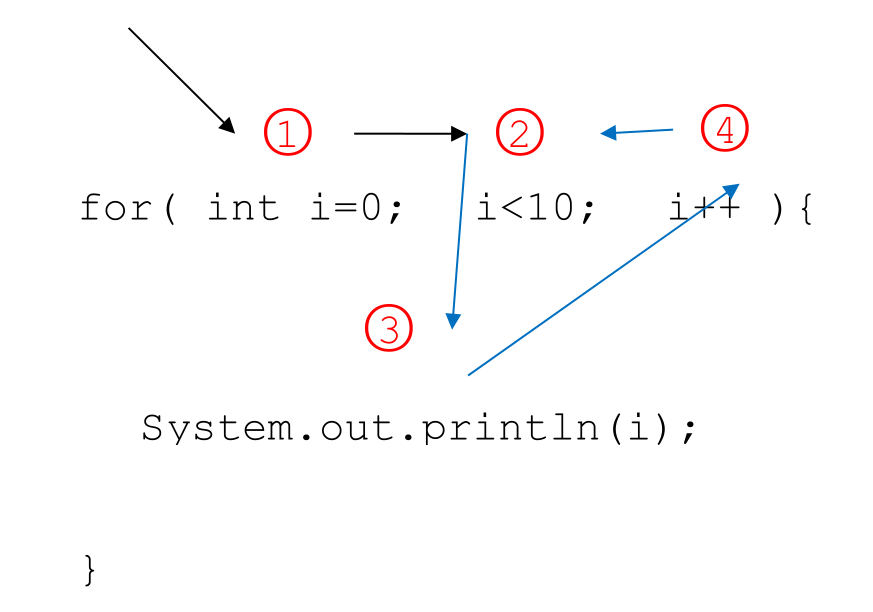
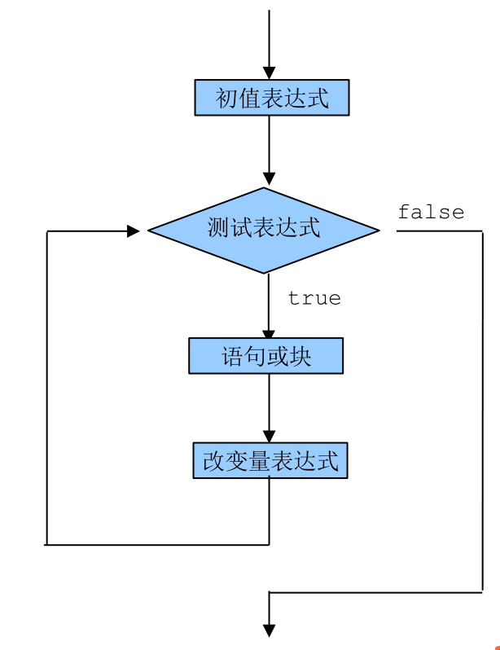
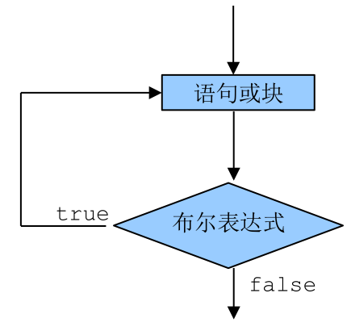

# Html标签

HTML（英文Hyper Text Markup Language的缩写）中文译为“超文本标签语言”，主要是通过HTML标签对网页中的文本、图片、声音等内容进行描述。

HTML 语言的语法格式：

```html
<HTML>  
  <head>   
    <title></title>
  </head>
  <body>
  </body>
</HTML>
```


## 结构标签

### p

`<p>` 标签定义段落。


### div

`<div>`标签定义 HTML 文档中的一个分隔区块或者一个区域部分。
`<div>`标签常用于组合块级元素，以便通过 CSS 来对这些元素进行格式化。


### span

`<span> `用于对文档中的行内元素进行组合。


### H5语义化结构标签

H5推出语义化标签，比`<div>`标签有更加丰富的含义，方便开发与维护 。

结构标签不具有任何样式，只是使页面元素的的语义更加明确。

| 标签    | 说明                                                 |
| ------- | ---------------------------------------------------- |
| article | 代表文档、页面或者应用程序中与上下文不相关的独立部分 |
| footer  | 用来定义文档或节的页脚                               |
| header  | 用来定义导航链接的部分                               |
| nav     | 用来定义导航链接的部分                               |
| section | 用来定义文档的某个区域                               |


## img图像

img标签属性

| **属性名** | **描述**                                     |
| ---------- | -------------------------------------------- |
| src        | 图像路径                                     |
| width      | 宽                                           |
| height     | 高                                           |
| align      | 对齐方式（bottom、middle、top、left、right） |

 

 

 

## 链接

| **属性名** | **描述**             |
| ---------- | -------------------- |
| href       | 指向另一个文档的链接 |

### 文本链接

```html
<a href="test2.html">测试页</a>
```

 

### 图片链接

```html
<a href="test2.html">
   
</a>
```


 

## 表格

### 表格标签

| **标签**  | **描述**         |
| --------- | ---------------- |
| <table>   | 定义表格         |
| <capiton> | 定义表格标题     |
| <th>      | 定义表格的表头   |
| <tr>      | 定义表格的行     |
| <td>      | 定义表格的单元   |


 

 

## 列表

### 列表标签

| **标签** | **描述** |
| -------- | -------- |
| <ol>     | 有序列表 |
| <ul>     | 无序列表 |
| <li>     | 列表项   |


### 无序列表

无序列表type的属性：

| **type**  **类型** | **描** **述** |
| ------------------ | ------------- |
| type=disc          | 实心圆(默认)  |
| type=circle        | 空心圆        |
| type=square        | 小方块        |

**无序列表示例：**

 ```html
  <body>  
      <ul>  　　
          <li>默认的无序列表加"实心园"  　　
          <li>默认的无序列表"实心园"  　　
          <li>默认的无序列表"实心园"  
      </ul>  
      <ul>  
          <li type=square>无序列表square加方块  　　
          <li type=square>无序列表square加方块  　　
          <li type=square>无序列表square加方块  
      </ul>  
      <ul>  
          <li type=circle>无序列表circle加空心园  　　
          <li type=circle>无序列表circle加空心园  　　
          <li type=circle>无序列表circle加空心园  
      </ul>  
 </body>  
 ```


**无序列表效果：**


 

### 有序列表

`<ol>` 标签定义有序列表

```html
<body>
    <ol>
        <li>Coffee
        <li>Tee
        <li>Milk
    </ol>
</body>
```


有序列表type的属性：

| **type** **类型** | **描** **述**                                 |
| ----------------- | --------------------------------------------- |
| type=1            | 表示列表项目用数字标号（1,2,3...）            |
| type=A            | 表示列表项目用大写字母标号（A,B,C...）        |
| type=a            | 表示列表项目用小写字母标号（a,b,c...）        |
| type=I            | 表示列表项目用大写罗马数字标号（Ⅰ,Ⅱ,Ⅲ...）    |
| type=i            | 表示列表项目用小写罗马数字标号（i,ii,iii...） |


 

## 表单

表单用于获取不同类型的用户输入。

### form

表单标签的格式: 

```html
<form>
</form>
```


### input


标记<input>用来定义一个用户输入区，用户可在其中输入信息。

```html
<input type="text" value="内容">
```


具体是哪一种类型由type属性来决定。请看下边列表：

| **type属性取值**                | 说明       |
| ------------------------------- | ---------- |
| text                            | 输入框     |
| password                        | 密码框     |
| hidden                          | 隐藏域     |
| radio                           | 单选框     |
| checkbox                        | 复选框     |
| file                            | 文件框     |
| date                            | 日期       |
| color                           | 颜色       |
| email                           | 邮件框     |
| number                          | 数字输入框 |
| range                           | 滑块       |
| search                          | 搜索框     |
| button                          | 按钮       |
| submit                          | 提交按钮   |
| reset                           | 重置按钮   |


### 下拉菜单

```html
<select>
    <option>
</select>
```


**示例：**

  ```html
  <body>  
      <form>  
          <p>请选择最喜欢的男歌星:  
              <select>  
                  <option  value="ldh">刘德华</option>  
                  <option  value="zhxy" selected>张学友</option>  
                  <option  value="gfch">郭富城</option>  
                  <option  value="lm">黎明</option>  
              </select>  
      </form>  
  </body>  
  ```


**效果：**


### 多行的文本框

```html
<textarea clos="20" rows="5"></textarea>
```


 

 

 

 


# JS入门

## 概述

### JavaScript和HTML、CSS的区别

 

1.  HTML：提供网页的结构，提供网页中的内容

2.  CSS: 用来美化网页

3.  JavaScript: 可以用来控制网页内容，给网页增加动态的效果

 

### 什么是JavaScript

JavaScript是网景(Netscape)公司开发的，其前身是Livescript。

JavaScript是一种运行在客户端的脚本语言。

JavaScript的解释器被称为JavaScript引擎，为浏览器的一部分，广泛用于客户端的脚本语言，最早是在HTML（标准通用标记语言下的一个应用）网页上使用，用来给HTML网页增加动态功能。

 

### JavaScript语言的诞生

了解JavaScript的历史，才能明白Javascript为什么是现在的样子。以下主要是布兰登·艾奇（Brendan Eich）的自述。

#### 1994年网景公司发布了Navigator浏览器

1994年，网景公司（Netscape）发布了Navigator浏览器0.9版。这是历史上第一个比较成熟的网络浏览器，轰动一时。但是，这个版本的浏览器只能用来浏览，不具备与访问者互动的能力。网景公司急需一种网页脚本语言，使得浏览器可以与网页互动。

​                               

网页脚本语言到底是什么语言？网景公司当时有两个选择：一个是采用现有的语言，比如Perl、Python、Tcl、Scheme等等，允许它们直接嵌入网页；另一个是发明一种全新的语言。

这两个选择各有利弊。第一个选择，有利于充分利用现有代码和程序员资源，推广起来比较容易；第二个选择，有利于开发出完全适用的语言，实现起来比较容易。

到底采用哪一个选择，网景公司内部争执不下，管理层一时难以下定决心。

#### 1995年Java诞生了

就在这时，发生了另外一件大事：1995年Sun公司将Oak语言改名为Java，正式向市场推出。

Sun公司大肆宣传，许诺这种语言可以"一次编写，到处运行"（Write Once, Run Anywhere），它看上去很可能成为未来的主宰。

 

网景公司动了心，决定与Sun公司结成联盟。它不仅允许Java程序以applet（小程序）的形式，直接在浏览器中运行；甚至还考虑直接将Java作为脚本语言嵌入网页，只是因为这样会使HTML网页过于复杂，后来才不得不放弃。

总之，当时的形势就是，网景公司的整个管理层，都是Java语言的信徒，Sun公司完全介入网页脚本语言的决策。因此，Javascript后来就是网景和Sun两家公司一起携手推向市场的，这种语言被命名为"Java+script"并不是偶然的。

#### Brendan Eich来到了网景公司

此时，34岁的系统程序员Brendan Eich登场了。1995年4月，网景公司录用了他。


Brendan Eich的主要方向和兴趣是函数式编程，网景公司招聘他的目的，是研究将Scheme语言作为网页脚本语言的可能性。Brendan Eich本人也是这样想的，以为进入新公司后，会主要与Scheme语言打交道。

 

仅仅一个月之后，1995年5月，网景公司做出决策，未来的网页脚本语言必须"看上去与Java足够相似"，但是比Java简单，使得非专业的网页作者也能很快上手。这个决策实际上将Perl、Python、Tcl、Scheme等非面向对象编程的语言都排除在外了。

Brendan Eich被指定为这种"简化版Java语言"的设计师。

但是，他对Java一点兴趣也没有。为了应付公司安排的任务，他只用10天时间就把Javascript设计出来了。

由于设计时间太短，语言的一些细节考虑得不够严谨，导致后来很长一段时间，Javascript写出来的程序混乱不堪。如果Brendan Eich预见到，未来这种语言会成为互联网第一大语言，全世界有几百万学习者，他会不会多花一点时间呢？

总的来说，他的设计思路是这样的：

　　（1）借鉴C语言的基本语法；

　　（2）借鉴Java语言的数据类型和内存管理；

　　（3）借鉴Scheme语言，将函数提升到"第一等公民"（first class）的地位；

　　（4）借鉴Self语言，使用基于原型（prototype）的继承机制。

所以，Javascript语言实际上是两种语言风格的混合产物----（简化的）函数式编程+（简化的）面向对象编程。这是由Brendan Eich（函数式编程）与网景公司（面向对象编程）共同决定的。

 

## JavaScript初体验

### js能做什么

#### 在页面获取元素


#### 控制div内容


#### 控制input值


 

#### 控制img属性

 

#### 控制div样式


#### 控制标签的className


 

### 函数

 

函数是被设计为执行特定任务的代码块。

函数会在某代码调用它时被执行。

函数通过 function 关键词进行定义，其后是*函数名*和括号 ()

 

 ```js
  function 函数名() {   
      // 函数体  
  }  
 ```


 

 

 

 

 

### 变量

#### 什么是变量

 

- 什么是变量

变量是计算机内存中存储数据的标识符，根据变量名称可以获取到内存中存储的数据

 

- 为什么要使用变量

使用变量可以方便的获取或者修改内存中的数据

 

 

#### 如何使用变量

let声明变量

 ```js
  let age;  
 ```

 

变量的赋值

 ```js
 let age;  
 age = 18;  
 
 let name = "张三";  
 ```


   

 

### 元素对象

#### 认识对象

在 DOM 中, 每一个HTML元素都是一个元素对象，简称对象。

每个HTML元素，HTML 属性，HTML元素的文本，每个注释，都是对象。


对象中有两种组成部分，一个是属性，一个是方法。

- 属性： o.innerText/ o.value / o.style
  - 属性作用：存储数据

- 方法： document.getElementById( )
  - 方法作用：完成功能

 

#### 常用元素对象举例

 

| DOM对象  | **说明**                             |
| -------- | ------------------------------------ |
| document | 浏览器中的HTML文档，就是document对象 |
| form     | 表单对象                             |
| input    | 输入框对象                           |
| div      | div块对象                            |
| img      | 图像对象                             |
| select   | 下拉列表对象                         |
| option   | 选项对象                             |
| button   | 按钮对象                             |

 

 

 

## 事件

### 事件驱动及事件处理

我们也可以将某个函数与某个事件（Event，通常是鼠标或热键的动作）联系起来，使得当事件发生时执行该函数。这个方法称之为**事件驱动**（Event Driver）。而对事件进行处理的函数，称之为**事件处理程序**（Event Handler事件句柄）。

### 常用事件

JavaScript事件驱动中的事件是通过鼠标或热键的动作（点击或按下）引发的。下表中列出了常见的事件及其说明。

 

| **事件属性** | **说明**                       |
| ------------ | ------------------------------ |
| onabort      | 图像加载被中断                 |
| onblur       | 元素失去焦点                   |
| onfocus      | 元素获得焦点                   |
| onchange     | 用户改变域的内容               |
| onclick      | 鼠标点击某个对象               |
| ondblclick   | 鼠标双击某个对象               |
| onerror      | 当加载文档或图像时发生某个错误 |
| onkeydown    | 某个键盘的键被按下             |
| onkeypress   | 某个键盘的键被按下或按住       |
| onkeyup      | 某个键盘的键被松开             |
| onInput      | 在用户输入时触发               |
| onload       | 某个页面或图像被完成加载       |
| onunload     | 用户退出页面                   |
| onmousedown  | 某个鼠标按键被按下             |
| onmouseup    | 某个鼠标按键被松开             |
| onmousemove  | 鼠标被移动                     |
| onmouseout   | 鼠标从某元素移开               |
| onmouseover  | 鼠标被移到某元素之上           |
| onreset      | 重置按钮被点击                 |
| onresize     | 窗口或框架被调整尺寸           |
| onselect     | 文本被选定                     |
| onsubmit     | 提交按钮被点击                 |

 


## 引入js文件

 

写在script标签中

```html
<head>  
    <script>    
        alert('Hello World!');   
    </script>  
</head>  
```


 

写在外部js文件中，在页面引入

```html
<script  src="main.js"></script>  
```


> 注意：引用外部js文件的script标签中不可以写JavaScript代码

 

# 基础语法

 

## 变量

### 什么是变量

 

- 什么是变量

变量是计算机内存中存储数据的标识符，根据变量名称可以获取到内存中存储的数据

 

- 为什么要使用变量

使用变量可以方便的获取或者修改内存中的数据

 

 

### 如何使用变量

let声明变量

  ```js
  let age;  
  ```


 

变量的赋值

```js
let age;  age = 18;  
```


 

同时声明多个变量

```js
let age, name, sex;  
age = 18;  
name = '王聪';  
```


 

同时声明多个变量并赋值

```js
let age = 18, name = '王聪';  
```


 

 

### 变量在内存中的存储

  

 

### 变量的命名规则和规范

 

规则：必须遵守的，不遵守会报错：

- 由字母、数字、下划线、$符号组成
- 不能以数字开头  
- 不能是关键字和保留字，例如：for、while、let、function  
- 区分大小写  

 

建议：

- 变量名必须有意义  
- 遵守驼峰命名法。首字母小写，后面单词的首字母需要大写。例如：userName、userPassword  

 

下面哪些变量名不合法

A. a      

B. 1  

C.  age18  

D.   18age  

E.   name  

F.   $name  

G.   _sex  

H.   &sex  

> javascript的关键字：  
>
> break  case  catch   continue  default  delete   do  else  finally  for   function  if  in   instanceof  new  return  switch   this  throw  try   typeof  var  void  while   with const    

  

> javascript的保留字：  
>
> abstract  boolean  byte   char  class  debugger   double  enum    export  extends    final   float  goto    implements  import   int    interface   long    native package  private  protected public  short     static super   synchronized  throws   transient volatile     

 

  

 

 

## 数据类型

 

### 简单数据类型

number、string、boolean、undefined、null

 

#### number类型

数值字面量：数值的固定值的表示法 

  110   1024   60.5  1.5e3  1.5e-3  

 

#### string类型


- 字符串字面量 'abc'  "abc"

> 思考：如何打印以下字符串。
>
> 我是一个"正直"的人 
>
> 我很喜欢"Java编程"

- 字符串长度

length属性用来获取字符串的长度

let str = 'Hello World';  console.log(str.length);  

 

- 字符串拼接

字符串拼接使用 + 连接

  ```js
  console.log(11 + 11);  
  console.log('hello' + ' world');  
  console.log('100' + '100');  
  console.log('11' + 11);  
  console.log('male:' + true);  
  ```

> 1. 两边只要有一个是字符串，那么+就是字符串拼接功能
>
> 2. 两边如果都是数字，那么就是算术功能。

  

 

#### boolean类型

boolean字面量： true和false，区分大小写

计算机内部存储：true为1，false为0

 

#### undefined和null

 

1.  undefined表示一个声明了没有赋值的变量，变量只声明的时候值默认是undefined

2.  null表示一个空，变量的值如果想为null，必须手动设置

 

### 复杂数据类型

 

Object

 

### 获取变量的类型

typeof方法

  ```js
  let age = 18;  
  console.log(typeof age); // 'number'  
  ```


## 注释

 

### 单行注释

用来描述下面一个或多行代码的作用

  ```js
  // 这是一个变量  
  let name = 'hm';  
  ```


> 快捷键：ctrl+/


### 多行注释

用来注释多行代码

```js
 /*  
 let name = '王聪';  
 let age = 18;  
 console.log(name, age);  
 */  
```

> 快捷键：ctrl+shift+/


 


 

## 操作符

运算符 operator 

5 + 6  

表达式 组成 操作数和操作符，会有一个结果

### 算术运算符

 ` + - * / %`   

 

 

### 一元运算符

只有一个操作数的运算符

5 + 6 两个操作数的运算符 二元运算符

++ 自身加1

-- 自身减1

 

- 前置++

  ```js
  let num1 = 5;  
  ++num1;      
  let num2 = 6;  
  console.log(num1 + ++num2);  
  ```


 

- 后置++ 

  ```js
  let num1 = 5;  
  ++num1;      
  let  num2 = 6;  
  console.log(num1 + num2++);  
  ```


 

 

练习：

  ```js
  let a = 1; 
  let b = ++a + ++a; 
  console.log(b);    
  let a = 1; 
  let b = a++ + ++a; 
  console.log(b);    
  let a = 1; 
  let b = a++ + a++; 
  console.log(b);    
  let a = 1; 
  let b = ++a + a++; 
  console.log(b);  
  ```


### 关系运算符(比较运算符)

 ` < > >=   <= == != === !==  `

 

\==与\=\==的区别：\==只进行值得比较，\===类型和值同时相等，则相等

 ```js
 let result = '55' == 55;  // true  
 let result = '55' === 55;  //  false 值相等，类型不相等  
 let result = 55 === 55;  // true  
 ```


 

### 逻辑运算符(布尔运算符)

- && 与 两个操作数同时为true，结果为true，否则都是false

- || 或 两个操作数有一个为true，结果为true，否则为false

- ! 非 取反

| **逻辑与关系值表** |       |       |
| ------------------ | ----- | ----- |
| A                  | B     | A&&B  |
| true               | true  | true  |
| true               | false | false |
| false              | true  | false |
| false              | false | false |

 

| **逻辑或关系值表** |       |        |
| ------------------ | ----- | ------ |
| A                  | B     | A\|\|B |
| true               | true  | true   |
| true               | false | true   |
| false              | true  | true   |
| false              | false | false  |

 

 

| **逻辑非关系值表** |       |
| ------------------ | ----- |
| A                  | !A    |
| true               | false |
| false              | true  |

 

 

 

 

 

### 赋值运算符 

  =  +=  -=   *=  /=  %=  

 ```js
 let num = 0;  
 num += 5; 
 //相当于 num = num + 5;  
 ```


  

 

 

### 运算符的优先级 

  

| **优先级从高到底** | **说明**                |
| ------------------ | ----------------------- |
| 小括号             | ()                      |
| 一元运算符         | ++  --   !              |
| 算数运算符         | 先*   / %  后 +   -     |
| 关系运算符         | >  >=   <  <=           |
| 相等运算符         | ==  !=    \===  !==     |
| 逻辑运算符         | 先&&  后\|\|            |
| 赋值运算符         | =  +=   -=  *=  /=   %= |

 

 

 

### 表达式和语句 

 

#### 表达式

一个表达式可以产生一个值，有可能是运算、函数调用、有可能是字面量。表达式可以放在任何需要值的地方。

 

#### 语句

 语句可以理解为一个行为，循环语句和判断语句就是典型的语句。一个程序有很多个语句组成，一般情况下;分割一个一个的语句

## 流程控制

程序的三种基本结构

 

| **结构类型** | **说明**                                                     |
| ------------ | ------------------------------------------------------------ |
| 顺序结构     | 从上到下执行的代码就是顺序结构  程序默认就是由上到下顺序执行的 |
| 分支结构     | 根据不同的情况，执行对应代码                                 |
| 循环结构     | 重复做一件事情                                               |

 

 

### 分支结构

 

#### if语句

 

​       语法结构

```js
if (/* 条件表达式 */) {   
	// 执行语句  
}  
```


```js
if (/* 条件表达式 */) {   
	// 执行语句  
}else{
   // 执行语句   
}  
```


```js
if (/* 条件表达式 */) {   
	// 执行语句  
}else if(/* 条件表达式 */){
    // 执行语句 
}else if(/* 条件表达式 */){
    // 执行语句 
}else{
    // 最后默认执行语句   
}  
```


>   练习：  
>
> 1. 求两个数的最大数 
> 2.  判断一个数是偶数还是奇数  
> 3. 分数转换，把百分制转换成ABCDE     <60 E  60-70 D   70-80 C 80-90 B 90 - 100 A  
> 4. 判断一个年份是闰年还是平年   闰年：能被4整除，但不能被100整除的年份 或者 能被400整除的年份  
> 5.  判断一个人的年龄是否满18岁(是否成年)  
>
>  

 

 

 

 


#### 三元运算符

  

```js
布尔表达式? 表达式1:表达式2  
```

对if……else语句的一种简化写法  

>   练习：  
>
> 1. 是否年满18岁  
> 2. 从两个数中找最大值  

 

 

#### switch语句

语法格式:

 switch 表示选择分支的情况，switch 语句的句法是：

```js
switch  ( 表达式 ){
    case  常量1: 
        语句;
        break;
    case  常量2: 
        语句;
        break;
    default: 
        语句;
        break;
}
```

break可以省略，如果省略，代码会继续执行下一个case

switch 语句在比较值时使用的是全等操作符, 因此不会发生类型转换（例如，字符串'10' 不等于数值 10）

> 练习：    
>
> 1. 显示星期几    
> 2. 素质教育（把分数变成ABCDE）千万不要写100个case哟  

#### 布尔类型的隐式转换

流程控制语句会把后面的值隐式转换成布尔类型

- 转换为true  
  - 非空字符串 非0数字 true   任何对象  

- 转换成false 
  - 空字符串  0     false    null   undefined    NaN  

 

 

 

### 循环结构

 

在javascript中，循环语句有三种，for、while、do..while循环。

 

#### for语句

​           for循环语法：

  ```js
  // for循环的表达式之间用的是;号分隔的，千万不要写成逗号 
  for (初值表达式; 测试表达式; 改变量表达式) {   
      // 循环体  
  }  
  ```



 




>  作业：  
>
> 1. 打印1-100之间所有数  
> 2. 求1-100之间所有数的和  
> 3. 求1-100之间所有数的平均值  
> 4. 求1-100之间所有偶数的和  
> 5. 同时求1-100之间所有偶数和奇数的和  
> 6. 打印正方形  
> 7. 打印直角三角形  
> 8. 打印9*9乘法表  
> 9. 求1-100之间所有数的乘积  
> 10. 求1-100之间所有奇数的和  
> 11. 计算1-100之间能3整除的数的和  
> 12. 计算1-100之间不能被7整除的数的和     
> 13. 本金10000元存入银行，年利率是千分之三，每过1年，将本金和利息相加作为新的本金。计算5年后，获得的本金是多少？     
> 14. 有个人想知道，一年之内一对兔子能繁殖多少对？于是就筑了一道围墙把一对兔子关在里面。已知一对兔子每个月可以生一对小兔子，而一对兔子从出生后第3个月起每月生一对小兔子。假如一年内没有发生死亡现象，那么，一对兔子一年内（12个月）能繁殖成多少对？（兔子的规律为数列，1，1，2，3，5，8，13，21）


​    

 

 

#### while语句

基本语法：

           ```js
           // 当循环条件为true时，执行循环体，  
           // 当循环条件为false时，结束循环。  
           while (循环条件) {   
               //循环体  
           }            
           ```


​       


   

代码示例：

 ```js
 // 计算1-100之间所有数的和  
 // 初始化变量  
 let i = 1;  
 let sum = 0;  
 // 判断条件  
 while (i <= 100) {   
     // 循环体   
     sum += i;   
     // 自增   
     i++;  
 }  
 console.log(sum);  
 ```


 

>  练习：    
>
> 1. 打印100以内 7的倍数    
> 2. 打印100以内所有偶数    
> 3. 打印100以内所有偶数的和    
> 4. 打印100以内的奇数    
> 5. 打印100以内的奇数的和    

 

 

#### do...while语句

基础语法：  

         ```js
         do {   
             // 循环体;  
         } while (循环条件);  
         ```

 




   

   ```js
    // 初始化变量  
   let i = 1;  
   let sum = 0;  
   do {   
       sum += i;
       //循环体   
       i++;
       //自增  
   } while (i <= 100);//循环条件  
   ```


> 作业：
>
> 1. 求100以内所有3的倍数的和  
> 2. 使用do-while循环：输出询问“我爱你，嫁给我吧？”，选择“你喜欢我吗？(y/n):"，如果输入为y则打印”我们形影不离“，若输入为n,则继续询问   


 

 

#### 特点

-  for循环一般在循环次数确定的时候比较方便
- while和do...while一般用来解决无法确认次数的循环。
- do..while循环和while循环非常像，二者经常可以相互替代，但是do..while的特点是不管条件成不成立，都会执行一次。

 

 

#### continue和break

 

- break:立即跳出整个循环，即循环结束，开始执行循环后面的内容（直接跳到大括号）

- continue:立即跳出当前循环，继续下一次循环（跳到i++的地方）

 

> 练习：
>
> 1. 求整数1～100的累加值，但要求碰到个位为3的数则停止累加  
> 2. 求整数1～100的累加值，但要求跳过所有个位为3的数     
> 3. 求1-100之间不能被7整除的整数的和（用continue）  
> 4. 求200-300之间所有的奇数的和（用continue）  
> 5. 求200-300之间第一个能被7整数的数（break）  

 

## 断点调试

断点调试是指自己在程序的某一行设置一个断点，调试时，程序运行到这一行就会停住，然后你可以一步一步往下调试，调试过程中可以看各个变量当前的值，出错的话，调试到出错的代码行即显示错误，停下。

 

调试步骤：

- 浏览器中按F12-->sources
- 找到需要调试的文件
- 在程序的某一行设置断点  

 

 

调试中的相关操作

- Watch: 监视，通过watch可以监视变量的值的变化，非常的常用。

- F10: 程序单步执行，让程序一行一行的执行，这个时候，观察watch中变量的值的变化。

- F8：跳到下一个断点处，如果后面没有断点了，则程序执行结束。

 

代码调试的能力非常重要，只有学会了代码调试，才能学会自己解决bug的能力。初学者不要觉得调试代码麻烦就不去调试，知识点花点功夫肯定学的会，但是代码调试这个东西，自己不去练，永远都学不会。

 

 


 

# 数组

## 为什么要学习数组

之前学习的数据类型，只能存储一个值(比如：Number/String。我们想存储班级中所有学生的姓名，此时该如何存储？

 

## 数组的概念

所谓数组，就是将多个元素（通常是同一类型）按一定顺序排列放到一个集合中，那么这个集合我们就称之为数组。

## 数组的定义

数组是一个有序的列表，可以在数组中存放任意的数据，并且数组的长度可以动态的调整。

 

通过数组字面量创建数组

```js
// 创建一个空数组  
let arr1 = [];      

// 创建一个包含3个数值的数组，多个数组项以逗号隔开  
let arr2 = [1, 3, 4];      

// 创建一个包含2个字符串的数组  
let arr3 = ['a', 'c']; 

//可以通过数组的length属性获取数组的长度  
console.log(arr3.length);  

// 可以设置length属性改变数组中元素的个数  
arr3.length = 0;  
```


 

 

## 获取数组元素

数组的取值

-  格式：数组名[下标]  下标又称索引 
- 功能：获取数组对应下标的那个值，如果下标不存在，则返回undefined。       

 ```js
 let arr = ['red', 'green', 'blue'];  
 console.log(arr[0]);  //red  
 console.log(arr[2]); // blue  
 console.log(arr[3]); // 这个数组的最大下标为2,因此返回undefined
 ```


## 遍历数组

遍历：遍及所有，对数组的每一个元素都访问一次就叫遍历。

数组遍历的基本语法：

 ```js
  for(let i = 0; i < arr.length; i++) {    
      // 数组遍历的固定结构  
  }  
 ```


 

## 数组中新增元素

格式：数组名[下标/索引] = 值;  

// 如果下标有对应的值，会把原来的值覆盖，如果下标不存在，会给数组新增一个元素。  

```js
let arr = ["red",  "green", "blue"];  
// 把red替换成了yellow  
arr[0] = "yellow";  
// 给数组新增加了一个pink的值  
arr[3] = "pink";  
```


 

> 练习：
>
> 1. 求一组数中的所有数的和 和 平均值  
> 2. 求一组数中的最大值和最小值，以及所在位置  
> 3. 将字符串数组用|或其他符号分割，拼接成字符串展示  
> 4. 要求将数组中的0项去掉，将不为0的值存入一个新的数组，生成新的数组  
> 5. 翻转数组   
> 6. 冒泡排序，从小到大  

 

 

# 函数

## 为什么要有函数

如果要在多个代码位置，需要对数组进行排序操作，应该怎么做？

 

## 什么是函数

把一段相对独立的具有特定功能的代码块封装起来，形成一个独立实体，就是函数，起个名字（函数名），在后续开发中可以反复调用

函数的作用就是封装一段代码，将来可以重复使用

 

## 函数的定义

 

函数声明

 ```js
  function 函数名() {   
      // 函数体  
  }  
 ```

 

函数表达式

 ```js
  函数名 = function () {   
      // 函数体  
  }  
 ```


特点：

- 函数声明的时候，函数体并不会执行，只要当函数被调用的时候才会执行。

-  函数一般都用来干一件事情，函数名称一般使用动词

 

## 函数的调用

调用函数的语法：

  函数名();  

 

特点：

- 函数体只有在调用的时候才会执行，调用需要()进行调用。

- 可以调用多次(重复使用)

 

代码示例：

 ```js
  // 声明函数  
 function sayHi() {     
     console.log("吃了没？");  
 }  
 
 // 调用函数  
 sayHi(); 
 ```

 

 ```js
 // 求1-100之间所有数的和  
 function getSum() {   
     let  sum = 0;   
     for (let i = 0; i < 100; i++) {    
         sum  += i;   
     }     
     console.log(sum);  
 }  
 // 调用  
 getSum(); 
 ```


 

## 函数的参数

 

### 为什么要有参数

 ```js
  function getSum() {   
      let sum = 0;   
      for (let i = 1; i <= 100; i++) {    
          sum += i;   
      }   
      console.log();  
  }     
 ```

 

虽然上面代码可以重复调用，但是只能计算1-100之间的值 

如果想要计算n-m之间所有数的和，应该怎么办呢？     

 

### 语法

  函数内部是一个封闭的环境，可以通过参数的方式，把外部的值传递给函数内部  

 ```js
 // 带参数的函数声明  
 function 函数名(形参1, 形参2, 形参3...) {   
     // 函数体  
 }     
 // 带参数的函数调用  
 函数名(实参1,  实参2, 实参3);   //形参1=实参1  形参2=实参2  
 ```


 

### 形参和实参

 

形式参数：在声明一个函数的时候，为了函数的功能更加灵活，有些值是固定不了的，对于这些固定不了的值。我们可以给函数设置参数。这个参数没有具体的值，仅仅起到一个占位置的作用，我们通常称之为形式参数，也叫形参。

实际参数：如果函数在声明时，设置了形参，那么在函数调用的时候就需要传入对应的参数，我们把传入的参数叫做实际参数，也叫实参。

 ```js
 let x = 5, y = 6;  
 fn(x,y);   
 
 function fn(a, b) {     
     console.log(a + b);  
 }
 ```

 x,y实参，有具体的值。函数执行的时候会把x,y复制一份给函数内部的a和b，函数内部的值是复制的新值，无法修改外部的x,y  

 

 

 

## 函数的返回值

 

当函数执行完的时候，并不是所有时候都要把结果打印。我们期望函数给我一些反馈（比如计算的结果返回进行后续的运算），这个时候可以让函数返回一些东西。也就是返回值。函数通过return返回一个返回值

 ```js
 //声明一个带返回值的函数  
 function 函数名(形参1, 形参2, 形参3...) {   
     //函数体     
     return 返回值;  
 }     
 
 //可以通过变量来接收这个返回值  
 let 变量 = 函数名(实参1,  实参2, 实参3...);    
 ```


   

函数的调用结果就是返回值，因此我们可以直接对函数调用结果进行操作。

返回值详解：

| **函数中**     | **返回值**                                            |
| -------------- | ----------------------------------------------------- |
| 没有return语句 | 函数有默认的返回值：undefined                         |
| 有return语句   | 在return后面的值，就是函数的返回值                    |
| 有return语句   | return后面没有任何值，那么函数的返回值也是：undefined |

函数使用return语句后，这个函数会在执行完 return 语句之后停止并立即退出，也就是说return后面的所有其他代码都不会再执行。

 

推荐的做法是要么让函数始终都返回一个值，要么永远都不要返回值。

 

>  练习：
>
> 1. 求1-n之间所有数的和  
> 2. 求n-m之间所有数的和  
> 3. 求2个数中的最大值  
> 4. 求3个数中的最大值  
> 5. 圆的面积  
> 6. 判断一个数是否是素数(又叫质数，只能被1和自身整数的数)  
> 7. 求斐波那契数列Fibonacci中的第n个数是多少？  1 1 2 3 5 8 13 21...  
> 8. 翻转数组，返回一个新数组  
> 9. 对数组排序，从小到大  
> 10. 输入一个年份，判断是否是闰年[闰年：能被4整数并且不能被100整数，或者能被400整数]  
> 11. 输入某年某月某日，判断这一天是这一年的第几天？  
> 12. 求阶乘：例如5的阶乘=5*4*3*2*1=120  
> 13. 求1!+2!+3!+....+n!    

 

 

## arguments的使用

 

JavaScript中，arguments对象是比较特别的一个对象，实际上是当前函数的一个内置属性。也就是说所有函数都内置了一个arguments对象，arguments对象中存储了传递的所有的实参。arguments是一个伪数组，因此及可以进行遍历

 

>  作业：
>
> 1. 求任意个数的最大值  
> 2. 求任意个数的和  

 

 

 

 

## 代码规范

  1.命名规范 

​    变量、函数 的命名 必须要有意义

​    变量 的名称一般用名词

​    函数 的名称一般用动词

  2.变量规范  

​    操作符的前后要有空格

 ```js
 let name = 'zs';  
 let x = 5 + 6
 ```


  3.注释规范

   ```js
    // 这里是注释
   ```


  4.空格规范

    ```js
    if (true) {
    
    }
    
    for (let i = 0; i <= 100; i++) {
    
    }
    ```


  5.换行规范

    ```js
    let arr = [1, 2, 3, 4];
    if (a > b) {  
    }
    for (let i = 0; i < 10; i++) {   
    }
    function fn() {
    }
    ```


 

 

## 变量的作用域

作用域：变量可以起作用的范围

分为全局变量和局部变量

 

### 全局变量

 

在任何地方都可以访问到的变量就是全局变量，对应全局作用域

 

### 局部变量

只在固定的代码片段内可访问到的变量，最常见的例如函数内部。对应局部作用域(函数作用域)

  不使用let声明的变量是全局变量，不推荐使用。  变量退出作用域之后会销毁，全局变量关闭网页或浏览器才会销毁  


## 系统函数

JavaScript中的系统函数又称为内部方法，它们不属于任何对象，可以直接使用。它们可以完成许多很常用的功能。

### parseFloat

parseFloat(字符串)

返回浮点数

例如: let f = parseFloat("10.5") 返回数字：10.5

### parseInt(字符串,radix)

parseInt(字符串,radix)

其中radix是数的进制，默认是十进制数 parseInt(字符串)

例如: let i = parseInt("10.5") 返回数字：10

let i = parseInt("10") 返回数字：10

let i = parseInt("abc") 返回值：NaN

let i = parseInt("1100",2) 返回数字：12

### isNaN(x)

该函数可用于判断其参数是否是NaN，NaN表示一个非法的数字。如果把 NaN 与任何值（包括其自身）相比得到的结果均是false，所以要判断某个值是否是 NaN，不能使用 == 运算符。正因为如此，isNaN()函数是必需的。

如果x是特殊的非数字值 NaN（或者能被转换为这样的值），返回的值就是 true。如果 x 是其他值,则返回 false。

isNaN() 函数通常用于检测 parseFloat() 和 parseInt() 的结果，以判断它们表示的是否是合法的数字。

例如: let n = parseInt("javakc"); isNaN(n)的返回值是true。

例如: let n = parseInt("10"); isNaN(n)的返回值是false。

### eval( 字符串表达式)

eval( 字符串表达式) 

返回字符串表达式中的运算结果值。

例1：test=eval("x=8+9+5/2");

   document.write(test);      //输出显示19.5

 

### escape和unescape

escape(字符串) 

返回字符串的一种简单编码，将非字母数字的符号转换为%加其unicode码的十六进制表示。

例如: let s = escape("java快车") 返回 "java%u5FEB%u8F66"

unescape(字符串)

将已编码的字符串还原为纯字符串。

例如: let s = unescape("java%u5FEB%u8F66") 返回 "java快车"

 

 

 

 

 

# 内置对象

JavaScript是一种基于对象的脚本语言，而不是面向对象的编程语言。

对象就是客观世界存在的实体，具有属性和方法两方面特性。

访问对象的属性和方法的方式如下：

- 对象名.属性

- 对象名.方法名()

## 字符串对象

  

  myStr="我们来自五湖四海!";  

 

| 下标 | 0    | 1    | 2    | 3    | 4    | 5    | 6    | 7    | 8    |
| ---- | ---- | ---- | ---- | ---- | ---- | ---- | ---- | ---- | ---- |
| 字符 | 我   | 们   | 来   | 自   | 五   | 湖   | 四   | 海   | !    |

 

 

### 字符串的长度属性

  myStr.length 返回字符串中字符的个数，一个汉字算一个字符。

### 字符串的方法

| **方法**                      | **描述**                                             | **示例及结果**                                               |
| ----------------------------- | ---------------------------------------------------- | ------------------------------------------------------------ |
| charAt(下标)                  | 返回在指定位置的字符。                               | "北京欢迎你".charAt(2)结果是"欢"   "北京欢迎你".charAt(0)结果是"北" |
| concat(字符串)                | 连接字符串。                                         | "北京".concat("欢迎你")结果是"北京欢迎你"                    |
| indexOf(字符串)               | 检索字符串。                                         | "北京欢迎你".indexOf("欢迎")结果是2   "北京欢迎你".indexOf("上海")结果是-1   "北京欢迎欢迎你 ".indexOf("欢迎")结果是2 |
| lastIndexOf(字符串)           | 检索字符串最后一次出现的位置。                       | "北京欢迎你，欢迎".lastIndexOf("欢迎") 结果是6               |
| split(字符串)                 | 把字符串分割为字符串数组。                           | "北京\|欢迎你\|欢迎".split("\|")   结果是数组 ["北京","欢迎你","欢迎"] |
| slice(开始位置，结束位置)     | 提取字符串的片断，并在新的字符串中返回被提取的部分。 | "北京欢迎你".slice(2,4)  结果是"欢迎"  "北京欢迎你".slice(2)  结果是"欢迎你" |
| substr(开始位置,长度)         | 从起始索引号提取字符串中指定数目的字符。             | "北京欢迎你".substr(3,2)  结果是"迎你"                       |
| substring(开始位置，结束位置) | 提取字符串中两个指定的索引号之间的字符。             | "北京欢迎你".substring(2,4)结果是"欢迎"  "北京欢迎你".substring(2)结果是"欢迎你" |
| toLowerCase()                 | 把字符串转换为小写。（不改变旧的字符串）             | "Welcome to  BeiJing".toLowerCase()   结果是welcome to beijing |
| toUpperCase()                 | 把字符串转换为大写。（不改变旧的字符串）             | "Welcome to  BeiJing".toUpperCase()   结果是WELCOME TO BEIJING |
| repeat(数字)                  | 字符串重复指定次数                                   | "BeiJing  ".repeat(2)   结果是BeiJing BeiJing                |
| trim                          | 去除字符串两边的空格                                 | " Bei Jing   ".trim()   结果是Bei Jing                       |
| replace                       | 替换                                                 | "北京欢迎你".replace("北京"，"上海")   结果是"上海欢迎你"    |
| replaceAll                    | 替换                                                 | "北京欢迎你，北京欢迎你".replaceAll("北京"，"上海")   结果是"上海欢迎你，上海欢迎你" |

 

### 使用正则表达式验证数据

数据验证是网络应用软件从客户端接受数据的重要步骤，客户提交的数据要符合预期的格式。在网络应用程序中，可以利用客户端JavaScript的优势，使用正则表达式简化数据验证的工作。

正则表达式是一种模式匹配的工具，它允许您以文字方式来表述模式，因而正则表达式成为了一个验证文本数据的强大工具。除了模式匹配之外，正则表达式还可以用于文字替换。

| **元字符** | **描述**                               |
| ---------- | -------------------------------------- |
| .          | 匹配除了换行符以外的任意字符           |
| \w         | 匹配字母、数字、下划线                 |
| \s         | 匹配空白符（空格）                     |
| \d         | 匹配数字                               |
| ^          | 配置字符串开始                         |
| $          | 配置字符串结尾                         |
| []         | [123456789] [1-9] [a-z] [0-9a-z] [abc] |

 

 

| **次数** | **描述**         |
| -------- | ---------------- |
| *        | 重复零次或多次   |
| +        | 重复一次或多次   |
| ?        | 重复零次或一次   |
| {n}      | 重复n次          |
| {n,}     | 重复n次,或更多次 |
| {n,m}    | 重复n次到m次     |

 

 

 

下面就让我们来看看使用正则表达式验证数据格式。

 

| **方法**  | **描述**                         | **示例及结果**                                               |
| --------- | -------------------------------- | ------------------------------------------------------------ |
| match()   | 找到一个或多个正则表达式的匹配。 | "javakc35-21".match("\\d\\d")结果是:35     "javakc35-21".match(/\d\d/) 结果是: 35     "javakc35-21".match(/\d\d/g) 结果是: 35,21(数组) |
| replace() | 替换与正则表达式匹配的子串。     | "javakc35-21".replace("kc","快车")   结果是:java快车35-21     "javakc35-21".replace(/\d\d/,"XX")   结果是:javakcXX-21     "javakc35-21".replace(/\d\d/g,"XX")   结果是:javakcXX-XX |
| search()  | 检索与正则表达式相匹配的值。     | "javakc35-21".search("kc")结果是:4  "javakc35-21".search(/\d/)结果是:6  "jAvakc35-21".search(/a/i)结果是:1 |

 

## 数学类

包含了常用的数学常量和函数。不需要创建该类型的对象，而可以直接使用Math.属性名或Math.方法名来使用这些常量和方法。

### Math的常量

Math.E  返回2.718281828459045 

Math.PI 返回3.141592653589793


### Math 对象的方法

| **方法**   | **描述**                                                     |
| ---------- | ------------------------------------------------------------ |
| abs(x)     | 返回数的绝对值。                                             |
| ceil(x)    | 返回不小于参数x的最小整数。                                  |
| floor(x)   | 返回不大于参数x的最大整数                                    |
| max(x,y)   | 返回 x 和 y 中的最高值。                                     |
| min(x,y)   | 返回 x 和 y 中的最低值。                                     |
| pow(x,y)   | 返回 x 的 y 次幂。                                           |
| random()   | 返回 0 ~ 1 之间的随机数。                                    |
| round(x)   | 把数四舍五入为最接近的整数。                                 |
| sqrt(x)    | 返回数的平方根。                                             |
| exp(x)     | 返回 e 的指数。                                              |
| log(x)     | 返回数的自然对数（底为e）。                                  |
| sin(x)     | 返回数的正弦。                                               |
| atan2(y,x) | 返回从 x 轴到点 (x,y) 的角度（介于 -PI/2 与 PI/2 弧度之间）。 |
| atan(x)    | 以介于 -PI/2 与 PI/2 弧度之间的数值来返回 x 的反正切值。     |
| tan(x)     | 返回角的正切。                                               |
| cos(x)     | 返回数的余弦。                                               |
| acos(x)    | 返回数的反余弦值。                                           |
| asin(x)    | 返回数的反正弦值。                                           |

 

 

## 日期对象

该类型对象中存放年月日时分秒等信息。

​                    

   


 

 

### 创建日期对象的几种办法

| **方法**                                                     | **描述**                                                 |
| ------------------------------------------------------------ | -------------------------------------------------------- |
| `new Date()`                                                 | 不带参数，则以系统时间为新创建日期对象的内容             |
| `new Date(毫秒数)`                                           | 以距1970年1月1日0时到期望时间的毫秒数为参数,创建日期对象 |
| `new Date(2005,6,3,21,0,22)`                                 | 设定2005年7月3日，注意月从0开始的                        |
| `new Date('2020-3-17 09:13:26')  `<br />`new Date('2020/3/17 09:13:26') ` <br />`new Date('20200317 09:13:26')` | 通过字符串创建日期对象，注意字符串的格式                 |                                                 |

### 日期对象的方法

| **方法**      | **描述**                                               |
| ------------- | ------------------------------------------------------ |
| getFullYear() | 返回年份                                               |
| getMonth()    | 返回月份，注意从0开始的                                |
| getDate()     | 返回几号                                               |
| getHours()    | 返回几时                                               |
| getMinutes()  | 返回分钟数                                             |
| getSeconds()  | 返回秒数                                               |
| getTime()     | 返回距1970年1月1日零时到期望时间的毫秒数               |
| getDay()      | 返回星期几   （0代表星期日，1到6代表星期一到星期六）   |
|               |                                                        |
| setFullYear() | 设置年份                                               |
| setMonth()    | 设置月份，注意从0开始的                                |
| setDate()     | 设置几号                                               |
| setHours()    | 设置几时                                               |
| setMinutes()  | 设置分钟数                                             |
| setSeconds()  | 设置秒数                                               |
| setTime()     | 以距1970年1月1日零时到期望时间的毫秒数为参数，设置时间 |
| setDay()      | 设置星期几   （0代表星期日，1到6代表星期一到星期六）   |

​              

​        

 

## 数组对象

数组可以存放很多相同类型的数据。有数组名代表所有这些数据，而用数组名[下标]表示其中某个元素（下标从0开始）。

如：let myA=["张三","李四","王五"];

console.log(myA);   //看到所有三个字符串

myA[0]指向第一个元素“张三”

myA[2]指向第三个元素“王五”

###  数组的属性

length

数组名.length 返回数组中元素的个数

如：myA.length 为 3

  例：使用for语句输出myA数组的各个元素。  for(i=0;i<myA.length;i++){    console.log(myA[i]);  }  

 

### 数组的方法


#### join()

join(分隔符)
该方法的功能是把数组中所有数据用指定的分隔符连接起来，以一个字符串的形式表达出来。例如：

```js
let arr=["张三","李四","王五"];
let s=arr.join("、");
document.write(s);//返回一个字符串 "张三、李四、王五" 
```


#### reverse()

该方法的功能是将数组中的元素整个反转顺序。例如：

```js
let arr=["张三","李四","王五"];
arr.reverse()
document.write(arr);//数组变为 ["王五","李四","张三"]
```


#### sort()      

该方法的功能是将数组元素排序。 例如：

```js
let arr=["George","John","Thomas","James","Andrew","Martin"];
arr.sort()
document.write(arr); //Andrew,George,James,John,Martin,Thomas
```


#### concat() 

方法用于连接两个或多个数组。

下面的例子将把 concat() 中的参数连接到数组 a 中

  let a = [1,2,3];  console.log(a.concat(4,5));  //输出结果是：  //1,2,3,4,5  

```js
let arr=[1,2,3];
console.log(a.concat(4,5));//1,2,3,4,5  
```

下面的例子创建了两个数组，然后使用 concat() 把它们连接起来

 ```js
let arr = ["George","John","Thomas"];  
let arr2 = ["James","Adrew","Martin"];     
console.log(arr.concat(arr2));  
//输出结果是：  
//George,John,Thomas,James,Adrew,Martin    
 ```

   

下面的例子创建了三个数组，然后使用 concat() 把它们连接起来

```js
let arr = ["George","John","Thomas"];  
let arr2 = ["James","Adrew","Martin"];  
let arr3 = ["William","Franklin"];     
console.log(arr.concat(arr2,arr3));  
//输出结果是：  
//George,John,Thomas,James,Adrew,Martin,William,Franklin     
```


#### pop() 

方法用于删除并返回数组的最后一个元素。

删除数组的最后一个元素，把数组长度减 1，并且返回它删除的元素的值。如果数组已经为空，则 pop() 不改变数组，并返回 undefined 值。


```js
let arr = ["George","John","Thomas"]; 
console.log(arr);  
console.log(arr.pop());  
console.log(arr);     
//输出结果是：  
//George,John,Thomas  
//Thomas  
//George,John  
```


#### push() 

方法可向数组的末尾添加一个或多个元素，并返回新的长度。

语法：arrayObject.push(newelement1,newelement2,....,newelementX)

push() 方法可把它的参数顺序添加到 arrayObject 的尾部。它直接修改 arrayObject，而不是创建一个新的数组。push() 方法和 pop() 方法使用数组提供的先进后出栈的功能。


```js
let arr = ["George","John","Thomas"];     
console.log(arr);  
console.log(arr.push("James"));  
console.log(arr);     
//输出结果是：  
//George,John,Thomas  
//4  
//George,John,Thomas,James    
```

 

#### shift() 

方法用于把数组的第一个元素从其中删除，并返回第一个元素的值。

如果数组是空的，那么 shift() 方法将不进行任何操作，返回 undefined 值。请注意，该方法不创建新数组，而是直接修改原有的 arrayObject。


```js
let arr = ["George","John","Thomas"];    
console.log(arr  );    
console.log(arr.shift());    
console.log(arr);    
//输出结果是：    
//George,John,Thomas    
//George    
//John,Thomas  
```

 

#### unshift() 

方法可向数组的开头添加一个或更多元素，并返回新的长度。

unshift() 方法将把它的参数插入 arrayObject 的头部，并将已经存在的元素顺次地移到较高的下标处，以便留出空间。该方法的第一个参数将成为数组的新元素 0，如果还有第二个参数，它将成为新的元素 1，以此类推。

请注意，unshift() 方法不创建新的创建，而是直接修改原有的数组。

```js
let arr = ["George","John","Thomas"];    
console.log(arr  );    
console.log(arr.unshift("William") );    
console.log(arr);       
//输出结果是：    
//George,John,Thomas   
//4    
//William,George,John,Thomas   
```

 


#### slice() 

slice(start,end) 

从已有的数组中返回选定的元素。


```js
let arr = ["George","John","Thomas"];  
console.log(arr ); 
console.log(arr.slice(1) );  
console.log(arr);     
//输出结果是：  
//George,John,Thomas  
//John,Thomas  
//George,John,Thomas  
```

```js
let arr =["George","John","Thomas","James","Adrew","Martin"];  
console.log(arr );  console.log(arr.slice(2,4) );  
console.log(arr);    
//输出结果是：  
//George,John,Thomas,James,Adrew,Martin  
//Thomas,James  
//George,John,Thomas,James,Adrew,Martin     
```


#### splice() 

方法用于插入、删除或替换数组的元素。

语法：arrayObject.splice(index,howmany,element1,.....,elementX)

splice() 方法可删除从 index 处开始的零个或多个元素，并且用参数列表中声明的一个或多个值来替换那些被删除的元素。

| **参数** | **描述**                                                     |
| -------- | ------------------------------------------------------------ |
| index    | 必需。规定从何处添加/删除元素。   该参数是开始插入和（或）删除的数组元素的下标，必须是数字。 |
| howmany  | 必需。规定应该删除多少元素。必须是数字，但可以是 "0"。   如果未规定此参数，则删除从 index 开始到原数组结尾的所有元素。 |
| element1 | 可选。规定要添加到数组的新元素。从 index 所指的下标处开始插入。 |
| elementX | 可选。可向数组添加若干元素。                                 |

下面的实例中，创建一个新数组，并向其添加一个元素：


```js
let arr =["George","John","Thomas","James","Adrew","Martin"];  
console.log(arr );  
arr.splice(2,0,"William"); 
console.log(arr );    
//输出结果是：  
//George,John,Thomas,James,Adrew,Martin  //George,John,William,Thomas,James,Adrew,Martin     
```


下面的实例中，将删除位于 index 2 的元素：


```js
let arr =["George","John","Thomas","James","Adrew","Martin"];  
console.log(arr );  
arr.splice(2,1);  
console.log(arr);    
//输出结果是：  
//George,John,Thomas,James,Adrew,Martin  
//George,John,James,Adrew,Martin     
```


下面的实例中，将删除位于 index 2 的元素，并添加一个新元素来替代被删除的元素：

```js
let arr =["George","John","Thomas","James","Adrew","Martin"];  
console.log(arr ); 
arr.splice(2,1,"William");  
console.log(arr);     
//输出结果是：  
//George,John,Thomas,James,Adrew,Martin  
//George,John,William,James,Adrew,Martin     
```


####   fill()

fill(value,start,end)
该方法用于将一个固定值替换数组的元素。例如：


```js
let arr=["George","John","Thomas"];     
arr.fill("baker");  
console.log(arr);  
//输出结果是：[baker, baker, baker]     
```


####   indexOf()

indexOf(value,start)
该方法可返回数组中某个指定的元素位置。例如：


```js
let arr=["George","John","Thomas"];  
let index=arr.indexOf("John");  
console.log(index);  
//输出结果是：1     
```


####  lastIndexOf()

lastIndexOf(value,start)
该方法返回一个指定的元素在数组中最后出现的位置，从该字符串的后面向前查找。例如：

 

```js
let arr=["George","John","Thomas","John"];  
let index=arr.lastIndexOf("John");  
console.log(index);  
//输出结果是：3   
```


####  includes()

includes(value,start)
该方法用来判断一个数组是否包含一个指定的值，如果是返回 true，否则false。例如：

```js
let arr=["George","John","Thomas"];  
let result=arr.includes("John");  
console.log(result);  
//输出结果是：true  
```

 

####  isArray()

isArray(obj)
该方法用于判断一个对象是否为数组。例如：


```js
let arr=["George","John","Thomas"];  
let result=Array.isArray(arr);  
console.log(result); 
//输出结果是：true     
```


####  forEach()

forEach(function(element,index, thisValue))

该方法用于调用数组的每个元素，并将元素传递给回调函数。例如：


```js
let arr=["George","John","Thomas","James","Adrew","Martin"]; 
arr.forEach( (e, i, a)=>console.log(e+","+i) );  
```

#### filter()

filter(function(element, index, thisValue))


该方法用于筛选数组中符合指定条件的元素（通过函数提供）。例如：


```js
let arr=[23,15,26,19,17,24];  
let arr2=arr.filter( (e, i, a)=>currentValue>20  );  
console.log(arr2);  
//输出结果是：[23,26,24]  
```


#### find(）

find(function(element, index, thisValue))


该方法返回通过测试（函数内判断）的数组的第一个元素的值。例如：


```js
let arr=[23,15,26,19,17,24]; 
let age=arr.find( (e, i, a)=>currentValue>20  );  
console.log(age);  
//输出结果是：23     
```


####  findIndex()

findIndex(function(element, index, thisValue))
该方法返回传入一个测试条件（函数）符合条件的数组第一个元素位置。例如：


```js
let arr=[23,15,26,19,17,24]; 
let index=arr.findIndex( (e, i, a)=>currentValue>20  );  
console.log(index);  
//输出结果是：0     
```

#### every()

every(function(element, index, thisValue))

该方法用于检测数组所有元素是否都符合指定条件（通过函数提供）。例如：


```js
let arr=[23,15,26,19,17,24]; 
let arr2=arr.every( (e, i, a)=>currentValue>20  );  
console.log(arr2);  
//输出结果是：false  
```

#### some()

some(function(element, index, thisValue))

该方法返回是否存在符合测试条件（函数）的元素，如果存在返回true。例如：


```js
let arr=[23,15,26,19,17,24];  
let result= arr.some( (e, i, a)=>currentValue>20  );  
console.log(result);  
//输出结果是：true     
```

#### map()

map(function(element, index, thisValue))

该方法返回一个新数组，数组中的元素为原始数组元素调用函数处理后的值。例如：

 ```js
let arr=["George","John","Thomas"];  
let arr2=arr.map( (e, i, a)=>currentValue.substring(0,3)  );
console.log(arr2);  
//输出结果是：[Geo,Joh,Tho]     
 ```


# 窗口window对象

文档对象模型：

  

 

- window   整个浏览器窗口的统称，是最上层的唯一对象。这一级可以省略，是系统默认值。
- history  包含用户（在浏览器窗口中）访问过的 URL
- document  是window的一个子对象，包含当前文档(HTML文件)中所有的对象。
- location 窗口中当前显示的文档的Web     地址。
- navigator 包含有关浏览器的信息。
- 以上对象都是系统预定义好的。

 

在JavaScript中可以使用window和self标志符来引用当前的浏览器窗口。

每个打开的窗口定义一个window对象，如果文档包含框架（frame 或 iframe 标签），浏览器会为 HTML 文档创建一个 window 对象，并为每个框架创建一个额外的 window 对象。

可以使用top标识符引用最上层的窗口，或使用parent标志符引用当前窗口的父窗口。

## window 对象属性

| **属性**                                   | **描述**                                                     |
| ------------------------------------------ | ------------------------------------------------------------ |
| closed                                     | 返回窗口是否已被关闭。                                       |
| defaultstatus                              | 设置或返回窗口状态栏中的默认文本。                           |
| status                                     | 设置窗口状态栏的文本。                                       |
| document                                   | 对 Document 对象的只读引用。请参阅  Document 对象。          |
| history                                    | 对 History 对象的只读引用。请参数  History 对象。            |
| length                                     | 设置或返回窗口中的框架数量。                                 |
| location                                   | 用于窗口或框架的 Location 对象。请参阅 Location 对象。       |
| name                                       | 设置或返回窗口的名称。                                       |
| navigator                                  | 对 Navigator 对象的只读引用。请参数  Navigator 对象。        |
| opener(window)                             | 返回对创建此窗口的窗口的引用。                               |
| parent(window)                             | 返回父窗口。                                                 |
| top(window)                                | 返回最顶层的先辈窗口。                                       |
| screen                                     | 对 Screen 对象的只读引用。请参数  Screen 对象。              |
| self(window)                               | 返回对当前窗口的引用。等价于 window 属性。                   |
| innerHeight                                | 返回窗口高度                                                 |
| innerWidth                                 | 返回窗口宽度                                                 |
| screenLeft   screenTop   screenX   screenY | 只读整数。声明了窗口的左上角在屏幕上的的 x 坐标和 y 坐标。IE、Safari 和 Opera 支持 screenLeft 和 screenTop，而 Firefox 和 Safari 支持 screenX 和 screenY。 |

 

## Window 对象方法

| **方法**        | **描述**                                           |
| --------------- | -------------------------------------------------- |
| alert()         | 显示带有一段消息和一个确认按钮的警告框。           |
| blur()          | 把键盘焦点从顶层窗口移开。                         |
| focus()         | 把键盘焦点给予一个窗口。                           |
| close()         | 关闭浏览器窗口。                                   |
| confirm()       | 显示带有一段消息以及确认按钮和取消按钮的对话框。   |
| createPopup()   | 创建一个 pop-up 窗口。                             |
| moveBy()        | 可相对窗口的当前坐标把它移动指定的像素。           |
| moveTo()        | 把窗口的左上角移动到一个指定的坐标。               |
| open()          | 打开一个新的浏览器窗口或查找一个已命名的窗口。     |
| print()         | 打印当前窗口的内容。                               |
| prompt()        | 显示可提示用户输入的对话框。                       |
| resizeBy()      | 按照指定的像素调整窗口的大小。                     |
| resizeTo()      | 把窗口的大小调整到指定的宽度和高度。               |
| scrollBy()      | 按照指定的像素值来滚动内容。                       |
| scrollTo()      | 把内容滚动到指定的坐标。                           |
| setInterval()   | 按照指定的周期（以毫秒计）来调用函数或计算表达式。 |
| clearInterval() | 取消由 setInterval() 设置的 timeout。              |
| setTimeout()    | 在指定的毫秒数后调用函数或计算表达式。             |
| clearTimeout()  | 取消由 setTimeout() 方法设置的 timeout。           |

 

## 常用方法示例

### 打开和关闭窗口

**open** 打开一个浏览器窗口来显示新的页面。

window.open(URL,窗口名称,配置参数);

URL:用来指定新窗口要显示的文档的URL。

窗口:用来向设置新窗口的title。

配置参数:用来描述新窗口的外观等信息，可以使用以下的一个或几个，用分号“;”隔开。

| **配置参数** | **描述**                                                   |
| ------------ | ---------------------------------------------------------- |
| toolbar      | 是否显示浏览器工具栏，yes为显示，no为不显示，默认yes。     |
| location     | 是否显示浏览器的地址栏，yes为显示，no为不显示，默认yes。   |
| directories  | 是否显示目录按钮，yes为显示，no为不显示，默认yes。         |
| status       | 是否显示状态栏，yes为显示，no为不显示，默认yes。           |
| menubar      | 是否显示菜单条，yes为显示，no为不显示，默认yes。           |
| scrollbar    | 是否显示水平和垂直滚动条，yes为显示，no为不显示，默认yes。 |
| resizable    | 是否可以改变窗口大小，yes为可以，no为不可以，默认yes。     |
| width        | 指定窗口的宽度，以像素为单位                               |
| height       | 指定窗口的高度，以像素为单位                               |
| left         | 指定窗口距屏幕左端的距离，以像素为单位                     |
| top          | 指定窗口距屏幕顶端的距离，以像素为单位                     |
| screenX      | 等同于Left属性                                             |
| screenY      | 等同于Top属性                                              |

 

 

### 对话框方法

alert (提示字符串)

在屏幕中显示一个消息框，显示一个提示信息，单击“确定”按钮关闭消息框。

 

 

confirm (提示字符串)

显示一个可以接受用户输入的确定框，当选择确定或取消，返回值为true或false。

 

 

prompt(提示字符串，初始值)  让用户在对话框中输入

 

 

### 移动窗口方法 

（窗口左上角为坐标0，0点）

**moveBy**   窗口横向纵向移动多少象素 moveBy(10,10)

**moveTo**   窗口移动到参数指定的位置 moveTo(100,100)

 

### 定时方法

设置定时器，按指定时间间隔，反复执行某函数：

**setInterval** **和** **clearInterval**

 

设置定时器，按指定时间间隔，执行一遍某函数：

**setTimeout** **和** **clearTimeout**

 


 

# 文档document对象

## document对象概述

document对象最强大的一个特性在于它的组织性。如果给页面中的元素起个名字，则可以把该元素当成document对象的一个属性来处理。例如，如果在form元素“form1”中有一个名叫“txtbox”的文本框，则可以像下面这样去引用该文本框中的文本：document.form1.txtbox.value。
   除了将HTML元素按名字组织起来外，document对象还有许多属性、方法、事件，这些特点可以帮助我们扩展程序的功能。
 document **对象集合**

| **集合**  | **描述**                               |
| --------- | -------------------------------------- |
| all[]     | 提供对文档中所有 HTML 元素的访问       |
| anchors[] | 返回对文档中所有 Anchor 对象的引用     |
| applets   | 返回对文档中所有 Applet 对象的引用     |
| forms[]   | 返回对文档中所有 Form 对象引用         |
| images[]  | 返回对文档中所有 Image 对象引用        |
| links[]   | 返回对文档中所有 Area 和 Link 对象引用 |

 

document 对象属性

| **属性**     | **描述**                                                     |
| ------------ | ------------------------------------------------------------ |
| body         | 提供对 <body> 元素的直接访问   对于定义了框架集的文档，该属性引用最外层的 <frameset> |
| cookie       | 设置或返回与当前文档有关的所有 cookie                        |
| domain       | 返回当前文档的域名                                           |
| lastModified | 返回文档被最后修改的日期和时间                               |
| referrer     | 返回载入当前文档的文档的 URL                                 |
| title        | 返回当前文档的标题                                           |
| bgColor      | 返回当前文档的背景色                                         |
| fgColor      | 返回当前文档的前景色                                         |
| URL          | 返回当前文档的 URL                                           |

 

 

 

document 对象方法

| **方法**               | **描述**                                                     |
| ---------------------- | ------------------------------------------------------------ |
| close()                | 关闭用 document.open() 方法打开的输出流，并显示选定的数据    |
| getElementById()       | 返回对拥有指定 id 的第一个对象的引用                         |
| getElementsByName()    | 返回带有指定名称的对象集合                                   |
| getElementsByTagName() | 返回带有指定标签名的对象集合                                 |
| open()                 | 打开一个流，以收集来自任何 console.log()  或 console.logln() 方法的输出 |
| write()                | 向文档写 HTML 表达式 或 JavaScript 代码                      |
| writeln()              | 等同于 write() 方法，不同的是在每个表达式之后写一个换行符    |

 


 

# 表单form对象

## 什么是表单对象

表单（<form>）是Web页面中的基本元素。表单对象最主要的功能就是能够直接访问页面中的表单。利用表单对象，可以实现与用户的交互；不需要服务器的介入，就可以实现动态改变Web页面的行为。

对于Web页面表单，通常使用document对象的forms数组可以很方便地访问不同的表单。例如，某HTML文件片段如下：

  ```html
  <form name="form1">    
      <input  type="text">    
      <input  type="text">    
      <input  type="text">  
  </form>  
  <form name="form2">    
      <input  type="text">    
      <input  type="text">  
  </form>  
  ```


document对象的forms数组有两个元素：forms[0]可以访问第一个表单，其中共有三个基本元素：而forms[1]对应表单form2，其中只有两个元素。

除了用forms数组方式访问表单对象外，也可以直接用表单的名字进行访问。例如，对于上例，也可以用document.form1和document.form2分别访问两个表单。

## 表单对象的方法

表单对象的submit（）方法用于实现表单信息的提交。例如，要提交页面中的一个名为form1的表单，可以使用下列语句：

  document.form1.submit();  


###  表单对象的属性

 

| **属性**        | **描述**                                                     |
| --------------- | ------------------------------------------------------------ |
| name            | 表单的名称                                                   |
| action          | 提交表单后执行的程序                                         |
| target          | 指定数据显示在哪个窗口(_blank,_parent,_self,_top)   或哪个框架(框架名称)中 |
| method          | Get或Post                                                    |
| elements   数组 | 只读，表单中所有对象的索引,0,1,…   由document.表单名.elements.length可知该表单共有多少个对象 |

这里elements属性是一个数组，其中的元素对应于页面上表单内的各个控件。除了elements外，表单的其他几个属性均对应于HTML语法中<form>标记的属性。


## 表单中的基本元素 

表单中的基本控件由按钮、单选按钮、复选按钮、提交按钮、重置按钮和文本框等组成。

### 通用元素属性

| 属性      | 说明                                |
| --------- | ----------------------------------- |
| id        | 设置或返回文本域的 id。             |
| name      | 设置或返回文本域的名称。            |
| disabled  | 设置或返回文本域是否应被禁用。      |
| readOnly  | 设置或返回文本域是否应是只读的。    |
| value     | 设置或返回文本域的 value 属性的值。 |
| className | 设置或返回class样式名               |
| style     | 设置或返回css样式                   |


### input对象


```html
<input type="text" id="name" value="">
<script>
	let o = document.querySelector("#name");
    o.value='赋值'
    console.log(o.value);
    let v=o.value;
</script>
```

- value属性：设置或返回输入框的内容
- size属性：设置或返回文本域的尺寸
- maxLength：设置或返回文本域中的最大字符数


  

### 按钮对象


```html
<input type="button" id="btn"  value="提交" />
<button>提交</button>
<script>
let o=document.querySelector("#btn")；
o.disabled=true;
</script>
```


- disabled属性：设置或返回按钮是否应被禁用。(true禁用，false可用)


 

 

### 复选框（单选框）对象

```html
<input type="checkbox" id="chk" name="控件名称" value="默认文本" />
<script>
let o=document.querySelector("#chk");
o.checked=true;
</script>
```

- checked属性：设置或返回复选框是否应被选中


### 下拉列表对象


```html
<select id="city">
    <option>请选择城市</option>
    <option value="1">北京</option>
    <option value="2">天津</option>
</select>
<script>
let o=document.querySelector("#city");
</script>
```

- select组件的方法：
  - length属性：返回下拉列表中的选项数目
  - selectedIndex属性：当前选中项的下标（只支持选择一个option）
  - multiple属性：设置或返回是否选择多个项目
  - size属性：设置或返回下拉列表中的可见行数
  - options属性：返回包含下拉列表中的所有选项(option对象)的一个数组
  - remove(index)方法：从下拉列表中删除一个选项，参数为选项的下标
  - add(Option对象)方法：向下拉列表添加一个选项


```js
o.add(new Option("文本","值"));
o.add(new Option("上海","3"));
```


- Option组件：
  - selected属性：设置或返回选项是否被选中


 

 


# History对象

history 对象包含用户（在浏览器窗口中）访问过的 URL。

history 对象是 window 对象的一部分，可通过 window.history 属性对其进行访问。

## history 对象属性

 

| **属性** | **描述**                          |
| -------- | --------------------------------- |
| length   | 返回浏览器历史列表中的 URL 数量。 |

 

## history 对象方法

 

| **方法**        | **描述**                                               |
| --------------- | ------------------------------------------------------ |
| back()          | 加载 history 列表中的前一个 URL。                      |
| forward()       | 加载 history 列表中的下一个 URL。                      |
| go(number\|URL) | 加载 history 列表中的某个具体页面。   -1表示前一个页面 |

 


 

# Navigator对象

navigator 对象包含有关浏览器的信息。可以使用这些属性进行平台专用的配置。

navigator 对象的实例是唯一的，可以用 window 对象的 navigator 属性来引用它。

## navigator 对象属性

| **属性**        | **描述**                                        |
| --------------- | ----------------------------------------------- |
| appCodeName     | 返回浏览器的代码名。                            |
| appMinorVersion | 返回浏览器的次级版本。                          |
| appName         | 返回浏览器的名称。                              |
| appVersion      | 返回浏览器的平台和版本信息。                    |
| browserLanguage | 返回当前浏览器的语言。                          |
| cookieEnabled   | 返回指明浏览器中是否启用  cookie 的布尔值。     |
| onLine          | 返回指明系统是否处于脱机模式的布尔值。          |
| platform        | 返回运行浏览器的操作系统平台。                  |
| systemLanguage  | 返回 OS 使用的默认语言。                        |
| userAgent       | 返回由客户机发送服务器的  user-agent 头部的值。 |
| userLanguage    | 返回 OS 的自然语言设置。                        |

 

# screen对象

screen对象包含有关客户端显示屏幕的信息。

每个Window对象的screen属性都引用一个Screen对象。Screen对象中存放着有关显示浏览器屏幕的信息。JavaScript程序将利用这些信息来优化它们的输出，以达到用户的显示要求。例如，一个程序可以根据显示器的尺寸选择使用大图像还是使用小图像，它还可以根据显示器的颜色深度选择使用16位色还是使用8位色的图形。另外，JavaScript 程序还能根据有关屏幕尺寸的信息将新的浏览器窗口定位在屏幕中间。

注意：没有应用于screen对象的公开标准，不过所有浏览器都支持该对象。

## screen对象属性

 

| **属性**             | **描述**                                   |
| -------------------- | ------------------------------------------ |
| availHeight          | 返回显示屏幕的高度 (除 Windows 任务栏之外) |
| availWidth           | 返回显示屏幕的宽度 (除 Windows 任务栏之外) |
| bufferDepth          | 设置或返回调色板的比特深度                 |
| colorDepth           | 返回目标设备或缓冲器上的调色板的比特深度   |
| deviceXDPI           | 返回显示屏幕的每英寸水平点数               |
| deviceYDPI           | 返回显示屏幕的每英寸垂直点数               |
| fontSmoothingEnabled | 返回用户是否在显示控制面板中启用了字体平滑 |
| logicalXDPI          | 返回显示屏幕每英寸的水平方向的常规点数     |
| logicalYDPI          | 返回显示屏幕每英寸的垂直方向的常规点数     |
| pixelDepth           | 返回显示屏幕的颜色分辨率（比特每像素）     |
| updateInterval       | 设置或返回屏幕的刷新率                     |
| height               | 返回显示屏幕的高度                         |
| width                | 返回显示器屏幕的宽度                       |

 


 

# JavaScript框架编程

  一个HTML页面可以有一个或多个子框架，这些子框架以<iframe>或<frame>来标记，用来显示一个独立的HTML页面。本节介绍框架的自我控制及框架之间的相互访问，例如从一个框架中引用另一个框架中的JavaScript变量，调用其他框架内的函数，控制另一个框架中表单的行为等。

## 子框架的引用

在一个HTML页面中，所有的框架以集合的形式作为window对象的属性提供，例如window.frames表示该页面内所有框架的集合，这和表单对象、链接对象等类似。不同的是，这些集合是document的属性，因此，要引用一个子框架，可以使用如下语法：

```js
window.frames["frameName"]    
window.frames.frameName    
window.frames[index]  
```

​    

 

其中，window字样也可以用self代替或省略，假设frameName为页面中第一个框架，则以下写法是等价的：

   ```js
   window.frames["frameName"]    
   self.frames["frameName"]    
   self.frames[0]    
   frames[0]    
   frameName 
   ```

 

每个框架都对应一个HTML页面，所以这个框架也是一个独立的浏览器窗口，它具有窗口的所有性质，对框架的引用也就是对window对象的引用。有了这个window对象，就可以很方便地对其中的页面进行操作，例如使用window.document对象向页面写入数据、使用window.location属性来改变框架内的页面等。下面分别介绍不同层次框架间的相互引用。

父框架到子框架的引用

从父框架引用子框架的方法为：

```js
window.frames["frameName"]  
```


这样就引用了页面内名为frameName的子框架，如果要引用子框架内的子框架，事实上，引用的框架就是window对象，实现方法如下：

     ```js
     window.frames["frameName"].frames["frameName2"] 
     ```

 这样就很容易引用到了二级子框架，依次类推，可以实现多层框架的引用。

### 子框架到父框架的引用

每个window对象都有一个parent属性，表示它的父框架。如果该框架已经是顶层框架，则window.parent还表示该框架本身。

### 兄弟框架间的引用

如果两个框架为同一个框架的子框架，它们称为兄弟框架，可以通过父框架来实现互相引用。

### 不同层次框架间的相互引用

框架的层次是针对顶层框架而言的。当层次不同时，只要知道自己所在的层次以及另一个框架所在的层次和名字，利用框架引用的window对象性质，就可以很容易地实现互相访问。

## 对顶层框架的引用

和parent属性类似，window对象还有一个top属性，它表示对顶层框架的引用，可以用来一个框架自身是否为顶层框架**。**

## 引用其他框架内的变量和函数

在一个框架中可以引用其他框架内的JavaScript变量和函数。


 

 

 

