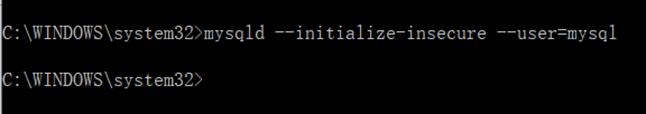

 

# MySQL

## 概述

​                               

MySQL是一个关系型数据库管理系统，由瑞典MySQL AB 公司开发，目前属于 Oracle 旗下产品。MySQL 是最流行的关系型数据库管理系统之一。

MySQL的海豚标志的名字叫“sakila”，它是由MySQL AB的创始人从用户在“海豚命名”的竞赛中建议的大量的名字表中选出的

### MySQL的历史

早期历史

1979年，有一个人叫Monty Widenius, 为一个叫TcX的小公司打工，并用BASIC设计了一个报表工具，可以在4M主频和16KB内存的计算机上运行。过了不久，又将此工具，使用C语言重写，移植到Unix平台，当时，它只是一个很底层的面向报表的存储引擎。这个工具叫做Unireg。

1985 年，瑞典的几位志同道合小伙子（以David Axmark 为首） 成立了一家公司，这就是MySQL AB 的前身。这个公司最初并不是为了开发数据库产品，而是在实现他们想法的过程中，需要一个数据库。他们希望能够使用开源的产品。但在当时并没有一个合适的选择，没办法，那就自己开发吧。 

在最初，他们只是自己设计了一个利用索引顺序存取数据的方法，也就是I S A M（Indexed Sequential Access Method）存储引擎核心算法的前身，利用ISAM 结合mSQL 来实现他们的应用需求。在早期，他们主要是为瑞典的一些大型零售商提供数据仓库服务。在系统使用过程中，随着数据量越来越大，系统复杂度越来越高，ISAM 和mSQL 的组合逐渐不堪重负。在分析性能瓶颈之后，他们发现问题出在mSQL 上面。不得已，他们抛弃了mSQL，重新开发了一套功能类似的数据存储引擎，这就是ISAM 存储引擎。大家可能已经注意到他们当时的主要客户是数据仓库，应该也容易理解为什么直至现在，MySQL 最擅长的是查询性能，而不是事务处理（需要借助第三方存储引擎）。

1990年，TcX的customer 中开始有人要求要为它的API提供SQL支持，当时，有人想到了直接使用商用数据库算法，但是Monty觉得商用数据库的速度难令人满意。于是，他直接借助于mSQL的代码，将它集成到自己的存储引擎中。但不巧的是，效果并不太好。于是,Monty雄心大起，决心自己重写一个SQL支持。

近期发展

1996年，MySQL 1.0发布, 在小范围内使用。到了96年10月，MySQL 3.11.1发布了，没有2.x版本。最开始，只提供了Solaris下的二进制版本。一个月后，Linux版本出现了。 此时的MySQL还非常简陋，除了在一个表上做一些Insert，Update，Delete和Select 操作职位，没有其他更多的功能。 

紧接下来的两年里，MySQL依次移植到各个平台下。它发布时，采用的许可策略，有些与众不同：允许免费商用，但是不能将MySQL与自己的产品绑定在一起发布。如果想一起发布，就必须使用特殊许可，意味着要花银子。当然，商业支持也是需要花银子的。其它的，随用户怎么用都可以。这种特殊许可为MySQL带来了一些收入，从而为它的持续发展打下了良好的基础。

1999-2000年，有一家公司在瑞典成立了，叫MySQL AB。 雇了几个人,与Sleepycat合作，开发出了 Berkeley DB引擎, 因为BDB支持事务处理，所以，MySQL从此开始支持事务处理了。

2000年4月，MySQL对旧的存储引擎进行了整理，命名为MyISAM。

2001年，Heikiki Tuuri向MySQL提出建议，希望能集成他们的存储引擎InnoDB，这个引擎同样支持事务处理，还支持行级锁。所以在2001年发布的3.23 版本的时候，该版本已经支持大多数的基本的SQL 操作，而且还集成了MyISAM和InnoDB 存储引擎。MySQL与InnoDB的正式结合版本是4.0。

2004年10月，发布了经典的4.1版本。 2005年10月，有发布了里程碑的一个版本，MySQL 5.0. 在5.0中加入了游标，存储过程，触发器，视图和事务的支持。在5.0 之后的版本里，MySQL明确地表现出迈向高性能数据库的发展步伐。

2008年1月16号 MySQL被Sun公司收购。

2009年04月20日Oracle收购Sun 公司，MySQL 转入Oracle 门下。

2010年04月22 发布MySQL 5.5。

2013年，MySQL 5.6 GA版本发布。

2015年，MySQL 5.7.10 GA版本发布。

2018年，MySQL 8.0.11 GA版本发布。

 

### MySQL的特点

与其他的大型数据库，例如 Oracle、DB2、SQL Server等相比，MySQL自有它的不足之处，但是这丝毫也没有减少它受欢迎的程度。对于一般的个人使用者和中小型企业来说，MySQL提供的功能已经绰绰有余，而且由于 MySQL是开放源码软件，因此可以大大降低总体拥有成本。

1. MySQL数据库是用C和C++语言编写的，并且使用了多种编辑器进行测试，以保证源码的可移植性

2. 支持多个操作系统例如：Windows、Linux、Mac OS等等

3. 支持多线程，可以充分的利用CPU资源

4. 为多种编程语言提供API，包括C语言，Java，PHP，Python语言等

5. MySQL优化了SQL算法，有效的提高了查询速度

6. MySQL内提供了用于管理，检查以及优化数据库操作的管理工具

7. 它能够作为一个单独的应用程序应用在客户端服务器网络环境中，也可以作为一个库嵌入到其他的软件中并提供多种语言支持

 

 

 

## Mysql5.7解压版

### 下载

下载地址：https://downloads.mysql.com/archives/community/

 

 

 

### 解压

 

解压到目录中：

 

 

### 配置my.ini

配置初始化的my.ini文件的文件

解压后的目录并没有的my.ini文件，在安装根目录下创建my.ini文件（新建文本文件，将文件类型改为的.ini），写入基本配置：


> 下面第5行和第7行，需要修改成自己的安装路径！！！
>
> 配置文件中的Data目录，是安装程序自动创建的，不要手动创建。
>
> 一定确保没有Data目录，如果是第二次安装，则需要把Data目录手动删除。

 

```ini
[mysqld]
# 设置3306端口
port=3306
# 设置mysql的安装目录
basedir=D:/Program Files/mysql-5.7.29-winx64
# 设置mysql数据库的数据的存放目录
datadir=D:/Program Files/mysql-5.7.29-winx64/Data
# 允许最大连接数
max_connections=200
# 允许连接失败的次数。
max_connect_errors=10
# 服务端使用的字符集默认为utf8
character-set-server=utf8
# 创建新表时将使用的默认存储引擎
default-storage-engine=INNODB

[mysql]
# 设置mysql客户端默认字符集
default-character-set=utf8
```


 

 

 

### 配置环境变量

将mysql目录下的bin目录，设置在环境变量path中

 

 

### 安装MySql服务

在安装时，避免出错我们尽量全部使用管理员身份运行CMD，否则在安装时可能会报错，会导致安装失败的情况


 在cmd命令窗口，执行mysqld -install命令进行安装

 

 

 

### 初始化MySql

执行mysqld --initialize-insecure --user=mysql命令初始化

 

成功后，会生成data目录并生成root用户。

 

### 启动MySQL服务

执行net start mysql命令启动MySQL。

 

 

 

9.启动成功，执行"mysqladmin -u root -p password"命令设置密码，root旧密码为空，直接回车就可以。

 

至此解压版安装完成。

如果需要修改root密码，先登陆数据库，执行以下命令：

选择数据库：use mysql;

更新root的密码：

```sql
update user set authentication_string=password('新密码') where user='root' and Host='localhost';
```


 

### 登录数据库

在命令提示符中输入如下命令：

 ```
 mysql -hlocalhost -uroot -p
 ```


其中**-h**表示服务器名，localhost表示本地；**-u**为数据库用户名，root是mysql默认用户名；**-p**为密码，如果设置了密码，可直接在**-p**后链接输入

```
mysql -u root –p123456
```


 

 

 

## 图形化客户端Navicat Premium


解压：

 

 

 

 

# 操作MySQL神兵利器-SQL

## SQL简介

**SQL**全名是结构化查询语言（**Structured** **Query** **Language**），是用于数据库中的标准数据查询语言，**IBM**公司最早使用在其开发的数据库系统中。1986年10月，美国**ANSI**对**SQL**进行规范后，以此作为关系式数据库管理系统的标准语言 (**ANSIX3**. **135**-**1986**)，1987年得到国际标准组织的支持下成为国际标准。不过各种通行的数据库系统在其实践过程中都对**SQL**规范作了某些编改和扩充。所以，实际上不同数据库系统之间的**SQL**语言不能完全相互通用

### Sql能干什么

 

SQL 面向数据库执行查询

SQL 可从数据库取回数据

SQL 可在数据库中插入行的记录

SQL 可更新数据库中的数据

SQL 可从数据库删除记录

SQL 可创建新数据库

SQL 可在数据库中创建新表

SQL 可在数据库中创建存储过程

SQL 可在数据库中创建视图

SQL 可以设置表、存储过程和视图的权限

 

### Sql分类

**SQL**语言按照功能可分为五种：

**DDL**语句（数据定义语言）**Create**、**Alter**、 **Drop**、**Declare**、**Truncate**

**DQL**语句（数据查询语言）**Select**

**DML**语句（数据操作语言）**Insert**、**Update**、**Delete**、**Merge**

**DTL**语句（事务控制语句）**Commit**、**Rollback**、**Savepoint**

**DCL**语句（数据控制语言）**Grant**、**Revoke**

 

### SQL特点

1．一体化：SQL集数据定义（DDL）、数据操纵（DML）和数据控制（DCL）于一体，可以完成数据库中的全部工作。

2．使用方式灵活：它具有两种使用方式，即可以直接以命令方式交互使用；也可以嵌入使用，嵌入到C、C++、FORTRAN、COBOL、JAVA等主语言中使用。

3．非过程化：只提操作要求，不必描述操作步骤，也不需要导航。使用时只需要告诉计算机“做什么”，而不需要告诉它“怎么做”。

4．语言简洁，语法简单，好学好用：在ANSI标准中，只包含了94个英文单词，核心功能只用6个动词，语法接近英语口语。

 

 

## SQL语句举例

### 创建表

日常统计数据时，我们习惯将数据以二维表的形式展示出来，这样使得数据便于查看：

表名 user(客户表)

| **userId** | **name** | **ename** | **personId**       | **sex** | **credit** | **city** |
| ---------- | -------- | --------- | ------------------ | ------- | ---------- | -------- |
| 101        | 王鹤     | tom       | 110113197901318695 | 男      | 328        | 北京     |
| 102        | 李崇     | bill      | 642117199205316578 | 男      | 214        | 深圳     |
| 103        | 郭玉     | Lucy      | 250106199309307773 | 女      | 426        | 上海     |
| 104        | 张赫     | Aaron     | 110117199205316578 | 男      | 722        | 北京     |
| 105        | 李文婷   | Niki      | 112566199904303876 | 女      | 123        | 北京     |
| 106        | 李峰     | kate      | 130115199704300375 | 男      | 273        | 上海     |
| 107        | 海涛     |           | 830115198811303497 | 男      | 285        | 长沙     |

(表、字段、记录、主键)

表名：card(银行卡表) 

| **cardNo** | **openDate** | **money** | **password** | **isLock** | **userId** |
| ---------- | ------------ | --------- | ------------ | ---------- | ---------- |
| 001        | 2019-03-08   | 12300     | 123456       | 0          | 102        |
| 002        | 2019-02-12   | 15029     | 634573       | 0          | 106        |
| 003        | 2019-01-22   | 20000     | 329847       | 0          | 101        |
| 004        | 2019-03-31   | 2000      | 248593       | 1          | 104        |
| 005        | 2019-04-02   | 11500     | 268952       | 0          | 103        |
| 006        | 2019-04-27   | 3212      | 656573       | 0          | 107        |
| 007        | 2019-05-23   | 15634     | 356345       | 0          | 106        |
| 008        | 2019-04-18   | 23823     | 567764       | 0          | 105        |
| 009        | 2019-03-19   | 12343     | 567878       | 0          | 106        |

(外键、user表和card有关系)

表名：transInfo(交易记录表)

| **id** | **transDate**       | **cardNo** | **type** | **money** | **remark** |
| ------ | ------------------- | ---------- | -------- | --------- | ---------- |
| 1      | 2019-06-20 14:30:30 | 002        | 转入     | 7234      | 工资       |
| 2      | 2019-06-20 16:46:49 | 003        | 转入     | 8326      | 工资       |
| 3      | 2019-07-02 15:09:55 | 001        | 支取     | 500       |            |
| 4      | 2019-07-02 17:18:22 | 005        | 支取     | 1000      |            |
| 5      | 2019-07-03 09:40:04 | 006        | 转出     | 127       | 支付宝     |
| 6      | 2019-07-05 17:19:34 | 007        | 存入     | 1000      |            |
| 7      | 2019-07-02 17:49:23 | 008        | 转出     | 800       | 还钱       |
| 8      | 2019-07-03 19:22:28 | 009        | 转出     | 512       | 超市购物   |
| 9      | 2019-07-05 22:42:08 | 002        | 支取     | 300       |            |
| 10     | 2019-07-23 04:58:59 | 003        | 转出     | 421       | 支付宝     |

 

在MySQL数据库中存储的数据也是以这种形式保存的，我们称之为--**数据表**，横向数据包括第一行我们称之为--**行（记录）**，其中第一行中每个纵向的数据我们称之为--**字段**，每个字段对应的一列数据是此字段对应的值。能够唯一标识一条记录的字段为**主键**（亦或**主码**）；表(user)中主键userId和表(card)中的userId对应的数值一致，称表(card)的字段userId为**外键**(**外码**)；外键表示主表(user)和子表(card)两张表之间有关系

那么使用SQL语句在数据库中创建表，如下图:

```sql
-- 创建用户表
create table user (
  userId varchar(3) not null,
  name varchar(10) not null,
  ename varchar(10),
  personId varchar(18),
  sex varchar(2),
  credit int(11),
  city varchar(20),
  primary key (userId)
);
-- 创建银行卡表
create table card (
  cardNo varchar(3) not null,
  openDate date,
  money decimal(10,2),
  password varchar(6),
  isLock tinyint(1),
  userId varchar(3),
  primary key (cardNo)
);
-- 创建交易记录表
create table transInfo (
  id int(11) not null auto_increment,
  transDate datetime,
  cardNo varchar(3),
  type varchar(4),
  money decimal(10,2),
  remark varchar(10),
  primary key (id)
);

```


将如图中SQL语句在oracle命令窗口中，或者能够操作数据库的**图形化管理工具**中执行后，在数据库中会创建表格。

### 删除表

我们使用drop指令对数据表进行删除：

```sql
drop table transInfo;
```


如果存在则删除：

 ```sql
 drop table if exists transInfo;
 ```

 

### 新增数据

当我们使用SQL语句在mySql数据库中创建好一张表后（user），这张表中并没有任何的数据，那么我们想要向这张表中录入数据的话可使用SQL语句：

```sql
insert into user(userId,name,ename,personId,sex,credit,city) 
values('101','王鹤','tom','110113197901318695', '男', 328, '北京');
```


执行后查看表数据效果如下： 

| **userId** | **name** | **ename** | **personId**       | **sex** | **credit** | **city** |
| ---------- | -------- | --------- | ------------------ | ------- | ---------- | -------- |
| 101        | 王鹤     | tom       | 110113197901318695 | 男      | 328        | 北京     |
| 102        | 李崇     | bill      | 642117199205316578 | 男      | 214        | 深圳     |
| 103        | 郭玉     | Lucy      | 250106199309307773 | 女      | 426        | 上海     |
| 104        | 张赫     | Aaron     | 110117199205316578 | 男      | 722        | 北京     |
| 105        | 李文婷   | Niki      | 112566199904303876 | 女      | 123        | 北京     |
| 106        | 李峰     | kate      | 130115199704300375 | 男      | 273        | 上海     |
| 107        | 海涛     |           | 830115198811303497 | 男      | 285        | 长沙     |

向银行卡表插入数据：

 ```sql
 insert into card (cardNo,openDate,money,password,isLock,userId)
 values ('001', '2019-03-08', 12300, '123456', 0, '102');
 ```


 

执行后查看表数据效果如下：

| **cardNo** | **openDate** | **money** | **password** | **isLock** | **userId** |
| ---------- | ------------ | --------- | ------------ | ---------- | ---------- |
| 001        | 2019-03-08   | 12300     | 123456       | 0          | 102        |
| 002        | 2019-02-12   | 15029     | 634573       | 0          | 106        |
| 003        | 2019-01-22   | 20000     | 329847       | 0          | 101        |
| 004        | 2019-03-31   | 2000      | 248593       | 1          | 104        |
| 005        | 2019-04-02   | 11500     | 268952       | 0          | 103        |
| 006        | 2019-04-27   | 3212      | 656573       | 0          | 107        |
| 007        | 2019-05-23   | 15634     | 356345       | 0          | 106        |
| 008        | 2019-04-18   | 23823     | 567764       | 0          | 105        |
| 009        | 2019-03-19   | 12343     | 567878       | 0          | 106        |

 

向交易表中插入数据：

```sql
insert into transInfo (transDate,cardNo,type,money,remark)
values ('2019-06-20 14:30:30', '002', '转入', 7234, '工资');

insert into transInfo (transDate,cardNo,type,money,remark)
values ('2019-07-02 15:09:55', '001', '支取', 500, '');
```


 

执行后查看表数据效果如下：

| **id** | **transDate**       | **cardNo** | **type** | **money** | **remark** |
| ------ | ------------------- | ---------- | -------- | --------- | ---------- |
| 1      | 2019-06-20 14:30:30 | 002        | 转入     | 7234      | 工资       |
| 2      | 2019-06-20 16:46:49 | 003        | 转入     | 8326      | 工资       |
| 3      | 2019-07-02 15:09:55 | 001        | 支取     | 500       |            |
| 4      | 2019-07-02 17:18:22 | 005        | 支取     | 1000      |            |
| 5      | 2019-07-03 09:40:04 | 006        | 转出     | 127       | 支付宝     |
| 6      | 2019-07-05 17:19:34 | 007        | 存入     | 1000      |            |
| 7      | 2019-07-02 17:49:23 | 008        | 转出     | 800       | 还钱       |
| 8      | 2019-07-03 19:22:28 | 009        | 转出     | 512       | 超市购物   |
| 9      | 2019-07-05 22:42:08 | 002        | 支取     | 300       |            |
| 10     | 2019-07-23 04:58:59 | 003        | 转出     | 421       | 支付宝     |

 

### 查询数据

上一个例子中我们实现了向表（user）中新增数据，之后我们需要在图形化管理工具中查询所新增的数据，SQL语句为：

```sql
select userId,name,ename,personId,sex,credit,city 
from user 
where userId ='105';

-- 或者

select * from user where userId ='105';
```


 执行效果如下： 

| **userId** | **name** | **ename** | **personId**       | **sex** | **credit** | **city** |
| ---------- | -------- | --------- | ------------------ | ------- | ---------- | -------- |
| 105        | 李文婷   | Niki      | 112566199904303876 | 女      | 123        | 北京     |

 

 

### 修改数据

如果需要对新增数据进行修改，那么使用SQL语句如下：

```sql
update user 
set name='张琳',credit=453,personId='231763199704304912',city='西安'   
where userId='105';
```

执行效果如下：

| **userId** | **name** | **ename** | **personId**       | **sex** | **credit** | **city** |
| ---------- | -------- | --------- | ------------------ | ------- | ---------- | -------- |
| 105        | 张琳     | Niki      | 231763199704304912 | 女      | 453        | 西安     |

 

### 删除数据

对表中无用的数据进行删除，SQL语句为：

 ```sql
 delete from user where userId=105
 ```

执行后，数据就会被删除。

  

# Sql详解

经过之前几节的内容，大家已经对于SQL语句有了一定的了解那么现在我们来深入的讨论一下SQL语句。


## 常用数据类型

在创建表的SQL语句中，我们看到每声明一个字段都要给字段标识一个数据类型，那么在**Mysql**中都有哪些数据类型呢

### 字符数据类型

**字符类型分为两种**:**一种是定长，一种是不定长。**

| 数据类型   | 说明                                                         |
| ---------- | ------------------------------------------------------------ |
| Char       | 1~255个字符的定长串，它的长度必须在创建时指定，否则MySQL假定为CHAR（1） |
| Varchar    | 可变长度，最多不超过255字节，如在创建时指定VARCHAR（n），则可存储0~n个字符的变长串 |
| Tinytext   | 同TEXT，最大长度为255字节                                    |
| Meduimtext | 同TEXT，最大长度为16K                                        |
| Text       | 最大长度为64K的变长文本                                      |
| Longtext   | 同Text，最大长度为4GB（纯文本，一般不会到4G）                |
| Enum       | 接受最多64K个串组成的预定义集合的某个串                      |
| Set        | 接受最多64K个串组成的预定义集合的零个或多个串                |

 

### 数值数据类型

 

| 类型说明     | 存储需求 | 取值范围                                                     |
| ------------ | -------- | ------------------------------------------------------------ |
| tinyint      | 1字节    | 有符号值：-128 到127（- 2^7^ 到2^7^ – 1）    <br />无符号值：0到255（0 到2^8^ – 1） |
| smallint     | 2字节    | 有符号值：-32768 到32767（- 2^15^ 到2^15^ – 1）    <br />无符号值：0到65535（0 到2^16^ – 1） |
| mediumint    | 3字节    | 有符号值：-8388608 到8388607（- 2^23^ 到2^23^ – 1 ）  <br /> 无符号值：0到16777215（0 到2^24^ – 1） |
| int          | 4字节    | 有符号值：-2147683648 到2147683647（- 2^31^ 到2^31^- 1）    <br />无符号值：0到4294967295（0 到2^32^ – 1） |
| bigint       | 8字节    | 有符号值：-9223372036854775808 到9223373036854775807（- 2^63^ 到2^63^-1）    <br />无符号值：0到18446744073709551615（0到2^64^ – 1） |
| float        | 4字节    | 最小非零值：±1.175494351e^–38^                               |
| double       | 8字节    | 最小非零值：±2.2250738585072014e ^–308^                      |
| decimal(m,d) | m字节    | 可变；其值的范围依赖于m 和d                                  |

 

mysql提供了5种整型： tinyint、smallint、mediumint、int和bigint(字节数1、2、3、4、8)，这些类型在可表示的取值范围上是不同的。整数列可定义为unsigned从而禁用负值；这使列的取值范围为0以上。

mysql 提供三种浮点类型： float、double和decimal。与整型不同，浮点类型不能是unsigned的，其取值范围也与整型不同，这种不同不仅在于这些类型有最大值，而且还有最小非零值。。

在选择了某种数值类型时，应该考虑所要表示的值的范围，只需选择能覆盖要取值的范围的最小类型即可。选择较大类型会对空间造成浪费，使表不必要地增大，处理起来没有选择较小类型那样有效。

对于整型值，如果数据取值范围较小，如人员年龄或兄弟姐妹数，则tinyint最合适。mediumint能够表示数百万的值并且可用于更多类型的值，但存储代价较大。bigint在全部整型中取值范围最大，而且需要的存储空间是表示范围次大的整型int类型的两倍，因此只在确实需要时才用。

对于浮点值，double占用float的两倍空间。除非特别需要高精度或范围极大的值，一般应使用只用一半存储代价的float型来表示数据。

 

### 日期类型

 

| 数据类型  | 存储字节数 | 取值范围                                   |
| --------- | ---------- | ------------------------------------------ |
| Date      | 4          | 1000-01-01--9999-12-31                     |
| Time      | 3          | -838:59:59--838:59:59                      |
| Datetime  | 8          | 1000-01-01  00:00:00--9999-12-31 23:59:59  |
| Timestamp | 4          | 1970-01-01 08:00:01 -- 2038-01-19 11:14:07 |
| Year      | 1          | 1901--2155                                 |

 

 

 

### 二进制数据类型

| **数据类型** | **说明**          |
| ------------ | ----------------- |
| Tityblob     | 最大长度为255字节 |
| Blob         | 最大长度为64KB    |
| Mediumblob   | 最大长度为16MB    |
| Longblob     | 最大长度为4GB     |

二进制类型可存储任何数据，如文字、图像、多媒体等

 

 

 


 

## 用SQL进行单表查询

### 查询所有记录

在能够执行SQL语句的编辑窗口中执行如下语句：

```sql
select * from user
```

注：SQL语句中的“ * ”代表这张表中所有的字段。

查询结果如下：

| **userId** | **name** | **ename** | **personId**       | **sex** | **credit** | **city** |
| ---------- | -------- | --------- | ------------------ | ------- | ---------- | -------- |
| 101        | 王鹤     | tom       | 110113197901318695 | 男      | 328        | 北京     |
| 102        | 李崇     | bill      | 642117199205316578 | 男      | 214        | 深圳     |
| 103        | 郭玉     | Lucy      | 250106199309307773 | 女      | 426        | 上海     |
| 104        | 张赫     | Aaron     | 110117199205316578 | 男      | 722        | 北京     |
| 105        | 李文婷   | Niki      | 112566199904303876 | 女      | 123        | 北京     |
| 106        | 李峰     | kate      | 130115199704300375 | 男      | 273        | 上海     |
| 107        | 海涛     |           | 830115198811303497 | 男      | 285        | 长沙     |

 

### 查询表中某些字段对应数据

在SQL语句编辑窗口中执行如下语句：

```sql
select  userId, name, personId  from  user
```

查询结果如下：

| **userId** | **name** | **personId**       |
| ---------- | -------- | ------------------ |
| 101        | 王鹤     | 110113197901318695 |
| 102        | 李崇     | 642117199205316578 |
| 103        | 郭玉     | 250106199309307773 |
| 104        | 张赫     | 110117199205316578 |
| 105        | 李文婷   | 112566199904303876 |
| 106        | 李峰     | 130115199704300375 |
| 107        | 海涛     | 830115198811303497 |

 

### 变换查询显示

在SQL语句编辑窗口中执行如下语句：

```sql
select  userId 用户编号, name 姓名, personId 身份证  from  user
```

查询结果如下：

| **用户编号** | **姓名** | **身份证**         |
| ------------ | -------- | ------------------ |
| 101          | 王鹤     | 110113197901318695 |
| 102          | 李崇     | 642117199205316578 |
| 103          | 郭玉     | 250106199309307773 |
| 104          | 张赫     | 110117199205316578 |
| 105          | 李文婷   | 112566199904303876 |
| 106          | 李峰     | 130115199704300375 |
| 107          | 海涛     | 830115198811303497 |

  

### 查询表中某些字段不重复的数据

在SQL语句编辑窗口中执行如下语句：

 ```sql
 select distinct city from user
 ```

查询结果如下：

| **City** |
| -------- |
| 北京     |
| 深圳     |
| 上海     |
| 长沙     |

注：这里“**distinct**” 保留字的作用是去除相同记录，与之相反的是“**all**”,所有SQL默认为“**all**”。

### 单条件查询

#### 等于=

示例：查询北京的客户信息：

 ```sql
 select userId, name, personId, city from user where city='北京'
 ```

查询结果如下：

| **userId** | **name** | **personId**       | **city** |
| ---------- | -------- | ------------------ | -------- |
| 101        | 王鹤     | 110113197901318695 | 北京     |
| 104        | 张赫     | 110117199205316578 | 北京     |
| 105        | 李文婷   | 112566199904303876 | 北京     |

 

注：“=”在此处是比较运算符可以跟字符串和数值，代表的是条件为字段“city”等于“北京”，“where”保留字后面跟条件.

示例：查询被冻结的银行卡信息：

 ```sql
 select  * from card where isLock=1
 ```

 

查询结果如下：

| **cardNo** | **openDate** | **money** | **password** | **isLock** | **userId** |
| ---------- | ------------ | --------- | ------------ | ---------- | ---------- |
| 004        | 2019-03-31   | 2000      | 248593       | 1          | 104        |

 

 

#### 不等于!=

示例：查询不是上海地区的客户信息：

```sql
select id, name, personId, city from user where city!='上海'
```

查询结果如下：

| **userId** | **name** | **personId**       | **city** |
| ---------- | -------- | ------------------ | -------- |
| 101        | 王鹤     | 110113197901318695 | 北京     |
| 102        | 李崇     | 642117199205316578 | 深圳     |
| 104        | 张赫     | 110117199205316578 | 北京     |
| 105        | 李文婷   | 112566199904303876 | 北京     |
| 107        | 海涛     | 830115198811303497 | 长沙     |

 

示例：查询被冻结的银行卡信息：

 ```sql
 select  * from card where isLock!=0
 ```

查询结果如下：

| **cardNo** | **openDate** | **money** | **password** | **isLock** | **userId** |
| ---------- | ------------ | --------- | ------------ | ---------- | ---------- |
| 004        | 2019-03-31   | 2000      | 248593       | 1          | 104        |

 

#### 大于、小于、大于等于、小于等于

示例：查询余额大于20000的银行卡信息：

 ```sql
 select  * from card where money>20000
 ```

 查询结果如下：

| **cardNo** | **openDate** | **money** | **password** | **isLock** | **userId** |
| ---------- | ------------ | --------- | ------------ | ---------- | ---------- |
| 008        | 2019-04-18   | 23823     | 567764       | 0          | 105        |

 

示例：查询余额大于等于20000的银行卡信息：

 ```sql
 select  * from card where money>=20000
 ```

 查询结果如下：

| **cardNo** | **openDate** | **money** | **password** | **isLock** | **userId** |
| ---------- | ------------ | --------- | ------------ | ---------- | ---------- |
| 003        | 2019-01-22   | 20000     | 329847       | 0          | 101        |
| 008        | 2019-04-18   | 23823     | 567764       | 0          | 105        |

 

#### in

示例：查询所在城市是北京、上海的客户信息：

 ```sql
 select  * from user where city in ('上海','北京')
 ```

查询结果如下：

| **userId** | **name** | **ename** | **personId**       | **sex** | **credit** | **city** |
| ---------- | -------- | --------- | ------------------ | ------- | ---------- | -------- |
| 101        | 王鹤     | tom       | 110113197901318695 | 男      | 328        | 北京     |
| 103        | 郭玉     | Lucy      | 250106199309307773 | 女      | 426        | 上海     |
| 104        | 张赫     | Aaron     | 110117199205316578 | 男      | 722        | 北京     |
| 105        | 李文婷   | Niki      | 112566199904303876 | 女      | 123        | 北京     |
| 106        | 李峰     | kate      | 130115199704300375 | 男      | 273        | 上海     |

 

 

#### not in

示例：查询所在城市不是北京、上海的客户信息：

 ```sql
 select  * from user where city not in ('上海','北京')
 ```

查询结果如下：

| **userId** | **name** | **ename** | **personId**       | **sex** | **credit** | **city** |
| ---------- | -------- | --------- | ------------------ | ------- | ---------- | -------- |
| 102        | 李崇     | bill      | 642117199205316578 | 男      | 214        | 深圳     |
| 107        | 海涛     |           | 830115198811303497 | 男      | 285        | 长沙     |

 

 

#### between

示例：查询余额10000-20000范围内的银行卡信息：

 ```sql
 select  * from card where money between 10000 and 20000
 ```

查询结果如下：

| **cardNo** | **openDate** | **money** | **password** | **isLock** | **userId** |
| ---------- | ------------ | --------- | ------------ | ---------- | ---------- |
| 001        | 2019-03-08   | 12300     | 123456       | 0          | 102        |
| 002        | 2019-02-12   | 15029     | 634573       | 0          | 106        |
| 003        | 2019-01-22   | 20000     | 329847       | 0          | 101        |
| 005        | 2019-04-02   | 11500     | 268952       | 0          | 103        |
| 007        | 2019-05-23   | 15634     | 356345       | 0          | 106        |
| 009        | 2019-03-19   | 12343     | 567878       | 0          | 106        |

注意：包含10000,20000

#### not between

示例：查询余额不在10000-20000范围内的银行卡信息：

```sql
select  * from card where money not between 10000 and 20000
```

查询结果如下：

| **cardNo** | **openDate** | **money** | **password** | **isLock** | **userId** |
| ---------- | ------------ | --------- | ------------ | ---------- | ---------- |
| 004        | 2019-03-31   | 2000      | 248593       | 1          | 104        |
| 006        | 2019-04-27   | 3212      | 656573       | 0          | 107        |
| 008        | 2019-04-18   | 23823     | 567764       | 0          | 105        |

注意：不包含10000,20000

 

#### like

支持模糊匹配和完全匹配，不区分大小写。 

示例：查询姓李的客户信息：

 ```sql
 select  * from user where name like '李%'
 ```

查询结果如下：

| **userId** | **name** | **ename** | **personId**       | **sex** | **credit** | **city** |
| ---------- | -------- | --------- | ------------------ | ------- | ---------- | -------- |
| 102        | 李崇     | bill      | 642117199205316578 | 男      | 214        | 深圳     |
| 105        | 李文婷   | Niki      | 112566199904303876 | 女      | 123        | 北京     |
| 106        | 李峰     | kate      | 130115199704300375 | 男      | 273        | 上海     |

 

示例：查询姓李的，并且名字是两个字的客户信息：

 ```sql
 select  * from user where name like '李_'
 ```

查询结果如下：

| **userId** | **name** | **ename** | **personId**       | **sex** | **credit** | **city** |
| ---------- | -------- | --------- | ------------------ | ------- | ---------- | -------- |
| 102        | 李崇     | bill      | 642117199205316578 | 男      | 214        | 深圳     |
| 106        | 李峰     | kate      | 130115199704300375 | 男      | 273        | 上海     |

 

注： %代表任意长度的字符串,_下划线代表一个任意的字符.like“李%”代表“李”字符开头的任意长度的字符串，like“李_”代表“李”字符开头长度为1个字符.

 

like查询是不区分大小的：

 ```sql
 select  * from user where ename like '%L%'
 ```

查询结果如下：

| **userId** | **name** | **ename** | **personId**       | **sex** | **credit** | **city** |
| ---------- | -------- | --------- | ------------------ | ------- | ---------- | -------- |
| 102        | 李崇     | bill      | 642117199205316578 | 男      | 214        | 深圳     |
| 103        | 郭玉     | Lucy      | 250106199309307773 | 女      | 426        | 上海     |

如果需要区别大小写，使用like binary：

```sql
select  * from user where ename like binary '%L%'
```

查询结果如下：

| **userId** | **name** | **ename** | **personId**       | **sex** | **credit** | **city** |
| ---------- | -------- | --------- | ------------------ | ------- | ---------- | -------- |
| 103        | 郭玉     | Lucy      | 250106199309307773 | 女      | 426        | 上海     |

 

 

 

#### not like

示例：查询不姓李的客户信息：

 ```sql
 select  * from user where name not like '李%'
 ```

查询结果如下：

| **userId** | **name** | **ename** | **personId**       | **sex** | **credit** | **city** |
| ---------- | -------- | --------- | ------------------ | ------- | ---------- | -------- |
| 101        | 王鹤     | tom       | 110113197901318695 | 男      | 328        | 北京     |
| 103        | 郭玉     | Lucy      | 250106199309307773 | 女      | 426        | 上海     |
| 104        | 张赫     | Aaron     | 110117199205316578 | 男      | 722        | 北京     |
| 107        | 海涛     |           | 830115198811303497 | 男      | 285        | 长沙     |

 

#### regexp和rlike

使用 regexp操作符来进行正则表达式匹配。

regexp是不完全匹配，只要不同时匹配^和 $， 其他的包含即可。

例1:查询身份证号码包含1992的用户信息

 ```sql
 select  * from user where personId like '1992' 
 ```


查询结果如下：

| **userId** | **name** | **ename** | **personId**       | **sex** | **credit** | **city** |
| ---------- | -------- | --------- | ------------------ | ------- | ---------- | -------- |
| 102        | 李崇     | bill      | 642117199205316578 | 男      | 214        | 深圳     |
| 104        | 张赫     | Aaron     | 110117199205316578 | 男      | 722        | 北京     |

 

例2:查询身份证号码包含1992的用户信息

 ```sql
 select  * from user where personId rlike '.{6}1992.{8}'
 ```

查询结果如下：

| **userId** | **name** | **ename** | **personId**       | **sex** | **credit** | **city** |
| ---------- | -------- | --------- | ------------------ | ------- | ---------- | -------- |
| 102        | 李崇     | bill      | 642117199205316578 | 男      | 214        | 深圳     |
| 104        | 张赫     | Aaron     | 110117199205316578 | 男      | 722        | 北京     |

 

例3:查询北京或上海的用户信息

 ```sql
 select  * from user where city rlike '北京|上海'
 ```

查询结果如下：

| **userId** | **name** | **ename** | **personId**       | **sex** | **credit** | **city** |
| ---------- | -------- | --------- | ------------------ | ------- | ---------- | -------- |
| 101        | 王鹤     | tom       | 110113197901318695 | 男      | 328        | 北京     |
| 103        | 郭玉     | Lucy      | 250106199309307773 | 女      | 426        | 上海     |
| 104        | 张赫     | Aaron     | 110117199205316578 | 男      | 722        | 北京     |
| 105        | 李文婷   | Niki      | 112566199904303876 | 女      | 123        | 北京     |
| 106        | 李峰     | kate      | 130115199704300375 | 男      | 273        | 上海     |

 

例4:查询英文名包含A或N的用户信息

```sql
select * from user where ename rlike '[AN]'
```


查询结果如下：

| **userId** | **name** | **ename** | **personId**       | **sex** | **credit** | **city** |
| ---------- | -------- | --------- | ------------------ | ------- | ---------- | -------- |
| 104        | 张赫     | Aaron     | 110117199205316578 | 男      | 722        | 北京     |
| 105        | 李文婷   | Niki      | 112566199904303876 | 女      | 123        | 北京     |
| 106        | 李峰     | kate      | 130115199704300375 | 男      | 273        | 上海     |

 

例5: 查询英文名包含A或N的用户信息,区分大小写

 ```sql
 select * from user where ename rlike binary '[AN]'
 ```

查询结果如下：

| **userId** | **name** | **ename** | **personId**       | **sex** | **credit** | **city** |
| ---------- | -------- | --------- | ------------------ | ------- | ---------- | -------- |
| 104        | 张赫     | Aaron     | 110117199205316578 | 男      | 722        | 北京     |
| 105        | 李文婷   | Niki      | 112566199904303876 | 女      | 123        | 北京     |

 

例6:查询字母AN开头的英文名

 ```sql
 select  * from user where ename rlike '^[AN]'
 ```

查询结果如下：

| **userId** | **name** | **ename** | **personId**       | **sex** | **credit** | **city** |
| ---------- | -------- | --------- | ------------------ | ------- | ---------- | -------- |
| 104        | 张赫     | Aaron     | 110117199205316578 | 男      | 722        | 北京     |
| 105        | 李文婷   | Niki      | 112566199904303876 | 女      | 123        | 北京     |

 

#### not rlike

例1:查询不是北京或上海的用户信息

 ```sql
 select  * from user where city not rlike '北京|上海'
 ```

 

查询结果如下：

| **userId** | **name** | **ename** | **personId**       | **sex** | **credit** | **city** |
| ---------- | -------- | --------- | ------------------ | ------- | ---------- | -------- |
| 102        | 李崇     | bill      | 642117199205316578 | 男      | 214        | 深圳     |
| 107        | 海涛     |           | 830115198811303497 | 男      | 285        | 长沙     |


 

#### is null

是否为空

示例：查询没有英文姓名的客户信息：

 ```sql
 select  * from user where ename is null
 ```

查询结果如下：

| **userId** | **name** | **ename** | **personId**       | **sex** | **credit** | **city** |
| ---------- | -------- | --------- | ------------------ | ------- | ---------- | -------- |
| 107        | 海涛     |           | 830115198811303497 | 男      | 285        | 长沙     |

 

#### is not null

是否不为空

示例：查询有英文姓名的客户信息：

```sql
select  * from user where ename is not null
```

查询结果如下：

| **userId** | **name** | **ename** | **personId**       | **sex** | **credit** | **city** |
| ---------- | -------- | --------- | ------------------ | ------- | ---------- | -------- |
| 101        | 王鹤     | tom       | 110113197901318695 | 男      | 328        | 北京     |
| 102        | 李崇     | bill      | 642117199205316578 | 男      | 214        | 深圳     |
| 103        | 郭玉     | Lucy      | 250106199309307773 | 女      | 426        | 上海     |
| 104        | 张赫     | Aaron     | 110117199205316578 | 男      | 722        | 北京     |
| 105        | 李文婷   | Niki      | 112566199904303876 | 女      | 123        | 北京     |
| 106        | 李峰     | kate      | 130115199704300375 | 男      | 273        | 上海     |

 

### 组合条件查询

 

#### 逻辑与

当我们使用两个条件进行查询时， 并且两个条件需要同时成立， 我们可以使用逻辑与(and)关键字，将两个条件组合起来。

示例：查询所在城市是“北京”的男性用户信息：

 ```sql
 select  * from user where city='北京' and sex='男'
 ```

查询结果如下：

| **userId** | **name** | **ename** | **personId**       | **sex** | **credit** | **city** |
| ---------- | -------- | --------- | ------------------ | ------- | ---------- | -------- |
| 101        | 王鹤     | tom       | 110113197901318695 | 男      | 328        | 北京     |
| 104        | 张赫     | Aaron     | 110117199205316578 | 男      | 722        | 北京     |

 

#### 逻辑或

当我们使用两个条件进行查询时， 并且两个条件中只要有一个成立，则需要查询展示出来， 我们可以使用逻辑或(or)关键字，将两个条件组合起来。

示例：查询所在城市是“北京”或“上海”的用户信息：

 ```sql
 select  * from user where  city='北京' or city='上海' 
 ```

查询结果如下：

| **userId** | **name** | **ename** | **personId**       | **sex** | **credit** | **city** |
| ---------- | -------- | --------- | ------------------ | ------- | ---------- | -------- |
| 101        | 王鹤     | tom       | 110113197901318695 | 男      | 328        | 北京     |
| 103        | 郭玉     | Lucy      | 250106199309307773 | 女      | 426        | 上海     |
| 104        | 张赫     | Aaron     | 110117199205316578 | 男      | 722        | 北京     |
| 105        | 李文婷   | Niki      | 112566199904303876 | 女      | 123        | 北京     |
| 106        | 李峰     | kate      | 130115199704300375 | 男      | 273        | 上海     |

 

 

 

#### 逻辑非

示例：查询不是上海地区的客户信息：

 ```sql
 select  *  from  user  where  not city='上海'
 ```

查询结果如下：

| **userId** | **name** | **ename** | **personId**       | **sex** | **credit** | **city** |
| ---------- | -------- | --------- | ------------------ | ------- | ---------- | -------- |
| 101        | 王鹤     | tom       | 110113197901318695 | 男      | 328        | 北京     |
| 102        | 李崇     | bill      | 642117199205316578 | 男      | 214        | 深圳     |
| 104        | 张赫     | Aaron     | 110117199205316578 | 男      | 722        | 北京     |
| 105        | 李文婷   | Niki      | 112566199904303876 | 女      | 123        | 北京     |
| 107        | 海涛     |           | 830115198811303497 | 男      | 285        | 长沙     |

注：此SQL为逻辑非组合条件查询，“not city='上海'”等价于“city!='上海'”。

### 排序查询

#### 升序

示例：查询未冻结的银行卡信息，并且按余额升序排列：

```sql
select  *  from  card  where  isLock=0 order by  money asc
```

查询结果如下：

| **cardNo** | **openDate** | **money** | **password** | **isLock** | **userId** |
| ---------- | ------------ | --------- | ------------ | ---------- | ---------- |
| 006        | 2019-04-27   | 3212      | 656573       | 0          | 107        |
| 005        | 2019-04-02   | 11500     | 268952       | 0          | 103        |
| 001        | 2019-03-08   | 12300     | 123456       | 0          | 102        |
| 009        | 2019-03-19   | 12343     | 567878       | 0          | 106        |
| 002        | 2019-02-12   | 15029     | 634573       | 0          | 106        |
| 007        | 2019-05-23   | 15634     | 356345       | 0          | 106        |
| 003        | 2019-01-22   | 20000     | 329847       | 0          | 101        |
| 008        | 2019-04-18   | 23823     | 567764       | 0          | 105        |

 

注：默认的排序方式是升序排列，所以asc可以省略。

#### 降序

示例：查询所有的男性客户信息，并且按姓名降序排列：

 ```sql
 select  *  from  user  where  sex='男' order by  name desc
 ```

查询结果如下：

| **userId** | **name** | **ename** | **personId**       | **sex** | **credit** | **city** |
| ---------- | -------- | --------- | ------------------ | ------- | ---------- | -------- |
| 101        | 王鹤     | tom       | 110113197901318695 | 男      | 328        | 北京     |
| 102        | 李崇     | bill      | 642117199205316578 | 男      | 214        | 深圳     |
| 104        | 张赫     | Aaron     | 110117199205316578 | 男      | 722        | 北京     |
| 106        | 李峰     | kate      | 130115199704300375 | 男      | 273        | 上海     |
| 107        | 海涛     |           | 830115198811303497 | 男      | 285        | 长沙     |

 

**注：**order by 可以指定查询结果如何排序,asc代表升序排列，desc代表降序排列，可以有多个排序字段，多个排序字段之间通过逗号分隔，若有where条件，order by 放在where条件后面.

### 分组查询

#### group by

分组查询是指将查询结果按照字段分组展示。

示例：统计每个城市中的客户数量：

 ```sql
 select  city,count(userId)  
 from  user  
 group by  city
 ```

查询结果如下：

| **city** | **Count(**userId) |
| -------- | ----------------- |
| 北京     | 3                 |
| 深圳     | 1                 |
| 上海     | 2                 |
| 长沙     | 1                 |

 

示例：统计每个城市中男性客户数量：

```sql
select  city,count(userId)  
from  user  
where  sex='男'
group by  city  
```

查询结果如下：

| **city** | Count(userId) |
| -------- | ------------- |
| 北京     | 2             |
| 深圳     | 1             |
| 上海     | 1             |
| 长沙     | 1             |

 

 

#### having

示例：查询客户数量大于等于2人的城市名称和客户数量：

 ```sql
 select  city,count(userId)  
 from   user  
 group by  city  
 having  count(userId)>1
 ```

查询结果如下：

| **city** | **count(userId)** |
| -------- | ----------------- |
| 北京     | 3                 |
| 上海     | 2                 |

having语句只能配合group by语句使用，没有group by时不能使用having。

### 字段运算查询

在SQL中也可以进行算术运算来查询数据。

常见的+(加)，-(减)，*(乘)，/(除)4种算术运算符都可以用来查询数据。

在SQL语句编辑窗口中输入：

```sql
select  cardNo,openDate,money,money/6.7 美元 ,isLock from  card

```

查询结果如下：

| **cardNo** | **openDate** | **money** | **美元**    | **isLock** |
| ---------- | ------------ | --------- | ----------- | ---------- |
| 001        | 2019-03-08   | 12300     | 1835.820896 | 0          |
| 002        | 2019-02-12   | 15029     | 2243.134328 | 0          |
| 003        | 2019-01-22   | 20000     | 2985.074627 | 0          |
| 004        | 2019-03-31   | 2000      | 298.507463  | 1          |
| 005        | 2019-04-02   | 11500     | 1716.417910 | 0          |
| 006        | 2019-04-27   | 3212      | 479.402985  | 0          |
| 007        | 2019-05-23   | 15634     | 2333.432836 | 0          |
| 008        | 2019-04-18   | 23823     | 3555.671642 | 0          |
| 009        | 2019-03-19   | 12343     | 1842.238806 | 0          |

**注**：算术运算符仅适合多个数值型字段或字段与数字之间的运算。

### 分页查询

检索user表中前3条数据：

```sql
select  * from  user limit 3
-- 或者
select  * from  user limit 0,3
```

查询结果如下：

| **userId** | **name** | **ename** | **personId**       | **sex** | **credit** | **city** |
| ---------- | -------- | --------- | ------------------ | ------- | ---------- | -------- |
| 101        | 王鹤     | tom       | 110113197901318695 | 男      | 328        | 北京     |
| 102        | 李崇     | bill      | 642117199205316578 | 男      | 214        | 深圳     |
| 103        | 郭玉     | Lucy      | 250106199309307773 | 女      | 426        | 上海     |

 

在SQL语句编辑窗口中输入：

```sql
select  * from  user limit 3,3
```

查询结果如下：

| **userId** | **name** | **ename** | **personId**       | **sex** | **credit** | **city** |
| ---------- | -------- | --------- | ------------------ | ------- | ---------- | -------- |
| 104        | 张赫     | Aaron     | 110117199205316578 | 男      | 722        | 北京     |
| 105        | 李文婷   | Niki      | 112566199904303876 | 女      | 123        | 北京     |
| 106        | 李峰     | kate      | 130115199704300375 | 男      | 273        | 上海     |

 

在SQL语句编辑窗口中输入：

```sql
select  * from  user where sex='男' limit 0,3
```

查询结果如下：

| **userId** | **name** | **ename** | **personId**       | **sex** | **credit** | **city** |
| ---------- | -------- | --------- | ------------------ | ------- | ---------- | -------- |
| 101        | 王鹤     | tom       | 110113197901318695 | 男      | 328        | 北京     |
| 102        | 李崇     | bill      | 642117199205316578 | 男      | 214        | 深圳     |
| 104        | 张赫     | Aaron     | 110117199205316578 | 男      | 722        | 北京     |

 

 

 


 

## 用SQL语句多表查询

### 无条件多表查询

无条件多表查询是将各表的记录以“笛卡尔”积的方式组合起来。

如user表共有7条记录，card表中共有9条记录，其“笛卡尔”积将有7*9=63条记录。

在SQL编辑窗口中执行

```sql
select user.userId,user.name,user.city,card.cardNo,card.money  
from user,card
```

查询结果如下：

| **userId** | **name** | **city** | **cardNo** | **money** |
| ---------- | -------- | -------- | ---------- | --------- |
| 101        | 王鹤     | 北京     | 001        | 12300     |
| 102        | 李崇     | 深圳     | 001        | 12300     |
| 103        | 郭玉     | 上海     | 001        | 12300     |
| 104        | 张赫     | 北京     | 001        | 12300     |
| 105        | 李文婷   | 北京     | 001        | 12300     |
| 106        | 李峰     | 上海     | 001        | 12300     |
| 107        | 海涛     | 长沙     | 001        | 12300     |
| 101        | 王鹤     | 北京     | 002        | 15029     |
| 102        | 李崇     | 深圳     | 002        | 15029     |

**注**：笛卡尔积所展示的数据有两张表之间有联系的数据，也有两张表中两条没有任何关系的数据组成一条记录展示在上图中。

### 等值多表查询

在银行表中，有一个外键userId与客户表的主键userId对应，如果有使用where条件子句，将两个字段连接起来，那么就形成了等值多表关联。

在SQL编辑窗口执行：

 ```sql
 select user.userId,user.name,user.city,card.cardNo,card.money  
 from user,card
 where user.userId = card.userId
 ```

查询结果如下：

| **userId** | **name** | **city** | **cardNo** | **money** |
| ---------- | -------- | -------- | ---------- | --------- |
| 102        | 李崇     | 深圳     | 001        | 12300     |
| 106        | 李峰     | 上海     | 002        | 15029     |
| 101        | 王鹤     | 北京     | 003        | 20000     |
| 104        | 张赫     | 北京     | 004        | 2000      |
| 103        | 郭玉     | 上海     | 005        | 11500     |
| 107        | 海涛     | 长沙     | 006        | 3212      |
| 106        | 李峰     | 上海     | 007        | 15634     |
| 105        | 李文婷   | 北京     | 008        | 23823     |
| 106        | 李峰     | 上海     | 009        | 12343     |

**注**：等值多表查询将按照等值的条件查询多个数据表中有联系的数据组成一条记录展示，要求作为等值条件字段具有相同的属性，即相同的数据类型、宽度、取值范围(如果是主外键作为等值条件在设计表时应当注意)。

### 非等值多表查询

在SQL编辑窗口执行

 ```sql
 select user.userId,user.name,user.city,card.cardNo,card.money  
 from user,card
 where user.userId != card.userId
 
 ```

查询结果如下：

| **userId** | **name** | **city** | **cardNo** | **money** |
| ---------- | -------- | -------- | ---------- | --------- |
| 101        | 王鹤     | 北京     | 001        | 12300     |
| 103        | 郭玉     | 上海     | 001        | 12300     |
| 104        | 张赫     | 北京     | 001        | 12300     |
| 105        | 李文婷   | 北京     | 001        | 12300     |
| 106        | 李峰     | 上海     | 001        | 12300     |
| 107        | 海涛     | 长沙     | 001        | 12300     |
| 12         | 王鹤     | 北京     | 001        | 12300     |
| 101        | 王鹤     | 北京     | 002        | 15029     |
| 102        | 李崇     | 深圳     | 002        | 15029     |

**注**：非等值查询的结果即“笛卡尔积”查询的数据去除掉正确的记录，同学们可以同无条件查询，和等值查询作比较。

## 用SQL进行嵌套查询

### 简单嵌套查询

示例：查询与编号101的客户在同一城市的客户信息：

```sql
select  *  
from  user  
where  userId!= '101'
and  city =(select city from user where userId='101')

```

查询结果如下：

| **userId** | **name** | **ename** | **personId**       | **sex** | **credit** | **city** |
| ---------- | -------- | --------- | ------------------ | ------- | ---------- | -------- |
| 104        | 张赫     | Aaron     | 110117199205316578 | 男      | 722        | 北京     |
| 105        | 李文婷   | Niki      | 112566199904303876 | 女      | 123        | 北京     |

 

### 带in的嵌套查询

示例：查询有交易记录的银行卡信息：

```sql
select  *  
from  card  
where  cardNo in (select distinct cardNo from transInfo)
```


查询结果如下：

| **cardNo** | **openDate** | **money** | **password** | **isLock** | **userId** |
| ---------- | ------------ | --------- | ------------ | ---------- | ---------- |
| 001        | 2019-03-08   | 12300     | 123456       | 0          | 102        |
| 002        | 2019-02-12   | 15029     | 634573       | 0          | 106        |
| 003        | 2019-01-22   | 20000     | 329847       | 0          | 101        |
| 005        | 2019-04-02   | 11500     | 268952       | 0          | 103        |
| 006        | 2019-04-27   | 3212      | 656573       | 0          | 107        |
| 007        | 2019-05-23   | 15634     | 356345       | 0          | 106        |
| 008        | 2019-04-18   | 23823     | 567764       | 0          | 105        |
| 009        | 2019-03-19   | 12343     | 567878       | 0          | 106        |

 

### 带any的嵌套查询

示例：查询信用积分比上海的某个用户大的用户信息。

```sql
select  userId,name,credit,city 
from  user 
where  credit >any(select credit from user where city='上海')
```

查询结果如下：

| **userId** | **Name** | **Credit** | **City** |
| ---------- | -------- | ---------- | -------- |
| 101        | 王鹤     | 328        | 北京     |
| 103        | 郭玉     | 426        | 上海     |
| 104        | 张赫     | 722        | 北京     |
| 107        | 海涛     | 285        | 长沙     |

### 带all的嵌套查询

例1：查询信用积分比上海的任何一个用户都要大的用户信息。

在编辑窗口中执行:

```sql
select  * 
from  user 
where  credit > all (select credit from user where city='上海')
```


查询结果如下：

| **userId** | **name** | **ename** | **personId**       | **sex** | **credit** | **city** |
| ---------- | -------- | --------- | ------------------ | ------- | ---------- | -------- |
| 104        | 张赫     | Aaron     | 110117199205316578 | 男      | 722        | 北京     |

### 并操作的嵌套查询

并操作就是集合中并集的概念。属于集合A和集合B的元素的总和，就是并集。

在SQL中并集使用union关键字，可以将两个select语句的查询结果合并在一起，前提是两个select语句所查询的字段数量是一致的。

在编辑窗口中执行:

```sql
select  userId,name,personId,sex,credit,city 
from  user 
where  city='上海'
union
select  userId,ename,personId,sex,credit,city 
from  user 
where  city='深圳'
```

查询结果如下：

| **userId** | **name** | **personId**       | **sex** | **credit** | **city** |
| ---------- | -------- | ------------------ | ------- | ---------- | -------- |
| 103        | 郭玉     | 250106199309307773 | 女      | 426        | 上海     |
| 106        | 李峰     | 130115199704300375 | 男      | 273        | 上海     |
| 102        | bill     | 642117199205316578 | 男      | 214        | 深圳     |

 

 **union和union all的区别：**

 查询所有的性别是男的用户姓名：

| **Name** |
| -------- |
| 王鹤     |
| 李崇     |
| 张赫     |
| 李峰     |
| 海涛     |

查询所有的信用积分大于300的用户姓名：

| **Name** |
| -------- |
| 王鹤     |
| 郭玉     |
| 张赫     |

可以看到两个结果集中有重复的姓名，使用union将两个结果集合并：

| **Name** |
| -------- |
| 王鹤     |
| 李崇     |
| 张赫     |
| 李峰     |
| 海涛     |
| 郭玉     |

 

使用union all将两个结果集合并：

| **Name** |
| -------- |
| 王鹤     |
| 李崇     |
| 张赫     |
| 李峰     |
| 海涛     |
| 王鹤     |
| 郭玉     |
| 张赫     |

 

## 用SQL进行函数查询

SQL语句中有许多内建函数可以直接调用，语法结构：

select 函数名(列) from 表;

  

### 逻辑函数

#### If函数

if(expr1,expr2,expr3)

如果 expr1 是TRUE (expr1 <> 0 and expr1 <> NULL)，则 IF()的返回值为expr2; 否则返回值则为 expr3。IF() 的返回值为数字值或字符串值，具体情况视其所在语境而定。

 ```sql
 select userId,name,credit,if(credit<300,'一般客户','优质客户') from user
 ```

 查询结果如下：

| **UserId** | **name** | **Credit** | **If(credit<300** |
| ---------- | -------- | ---------- | ----------------- |
| 101        | 王鹤     | 328        | 优质客户          |
| 102        | 李崇     | 214        | 一般客户          |
| 103        | 郭玉     | 426        | 优质客户          |
| 104        | 张赫     | 722        | 优质客户          |
| 105        | 李文婷   | 123        | 一般客户          |
| 106        | 李峰     | 273        | 一般客户          |
| 107        | 海涛     | 285        | 一般客户          |

#### IFNULL(expr1,expr2)

假如expr1 不为 NULL，则 IFNULL() 的返回值为 expr1; 否则其返回值为 expr2。IFNULL()的返回值是数字或是字符串，具体情况取决于其所使用的语境。

 ```sql	
 select userId,name,ename,ifnull(ename,'无')  from user
 ```

查询结果如下： 

| **UserId** | **name** | **Ename** | **Ifnull(ename** |
| ---------- | -------- | --------- | ---------------- |
| 101        | 王鹤     | tom       | tom              |
| 102        | 李崇     | bill      | bill             |
| 103        | 郭玉     | lucy      | lucy             |
| 104        | 张赫     | Aaron     | Aaron            |
| 105        | 李文婷   | Niki      | Niki             |
| 106        | 李峰     | kate      | kate             |
| 107        | 海涛     |           | 无               |

 

 

#### Case函数

 

```sql
select userId,name,credit,
(case when credit>300 then '优质客户' when credit>200 then '中等客户' else '一般客户' end) 别名
from user

```

查询结果如下： 

| **UserId** | **name** | **Credit** | **别名** |
| ---------- | -------- | ---------- | -------- |
| 101        | 王鹤     | 328        | 优质客户 |
| 102        | 李崇     | 214        | 中等客户 |
| 103        | 郭玉     | 426        | 优质客户 |
| 104        | 张赫     | 722        | 优质客户 |
| 105        | 李文婷   | 123        | 一般客户 |
| 106        | 李峰     | 273        | 中等客户 |
| 107        | 海涛     | 285        | 中等客户 |

 

 

```sql
select userId,name,credit,
(case city when '北京' then '首都' when '上海' then '魔都' when '深圳' then '特区'  else '省会' end) 别名
from user

```

查询结果如下：

 

| **UserId** | **name** | **Credit** | **别名** |
| ---------- | -------- | ---------- | -------- |
| 101        | 王鹤     | 328        | 首都     |
| 102        | 李崇     | 214        | 特区     |
| 103        | 郭玉     | 426        | 魔都     |
| 104        | 张赫     | 722        | 首都     |
| 105        | 李文婷   | 123        | 首都     |
| 106        | 李峰     | 273        | 魔都     |
| 107        | 海涛     | 285        | 省会     |

 

 

 

 

 

### 字符函数

对于针对字符串位置的操作，第一个位置被标记为1。

 

#### 连接字符串concat

concat(str1,str2,...)

**返回来自于参数连接的字符串**。如果任何参数是NULL，返回NULL。可以有超过2个的参数。一个数字参数被变换为等价的字符串形式。 

在编辑窗口中执行:

 ```sql
 select  userId,ename,personId,concat(name,',',sex,',',city) 联合信息 
 from  user
 
 ```

查询结果如下：

| **userId** | **ename** | **personId**       | **联合信息**   |
| ---------- | --------- | ------------------ | -------------- |
| 101        | tom       | 110113197901318695 | 王鹤,男,北京   |
| 102        | bill      | 642117199205316578 | 李崇,男,深圳   |
| 103        | Lucy      | 250106199309307773 | 郭玉,女,上海   |
| 104        | Aaron     | 110117199205316578 | 张赫,男,北京   |
| 105        | Niki      | 112566199904303876 | 李文婷,女,北京 |
| 106        | kate      | 130115199704300375 | 李峰,男,上海   |
| 107        |           | 830115198811303497 | 海涛,男,长沙   |

 

#### 字节长度length

length(str)

　在编辑窗口中执行:

 ```sql
 select userId,name,personId,length(personId)身份证位数 from user
 ```

查询结果如下：

| **userId** | **name** | **personId**       | **身份证位数** |
| ---------- | -------- | ------------------ | -------------- |
| 101        | 王鹤     | 110113197901318695 | 18             |
| 102        | 李崇     | 642117199205316578 | 18             |
| 103        | 郭玉     | 250106199309307773 | 18             |
| 104        | 张赫     | 110117199205316578 | 18             |
| 105        | 李文婷   | 112566199904303876 | 18             |
| 106        | 李峰     | 130115199704300375 | 18             |
| 107        | 海涛     | 830115198811303497 | 18             |

 

#### 字符长度char_length

char_length(str)

　在编辑窗口中执行:

 ```sql
 select name,length(name),char_length(name),ename from user
 ```

查询结果如下：

| **name** | **length(name)** | **char_length(name)** | **ename** |
| -------- | ---------------- | --------------------- | --------- |
| 王鹤     | 6                | 2                     | tom       |
| 李崇     | 6                | 2                     | bill      |
| 郭玉     | 6                | 2                     | Lucy      |
| 张赫     | 6                | 2                     | Aaron     |
| 李文婷   | 9                | 3                     | Niki      |
| 李峰     | 6                | 2                     | kate      |
| 海涛     | 6                | 2                     |           |

 

 

#### 查找字符locate

locate(substr,str)

返回字符串substr中第一次出现子字符串的位置 str。如果substr不是在str里面，返回0。

在编辑窗口中执行:

 ```sql
 select name,locate('李',name),ename,locate('i',ename) from user
 ```

查询结果如下：

| **name** | **LOCATE('**李',name) | **ename** | **LOCATE('i',ename)** |
| -------- | --------------------- | --------- | --------------------- |
| 王鹤     | 0                     | tom       | 0                     |
| 李崇     | 1                     | bill      | 2                     |
| 郭玉     | 0                     | Lucy      | 0                     |
| 张赫     | 0                     | Aaron     | 0                     |
| 李文婷   | 1                     | Niki      | 2                     |
| 李峰     | 1                     | kate      | 0                     |
| 海涛     | 0                     |           | 0                     |

 

#### 区间查找字符位置locate

locate(substr,str,pos)

返回子串substr在字符串str第一个出现的位置，从位置pos开始。如果substr不是在str里面，返回0。

在编辑窗口中执行:

```sql
select  name,locate('李',name,2),ename,locate('i',ename,3)
from  user

```


查询结果如下：

| **Name** | **locate('**李',name,2) | **ename** | **locate('i',ename,3)** |
| -------- | ----------------------- | --------- | ----------------------- |
| 王鹤     | 0                       | tom       | 0                       |
| 李崇     | 0                       | bill      | 0                       |
| 郭玉     | 0                       | Lucy      | 0                       |
| 张赫     | 0                       | Aaron     | 0                       |
| 李文婷   | 0                       | Niki      | 4                       |
| 李峰     | 0                       | kate      | 0                       |
| 海涛     | 0                       |           | 0                       |

 

 

#### 左填充lpad

lpad(str,len,padstr)

返回字符串str，左面用字符串padstr填补直到str是len个字符长。 

在编辑窗口中执行:

 ```sql
 select name,lpad(name,3,'#'),ename,rpad(ename,5,'#') from user
 ```

查询结果如下：

| **name** | **lpad(name,3,'#')** | **ename** | **lpad(ename,5,'#')** |
| -------- | -------------------- | --------- | --------------------- |
| 王鹤     | #王鹤                | tom       | ##tom                 |
| 李崇     | #李崇                | bill      | #bill                 |
| 郭玉     | #郭玉                | Lucy      | #Lucy                 |
| 张赫     | #张赫                | Aaron     | Aaron                 |
| 李文婷   | 李文婷               | Niki      | #Niki                 |
| 李峰     | #李峰                | kate      | #kate                 |
| 海涛     | #海涛                |           | #####                 |

 

#### 右填充rpad

rpad(str,len,padstr)

返回字符串str，右面用字符串padstr填补直到str是len个字符长。  

在编辑窗口中执行:

```sql
select name,rpad(name,3,'#'),ename,rpad(ename,5,'#') from user
```

查询结果如下：

| **name** | **rpad(name,3,'#')** | **ename** | **rpad(ename,5,'#')** |
| -------- | -------------------- | --------- | --------------------- |
| 王鹤     | 王鹤#                | tom       | tom##                 |
| 李崇     | 李崇#                | bill      | bill#                 |
| 郭玉     | 郭玉#                | Lucy      | Lucy#                 |
| 张赫     | 张赫#                | Aaron     | Aaron                 |
| 李文婷   | 李文婷               | Niki      | Niki#                 |
| 李峰     | 李峰#                | kate      | kate#                 |
| 海涛     | 海涛#                |           | #####                 |

 

#### 左截取left

left(str,len)

返回字符串str的最左面len个字符。

在编辑窗口中执行:

```sql
select name,left(name,1),personId,left(personId,6) from user
```

查询结果如下：

| **name** | **left(name,1)** | **personId**       | **left(personId,6)** |
| -------- | ---------------- | ------------------ | -------------------- |
| 王鹤     | 王               | 110113197901318695 | 110113               |
| 李崇     | 李               | 642117199205316578 | 642117               |
| 郭玉     | 郭               | 250106199309307773 | 250106               |
| 张赫     | 张               | 110117199205316578 | 110117               |
| 李文婷   | 李               | 112566199904303876 | 112566               |
| 李峰     | 李               | 130115199704300375 | 130115               |
| 海涛     | 海               | 830115198811303497 | 830115               |

 

#### 右截取right

right(str,len)

返回字符串str的最右面len个字符。

在编辑窗口中执行:

 ```sql
 select name,right(name,1),personId,right(personId,4) from user
 ```

查询结果如下：

| **name** | **right(name,1)** | **personId**       | **right(personId,4)** |
| -------- | ----------------- | ------------------ | --------------------- |
| 王鹤     | 鹤                | 110113197901318695 | 8695                  |
| 李崇     | 崇                | 642117199205316578 | 6578                  |
| 郭玉     | 玉                | 250106199309307773 | 7773                  |
| 张赫     | 赫                | 110117199205316578 | 6578                  |
| 李文婷   | 婷                | 112566199904303876 | 3876                  |
| 李峰     | 峰                | 130115199704300375 | 0375                  |
| 海涛     | 涛                | 830115198811303497 | 3497                  |

 

#### 截取substring

substring(str,pos,len) substring(str,pos)

　在编辑窗口中执行:

 ```sql
 select name,substring(name,2),personId,substring(personId,7,8) 
 from user
 ```

查询结果如下：

| **name** | **substring(name,2)** | **personId**       | **substring(personId,7,8)** |
| -------- | --------------------- | ------------------ | --------------------------- |
| 王鹤     | 鹤                    | 110113197901318695 | 19790131                    |
| 李崇     | 崇                    | 642117199205316578 | 19920531                    |
| 郭玉     | 玉                    | 250106199309307773 | 19930930                    |
| 张赫     | 赫                    | 110117199205316578 | 19920531                    |
| 李文婷   | 文婷                  | 112566199904303876 | 19990430                    |
| 李峰     | 峰                    | 130115199704300375 | 19970430                    |
| 海涛     | 涛                    | 830115198811303497 | 19881130                    |

 

 

#### 截去前后空格trim

trim(str)

在编辑窗口中执行:

```sql
select trim(' javakc ')
```

查询结果：'javakc'

 

 

#### 替换字符replace

replace(str,from_str,to_str)

返回字符串str，其字符串from_str的所有出现由字符串to_str代替。 

在编辑窗口中执行:

 ```sql
 select name,replace(name,'李','张'),
 personId,replace(personId,'1992','xxxx')
 from user
 ```

查询结果如下：

| **name** | **replace(name,'**李','张') | **personId**       | **replace(personId,'1992','xxxx')** |
| -------- | --------------------------- | ------------------ | ----------------------------------- |
| 王鹤     | 王鹤                        | 110113197901318695 | 110113197901318695                  |
| 李崇     | 张崇                        | 642117199205316578 | 642117xxxx05316578                  |
| 郭玉     | 郭玉                        | 250106199309307773 | 250106199309307773                  |
| 张赫     | 张赫                        | 110117199205316578 | 110117xxxx05316578                  |
| 李文婷   | 张文婷                      | 112566199904303876 | 112566199904303876                  |
| 李峰     | 张峰                        | 130115199704300375 | 130115199704300375                  |
| 海涛     | 海涛                        | 830115198811303497 | 830115198811303497                  |

 

#### 重复repeat

repeat(str,count)

返回由重复countTimes次的字符串str组成的一个字符串。如果count <= 0，返回一个空字符串。如果str或count是NULL，返回NULL。

在编辑窗口中执行:

 ```sql
 select userId, name,repeat(name,2),repeat(name,0)
 from user
 ```

查询结果如下：

| **userId** | **name** | **repeat(name,2)** | **repeat(name,0)** |
| ---------- | -------- | ------------------ | ------------------ |
| 101        | 王鹤     | 王鹤王鹤           |                    |
| 102        | 李崇     | 李崇李崇           |                    |
| 103        | 郭玉     | 郭玉郭玉           |                    |
| 104        | 张赫     | 张赫张赫           |                    |
| 105        | 李文婷   | 李文婷李文婷       |                    |
| 106        | 李峰     | 李峰李峰           |                    |
| 107        | 海涛     | 海涛海涛           |                    |

 

#### 反转字符reverse

reverse(str)

返回颠倒字符顺序的字符串str。 

在编辑窗口中执行:

```sql
select name,reverse(name),credit,reverse(credit)
from user
```

查询结果如下：

| **name** | **reverse(name)** | **credit** | **reverse(credit)** |
| -------- | ----------------- | ---------- | ------------------- |
| 王鹤     | 鹤王              | 28         | 82                  |
| 李崇     | 崇李              | 24         | 42                  |
| 郭玉     | 玉郭              | 26         | 62                  |
| 张赫     | 赫张              | 22         | 22                  |
| 李文婷   | 婷文李            | 23         | 32                  |
| 李峰     | 峰李              | 27         | 72                  |
| 海涛     | 涛海              | 25         | 52                  |

 

#### 插入字符insert

insert(str,pos,len,newstr)

返回字符串str，在位置pos起始的子串且len个字符长得子串由字符串newstr代替。 

在编辑窗口中执行:

```sql
select name,insert(name,2,0,'-'),personId,
insert(personId,7,8,'出生日期')
from user
```

查询结果如下：

| **name** | **insert(name** | **Credit**         | **insert(personId,7,)** |
| -------- | --------------- | ------------------ | ----------------------- |
| 王鹤     | 王-鹤           | 110113197901318695 | 110113出生日期8695      |
| 李崇     | 李-崇           | 642117199205316578 | 642117出生日期6578      |
| 郭玉     | 郭-玉           | 250106199309307773 | 250106出生日期7773      |
| 张赫     | 张-赫           | 110117199205316578 | 110117出生日期6578      |
| 李文婷   | 李-文婷         | 112566199904303876 | 112566出生日期3876      |
| 李峰     | 李-峰           | 130115199704300375 | 130115出生日期0375      |
| 海涛     | 海-涛           | 830115198811303497 | 830115出生日期3497      |

 

 

#### 转小写lower

lcase(str) lower(str)

返回字符串str，根据当前字符集映射(缺省是ISO-8859-1 Latin1)把所有的字符改变成小写。

在编辑窗口中执行:

```sql
select userId,ename,lcase(ename),lower(ename)from user
```

查询结果如下：

| **userId** | **ename** | **lcase(ename)** | **lower(ename)** |
| ---------- | --------- | ---------------- | ---------------- |
| 101        | tom       | tom              | tom              |
| 102        | bill      | bill             | bill             |
| 103        | Lucy      | lucy             | lucy             |
| 104        | Aaron     | aaron            | aaron            |
| 105        | Niki      | niki             | niki             |
| 106        | kate      | kate             | kate             |
| 107        |           |                  |                  |

 

#### 转大写upper

ucase(str)upper(str)

返回字符串str，根据当前字符集映射(缺省是ISO-8859-1 Latin1)把所有的字符改变成大写。

在编辑窗口中执行:

 ```sql
 select userId,ename,ucase(ename),upper(ename) from user
 ```

查询结果如下：

| **userId** | **ename** | **ucase(ename)** | **upper(ename)** |
| ---------- | --------- | ---------------- | ---------------- |
| 101        | tom       | TOM              | TOM              |
| 102        | bill      | BILL             | BILL             |
| 103        | Lucy      | LUCY             | LUCY             |
| 104        | Aaron     | AARON            | AARON            |
| 105        | Niki      | NIKI             | NIKI             |
| 106        | kate      | KATE             | KATE             |
| 107        |           |                  |                  |

 

 

 

 


 

### 数字函数

#### 绝对值abs

abs(x)

返回x的绝对值

在编辑窗口中执行:

 ```sql
 select cardNo,money,money-10000,abs(money-10000) from card
 ```

查询结果如下：

| **cardNo** | **money** | **money-10000** | **abs(money-10000)** |
| ---------- | --------- | --------------- | -------------------- |
| 001        | 12300     | 2300            | 2300                 |
| 002        | 15029     | 5029            | 5029                 |
| 003        | 20000     | 10000           | 10000                |
| 004        | 2000      | -8000           | 8000                 |
| 005        | 11500     | 1500            | 1500                 |
| 006        | 3212      | -6788           | 6788                 |
| 007        | 15634     | 5634            | 5634                 |
| 008        | 23823     | 13823           | 13823                |
| 009        | 12343     | 2343            | 2343                 |

 

 

#### 天花板数ceil

ceil(x)

返回不小于x的最小整数值

在编辑窗口中执行:

 ```sql
 select cardNo,money,money*0.1,ceil(money*0.1) from card
 ```

查询结果如下：

| **cardNo** | **money** | **money\*0.1** | **ceil(money\*0.1)** |
| ---------- | --------- | -------------- | -------------------- |
| 001        | 12300     | 1230           | 1230                 |
| 002        | 15029     | 1502.9         | 1503                 |
| 003        | 20000     | 2000           | 2000                 |
| 004        | 2000      | 200            | 200                  |
| 005        | 11500     | 1150           | 1150                 |
| 006        | 3212      | 321.2          | 322                  |
| 007        | 15634     | 1563.4         | 1564                 |
| 008        | 23823     | 2382.3         | 2383                 |
| 009        | 12343     | 1234.3         | 1235                 |

 

#### 地板数floor

floor(x)

返回不大于x的最大整数

在编辑窗口中执行:

 ```sql
 select cardNo,money,money*0.1,floor(money*0.1) from card
 ```

查询结果如下：

| **cardNo** | **money** | **money\*0.1** | **floor(money\*0.1)** |
| ---------- | --------- | -------------- | --------------------- |
| 001        | 12300     | 1230           | 1230                  |
| 002        | 15029     | 1502.9         | 1502                  |
| 003        | 20000     | 2000           | 2000                  |
| 004        | 2000      | 200            | 200                   |
| 005        | 11500     | 1150           | 1150                  |
| 006        | 3212      | 321.2          | 321                   |
| 007        | 15634     | 1563.4         | 1563                  |
| 008        | 23823     | 2382.3         | 2382                  |
| 009        | 12343     | 1234.3         | 1234                  |

 

#### 四舍五入round

round(x,d)

返回数字x四舍五入到指定的小数位

在编辑窗口中执行:

 ```sql
 select cardNo,money,round(money/100),round(money/100,1),round(money,-1) from card
 ```

查询结果如下：

| **cardNo** | **money** | **round(money/100)** | **round(money/100,1)** | **round(money,-1)** |
| ---------- | --------- | -------------------- | ---------------------- | ------------------- |
| 001        | 12300     | 123                  | 123                    | 12300               |
| 002        | 15029     | 150                  | 150.3                  | 15030               |
| 003        | 20000     | 200                  | 200                    | 20000               |
| 004        | 2000      | 20                   | 20                     | 2000                |
| 005        | 11500     | 115                  | 115                    | 11500               |
| 006        | 3212      | 32                   | 32.1                   | 3210                |
| 007        | 15634     | 156                  | 156.3                  | 15630               |
| 008        | 23823     | 238                  | 238.2                  | 23820               |
| 009        | 12343     | 123                  | 123.4                  | 12340               |

 

#### 截去truncate

truncate(x,d)

返回数字x截断为d位小数的值

在编辑窗口中执行:

```sql
select cardNo,money,truncate(money/100,1),truncate(money,-1)
from  card

```

查询结果如下：

| **cardNo** | **money** | **truncate(money/100,1)** | **truncate(money,-1)** |
| ---------- | --------- | ------------------------- | ---------------------- |
| 001        | 12300     | 123                       | 12300                  |
| 002        | 15029     | 150.2                     | 15020                  |
| 003        | 20000     | 200                       | 20000                  |
| 004        | 2000      | 20                        | 2000                   |
| 005        | 11500     | 115                       | 11500                  |
| 006        | 3212      | 32.1                      | 3210                   |
| 007        | 15634     | 156.3                     | 15630                  |
| 008        | 23823     | 238.2                     | 23820                  |
| 009        | 12343     | 123.4                     | 12340                  |

 

#### 随机数rand

 

rand( )

返回0到1的随机值

在编辑窗口中执行:

 ```sql
 select cardNo,money,rand(),truncate(money*rand(),1)
 from  card
 
 ```

查询结果如下：

| **cardNo** | **money** | **rand()**         | **truncate(money\*rand(),1)** |
| ---------- | --------- | ------------------ | ----------------------------- |
| 001        | 12300     | 0.865410446063998  | 10183.4                       |
| 002        | 15029     | 0.543380408122559  | 3503.7                        |
| 003        | 20000     | 0.535534016355438  | 19565.2                       |
| 004        | 2000      | 0.284722914253103  | 977.6                         |
| 005        | 11500     | 0.589929500212827  | 5556.6                        |
| 006        | 3212      | 0.646154552368591  | 2509.2                        |
| 007        | 15634     | 0.967571269690591  | 7726.8                        |
| 008        | 23823     | 0.568463429406717  | 8567.0                        |
| 009        | 12343     | 0.0926640081151053 | 4745.7                        |

 

#### 求模mod

mod(x,y)

返回数字x除以y后的余数

在编辑窗口中执行:

```sql
select cardno,money,mod(money,8),mod(money,10) from card
```

查询结果如下：

| **cardNo** | **money** | **mod(money,8)** | **mod(money,10)** |
| ---------- | --------- | ---------------- | ----------------- |
| 001        | 12300     | 4                | 0                 |
| 002        | 15029     | 5                | 9                 |
| 003        | 20000     | 0                | 0                 |
| 004        | 2000      | 0                | 0                 |
| 005        | 11500     | 4                | 0                 |
| 006        | 3212      | 4                | 2                 |
| 007        | 15634     | 2                | 4                 |
| 008        | 23823     | 7                | 3                 |
| 009        | 12343     | 7                | 3                 |

 

 

 


 

### 日期函数

#### 取得系统时间

mysql中使用now()获得系统当前的时间。

```sql
select now()
```


 查询结果如下：

| **now()**           |
| ------------------- |
| 2019-4-20  11:41:48 |

 

在查询结果集中展示当前时间：

```sql
select userId,name,credit,sex,city,now() from user;
```

查询结果如下：

| **userId** | **Name** | **Credit** | **Sex** | **City** | **now()**           |      |
| ---------- | -------- | ---------- | ------- | -------- | ------------------- | ---- |
| 101        | 王鹤     | 328        | 男      | 北京     | 2019-04-07 21:48:14 |      |
| 102        | 李崇     | 214        | 男      | 深圳     | 2019-04-07 21:48:14 |      |
| 103        | 郭玉     | 426        | 女      | 上海     | 2019-04-07 21:48:14 |      |
| 104        | 张赫     | 722        | 男      | 北京     | 2019-04-07 21:48:14 |      |
| 105        | 李文婷   | 123        | 女      | 北京     | 2019-04-07 21:48:14 |      |
| 106        | 李峰     | 273        | 男      | 上海     | 2019-04-07 21:48:14 |      |
| 107        | 海涛     | 285        | 男      | 长沙     | 2019-04-07 21:48:14 |      |
|            |          |            |         |          |                     |      |

 

sysdate()函数也可以获得系统当前的时间。

sysdate() 日期时间函数跟now() 类似，不同之处在于：now() 在执行开始时值就得到了，sysdate()在函数执行时动态得到值。

在编辑窗口中执行:

 ```sql
 select now(), sleep(3), now()
 ```

查询结果如下：

| **now()**           | **sleep(3)** | **now()**            |
| ------------------- | ------------ | -------------------- |
| 2019-04-07 21:51:58 | 0            | 2019-04-07  21:51:58 |

 

 获得当前时间戳函数：current_timestamp, current_timestamp()

 

#### 日期格式化函数

date_format(date,format), time_format(time,format) 能够把一个日期/时间转换成各种各样的字符串格式

在编辑窗口中执行:

 ```sql
 select cardNo,
 date_format(openDate,'%Y年%m月%d日') 开卡日期,money,userId  
 from   card
 ```

查询结果如下：

| **cardNo** | **开卡日期**   | **money** | **userId** |
| ---------- | -------------- | --------- | ---------- |
| 001        | 2019年03月08日 | 12300     | 102        |
| 002        | 2019年02月12日 | 15029     | 106        |
| 003        | 2019年01月22日 | 20000     | 101        |
| 004        | 2019年03月31日 | 2000      | 104        |
| 005        | 2019年04月02日 | 11500     | 103        |
| 006        | 2019年04月27日 | 3212      | 107        |
| 007        | 2019年05月23日 | 15634     | 106        |
| 008        | 2019年04月18日 | 23823     | 105        |
| 009        | 2019年03月19日 | 12343     | 106        |

 

```sql
select id,transdate,date_format(transDate,'%Y-%m-%d %H:%i:%s') 
from  transinfo 

select id,transdate,time_format(transDate,'%H:%i:%s') 
from  transinfo

```


 

 

#### 插入系统时间

插入记录时，newtime字段设置为系统当前时间：

 

```sql
insert into card(cardNo,openDate,money,password) 
values('010',now(),1000,'123456')
```


 查询结果如下：

| **cardNo** | **openDate** | **money** | **password** | **isLock** | **userId** |
| ---------- | ------------ | --------- | ------------ | ---------- | ---------- |
| 001        | 2019-03-08   | 12300     | 123456       | 0          | 102        |
| 002        | 2019-02-12   | 15029     | 634573       | 0          | 106        |
| 003        | 2019-01-22   | 20000     | 329847       | 0          | 101        |
| 004        | 2019-03-31   | 2000      | 248593       | 1          | 104        |
| 005        | 2019-04-02   | 11500     | 268952       | 0          | 103        |
| 006        | 2019-04-27   | 3212      | 656573       | 0          | 107        |
| 007        | 2019-05-23   | 15634     | 356345       | 0          | 106        |
| 008        | 2019-04-18   | 23823     | 567764       | 0          | 105        |
| 009        | 2019-03-19   | 12343     | 567878       | 0          | 106        |
| 010        | 2019-05-02   | 1000      | 123456       |            |            |

 

 

 

 

#### 插入指定时间数值

 

```sql
insert into card(cardNo,openDate,money,password) 
values('011', '2019-05-20',1000,'123456')
```

查询结果如下：

| **cardNo** | **openDate** | **money** | **password** | **isLock** | **userId** |
| ---------- | ------------ | --------- | ------------ | ---------- | ---------- |
| 001        | 2019-03-08   | 12300     | 123456       | 0          | 102        |
| 002        | 2019-02-12   | 15029     | 634573       | 0          | 106        |
| 003        | 2019-01-22   | 20000     | 329847       | 0          | 101        |
| 004        | 2019-03-31   | 2000      | 248593       | 1          | 104        |
| 005        | 2019-04-02   | 11500     | 268952       | 0          | 103        |
| 006        | 2019-04-27   | 3212      | 656573       | 0          | 107        |
| 007        | 2019-05-23   | 15634     | 356345       | 0          | 106        |
| 008        | 2019-04-18   | 23823     | 567764       | 0          | 105        |
| 009        | 2019-03-19   | 12343     | 567878       | 0          | 106        |
| 011        | 2019-05-20   | 1000      | 123456       |            |            |

 

 

#### 字符串转换成日期

 ```sql
 insert into card(cardNo,openDate,money,password) 
 values('011', str_to_date('05/20/2019', '%m/%d/%Y'),1000,'123456')
 ```

查询结果如下：

| **cardNo** | **openDate** | **money** | **password** | **isLock** | **userId** |
| ---------- | ------------ | --------- | ------------ | ---------- | ---------- |
| 001        | 2019-03-08   | 12300     | 123456       | 0          | 102        |
| 002        | 2019-02-12   | 15029     | 634573       | 0          | 106        |
| 003        | 2019-01-22   | 20000     | 329847       | 0          | 101        |
| 004        | 2019-03-31   | 2000      | 248593       | 1          | 104        |
| 005        | 2019-04-02   | 11500     | 268952       | 0          | 103        |
| 006        | 2019-04-27   | 3212      | 656573       | 0          | 107        |
| 007        | 2019-05-23   | 15634     | 356345       | 0          | 106        |
| 008        | 2019-04-18   | 23823     | 567764       | 0          | 105        |
| 009        | 2019-03-19   | 12343     | 567878       | 0          | 106        |
| 011        | 2019-05-20   | 1000      | 123456       |            |            |

 

 

 

 

#### 日期的运算

date_add(date,interval expr unit)

对日期的年月日时分秒进行运算

在编辑窗口中执行:

```sql
select cardNo,openDate,date_add(openDate,interval 1 day) ,money 
from card

```

查询结果如下：

| **cardNo** | **openDate** | **DATE****_****ADD(openDate** | **money** |
| ---------- | ------------ | ----------------------------- | --------- |
| 001        | 2019-03-08   | 2019-03-09                    | 12300     |
| 002        | 2019-02-12   | 2019-02-13                    | 15029     |
| 003        | 2019-01-22   | 2019-01-23                    | 20000     |
| 004        | 2019-03-31   | 2019-04-01                    | 2000      |
| 005        | 2019-04-02   | 2019-04-03                    | 11500     |
| 006        | 2019-04-27   | 2019-04-28                    | 3212      |
| 007        | 2019-05-23   | 2019-05-24                    | 15634     |
| 008        | 2019-04-18   | 2019-04-19                    | 23823     |
| 009        | 2019-03-19   | 2019-03-20                    | 12343     |

 

unit可以表示为

| **unit**    | **说明** |
| ----------- | -------- |
| day         | 天       |
| hour        | 小时     |
| minute      | 分钟     |
| second      | 秒       |
| microsecond | 微妙     |
| week        | 周       |
| month       | 月       |
| quarter     | 季度     |
| year        | 年       |

 

 

datediff(expr1,expr2)

对两个日期进行相减

在编辑窗口中执行:

 

```sql
select cardNo,openDate, datediff(now(),openDate) ,money 
from card
```


 

当前时间是2019年6月1日

查询结果如下：

| **cardNo** | **openDate** | datediff(now()，op | **money** |
| ---------- | ------------ | ------------------ | --------- |
| 001        | 2019-03-08   | 85                 | 12300     |
| 002        | 2019-02-12   | 109                | 15029     |
| 003        | 2019-01-22   | 130                | 20000     |
| 004        | 2019-03-31   | 62                 | 2000      |
| 005        | 2019-04-02   | 60                 | 11500     |
| 006        | 2019-04-27   | 35                 | 3212      |
| 007        | 2019-05-23   | 9                  | 15634     |
| 008        | 2019-04-18   | 44                 | 23823     |
| 009        | 2019-03-19   | 74                 | 12343     |

 

 

#### 取得

year(date)

返回日期date的年。

month(date)

返回日期date的月份。

day(date)

返回日期date的日。

 ```sql
 select id, transDate,year(transDate),month(transDate), day(transDate) 
 from transinfo
 
 ```


 查询结果如下： 

| **id** | **transDate**       | **year** | **month** | **day** |
| ------ | ------------------- | -------- | --------- | ------- |
| 1      | 2019-06-20 14:30:30 | 2019     | 6         | 20      |
| 2      | 2019-06-20 16:46:49 | 2019     | 6         | 20      |
| 3      | 2019-07-02 15:09:55 | 2019     | 7         | 02      |
| 4      | 2019-07-02 17:18:22 | 2019     | 7         | 02      |
| 5      | 2019-07-03 09:40:04 | 2019     | 7         | 03      |
| 6      | 2019-07-05 17:19:34 | 2019     | 7         | 05      |
| 7      | 2019-07-02 17:49:23 | 2019     | 7         | 02      |
| 8      | 2019-07-03 19:22:28 | 2019     | 7         | 03      |
| 9      | 2019-07-05 22:42:08 | 2019     | 7         | 05      |
| 10     | 2019-07-23 04:58:59 | 2019     | 7         | 23      |

 

 

hour(date)

返回日期date的小时。

minute(date)

返回日期date的分钟。

second (date)

返回日期date的秒。

 

```sql
select id,transDate,hour(transDate),minute(transDate),second(transDate) 
from transinfo
```

查询结果如下：

| **id** | **transDate**       | **hour** | **minute** | **second** |
| ------ | ------------------- | -------- | ---------- | ---------- |
| 1      | 2019-06-20 14:30:30 | 14       | 30         | 30         |
| 2      | 2019-06-20 16:46:49 | 16       | 46         | 49         |
| 3      | 2019-07-02 15:09:55 | 15       | 09         | 55         |
| 4      | 2019-07-02 17:18:22 | 17       | 17         | 22         |
| 5      | 2019-07-03 09:40:04 | 09       | 40         | 04         |
| 6      | 2019-07-05 17:19:34 | 17       | 19         | 34         |
| 7      | 2019-07-02 17:49:23 | 17       | 49         | 23         |
| 8      | 2019-07-03 19:22:28 | 19       | 22         | 28         |
| 9      | 2019-07-05 22:42:08 | 22       | 42         | 08         |
| 10     | 2019-07-23 04:58:59 | 04       | 58         | 59         |

 

dayOfWeek(date)

返回日期date的星期索引(1=星期天，2=星期一, ……7=星期六)。

weekDay(date)

返回date的星期索引(0=星期一，1=星期二, ……6= 星期天)。

 

```sql
select id,transDate,dayOfWeek(transDate),weekDay(transDate) from transinfo
```

 查询结果如下：

| **id** | **transDate**       | **dayOfWeek** | **weekDay** |
| ------ | ------------------- | ------------- | ----------- |
| 1      | 2019-06-20 14:30:30 | 5             | 3           |
| 2      | 2019-06-20 16:46:49 | 5             | 3           |
| 3      | 2019-07-02 15:09:55 | 3             | 1           |
| 4      | 2019-07-02 17:18:22 | 3             | 1           |
| 5      | 2019-07-03 09:40:04 | 4             | 2           |
| 6      | 2019-07-05 17:19:34 | 6             | 4           |
| 7      | 2019-07-02 17:49:23 | 3             | 1           |
| 8      | 2019-07-03 19:22:28 | 4             | 2           |
| 9      | 2019-07-05 22:42:08 | 6             | 4           |
| 10     | 2019-07-23 04:58:59 | 3             | 1           |

 

last_day(date)

返回date所在月的最后一天

 

### 多行函数（分组函数/聚合函数/聚集函数）

分组函数在执行时是自动滤空的，也就是排除掉为空的字段。

#### sum

**求和：**统计用户的信用积分之和

 ```sql
 select sum(Credit) from user;
 ```

查询结果如下：

| **sum(Credit)** |
| --------------- |
| 2371            |

**分组**求和：统计按用户性别统计信用积分之和

 ```sql
 select Sex, sum(Credit) from user group by Sex;
 ```

查询结果如下：

| **Sex** | **sum(Credit)** |
| ------- | --------------- |
| 男      | 1822            |
| 女      | 549             |

#### avg

**平均值**：统计用户的平均信用积分

 

```sql
-- 如果字段有空值也参与统计
select sum(credit)/count(*) from user;	

-- 如果字段有空值不参与统计
select avg(credit) from user;             
```


 查询结果如下：

| **avg(Credit)** |
| --------------- |
| 338.7143        |

**分组求平均值**：统计按用户性别统计信用积分的平均值

```sql
select Sex, avg(Credit) from user group by Sex;
```

查询结果如下：

| **Sex** | **avg(Credit)** |
| ------- | --------------- |
| 男      | 364.4000        |
| 女      | 274.5000        |

#### count

**总记录数**：统计用户的总数量（返回不为空的记录数）

```sql
select count(1) from user
```

查询结果如下：

| **count(1)** |
| ------------ |
| 7            |

**分组**求总记录数：统计按用户性别统计，男生有多少人，女生有多少人。

 

```sql
select Sex, count(Credit) from user group by Sex;
```


查询结果如下：

| **Sex** | **count(Credit)** |
| ------- | ----------------- |
| 男      | 5                 |
| 女      | 2                 |

#### max

**最大值**：统计信用积分最大的用户（可以作用于日期）

```sql
select max(credit) from user;
```


查询结果如下：

| **max(Credit)** |
| --------------- |
| 722             |

**分组**求最大值：统计按用户性别统计男生中信用积分最大的，女生中信用积分最大的。

 ```sql
 select Sex, max(Credit) from user group by Sex;
 ```


 

查询结果如下：

| **Sex** | **sum(Credit)** |
| ------- | --------------- |
| 男      | 722             |
| 女      | 426             |

#### min

**最小值**：统计信用积分最小的用户（可以作用于日期）

 ```sql
 select min(credit) from user;
 ```

查询结果如下：

| **sum(Credit)** |
| --------------- |
| 123             |

**分组**求最小值：统计按用户性别统计男生中信用积分最小的，女生中信用积分最小的。

```sql
select Sex, min(Credit) from user group by Sex;
```

查询结果如下：

| **Sex** | **sum(Credit)** |
| ------- | --------------- |
| 男      | 214             |
| 女      | 123             |

 

#### group_concat

```sql
select city, group_concat(name) name  from user group by city
```

查询结果如下：

| **city** | **name**         |
| -------- | ---------------- |
| 北京     | 王鹤,张赫,李文婷 |
| 长沙     | 海涛             |
| 上海     | 郭玉,李峰        |
| 深圳     | 李崇             |

 

## 外连接

场景：

员工表emp

| **empId** | **name** | **personId**       | **Birthday** | **sex** | **Sal** | **deptId** |
| --------- | -------- | ------------------ | ------------ | ------- | ------- | ---------- |
| 1001      | 王鹤     | 110113197901318695 | 1979-09-13   | 男      | 8326    | 02         |
| 1002      | 郭玉     | 250106199309307773 | 1993-09-30   | 女      | 9487    | 01         |
| 1003      | 于志国   | 345325199904302312 | 1999-04-30   | 男      | 12653   | 05         |
| 1004      | 李露华   | 783253199202115464 | 1992-02-11   | 男      | 7437    | 02         |
| 1005      | 李文婷   | 112566199904303876 | 1999-04-30   | 女      | 3583    |            |
| 1006      | 李崇     | 642117199205316578 | 1992-05-31   | 男      | 7234    | 04         |

 

部门表dept

| **deptId** | **name** |
| ---------- | -------- |
| 01         | 技术部   |
| 02         | 财务部   |
| 03         | 人事部   |
| 04         | 公关部   |
| 05         | 市场部   |

 

### 左(外)连接

```sql
select * from emp e left join dept t on e.deptId=t.deptId
```


 

 

### 右(外)连接

```sql
select * from emp e right join dept t on e.deptId=t.deptId
```

 

### 内连接

```sql
select * from emp e inner join dept t on e.deptId=t.deptId
```


和等值连接效果一样。

 

### 全连接

```sql
select * from emp e left join dept t on e.deptId=t.deptId
union
select * from emp e right join dept t on e.deptId=t.deptId
```


 

## exists存在

查询有交易记录的银行卡信息

```sql
select * from card c where exists (select * from transinfo t where t.cardNo=c.cardNo )
```


 

查询没有交易记录的银行卡信息

```sql
select * from card c where not exists (select * from transinfo t where t.cardNo=c.cardNo )
```


总结：

**in**适合于外表大而内表小的情况

**exists**适合于外表小而内表大的情况

**not exists**比not in 效率高，因为not exists使用索引检索

**原理：**

in是把外表和内表做Hash 连接，

exists 是对外表作loop 循环，每次loop循环再对内表进行查询


 

## 用SQL录入数据（DML）

### 单行录入数据

#### 语法

**insert into** 数据表名(字段名1，字段名2,......)

**values** (字段名1的值,字段名2的值,......)

由于字段的数据类型不同，在书写字段值时需要注意格式.

数值型字段，可以直接写值.

字符型字段，值左右两边需加单引号.

日期型字段, 值上要加单引号，同时还要注意年、月、日的排列顺序

**注**：列名与要插入的值要一一对应，字符型和日期型要加单引号，非空列必须有值.

#### 实例

如果我们只向这三个字段录入数据的话，SQL语句为：

```sql
insert into user (userId, name, credit)
values ('108','亨利',350)
```


 

如果我们向表中插入的数据包含所有的字段，SQL语句为：

```sql
insert into user 
values('108','亨利', 'Henry','110113197901318695','男',350,'北京');
```

注意：values中数值的顺序和建表时字段的顺序和数量是一致的。

 

 

### 多行录入数据

#### 语法

 

**insert** **into** 数据表(字段名1，字段名2,......)

**values** (字段名1的值,字段名2的值,......),(字段名1的值,字段名2的值,......),(字段名1的值,字段名2的值,......)

 

#### 实例

 ```sql
 insert into user 
 values('108','亨利', 'Henry','110113197901318695','男',350,'北京'),
 ('109','亨利', 'Henry','110113197901318695','男',350,'北京')
 ```


 

 

### 复制表

可以通过一个已有数据表创建一个新的数据表，并且将选择需要的数据插入到新的数据表中。

下面的示例中，我们按照user表创建了一个新的表user2，并且将user表中信用积分大于23的用户信息，插入到了新表中。

 ```sql
 create table user2	
 as(
 select userId,name,credit,city from user where credit>300
 )
 ```


 

当where条件不成立时，只创建新表，不插入任何数据

```sql
create table user3	
as(
select userId,name,credit,city from user where 1=2
)
```


 

### 复制数据

实际开发中，我们经常需要将一些数据从表中查询出来，之后成批的录入到其他表中。

语法：

 ```sql
 insert into 数据表(字段名1，字段名2,......)
 (select (字段名1或运算,字段名2或运算,......)
 from 数据表 where 条件)
 ```


 

#### 实例

将user表中信用积分大于等于300的用户信息插入到user3中。

 ```sql
 insert into user3(id,name,credit)
 (select userId,name,credit from user where credit>=300)
 ```


 

## 用SQL删除数据（DML）

使用delete命令可以删除数据，使用truncate命令可以删除整张表里所有的数据。

### 删除记录

语法：

 ```sql
 delete from 数据表 where 条件
 ```


删除编号为107的用户信息：

```sql
delete from user where userId ='107'
```


 

删除信用积分小于300的用户信息：

 ```sql
 delete from user where credit<=300
 ```


 

### 整表数据删除

在SQL编辑窗口中执行：

```sql
truncate table user
```


 

**注**：truncate table命令将快速删除数据表中的所有记录，但保留数据表结构。这种快速删除与delete from 数据表的删除全部数据记录不一样，delete命令删除的数据将保存在系统回滚段中，需要的时候，数据可以回滚回复，而truncate 命令不可以。

 

### 级联删除

示例：删除卡号为001的银行卡和此卡的交易记录

第1步： 设置  主键->外键->设置级联删除

第2步： 操作  delete

```sql
-- 建立外键sql语句
alter table transinfo 
add constraint fk_transinfo_cardno foreign key(cardNo) 
references card(cardNo) on delete cascade
```


 

级联删除：删除主键表中的数据，由数据库自动删除外键表中的相关数据

 

cascade   级联，一起删

no action  不允许删除

set null   置空

 

### 限制删除条数

 ```sql
 delete from user where sex ='男' limit 2
 
 delete from user where sex ='男' order by credit limit 2
 ```


 

 

 

 


 

## 用SQL更新数据（DML）

### 更新一条数据

更新数据使用的命令式update

语法：

```sql
update 数据表
set 字段名1=新的值，字段名2=新的值,...... where  条件
```


 

修改编号为2013107的用户信息

```sql
update user 
set name='张琳',credit=262,sex='女',
personId='112566199904303876',city='西安' 
where  userId='105'
```


 

### 更新多条数据

例1:将信用积分小于300的信用积分加100

 ```sql
 update user 
 set credit=credit+100
 where  credit<300
 ```


 

 

### 嵌套更新

语法

```sql
update 数据表 
set 字段名1=(select 字段列表 from 数据表 where 条件)，
字段名2=(select 字段列表 from 数据表 where 条件),...
where  条件
```


例1:将上海用户的信用积分修改成海涛的信用积分 ：

 ```sql
 update user
 set credit =(select credit from user where name='海涛')
 where city='上海'
 ```


 

 

 

# 视图

## 什么是视图

视图（view）是一种虚拟存在的表，是一个逻辑表，本身并不包含数据。作为一个select语句保存在数据字典中的。

通过视图，可以展现基表的部分数据；视图数据来自定义视图的查询中使用的表，使用视图动态生成。

基表：用来创建视图的表叫做基表base table

 

## 创建视图

 

 ```sql
 create or replace view v_user 
     as select * from user
 
 
 
 create or replace view v_user 
     as select * from user where sex='男'
 
 
 
 create or replace view v_user 
     as select userid,name,sex,city from user where sex='男'
 
 
 
 create or replace view v_user(userid,username,usersex,usercity)
     as select userid,name,sex,city from user where sex='男'
 
 
 
 create
 or replace view v_user as select
 	u.*, c.cardno,
 	c.opendate,
 	c.money,
 	c.islock,
 	c.passwrod
 from
 	user u,
 	card c
 where
 	u.userid = c.userid
 
 ```


 

## 视图的作用

为什么要使用视图？因为视图的诸多优点，如下：

1. 简单：使用视图的用户完全不需要关心后面对应的表的结构、关联条件和筛选条件，减少复杂的SQL语句，增强可读性，对用户来说已经是过滤好的符合条件的结果集。

2. 安全：使用视图的用户只能访问他们被允许查询的结果集，对表的权限管理并不能限制到某个行某个列，但是通过视图就可以简单的实现。

 

总而言之，使用视图的大部分情况是为了提高开发效率，保障数据安全性。

 

## 视图的DML操作

DML操作指对数据进行增删改。

```sql
create or replace view v_user 
    as select * from user where sex='男'

```


对v_user视图进行新增操作

```sql
insert into v_user (userId, name, credit)
values ('108','亨利',350);
```


 

当然，视图的DML操作，不是所有的视图都可以做DML操作。

有下列内容之一，视图不能做DML操作：

1. select子句中包含distinct

2. select子句中包含组函数

3. select语句中包含group by子句

4. select语句中包含union 、union all等集合运算符

5. where子句中包含相关子查询

6. 如果视图中有计算列，则不能更新

7. 如果基表中有某个具有非空约束的列未出现在视图定义中，则不能做insert操作

## 视图约束

对于可以执行DML操作的视图，定义时可以带上with check option约束

作用:对视图所做的DML操作的结果，不能违反视图的where条件的限制。

```sql
create or replace view v_user 
    as select * from user where city='北京' with check option
```


 

insert插入的数据，city只能是北京

 

## 删除视图

 ```sql
 drop view v_user
 
 drop view if exists v_user;
 
 ```


 

 

 


 

# 索引

​     

## 概述

### 什么是索引


索引是一种特殊的文件，它们包含着对数据表里所有记录的引用指针。更通俗的说，数据库索引好比是一本书前面的目录，能加快数据库的查询速度。

​                        


 

### 创建索引

第一种方式(创建索引)：

 ```sql
 create index index_user_name on user(name);
 ```


 

第二种方式(修改表结构)：

 ```sql
 alter table user add index index_user_name(name);
 ```

 

### 删除索引

 ```sql
 drop index index_user_name on user;
 ```


 

 

## 索引的分类

索引分为聚簇索引和非聚簇索引两种，聚簇索引是按照数据存放的物理位置为顺序的，而非聚簇索引就不一样了；聚簇索引能提高多行检索的速度，而非聚簇索引对于单行的检索很快。

 

### 普通索引

这是最基本的索引，它没有任何限制， MyIASM中默认的BTREE类型的索引，也是我们大多数情况下用到的索引。

 ```sql
 create index index_user_name on user(name);
 ```


 

 

### 普通索引-最左前缀

 ```sql
 create index index_user_personId on user(personId(6));
 ```


 

 

 

### 主键索引

不允许有空值,唯一。

主键索引建立的规则是 int优于varchar,一般在建表的时候创建,最好是与表的其他字段不相关的列或者是业务不相关的列.一般会设为 int 而且是 AUTO_INCREMENT自增类型的。

 ```sql
 alter table user add primary key(userid);
 ```


 

 

 

### 唯一索引

与普通索引类似，不同的就是：索引列的值必须唯一，但允许有空值（注意和主键不同）。

 

```sql
create unique index index_user_name on user(name);

alter table user add unique index_user_name(name);
```


 

 

### 多列索引

因为执行查询时，MySQL只能使用一个索引，会从多个索引中选择一个限制最为严格的索引，所以如果对多列进行组合查询时，建议使用多列索引。多列索引必须唯一，创建方法和普通索引类似

 

```sql
create unique index index_user_name on user(name,ename,city);


alter table user add unique index_user_name (name,ename,city);
```


 

我们在name、ename、city列上的多列索引，我们称这个索引为index_user_name。当搜索条件是以下各种列的组合时，MySQL将使用fname_lname_age索引：

name

name、ename

name、ename、city

 

 

 

## 索引的优缺点

### 索引的优点

1.可以通过建立唯一索引或者主键索引,保证数据库表中每一行数据的唯一性.

2.建立索引可以大大提高检索的速度,以及减少表的检索行数

3.在表连接的连接条件 可以加速表与表直接的相连 

4.在分组和排序字句进行数据检索,可以减少查询时间中 分组 和 排序时所消耗的时间(数据库的记录会重新排序)

 

### 索引的缺点

1.在创建索引和维护索引 会耗费时间,随着数据量的增加而增加

2. 当对表的数据进行 INSERT,UPDATE,DELETE 的时候,索引也要动态的维护,这样就会降低数据的维护速度,(建立索引会占用磁盘空间的索引文件。一般情况这个问题不太严重，但如果你在一个大表上创建了多种组合索引，索引文件的会膨胀很快)。

3. 索引文件会占用物理空间,除了数据表需要占用物理空间之外,每一个索引还会占用一定的物理空间

### 使用索引需要注意的地方

在建立索引的时候应该考虑索引应该建立在数据库表中的某些列上面，哪一些索引需要建立,哪一些索引是多余的。

一般来说,

1. 在经常需要搜索的列上建立索引，可以加快检索的速度。

2. 主键列上可以确保列的唯一性。

3. 在表与表的连接条件上加上索引，可以加快连接查询的速度。

4. 在经常需要排序(order by),分组(group by)和的distinct 列上加索引 可以加快排序查询的时间， (单独order by 用不了索引，索引考虑加where 或加limit) 。

5. 选择越小的数据类型越好,因为通常越小的数据类型通常在磁盘,内存,cpu，缓存中占用的空间很少,处理起来更快。

6. 使用最左前缀，也叫作短索引，如果你的一个字段是Char(32)或者int(32)，在创建索引的时候指定前缀长度 比如前10个字符 (前提是多数值是唯一的..)那么短索引可以提高查询速度,并且可以减少磁盘的空间,也可以减少I/0操作。

7. 数据的基数大效果好，基数小，加了用处也不大。

8. 在一些where 之后的 < <= > >= BETWEEN IN 以及某个情况下的like 建立字段的索引(B-TREE) 。

9. like语句的 如果你对name字段建立了一个索引，当查询的时候的语句是 name like '%ABC%'，这样会使得mysql索引失效。name like 'ABC%' 那么将可以用到索引。

10. 索引不会包含NULL列，如果列中包含NULL值都将不会被包含在索引中，复合索引中如果有一列含有NULL值，这样会使得mysql索引失效,一般需要给默认值0或者 ' '字符串。

11. 在列上进行运算，在列上使用函数，在列上类型转换，这样会使得mysql索引失效，也会进行全表扫描。

12. 使用not in 的时候，这样会使得mysql索引失效，也会进行全表扫描

13. 字符串不加单引号，这样会使得mysql索引失效，(如整形会隐式类型转换)

14. 如果出现OR(或者)运算，要求所有参与运算字段都存在索引，才会用到索引。尽量使用 union。

 

select *from index2_member where loginname = '时小露'


select *from index2_member where loginname like '时小露%'


select *from index2_member where loginname like '%时小露%'


### 什么情况下不能建立索引

1.查询中很少使用到的列 不应该创建索引,如果建立了索引然而还会降低mysql的性能和增大了空间需求.

2.选择区分度高的列建立索引,比如 一个性别字段 0或者1,在查询中,结果集的数据占了表中数据行的比例比较大,mysql需要扫描的行数很多,增加索引,并不能提高效率

3.定义为text和image和bit数据类型的列不应该增加索引,

4.当表的修改(UPDATE,INSERT,DELETE)操作远远大于检索(SELECT)操作时不应该创建索引,这两个操作是互斥的关系

 

# 事务

## 概述

### 为什么需要事务

MySQL 事务主要用于处理操作量大，复杂度高的数据。

事务处理可以用来维护数据库的完整性，保证成批的 SQL 语句要么全部执行，要么全部不执行。

### 在哪里使用

事务用来管理 insert,update,delete 语句。

 

### ACID

一般来说，事务是必须满足4个条件（ACID）：原子性（Atomicity，或称不可分割性）、一致性（Consistency）、隔离性（Isolation，又称独立性）、持久性（Durability）。

- 原子性：一个事务（transaction）中的所有操作，要么全部完成，要么全部不完成，不会结束在中间某个环节。事务在执行过程中发生错误，会被回滚（Rollback）到事务开始前的状态，就像这个事务从来没有执行过一样。

-  一致性：在事务开始之前和事务结束以后，数据库的完整性没有被破坏。这表示写入的资料必须完全符合所有的预设规则，这包含资料的精确度、串联性以及后续数据库可以自发性地完成预定的工作。

- 隔离性：数据库允许多个并发事务同时对其数据进行读写和修改的能力，隔离性可以防止多个事务并发执行时由于交叉执行而导致数据的不一致。事务隔离分为不同级别，包括读未提交（Read uncommitted）、读提交（read committed）、可重复读（repeatable read）和串行化（Serializable）。

- 持久性：事务处理结束后，对数据的修改就是永久的，即便系统故障也不会丢失。

 

## 事务处理

在 MySQL 中只有使用了 Innodb 数据库引擎的数据库或表才支持事务。

在 MySQL 命令行的默认设置下，事务都是自动提交的，即执行 SQL 语句后就会马上执行 commit 操作。因此要显式地开启一个事务务须使用命令 begin或 start transaction，或者执行命令 set autocommit=0，用来禁止使用当前会话的自动提交。

 

### 开启-提交-回滚

begin 开始一个事务

rollback 事务回滚

commit 事务确认

 

 

### 自动提交事务

用 set 来改变 数据库 的自动提交模式:

set autocommit=0 禁止自动提交

set autocommit=1 开启自动提交

 

## 事务的原子性

事务用于保证数据的原子性，它由一组相关的DML语句组成，该组DML语句要么全部成功，要么就全部失败。

 

 

12306系统功能：注册用户

 

 


 

| **字段名** | **类型**      | **说明** |      |
| ---------- | ------------- | -------- | ---- |
| 编号       | Number        | 主键     |      |
| 用户名     | Varchar2(20)  |          |      |
| 密码       | Varchar2(20)  |          |      |
| 姓名       | Varchar2(20)  |          |      |
| 证件类型   | Number(1)     |          |      |
| 证件号码   | Varchar2(20)  |          |      |
| 邮箱       | Varchar2(100) |          |      |
| 手机号码   | Varchar2(11)  |          |      |
| 旅客类型   | Number(1)     |          |      |
| 注册时间   | Date          |          |      |

 

完成注册功能的SQL语句：

```sql
insert into 用户表(用户名, 密码, 姓名, 证件类型, 证件号码, 邮箱, 手机号码, 旅客类型, 注册时间) values(?,?,?,?,?,?,?,?,?);
```


 

 

 

在淘宝网购买商品：

 


 

订单表：

| **字段名**       | **类型**      | **说明** |      |
| ---------------- | ------------- | -------- | ---- |
| 订单编号         | Varchar2(32)  | 主键     |      |
| 收货人姓名       | Varchar2(20)  |          |      |
| 收货人地址       | Varchar2(20)  |          |      |
| 收货人电话       | Varchar2(20)  |          |      |
| 卖家店铺         | Varchar2(100) |          |      |
| 买家留言         | Varchar2(100) |          |      |
| 发票抬头         | Varchar2(20)  |          |      |
| 总金额           | Number        |          |      |
| 是否使用天猫积分 | Number(1)     |          |      |
| 是否使用天猫点劵 | Number(1)     |          |      |
| 购买时间         | Date          |          |      |

 

订单明细表

| **字段名** | **类型**     | **说明** |      |
| ---------- | ------------ | -------- | ---- |
| 明细编号   | Varchar2(32) | 主键     |      |
| 订单编号   | Varchar2(32) | 外键     |      |
| 商品名称   | Varchar2(20) |          |      |
| 商品价格   | Number       |          |      |
| 实际价格   | Number       |          |      |
| 商品数量   | Number       |          |      |
|            |              |          |      |

 

 

订单表数据：

| **订单编号** | **收货人姓名** | **收货人地址** | **收货人电话** | **卖家店铺** | **总金额** | **购买时间** |
| ------------ | -------------- | -------------- | -------------- | ------------ | ---------- | ------------ |
| D1           | 付强           | 嘉华           | 136111         | 飞利浦       | 5482       | 2015-12-1    |
|              |                |                |                |              |            |              |
|              |                |                |                |              |            |              |

 

订单明细表数据：

| **明细编号** | **商品名称** | **商品价格** | **实际价格** | **商品数量** | **订单编号** |
| ------------ | ------------ | ------------ | ------------ | ------------ | ------------ |
| M1           | 吸尘器       | 1899         | 959          | 1            | D1           |
| M2           | 净化器       | 2999         | 1999         | 2            | D1           |
| M3           | 榨汁机       | 369          | 279          | 1            | D1           |
|              |              |              |              |              | D2           |
|              |              |              |              |              |              |

 

 


 

完成购买功能的SQL语句：

```sql
insert into 订单表(订单编号,收货人姓名, 收货人地址, 收货人电话, 卖家店铺, 总金额, 购买时间) values(?,?,?,?,?,?,?);

insert into 订单明细表(明细编号,订单编号,商品名称, 商品价格, 实际价格,商品数量) values(?,?,?,?,?,?);

insert into 订单明细表(明细编号,订单编号,商品名称, 商品价格, 实际价格,商品数量) values(?,?,?,?,?,?);

insert into 订单明细表(明细编号,订单编号,商品名称, 商品价格, 实际价格,商品数量) values(?,?,?,?,?,?);
```


 

 

## 事务的隔离性

当执行事务操作时，mysql会在被作用的表上加锁，防止其他用户改表。

数据库事务的隔离级别有4个，由低到高依次为Read uncommitted、Read committed、Repeatable read、Serializable，这四个级别可以逐个解决脏读、不可重复读、幻读这几类问题。

|                                       | **脏读**   | **不可重复读** | **幻读**   |
| ------------------------------------- | ---------- | -------------- | ---------- |
| Read uncommitted   <br />读未提交数据 | 可能出现   | 可能出现       | 可能出现   |
| Read committed   <br />读取已提交数据 | 不可能出现 | 可能出现       | 可能出现   |
| Repeatable read   <br />重复读数据    | 不可能出现 | 不可能出现     | 可能出现   |
| Serializable   <br />序列化           | 不可能出现 | 不可能出现     | 不可能出现 |

 

### Read uncommitted 

公司发工资了，领导把5000元打到员工政楠的账号上，但是该事务并未提交，而政楠正好去查看账户，发现工资已经到账，是5000元整，非常高兴。可是不幸的是，领导发现发给政楠的工资金额不对，是2000元，于是迅速回滚了事务，修改金额后，将事务提交，最后政楠实际的工资只有2000元，政楠空欢喜一场。

出现上述情况，即我们所说的脏读，两个并发的事务，“事务A：领导给政楠发工资”、“事务B：政楠查询工资账户”，事务B读取了事务A尚未提交的数据。

当隔离级别设置为Read uncommitted时，就可能出现脏读，如何避免脏读，请看下一个隔离级别。

​              

​         

 

### Read committed 

政楠拿着工资卡去消费，系统读取到卡里确实有2000元，而此时她的老婆也正好在网上转账，把政楠工资卡的2000元转到另一账户，并在政楠之前提交了事务，当政楠扣款时，系统检查到政楠的工资卡已经没有钱，扣款失败，政楠十分纳闷，明明卡里有钱，为何......

出现上述情况，即我们所说的不可重复读，两个并发的事务，“事务A：政楠消费”、“事务B：政楠的老婆网上转账”，事务A事先读取了数据，事务B紧接了更新了数据，并提交了事务，而事务A再次读取该数据时，数据已经发生了改变。

当隔离级别设置为Read committed时，避免了脏读，但是可能会造成不可重复读。

​              

​             


 

### Repeatable read （只能）重复读

当隔离级别设置为Repeatable read时，可以避免不可重复读。当政楠拿着工资卡去消费时，一旦系统开始读取工资卡信息（即事务开始），政楠的老婆就不可能对该记录进行修改，也就是政楠的老婆不能在此时转账。

虽然Repeatable read避免了不可重复读，但还有可能出现幻读。

政楠的老婆工作在银行部门，她时常通过银行内部系统查看政楠的信用卡消费记录。有一天，她正在查询到政楠当月信用卡的总消费金额为80元，而政楠此时正好在外面胡吃海塞后在收银台买单，消费1000元，即新增了一条1000元的消费记录，并提交了事务，随后政楠的老婆将政楠当月信用卡消费的明细打印到A4纸上，却发现消费总额为1080元，政楠的老婆很诧异，以为出现了幻觉，幻读就这样产生了。

​              

​          


 

 

 

### Serializable 序列化

Serializable是最高的事务隔离级别，同时代价也花费最高，性能很低，一般很少使用，在该级别下，事务顺序执行，不仅可以避免脏读、不可重复读，还避免了幻像读。

​              

​         


 

  

###  设置事务隔离级别

```sql
-- 查看当前事物级别：
SELECT @@tx_isolation;


-- 设置read uncommitted级别：
set session transaction isolation level read uncommitted;

 

-- 设置read committed级别：
set session transaction isolation level read committed;

 

-- 设置repeatable read级别：
set session transaction isolation level repeatable read;

 

-- 设置serializable级别：
set session transaction isolation level serializable;
```


 

 

# 存储过程

问题:

如何为表插入100条数据

## 概述

SQL语句需要先编译然后执行，而存储过程（Stored Procedure）是一组为了完成特定功能的SQL语句集，经编译后存储在数据库中，用户通过指定存储过程的名字并给定参数（如果该存储过程带有参数）来调用执行它。

存储过程是可编程的函数，在数据库中创建并保存，可以由SQL语句和控制结构组成。当想要在不同的应用程序或平台上执行相同的函数，或者封装特定功能时，存储过程是非常有用的。数据库中的存储过程可以看做是对编程中面向对象方法的模拟，它允许控制数据的访问方式。

存储过程是数据库的一个重要的功能，MySQL 5.0以前并不支持存储过程，这使得MySQL在应用上大打折扣。MySQL 5.0开始支持存储过程，这样即可以大大提高数据库的处理速度，同时也可以提高数据库编程的灵活性。

 

 

## 入门示例

### 建表

创建一个测试表：

```sql
create table `p_test` (
  `id` int(11) not null auto_increment,
  `name` varchar(8) default null,
  `num` varchar(6) default null,
  `createtime` timestamp null default current_timestamp on update current_timestamp,
  primary key (`id`)
)

```


 

 

### 示例

#### 创建存储过程

 ```sql
 drop procedure if exists myproc;
 
 create procedure myproc()
 begin
 	declare i int;
 	declare v_name varchar(8);
 	declare v_num varchar(6);
     declare v_random int;
 	set i = 0;
 
 	while i < 100 do
 		set v_name=concat('javakc',i);
 		set v_random= truncate(rand()*1000000,0);
 		set v_num=lpad(v_random,6,'0');
 		insert into p_test (name,num) values (v_name ,v_num );
 		set i = i + 1;
 	end while;
 
 end
 
 ```


 

 

#### 调用存储过程

 ```sql
 call myproc();
 ```


 

 

### 语法

 ```sql
 create procedure myproc( in|out|inout] 参数名 数据类型 )
 begin          
 	过程体
 end
 
 ```


 


 

## 基础语法

### 注释

#### 单行注释

-- 注释

\# 注释 

 ```sql
 # 如果存在myproc，则删除
 drop procedure if exists myproc;
 # 创建存储过程
 create procedure myproc()
 begin
 	# 声明变量
 	declare i int;
 	declare v_name varchar(8);
 	declare v_num varchar(6);
     declare v_random int;
 	# 为变量赋值
 	set i = 0;
 	# 循环100次
 	while i < 100 do
 		# 拼接字符串，表示姓名，赋值给变量v_name
 		set v_name=concat('javakc',i);
 		# 生成一个随机数，扩大1000000倍，截去小数部分
 		set v_random= truncate(rand()*1000000,0);
 		# 左填充，使之成为6位随机数字
 		set v_num=lpad(v_random,6,'0');
 		# 将两个变量值，插入到数据库表中
 		insert into p_test (name,num) values (v_name ,v_num );
 		# 计数器i，++
 		set i = i + 1;
 	# 循环结束
 	end while;
 
 end
 
 ```


 

 

#### 段落注释

/*  */

 

### 声明变量

#### 语法

```sql
declare 变量名  数据类型 [default 默认值];
```


注意：

声明变量必须写在begin至end中，而且必须写在最前面。

#### 整数类型

 ```sql
 create procedure myproc ()
 begin
 	/*声明整数类型变量，默认值是10*/
 	declare i int default 10;
 	/*输出变量*/
 	select i;
 
 end
 ```


```sql
create procedure myproc ()
begin
	/*声明整数类型变量*/
	declare i int;
	/*为变量赋值*/
	set i=100;
	/*输出变量*/
	select i;

end
```


 

​    

注意：

1、如果定义变量为整数类型，可以赋值小数值吗?


 

#### 小数类型

 

```sql
create procedure myproc()
begin
	/*声明整数类型变量*/
	declare d double;
	/*为变量赋值*/
	set d=3.14;
	/*输出变量*/
	select d;

end
```


​    

 

#### 字符串类型

 

```sql
create procedure myproc()
begin
	/*声明字符串类型变量*/
	declare s varchar(10);
	/*为变量赋值*/
	set s='汇才同飞';
	/*输出变量*/
	select s;

end
```


 

注意：

1. 字符串必须声明长度


 

#### 布尔类型

在Mysql数据库表的字段类型中，是没有Boolean类型的，但是存储过程底层实现中，可以使用tinyint(1)来替代。

true表示1，false表示0.

 ```sql
 create procedure myproc()
 begin
 	/*声明布尔类型变量*/
 	declare b boolean default true;
 	
 	/*输出变量*/
 	select b;
 
 end
 ```


 

 ```sql
 create procedure myproc()
 begin
 	/*声明布尔类型变量*/
 	declare b boolean;
 	/*为变量赋值*/
 	set b=false;
 	/*输出变量*/
 	select b;
 
 end
 ```


 

 


 

#### 日期类型

 

 ```sql
 create procedure myproc()
 begin
 	/*声明日期类型变量*/
 	declare d date;
 	/*为变量赋值*/
 	set d= '2019-4-27';
 	/*输出变量*/
 	select d;
 
 end
 
 ```


 

 ```sql
 create procedure myproc()
 begin
 	/*声明日期类型变量*/
 	declare d datetime default now();
 	/*输出变量*/
 	select d;
 
 end
 
 ```


 


 

### 数学运算

#### 加减

```sql
create procedure myproc()
begin
	/*声明整数类型变量*/
	declare x int; 	
	declare y int;
	declare z int;

	/*为变量赋值*/
	set x=20;
	set y=8;

	/*运算*/
	set z=x+y;

	/*输出变量*/
	select z;

end

```


 

 


 

#### 乘除

```sql
create procedure myproc()
begin
	/*声明整数类型变量*/
	declare x int; 	
	declare y int;
	declare z double;

	/*为变量赋值*/
	set x=20;
	set y=8;

	/*运算*/
	set z= x/y;

	/*输出变量*/
	select z;

end

```


 

执行结果：2.5

注意：

如果z是int类型，执行结果是3

在java中，整数除以整数，结果是整数，在mysql不是这样的。


 

#### 求模

 ```sql
 create procedure myproc()
 begin
 	/*声明整数类型变量*/
 	declare x int; 	
     declare y int;
     declare z int;
 
     /*为变量赋值*/
     set x=20;
     set y=8;
 
     /*运算*/
     set z=mod(x,y);
 
 	/*输出变量*/
 	select z;
 
 end
 
 
 ```


 

 


 

#### 四舍五入

 ```sql
 create procedure myproc()
 begin
 	/*声明整数类型变量*/
 	declare x int; 	
     declare y int;
     declare z double;
 
     /*为变量赋值*/
     set x=20;
     set y=3;
 
     /*运算*/
     set z=round(x/y,2);
 
 	/*输出变量*/
 	select z;
 
 end
 
 ```

 

输出结果：6.67

  

#### 练习

将10元随机分成三个红包，红包金额保留两位小数。

 


 

### 判断语句

#### if语句

句法结构：

```sql
if search_condition then statement_list    
[elseif search_condition then statement_list] ...   
[else statement_list]
end if

```


 

示例，比较两个数字的大小：

```sql
create procedure myproc()
begin
	declare x int;
	declare y int;

	declare result varchar(20);

	set x= truncate(rand()*100,0);
	set y= truncate(rand()*100,0);

	if x>y then
		set result = concat(x,'大于',y) ;
    elseif x<y then
		set result = concat(x,'小于',y);
	else 
		set result = concat(x,'等于',y);
	end if;

	select result ;
	
end;

```


 

注意：if语句中不能有空行

 ```sql
 ……
 	if x>y then
 		
     elseif x<y then
 		set result = concat(x,'小于',y);
 	else 
 		set result = concat(x,'等于',y);
 	end if;
 ……
 
 ```


 

 


 

#### case语句

句法结构：

 

```sql
case case_expression    
    when when_expression_1 then statement_list
	when when_expression_2 then statement_list
	...   
    else statement_list
end case

```


 

示例1，将数字0-6转换成字符串“星期日”至“星期六”：

 ```sql
 create procedure myproc()
 begin
 	declare n int;
 
 	declare result varchar(20);
 	# 生成一个0-6的随机数
 	set n=truncate(rand()*7,0);
 	
 	case n
 		when 0 then
 			set result='星期日';
 		when 1 then
 			set result='星期一';
 		when 2 then
 			set result='星期二';
 		when 3 then
 			set result='星期三';
 		when 4 then
 			set result='星期四';
 		when 5 then
 			set result='星期五';
 		else
 			set result='星期六';
 	end case;
 
 	select n,result ;
 	
 end;
 
 ```


 

 

示例2，将百分制成绩，转换成绩等级’A’,’B’,’C’,’D’,’E’ 

 ```sql
 create procedure myproc()
 begin
 	declare n int;
 
 	declare result varchar(20);
 	# 生成一个0-100的随机数
 	set n=truncate(rand()*101,0); 
 
 	case 
 		when n>=90 then
 			set result='A';
 		when n>=80 then
 			set result='B';
 		when n>=70 then
 			set result='C';
 		when n>=60 then
 			set result='D';
 		else
 			set result='E';
 	end case;
 
 	select n,result ;
 	
 end;
 
 ```


 

 

 

### 循环语句

#### while语句

句法结构：

```sql
while expression do   
    statement_list
end while

```


 

示例1，计算1+2+……+100的和：

 

```sql
create procedure myproc()
begin
		# 控制循环
	declare i int default 1;
    # 保存计算结果
	declare sum int default 0;
	
	while i<=100 do
			# 结果累加
		set sum=sum+i;
		# 计数器累加
		set i=i+1;
	end while;

	select sum ;
	
end;

```


 


 

#### repeat语句

句法结构：

```sql
repeat
statement_list
until expression  end repeat;

```


示例1，计算1+2+……+100的和：

 ```sql
 create procedure myproc()
 begin
 	declare i int default 1;
 
 	declare sum int default 0;
 	
 	repeat
 		set sum=sum+i;
 		set i=i+1;
 	until i>100 end repeat;
 
 	select sum ;
 	
 end;
 
 ```


 


 

#### loop语句

句法结构：

```sql
loop_label:loop
statement_list
if condition then
		leave loop_label;
end if;
end loop

```


 

leave 语句用于立即退出循环，而无需等待检查条件。

iterate语句用于跳过剩下的整个代码并开始新的循环。

示例1，计算1+2+……+100的和：

```sql
create procedure myproc()
begin
	declare i int default 1;

	declare sum int default 0;
	
	loop_label:loop
		set sum=sum+i;
		set i=i+1;
		
		if i>100 THEN
			leave loop_label;
		end if;

	end loop;

	select sum ;
	
end;

```


 


 

## 输入输出参数

### 分类

MySQL存储过程的参数用在存储过程的定义，共有三种参数类型：IN，OUT，INOUT。格式为：

 ```sql
 create procedure 过程名称([[in|out|inout] 参数名 数据类型...])
 ```


 

| **关键字** | **名称**     | **说明**                                                     |
| ---------- | ------------ | ------------------------------------------------------------ |
| in         | 输入参数     | 表示该参数的值必须在调用存储过程时指定，在存储过程中修改该参数的值不能被返回 |
| out        | 输出参数     | 该值可在存储过程内部被改变，并可返回                         |
| inout      | 输入输出参数 | 调用时指定，并且可被改变和返回                               |

 


 

### 输入参数

示例，计算1+2+……+n的和

```sql
create procedure myproc_1(in n int)
begin
	/*声明整数类型变量*/
	declare i int default 1;
	declare sum int default 0;
	
	while i<=n do
		set sum=sum+i;
		set i=i+1;
	end while;

	select sum;

end

```


执行存储过程：

 ```sql
 call myproc_1(10);
 ```


 


 

### 输出参数

示例，计算1+2+……+n的和

```sql
create procedure myproc_2(in n int,out sum int)
begin
	/*声明整数类型变量*/
	declare i int default 1;
	set sum=0;
		
	while i<n+1 do
		set sum=sum+i;
		set i=i+1;
	end while;

end

```


 

 

执行存储过程：

```sql
call myproc_2(10,@sum);
select @sum;

```


 

以@开头的变量是用户变量，是基于会话变量实现的, 可以暂存值, 并传递给同一连接里的下一条sql使用的变量.当客户端连接退出时,变量会被释放。

 

 

 

 

 


 

### 输入输出参数

示例，计算1+2+……+n的和

```sql
create procedure myproc_3(inout n int)
begin
	/*声明整数类型变量*/
	declare i int default 1;
declare sum int default 0;
		
	while i<n+1 do
		set sum=sum+i;
		set i=i+1;
	end while;

		set n=sum;

end

```


 

执行存储过程：

```sql
set @x=100;
call myproc_3(@x);
select @x;

```


 

 

 


 

## 接受查询结果

### 一个字段

 ```sql
 create procedure myproc(in keyword varchar(6) )
 begin
 	
 	declare total int;
 	select count(*) into total 
 from p_test 
 where num like concat('%',keyword,'%');
 
 select total;
 
 end
 
 ```


 

执行存储过程：

```sql
call myproc('999');
```


 

 

 

### 一条记录(多个字段)

 ```sql
 create procedure myproc(in keyword varchar(6),out ret_name varchar(8),out ret_num varchar(6),out ret_createtime datetime)
 begin
 	
 	select name,num,createtime into ret_name,ret_num,ret_createtime  
 	from p_test 
 	where num like concat('%',keyword,'%') limit 0,1;
 
 end
 
 ```


 

 

### 游标

如果你想要返回多行结果时，就需要使用到游标，游标可以遍历返回的多行结果。    

使用游标涉及几个明确的步骤：

1.  在能够使用游标前，必须声明（定义）它，这个过程实际上没有检索数据，它只是定义要使用的SELECT语句

2. 一旦声明后，必须打开游标以供使用。这个过程用前面定义的SELECT语句把数据实际检索出来

3. 对于填有数据的游标，根据需要取出（检索）的各行

4. 在结束游标使用时，必须关闭它 如果不明确关闭游标，MySQL将会在到达END语句时自动关闭它

 

```sql
create procedure myproc(out sum int)
begin
	# 定义接收游标数据的变量
	declare v_name varchar(8);
	declare v_num varchar(8);
	declare v_createtime datetime;

	# 定义遍历数据结束标志,必须声明在游标前
	declare done int default 0;
	# 定义游标
	declare v_cur cursor for select name,num,createtime from p_test;

	# 将结束标志绑定到游标
	declare continue handler for not found set done=1;

	set sum = 0;

	# 打开游标
	open v_cur;

loop_label:loop
		
# 提取游标中的数据
		fetch v_cur into v_name,v_num,v_createtime;

		if done=1  THEN
			leave loop_label;
		end if;

# 业务
		set sum=sum+v_num;

	end loop;

	# 关闭游标
	close v_cur;

end

```


 

 

## 优点

存储过程的优点：

(1)增强SQL语言的功能和灵活性：存储过程可以用控制语句编写，有很强的灵活性，可以完成复杂的判断和较复杂的运算。

(2)标准组件式编程：存储过程被创建后，可以在程序中被多次调用，而不必重新编写该存储过程的SQL语句。而且数据库专业人员可以随时对存储过程进行修改，对应用程序源代码毫无影响。

(3)较快的执行速度：如果某一操作包含大量的Transaction-SQL代码或分别被多次执行，那么存储过程要比批处理的执行速度快很多。因为存储过程是预编译的。在首次运行一个存储过程时查询，优化器对其进行分析优化，并且给出最终被存储在系统表中的执行计划。而批处理的Transaction-SQL语句在每次运行时都要进行编译和优化，速度相对要慢一些。

(4)减少网络流量：针对同一个数据库对象的操作（如查询、修改），如果这一操作所涉及的Transaction-SQL语句被组织进存储过程，那么当在客户计算机上调用该存储过程时，网络中传送的只是该调用语句，从而大大减少网络流量并降低了网络负载。

​     


 

(5)作为一种安全机制来充分利用：通过对执行某一存储过程的权限进行限制，能够实现对相应的数据的访问权限的限制，避免了非授权用户对数据的访问，保证了数据的安全。

 

## 动态sql(选修)

Mysql中有一种prepare预编译语句，在存储过程中动态的拼接表名，字段名，来达到动态查询的效果。

 

```sql
create procedure myproc()
begin
	
	set @sqlstr='update p_test set num=123456 where id=10 ';

# 预定义sql
prepare pre_sql from @sqlstr;
# 执行预定义的sql 
  execute pre_sql;
  # 释放数据库连接
  deallocate prepare pre_sql;

end

```


 

 ```sql
 create procedure myproc(in v_id int)
 begin
 	
 	set @sqlstr=' update p_test set num=123456 where id=?';
 set @id=v_id;
 	# 预定义sql
 	prepare pre_sql from @sqlstr;
 # 执行预定义的sql,传入一个会话变量来填充sql中的?
  execute pre_sql using @id;
  # 释放数据库连接
  deallocate prepare pre_sql;
 
 end
 
 ```


 

 

 

# 事件（定时器）

 

## 事件概述

事件（event）是MySQL在相应的时刻调用的存储过程的数据库对象。

一个事件可调用一次，也可周期性的启动，它由一个特定的线程来管理的，也就是所谓的“事件调度器”。

一些对数据定时性操作不再依赖外部程序，而直接使用数据库本身提供的功能。

 

## **事件调度器**

MySQL事件调度器event_scheduler负责调用事件，它默认是关闭的。这个调度器不断地监视一个事件是否要调用， 要创建事件，必须打开调度器。

### 查看事件调度器是否打开

 

```sql
show variables like '%event_scheduler%';
```


 

| **Variable_name** | **Value** |
| ----------------- | --------- |
| event_scheduler   | OFF       |

 

### 开启事件调度器

可通过如下任何一个命令行,开启事件调度器

```sql
SET GLOBAL event_scheduler = ON; 
SET @@global.event_scheduler = ON; 
SET GLOBAL event_scheduler = 1; 
SET @@global.event_scheduler = 1;

```


 

也可以通过修改配置文件my.ini,开启事件调度器

```sql
event_scheduler = 1 # 或者ON
```


 

 

### 关闭事件调度器

可通过如下任何一个命令行,关闭事件调度器

 ```sql
 SET GLOBAL event_scheduler = OFF; 
 SET @@global.event_scheduler = OFF; 
 SET GLOBAL event_scheduler = 0; 
 SET @@global.event_scheduler = 0;
 
 ```


 

也可以通过修改配置文件my.ini,关闭事件调度器

```sql
event_scheduler = 0 # 或者OFF
```


 

 

### 查看调度器执行情况

 

```sql
show processlist;
```


 

 

## 创建事件

一条create event语句创建一个事件。每个事件由两个主要部分组成:

第一部分是事件（eventschedule，表示事件何时启动以及按什么频率启动;

第二部分是事件动作（调度event action），这是事件启动时执行的代码，事件的动作包含一条SQL语句，它可能是一个简单地insert或者update语句，也可以使一个存储过程。

 

一个事件可以是活动（打开）的或停止（关闭）的，活动意味着事件调度器检查事件动作是否必须调用，停止意味着事件的声明存储在目录中，但调度器不会检查它是否应该调用。在一个事件创建之后，它立即变为活动的，一个活动的事件可以执行一次或者多次。

 

### 创建事件语法

 ```sql
 create 
     [definer = { user | current_user }] 
     event 
     [if not exists] 
     event_name 
     on schedule schedule
     [on completion [not] preserve] 
     [enable | disable] 
     [comment 'comment'] 
     do event_body;
 
 ```


  

 

```sql
 schedule: 
    at timestamp [+ interval interval] ... 
   | every interval 
    [starts timestamp [+ interval interval] ...] 
    [ends timestamp [+ interval interval] ...] 

```


  

 ```sql
 interval: 
     quantity {year | quarter | month | day | hour | minute | 
          week | second | year_month | day_hour | day_minute | 
          day_second | hour_minute | hour_second | minute_second}
 
 ```


 

 

名词解释：

event_name ：创建的event名字（唯一确定的）。

on schedule：计划任务。

schedule: 决定event的执行时间和频率（注意时间一定要是将来的时间，过去的时间会出错），有两种形式 at和every。

[on completion [not] preserve]： 可选项，默认是on completion not preserve 即计划任务执行完毕后自动drop该事件；on completion preserve则不会drop掉。

[comment 'comment'] ：可选项，comment 用来描述event；相当注释，最大长度64个字节。

[enable | disable] ：设定event的状态，默认enable：表示系统尝试执行这个事件， disable：关闭该事情，可以用alter修改

do event_body: 需要执行的sql语句（可以是复合语句）。

### 立即执行一次

 

```sql
create event event_now 
on schedule  at now() 
do insert into p_test (name,num) values ('javakc' ,'123456' );

```


​    

### 指定时间点执行一次

 

```sql
create event event_now 
on schedule at  '2022-10-23 11:23:00'
do insert into p_test (name,num) values ('javakc' ,'123456' );

```


 

 

### 每分钟执行一次

 

```sql
create event e_minute 
on schedule every 1 minute 
do call myproc();

```


 

 

### 指定时间后开始执行

 

```sql
create event e_minute 
on schedule every 1 minute 
starts date_add(now(),interval 10 minute)
do call myproc();

```


 

 

### 指定时间后结束

```sql
create event e_minute 
on schedule every 1 minute 
ends date_add(now(),interval 10 minute)
do call myproc();


```


 

 

### 查看正在执行的事件

 

```sql
show events
```


 

 

 

## 修改事件

 

```sql
ALTER EVENT  
event_name 
ON SCHEDULE schedule
[ON COMPLETION [NOT] PRESERVE] 
[ENABLE | DISABLE] 
[COMMENT 'comment'] 
DO event_body;

```


  

 

 

## 删除事件

```sql
DROP EVENT  
[IF EXISTS] 
event_name 

```


  

 

 

 

 

 

 

 

 

# 触发器

## 触发器概述

触发器在许多关系数据库系统都提供的一种技术。

触发器以独立对象的形式存储在数据库里的一种特殊存储过程，当指定的触发事件发生时自动执行。

触发器事件指的是对数据库的表进行insert、update、delete操作或对视图进行类似的操作及对数据库系统的启动与关闭等事件。

## 创建触发器

语法格式：

```sql
create trigger 触发器名称
	before|after
    	insert|update|delete 
    		on 表
    for each row
    ……
 sql语句块
    ……
end;

```


- 在DML语句中不能使用控制语句COMMIT、ROLLBACK等事务命令。

 

### insert触发器

只能在工作日，为user表插入数据：

 ```sql
 create trigger tri_insert
 before insert on user
 for each row
 begin
 if weekday(now()) in (5,6) then
 signal sqlstate 'HY000' set message_text = '不能在非工作日插入数据';
 end if;
 end;
 
 ```


 

### update触发器

在修改user表的同时，将备份表user2的数据也修改了

 ```sql
 create trigger tri_update
 before update on user
 for each row
 begin
 
     update user2
     set name = new.name,
     ename = new.ename,
     personId = new.personId,
     sex = new.sex,
     credit = new.credit,
     city = new.city
     where userId = new.userId;
 
 end;
 
 ```


 

 

修改信用积分时，要求更新后的信用积分不能比更新前小： 

 

```sql
create trigger tri_update
before update on user
for each row
begin

if new.credit<old.credit then
       signal sqlstate 'HY000' set message_text = '更新后的信用积分比更新前小';
     end if;

end;


```


 

 

 

### delete触发器

在删除数据时，将被删除的数据备份到日志表

首先创建一个日志表：

 ```sql
 create table log_user as (select * from user where false)
 ```


 ```sql
 create trigger tri_delete
   after delete on user
   for each row
 begin
   insert into log_user
     (userId,name,ename,personId,sex,credit,city)
     values
      (old.userId,
       old.name,
       old.ename,
       old.personId,
       old.sex,
       old.credit,
       old.city);
 end;
 
 ```


## **查询触发器**

查询触发器sql命令：

```sql
select * from information_schema.TRIGGERS
```


## 删除触发器

删除触发器sql命令：

```sql
drop trigger trigger_name;
```


## 触发器的作用

触发器可以用于：

- 数据确认
- 实施复杂的安全性检查
- 做审计跟踪表上所有的数据操作
- 数据的备份和同步

 

 

 

 

# 命令行操作

## 数据库操作

### 数据库服务

启动数据库服务：mysql服务名 是mysql数据库的服务名

 ```sql
 net start mysql服务名
 ```


 

关闭数据库服务：

 ```sql
 net stop mysql服务名
 ```


 

### 登录数据库

登录数据库：

 ```sql
 mysql -hlocalhost -uroot -p
 ```


 

其中**-h**表示服务器名，localhost表示本地；**-u**为数据库用户名，root是mysql默认用户名；**-p**为密码，如果设置了密码，可直接在**-p**后链接输入，如：-**p123456**

如果需要制定端口号，使用大写字母P表示：

 ```sql
 mysql -hlocalhost -uroot –p –P3306
 ```


 

### 退出数据库

 ```sql
 mysql>exit
 ```


 

 

### 创建数据库

 ```sql
 mysql>create database 库名;
 ```


指定字符集创建数据库

 ```sql
 mysql>create database 库名 character set utf8 collate utf8_general_ci;
 ```


 

### 删除数据库

 ```sql
 mysql>drop database 库名;
 ```


 

### 查看数据库列表

 ```sql
 mysql>show databases;
 ```


 

 

### 使用数据库

 ```sql
 mysql>use 数据库名;
 ```


 

 

### 查看数据表列表

 ```sql
 mysql>show tables;
 ```


 

### 查看表结构

 ```sql
 mysql>describe 表名;
 ```


 

## 用户

使用mysql库。

### 查看用户

 ```sql
 mysql>select host,user,authentication_string from user ;
 ```


 

 

### 创建用户

 ```sql
 mysql>create user fu IDENTIFIED by '123456';
 ```


fu表示用户名，123456表示密码。

identified by 表示将纯文本密码加密作为散列值存储

### 删除用户

 ```sql
 mysql>drop user fu;
 ```


 

### 修改用户名

 ```sql
 mysql>rename user fu to fu2;
 ```


 

 

### 更改密码

 ```sql
 mysql>set password for fu=password('654321');
 ```


 

 

## 权限

### 查看用户权限

 ```sql
 mysql>show grants for fu;
 ```

 

查询结果：

GRANT USAGE ON *.* TO 'fu'@'%' IDENTIFIED BY 

PASSWORD '*6BB4837EB74329105EE4568DDA7DC67ED2CA2AD9'

 

格式：grant 权限 on 数据库名.表名 to 用户@登录主机 identified by "用户密码"

*.* 代表所有权；

@ 后面是访问MySQL的客户端IP地址（或是 主机名） % 代表任意的客户端，如果填写 localhost 为本地访问（那此用户就不能远程访问该mysql数据库了）。

### 赋予权限

 ```sql
 mysql>grant select on test.* to fu;
 ```

也可使用多个权限同时赋予，权限之间使用逗号分隔

 ```sql
 mysql>grant select,update,delete,insert on test.*  to fu;
 ```


执行命令后，可能有延迟，如果想立即看到结果命令更新使用：

 ```sql
 mysql>flush  privileges;
 ```


 

 

### 回收权限

 ```sql
 mysql>revoke select on test.* from fu;
 ```

 

如果权限不存在会报错。

也可使用多个权限同时回收，权限之间使用逗号分隔

 ```sql
 mysql>revoke select,update,delete,insert on test.*  from fu;
 ```


 

### 权限详解

设置权限时必须给出以下信息：

1. 要授予的权限

2. 被授予访问权限的数据库或表

3. 用户名

 

#### 权限范围

grant和revoke可以在几个层次上控制访问权限

1. 整个服务器，使用 grant ALL privileges 和revoke ALL privileges 

2. 整个数据库，使用on database.*

3. 特定表，使用on  database.table

4. 特定的列

5. 特定的存储过程

 

 

#### IP地址

user表中host列的值的意义

| host      | 说明                                                |
| --------- | --------------------------------------------------- |
| %         | 匹配所有主机                                        |
| localhost | localhost不会被解析成IP地址，直接通过UNIXsocket连接 |
| 127.0.0.1 | 会通过TCP/IP协议连接，并且只能在本机访问            |

​       

  


 

 

#### 示例

grant 普通数据用户，查询、插入、更新、删除 数据库中所有表数据的权利。

 ```sql
 grant select on testdb.* to fu@'%'
 grant insert on testdb.* to fu@'%'
 grant update on testdb.* to fu@'%'
 grant delete on testdb.* to fu@'%'
 ```

 

或者，用一条 MySQL 命令来替代：

 ```sql
 grant select, insert, update, delete on testdb.* to fu@'%'
 ```


grant 创建、修改、删除 MySQL 数据表结构权限。

```sql
grant create on testdb.* to fu@'192.168.0.%';
grant alter on testdb.* to fu@'192.168.0.%';
grant drop on testdb.* to fu@'192.168.0.%';
```

 

grant 操作 MySQL 外键权限。

```sql
grant references on testdb.* to fu@'192.168.0.%';
```


grant 操作 MySQL 临时表权限。

```sql
grant create temporary tables on testdb.* to fu@'192.168.0.%';
```


 grant 操作 MySQL 索引权限。

```sql
grant index on testdb.* to fu@'192.168.0.%';
```


grant 操作 MySQL 视图、查看视图源代码 权限。

```sql
grant create view on testdb.* to fu@'192.168.0.%';
grant show view on testdb.* to fu@'192.168.0.%';
```


grant 操作 MySQL 存储过程、函数 权限。

```sql
grant create routine on testdb.* to fu@'192.168.0.%'; -- now, can show procedure status
grant alter routine on testdb.* to fu@'192.168.0.%'; -- now, you can drop a procedure
grant execute on testdb.* to fu@'192.168.0.%';
```


 

# 数据库存储引擎

数据库存储引擎是数据库底层软件组件，数据库管理系统（DBMS）使用数据引擎进行创建、查询、更新和删除数据操作。不同的存储引擎提供不同的存储机制、索引技巧、锁定水平等功能，使用不同的存储引擎，还可以获得特定的功能。现在许多不同的数据库管理系统都支持多种不同的数据引擎。MySQL的核心就是存储引擎。

 

## MySQL存储引擎简介

MySQL提供了多个不同的存储引擎，包括处理事务安全表的引擎和处理非事务安全表的引擎。在 MySQL 中，不需要在整个服务器中使用同一种存储引擎，针对具体的要求，可以对每一个表使用不同的存储引擎。MySQL5.7支持的存储引擎有:InnoDB、MyISAM、Memory、Merge、Archive、Federated、CSV、BLACKHOLE等。可以使用SHOW ENGINES语句查看系统所支持的引擎类型。

 

## InnoDB存储引擎

InnoDB是事务型数据库的首选引擎，支持事务安全表（ACID)，支持行锁定和外键。MySQL 5.5.5之后，InnoDB作为默认存储引擎，InnoDB主要特性有:

1. InnoDB给MySQL提供了具有提交、回滚和崩溃恢复能力的事务安全(ACID兼容)存储引擎。InnoDB锁定在行级并且也在SELECT语句中提供一个类似Oracle的非锁定读。这些功能增加了多用户部署和性能。在 SQL查询中，可以自由地将InnoDB类型的表与其他MySQL的表的类型混合起来，甚至在同一个查询中也可以混合。

2. InnoDB是为处理巨大数据量的最大性能设计。它的CPU效率可能是任何其他基于磁盘的关系数据库引擎所不能匹敌的。

3. InnoDB存储引擎完全与MySQL 服务器整合，InnoDB存储引擎为在主内存中缓存数据和索引而维持它自己的缓冲池。InnoDB将它的表和索引存在一个逻辑表空间中，表空间可以包含数个文件(或原始磁盘分区)。这与MyISAM表不同，比如在MyISAM表中每个表被存在分离的文件中。InnoDB表可以是任何尺寸，即使在文件尺寸被限制为2GB的操作系统上。

4. InnoDB 支持外键完整性约束（FOREIGN KEY)。

存储表中的数据时,每张表的存储都按主键顺序存放,如果没有显示在表定义时指定主键,InnoDB会为每一行生成一个6B的ROWID，并以此作为主键。

5.  InnoDB被用在众多需要高性能的大型数据库站点上。

InnoDB 不创建目录，使用InnoDB时，MySQL将在 MySQL 数据目录下创建一个名为ibdata1的10MB大小的自动扩展数据文件，以及两个名为 ib_logfile0和 ib_logfile1的5MB大小的日志文件。

## MyISAM存储引擎

MyISAM基于ISAM的存储引擎，并对其进行扩展。它是在Web、数据存储和其他应用环境下最常使用的存储引擎之一。MyISAM 拥有较高的插入、查询速度，但不支持事务。在MySQL 5.5.5之前的版本中，MyISAM是默认存储引擎。MyISAM主要特性有:

1. 大文件(达63位文件长度)在支持大文件的文件系统和操作系统上被支持。

2. 当把删除、更新及插入操作混合使用的时候，动态尺寸的行产生更少碎片。这要通过合并相邻被删除的块，以及若下一个块被删除，就扩展到下一块来自动完成。

3. 每个MyISAM表最大索引数是64，这可以通过重新编译来改变。每个索引最大的列数是16个。

4. 最大的键长度是1000B，这也可以通过编译来改变。对于键长度超过250B的情况，一个超过1024B的键将被用上。

5. BLOB和TEXT列可以被索引。

6. NULL值被允许在索引的列中。这个值占每个键的0~1个字节。(7)所有数字键值以高字节优先被存储以允许一个更高的索引压缩。

7. 每表一个AUTO_INCREMENT列的内部处理。MyISAM为 INSERT和 UPDATE操作自动更新这一列。这使得AUTO_INCREMENT列更快(至少10%)。在序列顶的值被删除之后就不能再利用。

8. 可以把数据文件和索引文件放在不同目录。
9. 每个字符列可以有不同的字符集。
10. 有VARCHAR的表可以固定或动态记录长度。
11. VARCHAR和CHAR列可以多达64KB。

使用 MyISAM引擎创建数据库，将生产3个文件。文件的名字以表的名字开始，扩展名指出文件类型:frm文件存储表定义，数据文件的扩展名为.MYD (MYData)，索引文件的扩展名是.MYT(MYIndex)。

## MEMORY存储引擎

MEMORY存储引擎将表中的数据存储到内存中，为查询和引用其他表数据提供快速访问。MEMORY主要特性有:

1. MEMORY表的每个表可以有多达32个索引，每个索引16列，以及500B的最大键长度。
2. MEMORY存储引擎执行HASH 和 BTREE索引。
3. 可以在一个MEMORY表中有非唯一键。
4. MEMORY表使用一个固定的记录长度格式。
5. MEMORY 不支持BLOB或TEXT列。
6. MEMORY支持AUTO_INCREMENT 列和对可包含NULL值的列的索引。
7. MEMORY表在所有客户端之间共享（就像其他任何非TEMPORARY表）。
8. MEMORY 表内容被存在内存中，内存是 MEMORY表和服务器在查询处理时的空闲中创建的内部表共享。
9. 当不再需要 MEMORY表的内容时，要释放被MEMORY表使用的内存，应该执行DELETE FROM或TRUNCATE TABLE，或者删除整个表（使用DROP TABLE)。

## Archive存储引擎

从archive单词的解释我们大概可以明白这个存储引擎的用途，这个存储引擎基本上用于数据归档；它的压缩比非常的高，存储空间大概是innodb的10-15分之一所以它用来存储历史数据非常的适合，由于它不支持索引同时也不能缓存索引和数据，所以它不适合作为并发访问表的存储引擎。Archivec存储引擎使用行锁来实现高并发插入操作，但是它不支持事务，其设计目标只是提供高速的插入和压缩功能。

每个archive表在磁盘上存在两个文件：.frm(存储表定义).arz(存储数据)

1. archive存储引擎支持insert、replace和select操作，但是不支持update和delete。
2. archive存储引擎支持blob、text等大字段类型。支持auto_increment自增列同时自增列可以不是唯一索引。
3. archive支持auto_increment列，但是不支持往auto_increment列插入一个小于当前最大的值的值。
4. archive不支持索引所以无法在archive表上创建主键、唯一索引、和一般的索引。

**存储**

往archive表插入的数据会经过压缩，archive使用zlib进行数据压缩，archive支持optimize table、 check table操作。

可以使用optimize table 或repair table来获取更好的压缩。

一个insert语句仅仅往压缩缓存中插入数据，插入的数据在压缩缓存中被锁定，当select操作时会触发压缩缓存中的数据进行刷新。

可以使用批量插入(bulk insert)或延迟插入(delay insert)插入数据

对于一个bulk insert操作只有当它完全执行完才能看到记录，除非在同一时刻还有其它的inserts操作，在这种情况下可以看到部分记录，select从不刷新bulk insert除非在它加载时存在一般的Insert操作。

**检索**

对于检索请求返回的行不会压缩，且不会进行数据缓存；一个select查询会执行完整的表扫描。

可以使用SHOW TABLES STATUS查看archive表的记录行。

 

## 存储引擎的选择

不同存储引擎都有各自的特点，以适应不同的需求。为了做出选择，首先需要考虑每一个存储引擎提供了哪些不同的功能。

| **功能**     | **MyISAM** | **Memory** | **InnoDB** | **Archive** |
| ------------ | ---------- | ---------- | ---------- | ----------- |
| 存储限制     | 256TB      | RAM        | 64TB       | None        |
| 支持事务     | No         | No         | Yes        | No          |
| 支持全文检索 | Yes        | No         | No         | No          |
| 支持树索引   | Yes        | Yes        | Yes        | No          |
| 支持哈希索引 | No         | Yes        | No         | No          |
| 支持数据缓存 | No         | Yes        | Yes        | No          |
| 支持外键     | No         | No         | Yes        | No          |

 

- 如果要提供提交、回滚和崩溃恢复能力的事务安全(ACID兼容)能力，并要求实现并发控制，InnoDB是个很好的选择;

- 如果数据表主要用来插入和查询记录，则MyISAM引擎能提供较高的处理效率;

- 如果只是临时存放数据，数据量不大，并且不需要较高的数据安全性，可以选择将数据保存在内存中的Memory引擎，MySQL中使用该引擎作为临时表，存放查询的中间结果。

- 如果只有INSERT和SELECT 操作，可以选择Archive引擎，Archive存储引擎支持高并发的插入操作，但是本身并不是事务安全的。Archive存储引擎非常适合存储归档数据,如记录日志信息可以使用Archive 引擎。

使用哪一种引擎要根据需要灵活选择，一个数据库中多个表可以使用不同引擎以满足各种性能和实际需求。使用合适的存储引擎，将会提高整个数据库的性能。

 

 

 

 

 

# 备份恢复

## sql备份恢复

### 备份整个数据库

mysqldump -u 用户名 -p 数据库名 > 导出的文件名

```sql
mysqldump -uroot -p javakc72 > d:/javakc72.sql
```


 

### 备份一个表

mysqldump -u 用户名 -p 数据库名 表名> 导出的文件名

```sql
mysqldump –uroot -p javakc72 user>d:/javakc72_user.sql
```


### 备份一个数据库结构

```sql
mysqldump -uroot -p -d --add-drop-table javakc72 >d:/javakc72.sql
```


-d 没有数据 --add-drop-table 在每个create语句之前增加一个drop table

### 恢复

常用source 命令

进入mysql数据库控制台，如

mysql -u root -p

mysql>use 数据库

然后使用source命令，后面参数为脚本文件(如这里用到的.sql)

```sql
mysql>source d:/javakc72.sql
```


 

数据导出导入

### 使用 SELECT ... INTO OUTFILE 语句导出数据

```sql
select * from user into OUTFILE 'd:/user.txt'
```


 

 

LOAD DATA INFILE 一直被认为是MySQL很强大的一个数据导入工具，因为他速度非常的快。

 ```sql
 load data infile 'd:/user.txt' into table user;
 ```


 

 

 

 

 

 

 

 